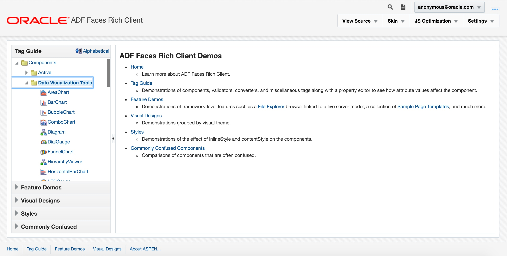
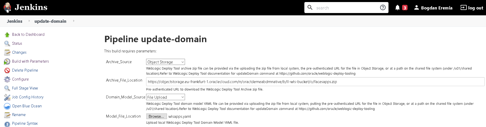
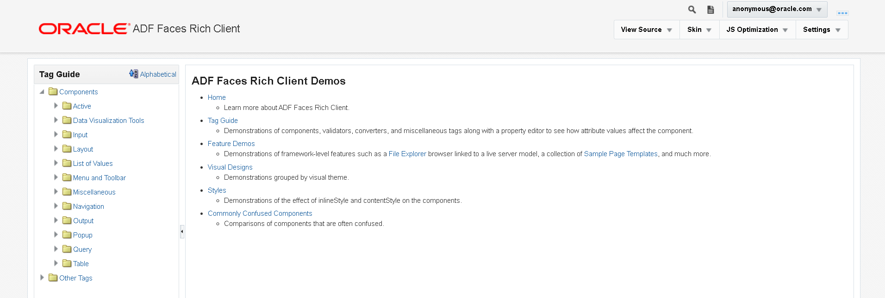
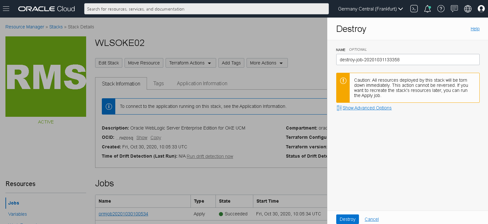
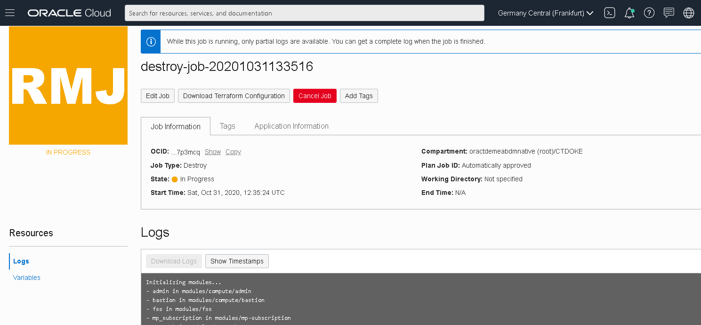
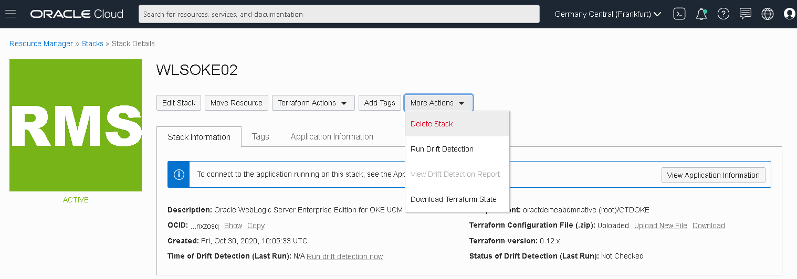

# WebLogic for OKE (JRF) - optional

### Extra deployment and deleting the WebLogic Infrastructure


## Objective

This chapter contains 2 optional steps you can execute:

- Deploying a 2nd ADF application that showcases all the features of an ADF Faces Rich Client
- Destroy the various resources you created in this lab to preserve resources on your tenancy


## Step 1. [Optional] Deploy ADF Faces Rich Client Components Demo Application

If you want to explore the ADF Faces components at runtime, the ADF Faces development team at Oracle created a component demo that showcases the various components and framework capabilities and allows you to try different property settings on the selected component. The components demo is provided with full source code and is a great way to learn how to work with the components in general. 




First, download the [faces-12.2.1.4.0.war](https://objectstorage.eu-frankfurt-1.oraclecloud.com/n/oractdemeabdmnative/b/ll-wls-bucket/o/faces-12.2.1.4.0.war) application web archive. Then, in a similar way as at step **Deploy custom ADF application**, use the *update-domain* Pipeline to install the faces-12.2.1.4.0.war application.


The `wlsapps.yaml` should look like this:

```
appDeployments:
    Application:
        'faces-12.2.2.1.0':
            SourcePath: 'wlsdeploy/applications/faces-12.2.1.4.0.war'
            Target: 'wlsoke02-cluster'
            ModuleType: war
            StagingMode: nostage
```

**Note**: Replace **wlsoke02-cluster** value with the WebLogic Cluster name in your specific environment.


But, as the web application archive file is quite big, you'd need to use the *Object_Storage* option to pass the archive source .zip file. You can upload the .zip file either in a public Object Storage bucket or in a private one with a pre-authenticated request generated so that the .zip file can be downloaded without authentication. Anyway, to be more easy, we have prepared the below link that you can pass directly to the **Archive_File_Location** Pipeline parameter:

```
https://objectstorage.eu-frankfurt-1.oraclecloud.com/n/oractdemeabdmnative/b/ll-wls-bucket/o/facesapps.zip
```


The Pipeline build configuration should look like this:




Once the pipeline completed, in another browser tab navigate to:

```
https://wlsoke/faces-12.2.2.1.0/
```




The **Tag Guide** is the entry link to the component demo and shows a list of ADF Faces components that you can select to further explore. Each component demo is launched in a browser that has a split screen layout. The split screen's right content area has a property inspector functionality that you can use to set properties for the individual component. Note that the right content area might be closed so that you have to drag it open before using it. Also of interest is that in addition to the rich client components, the data visualization components which allow you to graphically represent your data are also present in this listing.

The **Feature Demos** include a variety of demonstrations for the frameworks capabilities including a rich set of demos for the data visualization components, active data services, drag and drop and other client behaviors.

A demo of interest should be the **Styles** demo. Users frequently get confused by which part of a component is styled by the **inlineStyle** attribute and which part is styled by the **contentStyle** attribute. The demo also contains a skinning demonstration that allows developers to play with various skin definitions per component.


## Step 2. [Optional] Destroy resources

Before destroying the Stack, we need first to delete some resources using a prebuilt script on the Shared File System.


### Step 2.1 Delete resources

Connect to Admin host (check one of the previous labs on how to connect) and run:

```
/u01/shared/scripts/lcm/delete_resources.sh -p '<OCIR Auth Token>' -l
```

You'd need to pass the OCIR Authentication Token used in the prerequisites lab to create the WLS Registry Secret.

This script will delete the OCIR repositories associated with this WebLogic deployment and also the OCI Load Balancers.


### Step 2.2 Destroy the WebLogic for Stack

For the rest of the provisioned resources, destroying the WebLogic Stack will be sufficient.

In OCI Console, navigate to Resource Manager and click on the WebLogic for OKE stack:


To efficiently destroy all WebLogic and associated created resources, we can simply run the Terraform *Destroy* Job:


Click on **Destroy** button to kick off the Job:




The Job will start deleting the WebLogic Kubernetes cluster, terminating the Admin and Bastion host as well as the associated network resources:




Once the Terraform Destroy Job completes, it's safe to delete the Stack:




All provisioned resources have been terminated now.