# WebLogic for OKE (JRF) - prerequisites

### Prerequisites for provisioning the WebLogic Infrastructure


## Objective

This Lab will walk you through the steps to set up a WebLogic environment running on a Kubernetes cluster, using the **WebLogic for OKE** Marketplace stack, and using the JRF option (repository database required).  This stack will provision both the Managed Kubernetes instance as well as WebLogic running on top of this OKE instance.

To run these labs you will need access to an Oracle Cloud Account.  

<u>We assume you are using your own Oracle Cloud Tenancy,</u> either via a **Free Tier**, using a **Pay-as-you-Go** account, or using the **Corporate account** of your organization.  

==> If you do not have an account yet, you can obtain  an Oracle Free Tier account by [clicking here.](https://signup.oraclecloud.com/?sourceType=:em:lw:rce:cpo:::RC_WWMK201222P00024:EMEAHOLweblogicFeb)

Next, follow the steps described below.


## Step 1. Prepare OCI Compartment

When provisioning WebLogic for OCI through Marketplace, you need to specify an OCI Compartment where all resources will be created.

Make sure you have a Compartment that you can use or create a new one.

Take note of the compartment **OCID**:


The Compartment name is referred as **CTDOKE** in the Hands on Labs.

**Note:** If you <u>are</u> an Oracle **Cloud Infrastructure administrator** or if you are <u>using</u> a **Oracle Cloud Trial Account** (in which case you are an OCI administrator by default), you may **skip** steps **1.1** and **1.2** as no root or compartment level policies are required to run the Hands on Labs.


### 1.1 Required root level policies for WebLogic for OKE

You must be an Oracle Cloud Infrastructure <u>administrator</u>, or <u>be granted some root-level permissions</u>, in order to create domains with Oracle WebLogic Server for Oracle Cloud Infrastructure on OKE.

When you create a domain, Oracle WebLogic Server for OKE creates dynamic groups and root-level policies that allow the administration compute instance to:

- Access keys and secrets in Oracle Cloud Infrastructure Vault
- Access the database wallet if you're using Oracle Autonomous Transaction Processing (JRF-enabled domains)


In case <u>you are not an OCI administrator</u> and you cannot create dynamic-groups or you cannot create policies at root compartment level, please contact your OCI administrator and request that one  of the groups your cloud user is part of to have the following grants in place:

```
Allow group MyGroup to manage dynamic-groups in tenancy
Allow group MyGroup to manage policies in tenancy
Allow group MyGroup to use tag-namespaces in tenancy
Allow group MyGroup to inspect tenancies in tenancy
```

To be able to create and manage repositories in Oracle Cloud Infrastructure Repository:

```
Allow group MyGroup to manage repos in tenancy
```

Also, to be able to use the Cloud Shell you need:

```
Allow group MyGroup to use cloud-shell in tenancy
```


### 1.2 Required compartment level policies for WebLogic for OKE

If <u>you are not an Oracle Cloud Infrastructure administrator</u>, you must be given management access to resources in the compartment in which you want to create the WebLogic domain infrastructure.

Your Oracle Cloud Infrastructure user must have management access for Marketplace applications, Resource Manager stacks and jobs, Kubernetes clusters, compute instances, file systems, block storage volumes, load balancers, Key Management vaults and keys, and IAM policies. If you want Oracle WebLogic Server for OKE to create network resources for a domain, then you must also have management access for these network resources.

A policy that entitles your OCI user to have all management access for your compartment, needs to have the following grant in place:

```
Allow group MyGroup to manage all-resources in compartment MyCompartment
```


### 1.3 Service limits

Going through the hands on labs you will create the following main components in your tenancy:

- two Compute instances
- one OKE cluster (using another four Compute Instances for Kubernetes Nodes)
- one Virtual Cloud Network (VCN)
- two Load Balancers
- one Vault
- one File System Service and one Mount Target
- one Public IPs in use

Check your tenancy Service limits, current usage (*Governance and Administration* > *Governance* > *Limits, Quotas and Usage*) and make sure you have enough room for: 

- Compute Service: Cores for Standard2 based VM and BM Instances (you may consider choosing a specific AD)
- Container Engine: Cluster
- Virtual Cloud Network Service: Virtual Cloud Networks
- LbaaS Service: 100Mbps Load Balancer
- File Storage: File System and Mount Target

If you don't have visibility and/or you don't have admin rights for your tenancy, reach out to your administrator.


##  Step 2. Provision Repository Database and Database Objects

When deploying a JRF enabled WebLogic domain, a database repository is required. We will use Autonomous Transaction Processing - ATP - Database. As later on we'll deploy a sample ADF application that requires a database table and some records data, we should create the DB schema in advance.


### 2.1 Provision ATP Database

Go to *Oracle Database* > *Autonomous Transaction Processing*:


Choose to create a new Autonomous Database:


Give it a meaningful name, for example **WLSATPDB**; Keep default workload type **Transaction Processing**:

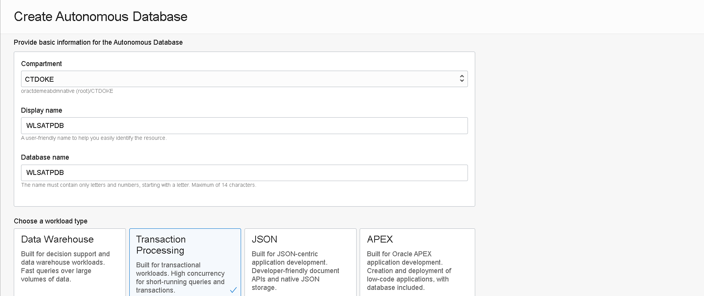


Scroll down and keep default setting for:

- **Deployment type**: *Shared Infrastructure*
- **Database version**: *19c*
- **OCPU count**: *1*
- **Storage (TB)**: *1*
- **Auto scaling**: *Enabled*

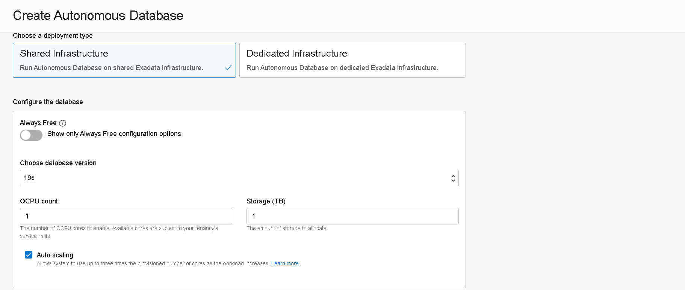


Next setup a password for the ADMIN user: must be 12 to 30 characters and contain at least one uppercase letter, one lowercase letter, and one number. The password cannot contain the double quote (") character or the username "admin.

Keep default setting to **Allow secure access from everywhere**; this will provision ATP database with public endpoints (access can still be restricted by allowing incoming traffic from trusted IP addresses or whitelisted Virtual Cloud Networks):

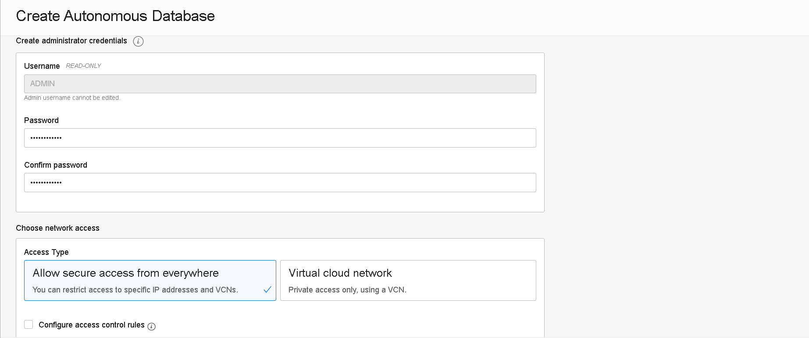


For the last step choose **License included** for license type and click on **Create Autonomous Database**:


The provisioning process will start:

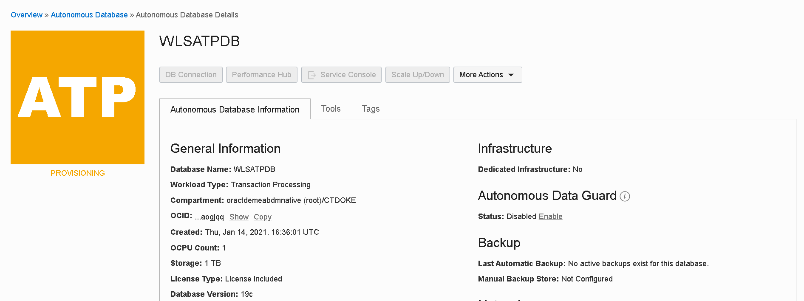


After a few minutes the Database should be available:


### 2.2 Prepare DB Objects

Once the ATP database available, we can use the SQL Developer Web tool to created a DB schema and some required tables and records needed in the next part.

Go to *Service Console*:

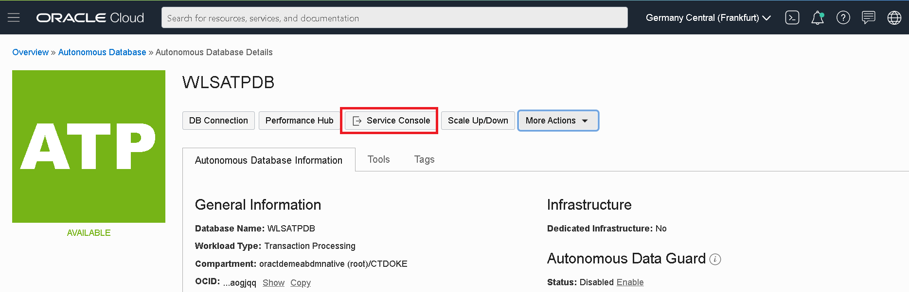


From *Development* submenu open **SQL Developer Web**:

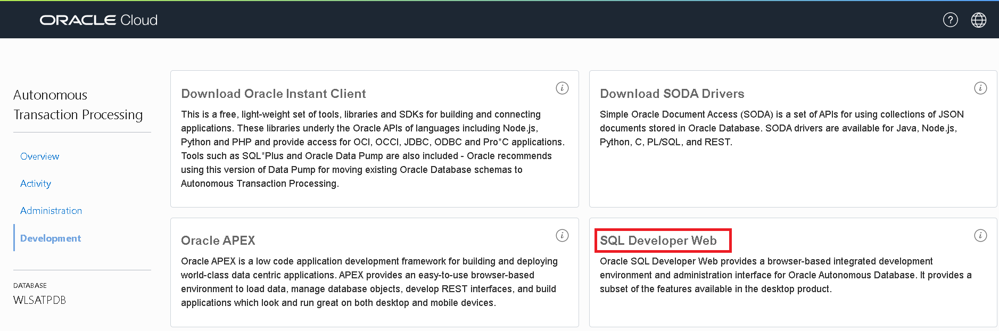


This will open in a new tab the SQL Developer Web Login screen. Use **ADMIN** and the password setup when provisioning the ATP Database:


Once logged in, you can follow a waking tour to discover the main user interface feature: 

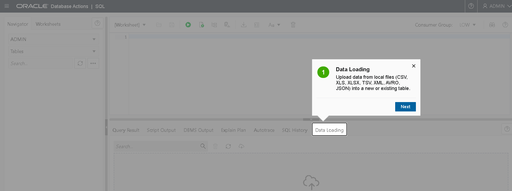


Once ready, copy and paste the contents of **[this](https://objectstorage.eu-frankfurt-1.oraclecloud.com/n/oractdemeabdmnative/b/ll-wls-bucket/o/adf_app_db_script.sql)** sql file into *Worksheet* window:

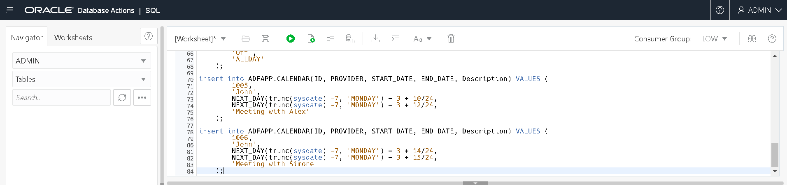


Execute the script by clicking the *Run script* play button. All statements should execute with success:

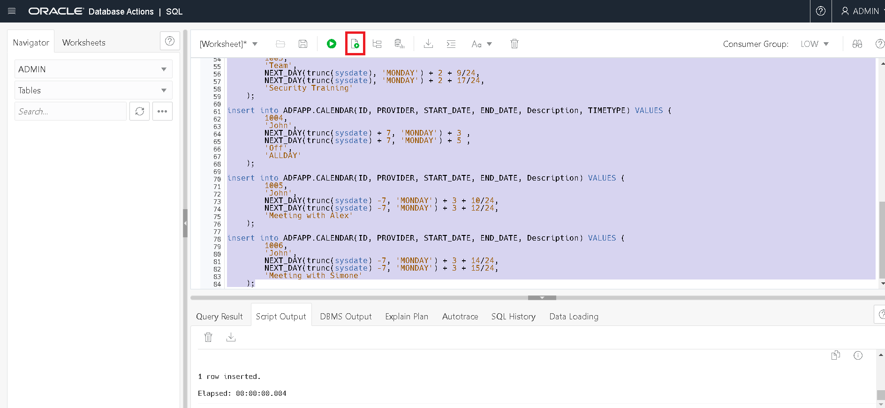


## Step 3. Create OCI Secrets

When you provision WebLogic for OKE you need to pass the WebLogic Admin password and the Authentication Token of your (or of a different) OCI user for access to Oracle Cloud Infrastructure Registry (OCIR) as well as the database AMIN password. Three OCI Secrets are required for this.


### 3.1 Create an Authentication Token

If you don't have an Authentication Token generated for your OCI user account, you need to create one.

Go to your user profile (click on your username link):

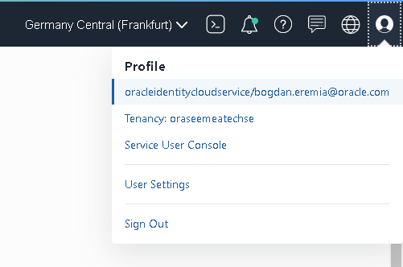


Switch to *Auth Tokens* submenu of your user profile page:

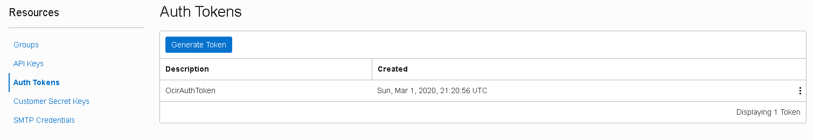


And generate a new Token:


Copy the Auth Token immediately to a secure location from where you can retrieve it later, because you won't see the Auth Token again in the Console:

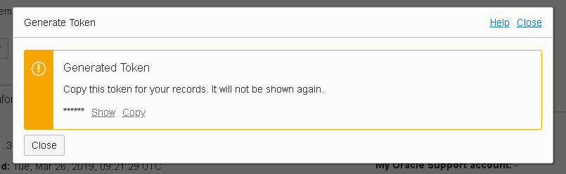


### 3.2 [Optional] Test the ability to create repos in OCIR

If you already had an Auth Token and used it before to authenticate and create repos in OCIR, you can skip this step. If not, would be really helpful to test the ability to create repos in OCIR before launching the WebLogic for OKE Stack.

For this follow this 10 minute tutorial: [Push an Image to Oracle Cloud Infrastructure Registry](https://www.oracle.com/webfolder/technetwork/tutorials/obe/oci/registry/index.html) 

If you face any issues, double check with  your tenancy administrator that you have the right policy in place to manage repositories (see previous step). 

A known issue is related with non-admin federated users created and added as members of their group long time ago. For that case, try to create a new group (both in IDCS and in OCI and setup IDCS-OCI mapping), add your user to this new group and setup the policies according to previous step in this Prerequisites lab. 


### 3.3 Create a Security Vault

Go to *Governance and Administration* > *Security* > *Vault*


Create a new Vault (leave the *Make it a Virtual Private Vault* option **unchecked**):


The new Vault should be listed as Active:


Have a look at the Vault Information:


### 3.4 Create an Encryption Key

Go to *Master Encryption Keys* submenu of the Vault Information page and create an new Key:


Give the key a Name and leave the other settings as default:

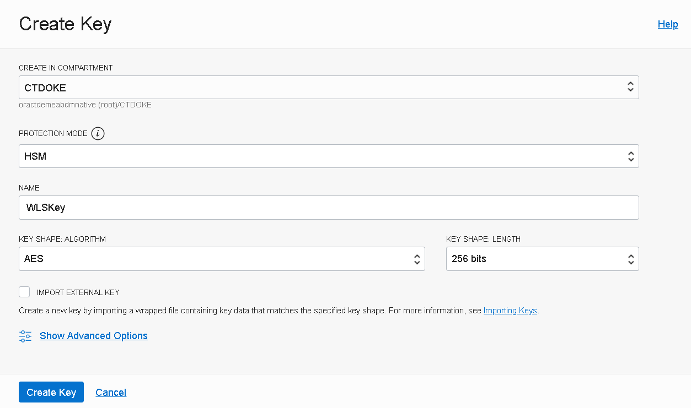


The new key should be listed as *Enabled*:


### 3.5 Create an OCI Secret for the WebLogic Admin password

Go to *Secrets* submenu of the Vault Information page and create an new Secret:


Setup a name for the OCI Secret; choose previously created Encryption Key (**WLSKey**) in the *Encryption Key* dropdown. With default option for *Secret Type Template* (**Plain-Text**), you have to enter the WebLogic Admin password as-is (the plain-text) in the *Secret Contents* aria. If you switch to **Base64** secret type template, you need to provide the WebLogic Admin password pre-encoded in base64.


> The password must start with a letter, should be between 8 and 30 characters long, should contain at least one number, and, optionally, any number of the special characters ($ # _).


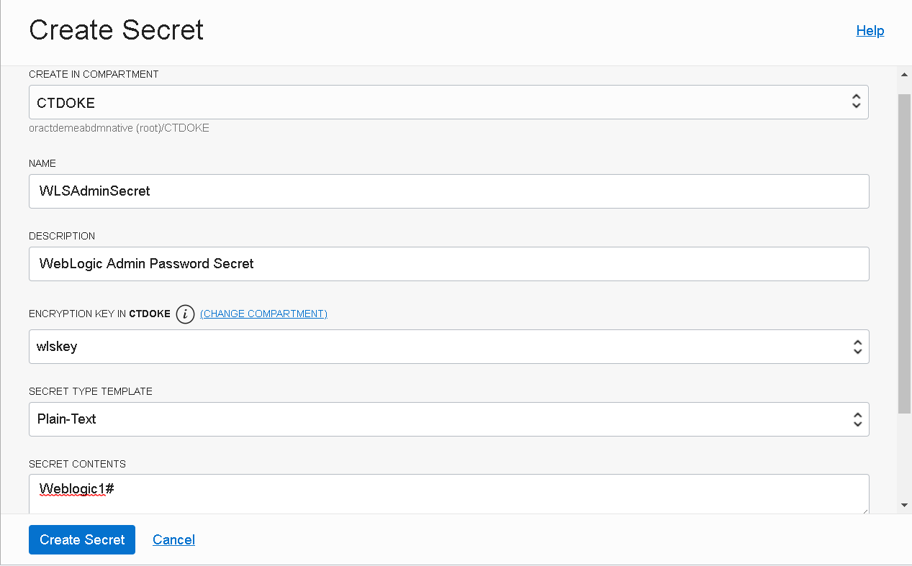


Shortly, the Secret should be listed as *Active*:


Click on the Secret name and take note of its **OCID**. We need to provide this value in the WebLogic for OKE Stack configuration form:

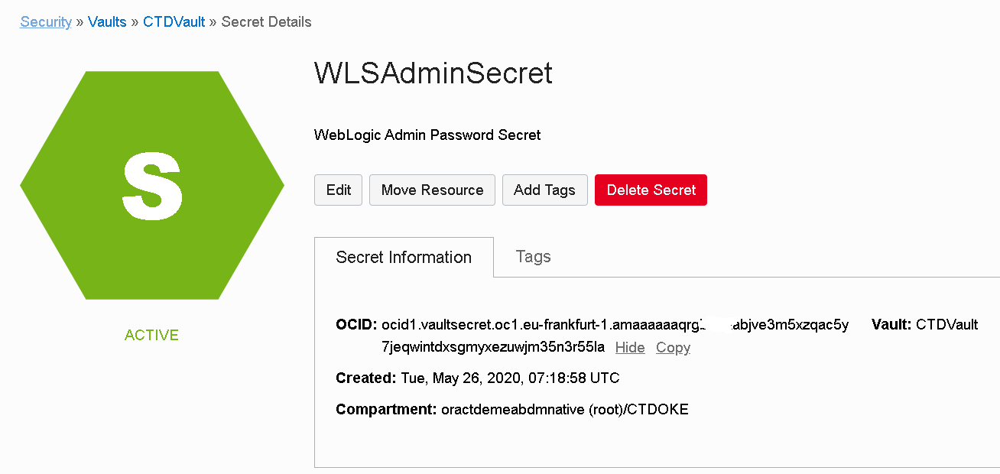


### 3.6 Create an OCI Secret for your OCI user Authentication Token

In the same way as in previous step, create a new OCI secret for your OCI user Authentication Token. Instead of the WebLogic Admin password, pass the Auth Token value generated earlier.

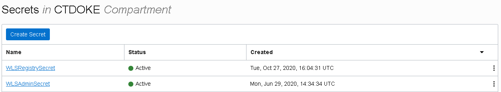


Click on the new Secret name (**WLSRegistrySecret**) and take note of its **OCID**. We need to provide this value in the WebLogic for OKE Stack configuration form.


### 3.7 Create an OCI Secret for the Database Admin password

Similarly, create a new OCI secret for your ATP Admin user Password. Instead of the WebLogic Admin password, pass the ADMIN password created during ATP Instance provisioning. Give Secret a name, for example **ATPDBSecret**

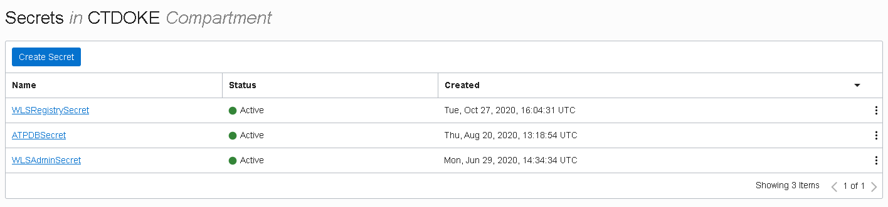


Click on the new Secret name (**ATPDBSecret**) and take note of its **OCID**. We need to provide this value in the WebLogic for OKE Stack configuration form.


##  Step 4. Create ssh keys

You need to generate a public and private ssh key pair. During provisioning using Marketplace, you have to specify the ssh public key that will be associated with the Administration and Bastion host Compute VMs.

We will be using the **Cloud Shell** to generate the keys in this tutorial.

- Open your Cloud Console by clicking on the **>** icon

- Create a directory to contain your keys

  ```
  $ mkdir keys
  $ cd keys
  ```
  

  
- Now create your key set :

  ```
  $ ssh-keygen -t rsa -b 4096 -f weblogic_ssh_key
  ```


This will create the **weblogic_ssh_key** containing the private key. The public key will be saved at the same location, with the .pub extension added to the filename: **weblogic_ssh_key.pub**.

```
Generating public/private rsa key pair.
Enter passphrase (empty for no passphrase): 
Enter same passphrase again: 
Your identification has been saved in weblogic_ssh_key.
Your public key has been saved in weblogic_ssh_key.pub.
The key fingerprint is:
SHA256:jnmUBEH3HnwxcibOvcpPLi5/c1p55PoE7LNLHRmijRI jan_leeman@5e83aaf6d012
The key's randomart image is:
+---[RSA 4096]----+
|     .+.. o =    |
|       o = * o   |
|        .E* o. . |
|       . o.o+o. o|
|        S..o..oo.|
|       = ... . *.|
|      o o o . * =|
|       .. .+oo.* |
|         +oo+++o.|
+----[SHA256]-----+
```


You should be able now to run the rest of the Hands on Labs on your own cloud environment.
