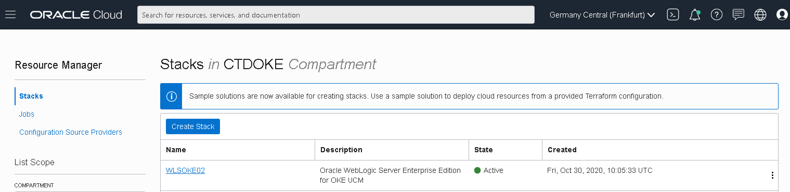
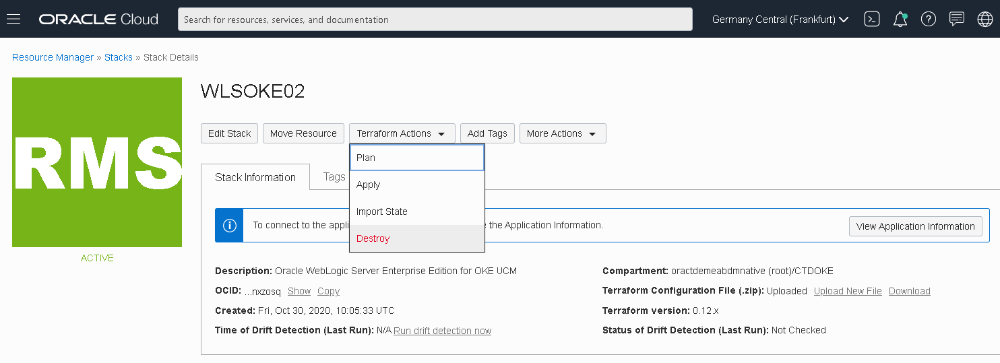

# WebLogic for OKE - removal

### Deleting the WebLogic Infrastructure


## Objective

In this short Hands on Lab we will delete all resources created by the WebLogic for OKE Stack.


## Step 1. Delete resources

Before destroying the Stack, we need first to delete some resources using a prebuilt script on the Shared File System.

Connect to Admin host (check one of the previous labs on how to connect) and run:

```
/u01/shared/scripts/lcm/delete_resources.sh -p <OCIR Auth Token> -l
```

You'd need to pass the OCIR Authentication Token used in the prerequisites lab to create the WLS Registry Secret.

This script will delete the OCIR repositories associated with this WebLogic deployment and also the OCI Load Balancers.


## Step 2. Destroy the WebLogic for Stack

For the rest of the provisioned resources, destroying the WebLogic Stack will be sufficient.

In OCI Console, navigate to Resource Manager and click on the WebLogic for OKE stack:




To efficiently destroy all WebLogic and associated created resources, we can simply run the Terraform *Destroy* Job:




Click on **Destroy** button to kick off the Job:


The Job will start deleting the WebLogic Kubernetes cluster, terminating the Admin and Bastion host as well as the associated network resources:


Once the Terraform Destroy Job completes, it's safe to delete the Stack:


All provisioned resources have been terminated now.