# WebLogic for OKE - deploy applications

### Deploying Sample Application and Custom applications


## Objective

In this Hands on Lab we start using the available Jenkins Pipelines to deploy on the WebLogic Domain the standard Sample Application and new applications as well. The same approach can be used for migrating applications from on-premise environments to WebLogic Domain on Kubernetes as the applications package and domain model extracted with WDT can easily passed as input parameters to one of the provided Jenkins Pipelines.

Note: Keep previous lab as a reference for connecting to Jenkins console or WebLogic Admin Console. This Hands on Lab won't provide step by step instructions on how to do it.


## Step 1. Deploy Sample Application

Login to Jenkins Console:


You should see Jenkins Dashboard Page and available Pipelines:

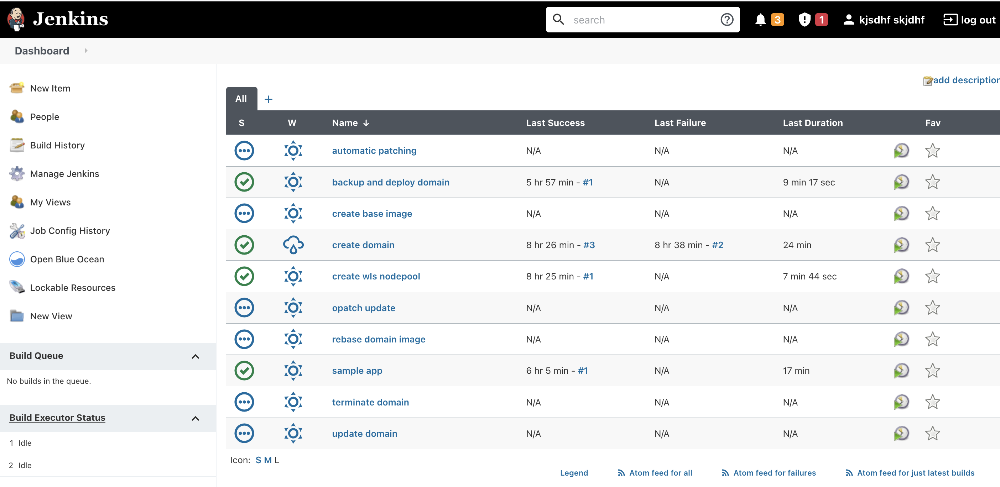


To deploy the WebLogic Sample Application, we will use the Pipeline called **sampleapp**. 

Hover on *sample-app* Pipeline, expand the contextual menu and click on **Build with  Parameters**:

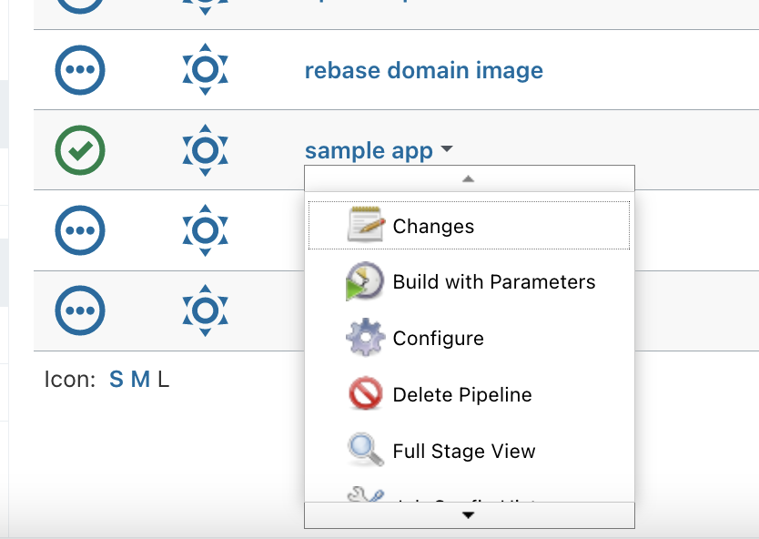


- Select the WLS domain you created in the previous part of the lab
- Click on **Build** to deploy the Sample Application:


Once build starts, you're redirected to Pipeline's *Status* Page. This page will get updated once build stages are running and completed.

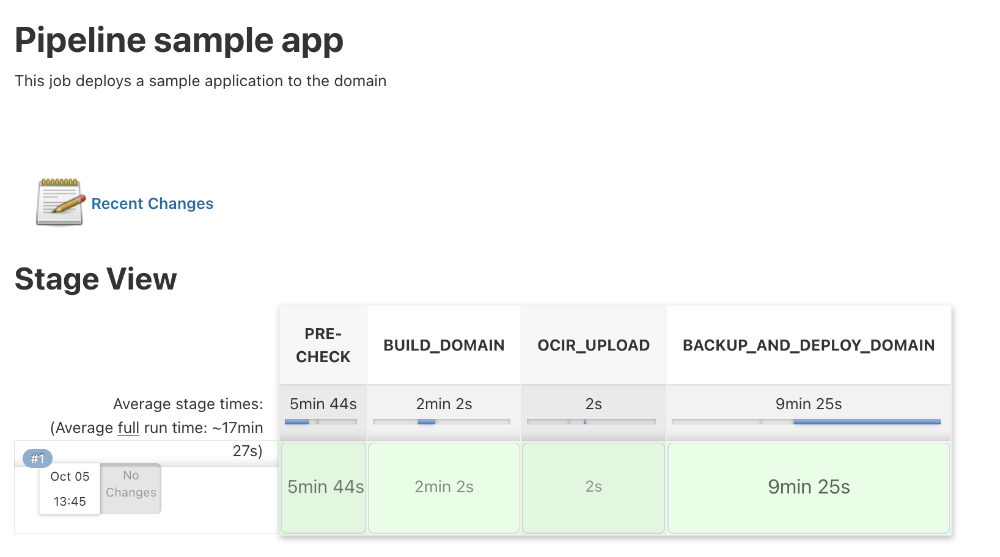

To check the build log, select the build number in the Build History section, then select the menu **Console Output**: on the left :

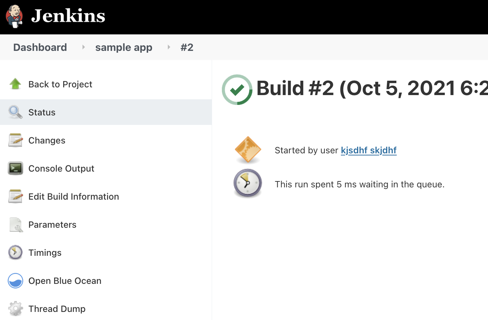

The running build output logs are displayed:

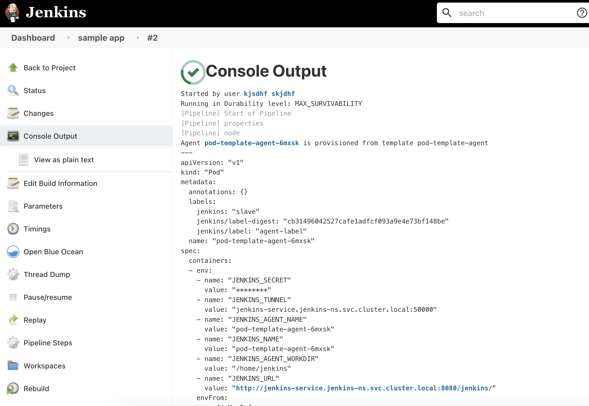


Next step, is to access and test the WebLogic Sample Application. In a new browser tab navigate to:

(check the previous lab on how to get the Public Load Balancer IP by inspecting the Load Balancers)

```
https://<public load balancer ip>/sample-app
```


If you see a messages warning about the serf signed certificate of the Load Balancer, just proceed forward (*Accept Risk and Continue*):

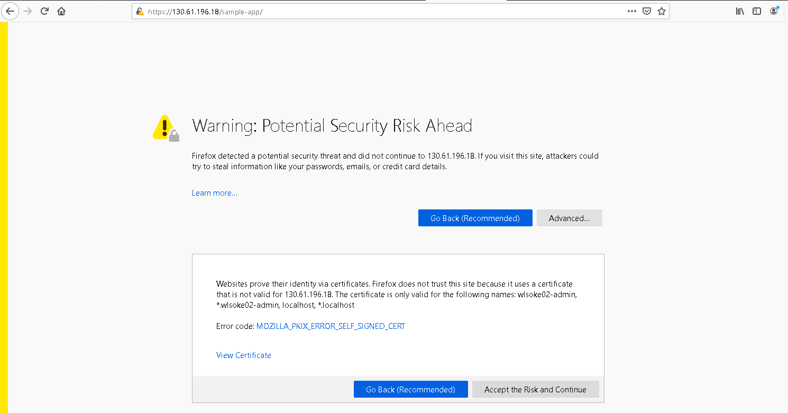


WebLogic Sample Application up & running:

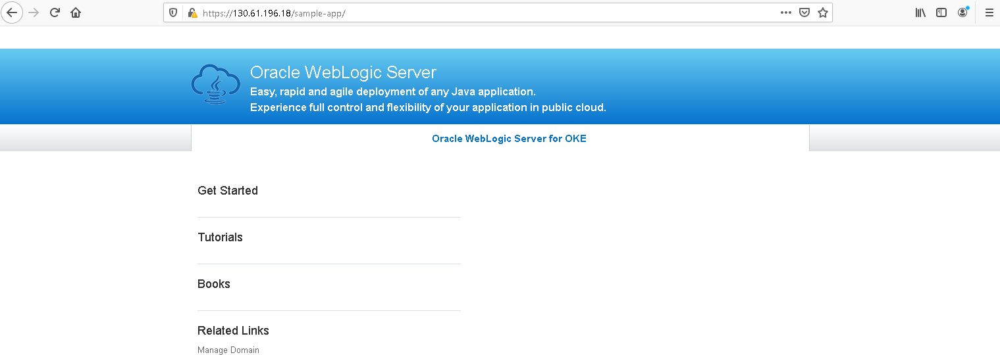


## Step 2. Deploy custom applications

In the second step of this Hands on Lab we will use the *update-domain* Pipeline to deploy a custom application.

Let's inspect the required Build Parameters to launch this Pipeline:

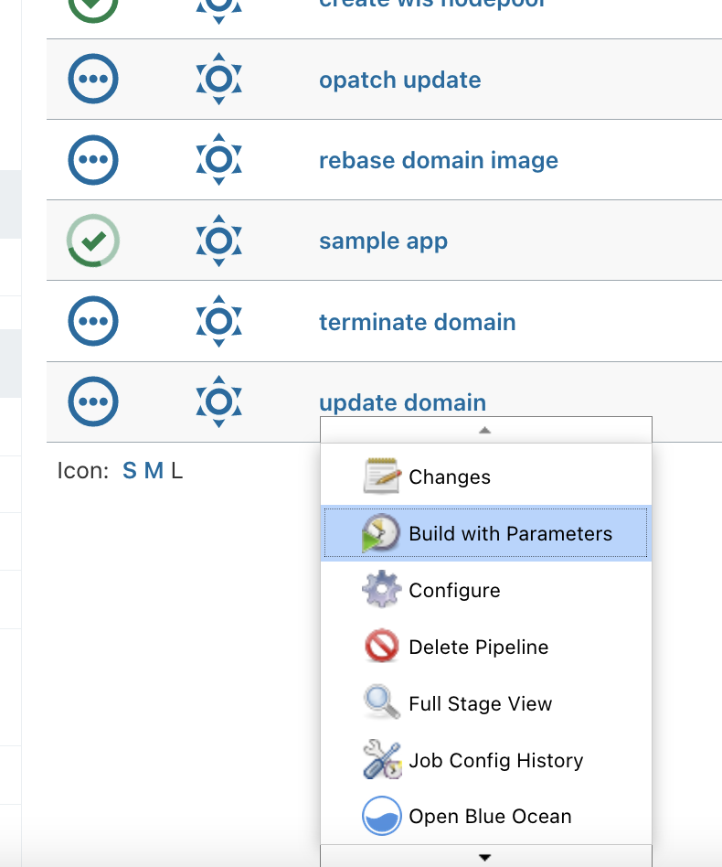


As this Pipeline executes the **WebLogic Deploy Tool** (**WDT**) *updateDomain* command, we can recognized the WDT parameters 

- **Domain name** : select the domain you created previously
- **Archive_Source**: The archive file is used to deploy binaries and other file resources to the target domain. The archive is a ZIP file with a specific directory structure.
- **Domain_Model_Source**: The metadata model (or model, for short) - the version-independent description of a WebLogic Server domain configuration in YAML format
- **Variable_Source**: Variables Properties file that can be passed and interpreted at execution
- **Encryption_Passphrase**: In case the model or variables properties file are encrypted, the encryptions passphrase should be passed here 


We can, of course, use WDT to introspect an existing WebLogic Environment and generate the domain model and applications archive, but very easy we can manually create these artefacts when we already have the WebLogic Applications.


Let's start by  downloading this Sample Web Application: [SampleWebApp.war](resources/SampleWebApp.war) (click on the link).

Create the following folder structure on your local machine and move the `SampleWebApp` file in the `applications` folder:

```
wlsdeploy > applications > SampleWebApp.war
```


Zip the entire `wlsdeploy` folder creating an archive, for example `wlsapps.zip`. (the archive will include the above folder structure and `SampleWebApp.war` file)


Create a file called `wlsapps.yaml` with following content:

```
appDeployments:
  Application:
    'SampleWebApp' :
      SourcePath: 'wlsdeploy/applications/SampleWebApp.war'
      Target: 'wlsoke02-cluster'
      ModuleType: war
      StagingMode: nostage
```


**Note 1**: Replace **wlsoke02** value from the Cluster name with the WebLogic Cluster name in your specific environment. To get it, connect to WebLogic Admin Console and navigate to *Clusters* page:

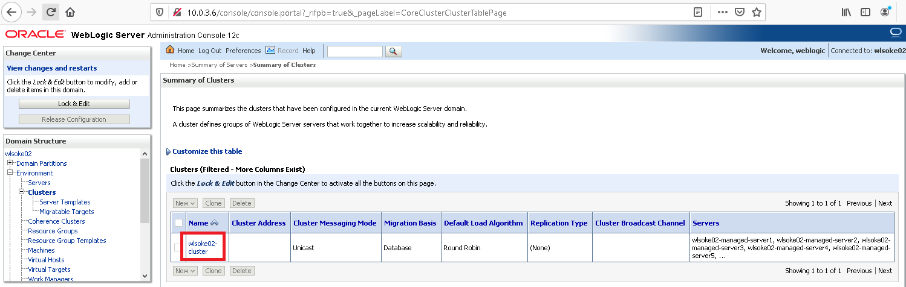


**Note 2**: You can put multiple applications in the applications archive. Don't forget to update the model accordingly, by putting a distinct section for each application, under the `Application:`  parent section.


For this lab example, we don't need a variables properties file, nor an encryption passphrase to pass for running the *update-domain* Pipeline.

In the Pipeline build form, select *File Upload* for **Archive_Source** and **Domain_Model_Source** and upload the two files:

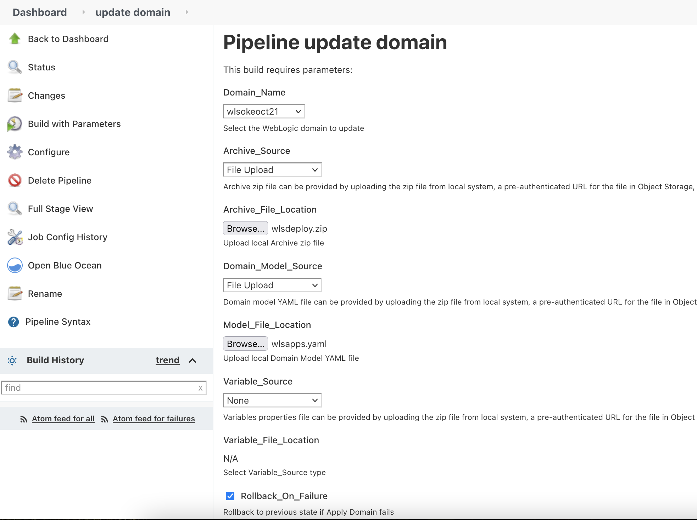


Click on **Build** to start updating the WebLogic Domain and deploying the Sample Web Application:


After a while (~14min) the Build should have been completed:

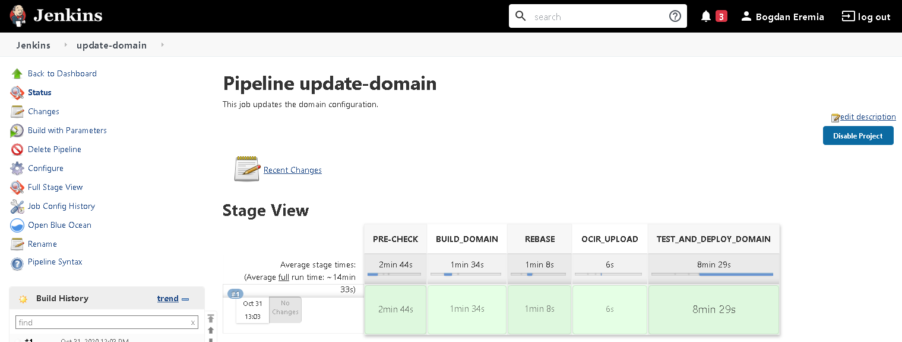


Next, access and test this new WebLogic Sample Web Application. In a new browser tab navigate to:

```
https://<public load balancer ip>/SampleWebApp
```


The app should be app & running:

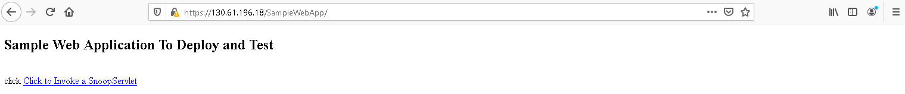


Invoke the Servlet to get some runtime information:

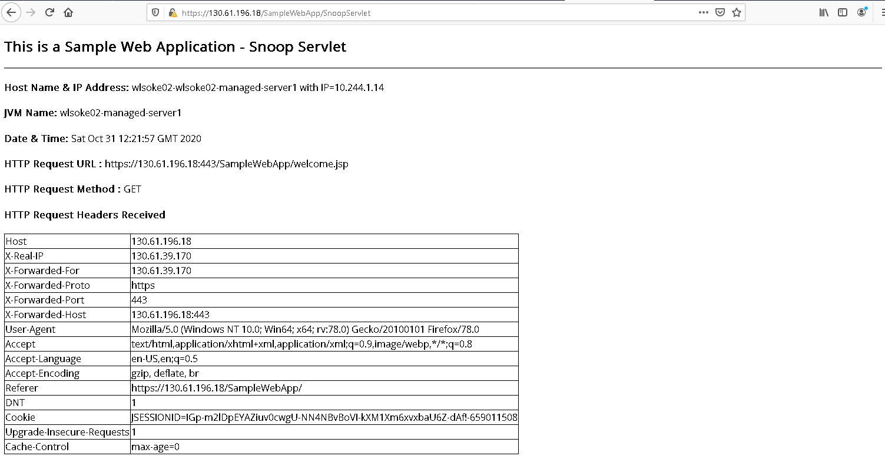