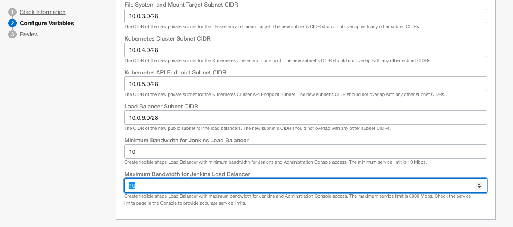
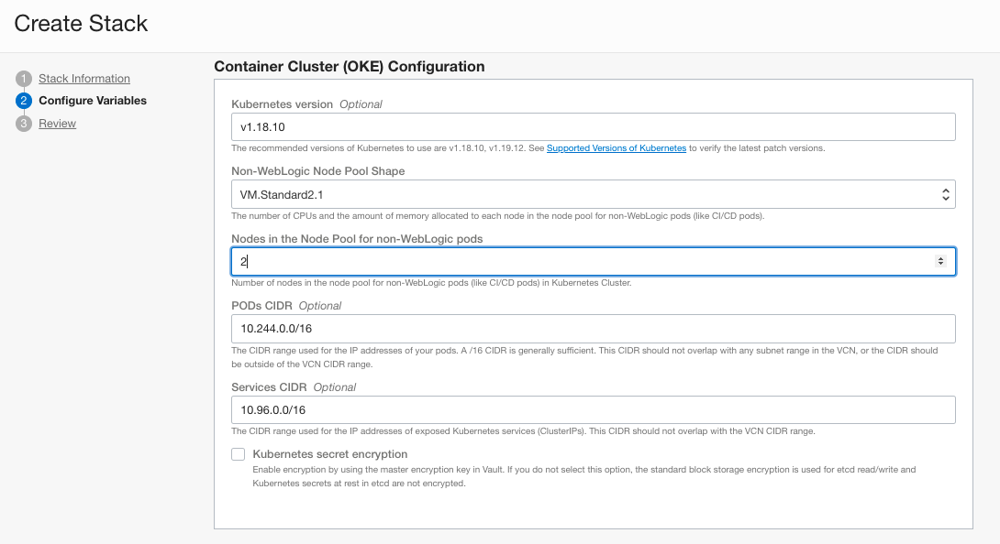
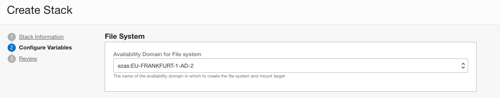
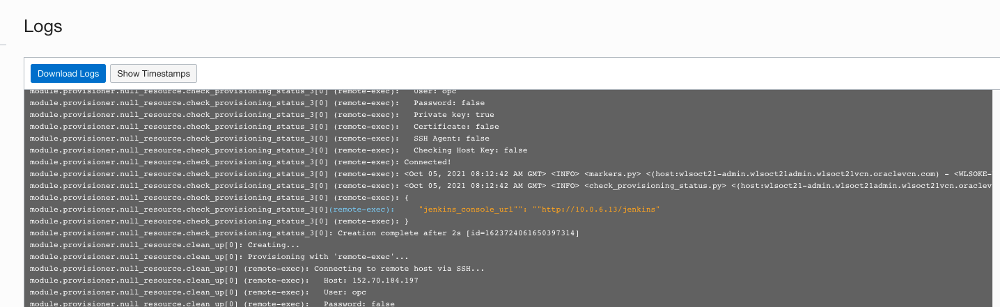
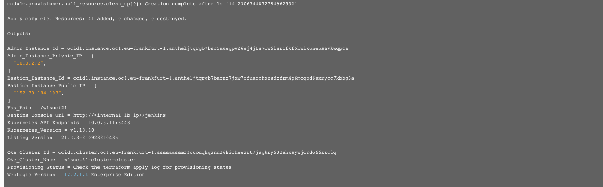

# WebLogic for OKE - stack creation

### Creating the stack and provisioning the WebLogic Infrastructure


## Objective

This Hands on Lab will go through the process of creating a WebLogic for OKE on Oracle CIoud Infrastructure - using Oracle Cloud Marketplace.


## Create WebLogic for OKE Stack

Login to your Oracle Cloud Infrastructure environment and from the main menu go to *Marketplace* -> *All Applications*:


You can search for *WebLogic* in the Marketplace search bar or narrow down displayed solutions by applying these filters:

- **Type:** *Stack*
- **Publisher**: *Oracle*
- **Category:** *Application Development*

Choose for *Oracle WebLogic Server Enterprise Edition for OKE UCM* (*Price*: *Paid*); This brings you to the Marketplace solution Overview page.

**Note**: if you're running this lab on an Oracle owned and managed environment, choose *Price: BYOL*


Choose your compartment where all WebLogic resources will be created, leave default WebLogic Version and accept *Oracle Terms of Use* before launching the Stack:


Launching the Stack will redirect you to Oracle Resource Manager (Oracle's managed Terraform service) where you need to configure some variables before the WebLogic Infrastructure gets provisioned.

Fill in Stack Information:

- **Name**: *WLSOKE* (add an unique suffix if other colleagues will be running this lab in the same Compartment)
- **Description**: *Oracle WebLogic Server Enterprise Edition for OKE UCM*

Click **Next** to go to the next screen.


Fill in information for **WebLogic Server on Container Cluster (OKE)**:

- **Resource Name Prefix**: *wlsoke* (use **lower case letters** and add an unique suffix if other colleagues will be running this lab on the same cloud environment)

- **SSH Public Key**: copy-and-paste the content of the generated **weblogic_ssh_key.pub** file; it contains the public key in RSA format; make sure to include the whole content in a single line, including *ssh-rsa* part at the beginning.

  - Note: if you have used the Cloud Shell to generate the SSH Key, you can use the `cat` command to display its contents:

    ```
    $ cat weblogic_ssh_key.pub
    ```

    

    

  - On Windows, use `Ctrl+INSERT` to copy the highlighted area as in the above example

  - On Mac, you can simply use `command+c`


On **Network** configuration:

- **Virtual Cloud Network Strategy**: *Create New VCN* (easy way for quick execution of the lab; if you'd like to reuse an existing network, check the documentation and make sure you have in place all prerequisites from networking perspective)
- **Network Compartment**: keep the same compartment selected when launching the Stack configuration
- **WebLogic Server Network CIDR**: keep default value
- **Bastion Host Subnet CIDR**: keep default value
- **Administration Host Subnet CIDR**: keep default value
- **File System and Mount Target Subnet CIDR**: keep default value


Continue with:

- **Kubernetes Cluster Subnet CIDR**: keep default value
- **Kubernetes API Endpoint Subnet CIDR**: keep default value
- **Load Balancer Subnet CIDR**: keep default value
- **Minimum Bandwidth for Jenkins Load Balancer**: *10 Mbps*
- **Maximum Bandwidth for Jenkins  Load Balancer**: *20 Mbps*




Next, in the **Container Cluster (OKE) Configuration** Section:

- **Kubernetes Version**: leave default
- **Non-WebLogic Node Pool Shape**: leave default
- **Nodes in the Node Pool for Non-WebLogic Pods**: *2*
- **Pods CIDR**: leave default
- **Services CIDR**: leave default
- **Kubernetes Secret Encryption**: leave default (unchecked)

 


For the **Container Cluster (OKE) Administration Instances**:

- **Availability Domain for Compute Instances**: choose one of the Availability Domains (in Single AD Regions you'll see only one option)
- **Administration Instance Compute Shape**: leave default
- **Bastion Instance Shape**: leave default


For the **File System** choose one of the Availability Domain. A File System and a Mount Target will be created in that particular AD. From Service Limits perspective, choose one that allows creation of new Shared File System resources.




Last part of the Stack configuration is addressing connectivity to OCI Registry for storing WebLogic Domain docker images. 

For the **Registry User Name** please use the *fully qualified username* you noted when creating the token in the prerequisites. 

- If you are using a **Single Sign-on** user via the Oracle Identity cloud service, your name will look like : `oracleidentitycloudservice/bogdaneremia@oracle.com`
- If you are using a **Direct Sign-in** user, this will be for example `janleemans`

If in doubt, you can see your full user name by clicking on the upper-right profile icon:


For the **Secrets OCID For Registry Authentication Token** use the OCID of the WLS Registry Secret created in the prerequisites lab:


Finally, leave **OCI Policies** option checked and the provisioning scripts will create required policies for reading Secrets from the Vault:


- Click **Next** to review Stack Configuration. 

- *ATTENTION*: if you are re-running the stack after an initial failed attempt, **make sure you have cleaned out all remaining artefacts of that initial run,** as they might interfere with this next run: compute instances, network environment, load balancers, etc.  

  

- Click **Create** to start executing the Stack:


An **Apply** Terraform Job Type has started running and all infrastructure is being provisioned:


Successfully spinning up the stack typically takes *between 15 and 20 minutes.* So feel free to take a short break, but check results from time to time, because if an error occurs the process will stop faster.  Some typical errors participants encounter:

- Lack of resources in your tenancy: make sure to check you have the appropriate number of Compute and Network resources available
- Incorrect fully qualified username: double-check the documentation on this topic
- Incorrect password OCID (do not enter passwords in the wizard, but the OCID of the secret holding the password)
- Not cleaning up resources from a previous run of the creation process.

Once the process finishes, you should see a green icon for a **Succeeded** creation:


Before navigating away of the Job Information page, let's take note of some relevant details that we'll be using later. Switch from the *Logs* to the *Outputs* submenu item and check the **Outputs** table:


Some items need our attention:

- **admin_instance_private_ip**: this displays the private IP address of the *Admin Host* Compute Instance in the reference architecture; we need to know this IP address to connect from the *Bastion* instance to *Admin Host* Instance
- **bastion_instance_public_ip**: public IP address of the *Bastion* Compute Instance in the reference architecture; the Bastion VM acts as jump server and let us connect from Internet to the WebLogic Infrastructure
- **fss_path**: mount path of the shared file system between *Admin Host*, WebLogic managed servers and Jenkins Continuous Integration system; by connecting to the *Admin Host* you can change/add new scripts to be used in existing or new Jenkins Pipelines
- **jenkins_console_url**: remember that `/jenkins` is the Jenkins application context root
- **oke_cluster_name**: the name of the OKE Cluster running 


To easily get the Jenkins Load Balancer IP, go back to the Job *Logs*, and scroll down to the end:






In yellow (at the top of the above image), we have the full URL for the Jenkins Console (**jenkins_console_url**)


You can now navigate to the next chapter of this lab called **Creating the WebLogic Domain**