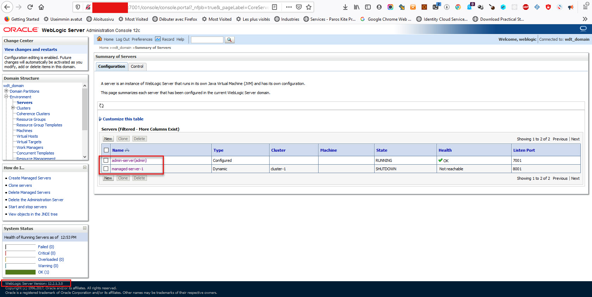
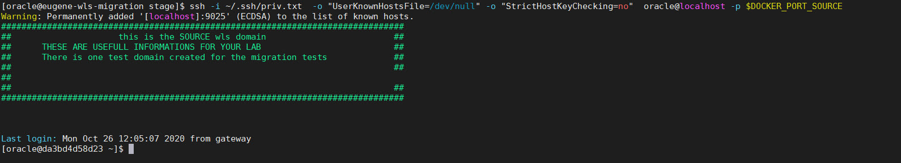
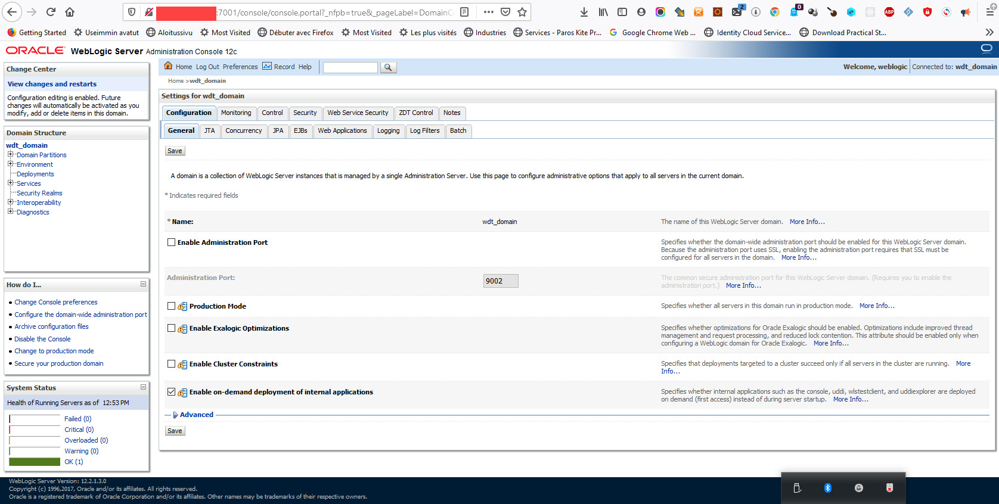
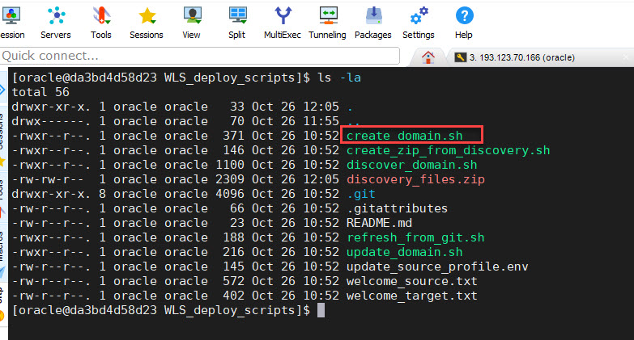
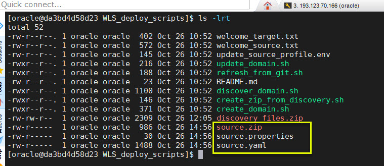
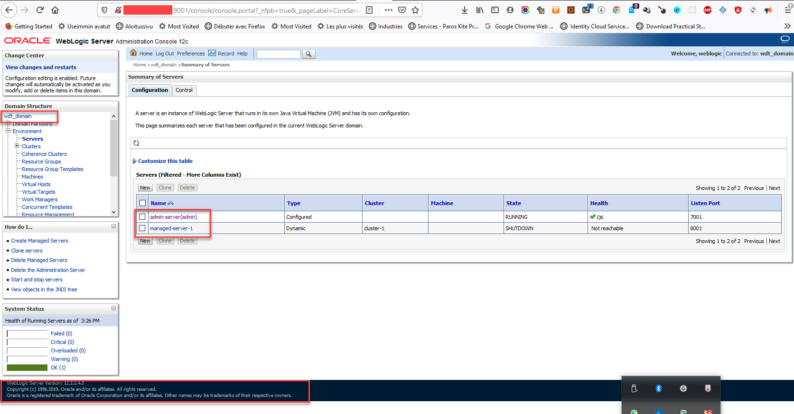
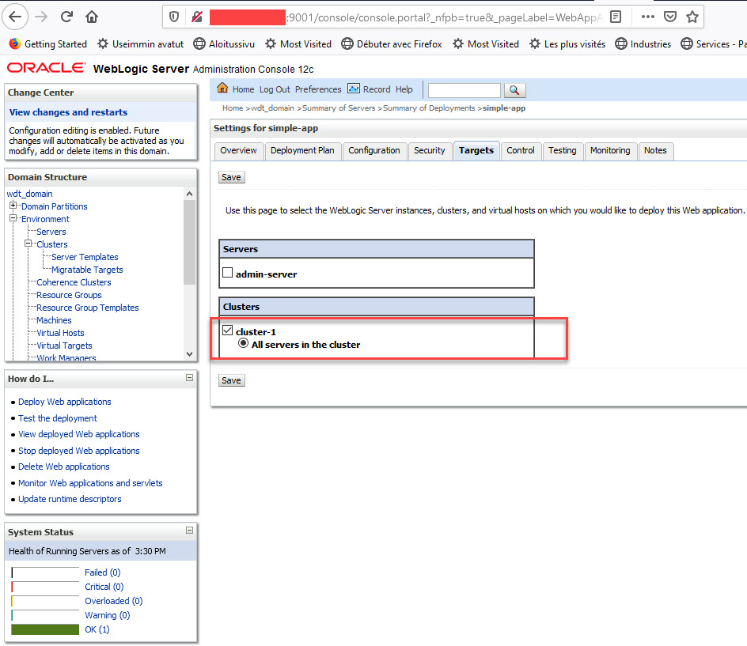

---

typora-copy-images-to: images
---

# WLS\_deploy\_scripts for the WLS Workshop migration toolkit 

The following scripts are using the [WDT Weblogic toolkit](https://github.com/oracle/weblogic-deploy-tooling)

The workshop is based on a simple scenario:

1. Introspect a source WebLogic domain
2. Create the domain configuration and its associated artifacts
3. Apply this configuration to a target WebLogic server


Two docker images will simulate two weblogic servers (source domain server, target domain server for this migration).


> ```
> CONTAINER IDIMAGE   COMMAND   CREATED STATUS  PORTS NAMES
> b2125ec2c26512214-domain:latest "/usr/sbin/sshd -D"   45 minutes ago  Up 45 minutes   0.0.0.0:9030->22/tcp, 0.0.0.0:9001->7001/tcp, 0.0.0.0:10001->8001/tcp, 0.0.0.0:9029->9001/tcp, 0.0.0.0:9028->10001/tcp, 0.0.0.0:9027->11001/tcp   test_sshd_target
> 
> da3bd4d58d2312213-domain-home-in-image-wdt:latest   "/usr/sbin/sshd -D"   2 hours ago Up 2 hours  0.0.0.0:7001->7001/tcp, 0.0.0.0:8001->8001/tcp, 0.0.0.0:9025->22/tcp, 0.0.0.0:9024->8453/tcp                                                      test_sshd
> ```
>
> 
>


The source server deploys a simple 12.2.1.3 clustered weblogic domain



=======


We will use the WDT tool to create an image of the wls configuration, then we will transfer this image to the target wls server.

The target server is installed with 12214 version of WLS, but there isn't any domain configured

The WDT toolkit is already installed on both servers

Once the artifacts generated by the discovery on the first server will be copied to the target, we will run the domain creation utility from the WDT to generate a new domain  to our target WLS docker server.

The script ***lab-comands.txt*** https://github.com/eugsim1/WLS_deploy_scripts/blob/main/lab-commands.txt will be used to execute all the lab steps.
In the below sections you will get some details about these scripts.

Before to run these steps you need to log into the [Docker hub](https://hub.docker.com/_/oracle-weblogic-server-12c) and download the following weblogic images:

**store/oracle/weblogic:12.2.1.3**

**store/oracle/weblogic:12.2.1.4**

If you don't have a Docker account follow the instructions on Docker site to create your account then use the below scripts to download the images to you test server:

```
###
### get the following images from the docker hub
##  
###
echo "You_Docker_Password" > ~/my_password.txt
cat ~/my_password.txt | docker login --username Your_Docker_Id --password-stdin
docker pull store/oracle/weblogic:12.2.1.3 
docker pull store/oracle/weblogic:12.2.1.4
```


```
#### clean all previous configuration
docker rm -f $(docker ps -a -q)
docker image prune -f
docker network rm test
docker container ls -a 

```
Then clone the workshop repository scrips to build the 2 docker images as :
```
cd
rm -rf  WLS_deploy_scripts
git clone https://github.com/eugsim1/WLS_deploy_scripts.git
###
### always restart docker daemon to avoid build failures 
###
sudo systemctl  restart docker
sudo systemctl  status docker


cd WLS_deploy_scripts
```
Then  launch the below commands to build the dockerimages

```
###
### build the images for the lab
cd /home/oracle/WLS_deploy_scripts
find  . -type f -iname "*.sh" -exec chmod +x {} \;
###
cd /home/oracle/WLS_deploy_scripts/source-12213-domain
cp -R /home/oracle/stage/installers/keys .
./build-docker-image.sh
cd /home/oracle/WLS_deploy_scripts/target-12214-domain
cp -R /home/oracle/stage/installers/keys .
./build-docker-image.sh
```
Then create the docker infrastructure for the workshop ie:
Create a local network
Create 2 container images source, and target


```
###
### create a network for the docker containers
###
docker network create -d bridge test
```

```
docker run -d -P --name test_sshd_target --network test -p 9001:7001 -p 10001:8001 12214-domain:latest
export DOCKER_PORT_TARGET=`docker port test_sshd_target 22`
export DOCKER_PORT_TARGET=`echo $DOCKER_PORT_TARGET | sed 's/0.0.0.0://g'`
echo $DOCKER_PORT_TARGET
###
###
docker run -d -P --name test_sshd --network test -p 7001:7001 -p 8001:8001 12213-domain-home-in-image-wdt:latest
export DOCKER_PORT_SOURCE=`docker port test_sshd 22`
export DOCKER_PORT_SOURCE=`echo $DOCKER_PORT_SOURCE | sed 's/0.0.0.0://g'`
echo $DOCKER_PORT_SOURCE
docker container ls -a
```
Get the ssh port of the source docker wich is running the wls source domain to migrate

```
### start the migration
### log to the source server
cd /home/oracle/WLS_deploy_scripts/source-12213-domain
ssh -i keys/wls_rsa  \
-o "UserKnownHostsFile=/dev/null" \
-o "StrictHostKeyChecking=no"  oracle@localhost -p $DOCKER_PORT_SOURCE

####ssh -i keys/wls_rsa  \
####-o "UserKnownHostsFile=/dev/null" \
####-o "StrictHostKeyChecking=no"  oracle@localhost -p $DOCKER_PORT_TARGET


```


```
### 
### start the admin server => this is not manadatory
###
nohup $DOMAIN_HOME/startWebLogic.sh &
```


log in the console IP of the hosts:7001/console

with the following credentials weblogic/welcome1

execute the commande  curl ifconfig.co to get your servers ip



### go to the scripts directory and execute the discovery of the domain
```
###
cd /home/oracle/WLS_deploy_scripts
```




```
cat discover_domain.sh
# default to JRF domain which filters out JRF libraries and applications
# If the domain is not JRF, the content would not be present so filterign it out will not make a difference
DOMAIN_TYPE=JRF

# clean up before starting
rm source.* || echo "clean startup"

echo "Discovering the source domain..."
discoverDomain.sh \
    -oracle_home $MW_HOME \
    -domain_home $DOMAIN_HOME \
    -archive_file source.zip \
    -model_file source.yaml \
    -variable_file source.properties \
    -domain_type $DOMAIN_TYPE


if [[ "$(cat source.yaml | grep '@@ORACLE_HOME@@' | wc -l)" != "0" ]]; then
    echo "Some of the application files are located within the ORACLE_HOME and won't be extracted by WDT"
    echo "Extracting those files and updating paths in the model file..."
    rm -rf ./wlsdeploy/
    mkdir -p ./wlsdeploy/applications;
    cp $(cat source.yaml | grep '@@ORACLE_HOME@@' | sed "s|.*: '@@ORACLE_HOME@@\(.*\)'|${ORACLE_HOME}\1|") ./wlsdeploy/applications/;
    zip -r source.zip ./wlsdeploy;
    rm -rf ./wlsdeploy/
    sed -i "s|@@ORACLE_HOME@@|wlsdeploy\/applications|g;" source.yaml
fi

[oracle@da3bd4d58d23 WLS_deploy_scripts]$

```

```
./discover_domain.sh
rm: cannot remove ‘source.*’: No such file or directory
clean startup
Discovering the source domain...
JDK version is 1.8.0_241-b07
JAVA_HOME = /u01/jdk
WLST_EXT_CLASSPATH = /u01/weblogic-deploy/lib/weblogic-deploy-core.jar
CLASSPATH = /u01/weblogic-deploy/lib/weblogic-deploy-core.jar
WLST_PROPERTIES = -Dcom.oracle.cie.script.throwException=true -Djava.util.logging.config.class=oracle.weblogic.deploy.logging.WLSDeployCustomizeLoggingConfig
/u01/oracle/oracle_common/common/bin/wlst.sh /u01/weblogic-deploy/lib/python/discover.py -oracle_home /u01/oracle -domain_home /u01/oracle/user_projects/domains/base_domain -archive_file source.zip -model_file source.yaml -variable_file source.properties -domain_type JRF

Initializing WebLogic Scripting Tool (WLST) ...

Welcome to WebLogic Server Administration Scripting Shell

Type help() for help on available commands

####<Oct 26, 2020 2:56:30 PM> <INFO> <WebLogicDeployToolingVersion> <logVersionInfo> <WLSDPLY-01750> <The WebLogic Deploy Tooling discoverDomain version is 1.9.6:master.2c18938:Oct 19, 2020 21:56 UTC>
####<Oct 26, 2020 2:56:31 PM> <INFO> <discover> <main> <WLSDPLY-06025> <Variable file was provided. Model password attributes will be replaced with tokens and corresponding values put into the variable file.>
####<Oct 26, 2020 2:56:34 PM> <INFO> <discover> <_get_domain_name> <WLSDPLY-06022> <Discover domain wdt_domain>
####<Oct 26, 2020 2:56:34 PM> <INFO> <TopologyDiscoverer> <discover> <WLSDPLY-06600> <Discovering domain model topology>
####<Oct 26, 2020 2:56:35 PM> <INFO> <Discoverer> <discover_domain_mbean> <WLSDPLY-06644> <Adding Domain Log>
####<Oct 26, 2020 2:56:35 PM> <INFO> <TopologyDiscoverer> <_get_nm_properties> <WLSDPLY-06627> <Discovering NM Properties>
####<Oct 26, 2020 2:56:35 PM> <INFO> <Discoverer> <_get_additional_parameters> <WLSDPLY-06150> <Unable to determine if additional attributes are available for NMProperties at location /NMProperties : Unable to find a valid MBean Interface in the Class list array(java.lang.Class,[])  of the MBean instance com.oracle.cie.domain.nodemanager.NMPropertiesConfigProxyBase@5756e8d5>
####<Oct 26, 2020 2:56:35 PM> <INFO> <TopologyDiscoverer> <get_clusters> <WLSDPLY-06601> <Discovering 1 clusters>
####<Oct 26, 2020 2:56:35 PM> <INFO> <TopologyDiscoverer> <get_clusters> <WLSDPLY-06602> <Adding Cluster cluster-1>
####<Oct 26, 2020 2:56:36 PM> <INFO> <TopologyDiscoverer> <get_servers> <WLSDPLY-06603> <Discovering 1 servers>
####<Oct 26, 2020 2:56:36 PM> <INFO> <TopologyDiscoverer> <get_servers> <WLSDPLY-06604> <Adding Server admin-server>
####<Oct 26, 2020 2:56:37 PM> <INFO> <TopologyDiscoverer> <get_server_templates> <WLSDPLY-06605> <Discovering 1 server templates>
####<Oct 26, 2020 2:56:37 PM> <INFO> <TopologyDiscoverer> <get_server_templates> <WLSDPLY-06606> <Adding cluster-1-template Server Template>
####<Oct 26, 2020 2:56:38 PM> <INFO> <TopologyDiscoverer> <discover_security_configuration> <WLSDPLY-06622> <Adding Security Configuration>
####<Oct 26, 2020 2:56:39 PM> <INFO> <TopologyDiscoverer> <get_embedded_ldap_configuration> <WLSDPLY-06639> <Skipping Embedded LDAP Server Configuration>
####<Oct 26, 2020 2:56:39 PM> <INFO> <ResourcesDiscoverer> <discover> <WLSDPLY-06300> <Discovering domain model resources>
####<Oct 26, 2020 2:56:39 PM> <INFO> <DeploymentsDiscoverer> <discover> <WLSDPLY-06380> <Discovering domain model deployments>
####<Oct 26, 2020 2:56:39 PM> <INFO> <DeploymentsDiscoverer> <get_applications> <WLSDPLY-06391> <Discovering 1 Applications>
####<Oct 26, 2020 2:56:39 PM> <INFO> <DeploymentsDiscoverer> <get_applications> <WLSDPLY-06392> <Adding Application simple-app>
####<Oct 26, 2020 2:56:39 PM> <INFO> <DeploymentsDiscoverer> <add_application_to_archive> <WLSDPLY-06394> <Add application simple-app binary /u01/oracle/user_projects/domains/base_domain/wlsdeploy/applications/simple-app.war to archive>
####<Oct 26, 2020 2:56:39 PM> <INFO> <MultiTenantDiscoverer> <discover> <WLSDPLY-06700> <Discover Multi-tenant>
####<Oct 26, 2020 2:56:39 PM> <INFO> <MultiTenantTopologyDiscoverer> <discover> <WLSDPLY-06709> <Discover Multi-tenant Topology>
####<Oct 26, 2020 2:56:40 PM> <INFO> <MultiTenantResourcesDiscoverer> <discover> <WLSDPLY-06707> <Discover Multi-tenant Resources>
####<Oct 26, 2020 2:56:40 PM> <INFO> <filter_helper> <apply_filters> <WLSDPLY-20017> <No filter configuration file /u01/weblogic-deploy/lib/model_filters.json>
####<Oct 26, 2020 2:56:40 PM> <INFO> <filter_helper> <apply_filters> <WLSDPLY-20016> <No filters of type discover found in filter configuration file /u01/weblogic-deploy/lib/model_filters.json>
####<Oct 26, 2020 2:56:40 PM> <INFO> <variable_injector> <inject_variables_keyword_file> <WLSDPLY-19518> <Variables were inserted into the model and written to the variables file source.properties>

Issue Log for discoverDomain version 1.9.6 running WebLogic version 12.2.1.3.0 offline mode:

Total:       WARNING :     0    SEVERE :     0

discoverDomain.sh completed successfully (exit code = 0)
[oracle@da3bd4d58d23 WLS_deploy_scripts]$

```



The discovered WebLogic domain is composed from one admin and one clustered managed server, one application is deployed on the cluster

```
 cat source.yaml
domainInfo:
    AdminUserName: '@@PROP:AdminUserName@@'
    AdminPassword: '@@PROP:AdminPassword@@'
topology:
    Name: wdt_domain
    AdminServerName: 'admin-server'
    DomainVersion: 12.2.1.3.0
    Log:
        DomainLogBroadcasterBufferSize: 1
        FileName: wdt_domain.log
    NMProperties:
        JavaHome: /u01/jdk
        weblogic.StartScriptName: startWebLogic.sh
    Cluster:
        'cluster-1':
            DynamicServers:
                ServerNamePrefix: 'managed-server-'
                MaxDynamicClusterSize: 1
                CalculatedListenPorts: false
                MaximumDynamicServerCount: 1
                ServerTemplate: 'cluster-1-template'
                DynamicClusterSize: 1
    Server:
        'admin-server':
            NetworkAccessPoint:
                T3Channel:
                    PublicPort: 30012
                    ListenPort: 30012
            SSL:
                Enabled: true
            ServerDiagnosticConfig:
                WldfDiagnosticVolume: Low
    ServerTemplate:
        'cluster-1-template':
            ListenPort: 8001
            Cluster: 'cluster-1'
            JTAMigratableTarget:
                Cluster: 'cluster-1'
            SSL:
                ListenPort: 8100
appDeployments:
    Application:
        'simple-app':
            SourcePath: 'wlsdeploy/applications/simple-app.war'
            PlanStagingMode: stage
            ModuleType: war
            StagingMode: nostage
            Target: 'cluster-1'

```

```


```

```
###
### create a zip file with all the articats
###
./create_zip_from_discovery.sh
updating: discovery_files/ (stored 0%)
updating: discovery_files/source.properties (deflated 3%)
updating: discovery_files/source.yaml (deflated 63%)
updating: discovery_files/source.zip (stored 0%)

```

```
 ###
 ### copy the file to the target server
 ###
scp -i ~/.ssh/wls_rsa  -o "UserKnownHostsFile=/dev/null" -o "StrictHostKeyChecking=no" \
/home/oracle/WLS_deploy_scripts/discovery_files.zip \
oracle@test_sshd_target:/home/oracle/WLS_deploy_scripts/discovery_files.zip && clear
clear


Warning: Permanently added 'test_sshd_target,172.22.0.2' (ECDSA) to the list of known hosts.
###############################################################################
##                     this is the TARGET     domain                         ##
##      THESE ARE USEFULL INFORMATIONS FOR YOUR LAB                          ##
##                                                                           ##
###############################################################################


discovery_files.zip                                                                                                                                                          100% 2309     4.9MB/s   00:00
[oracle@da3bd4d58d23 WLS_deploy_scripts]$

```


#### At this point you have :

1. #### discovered a domain, 

2. #### created the migration templates

3. #### copied to the target server 


#### The next step is to log into the target server, and create a domain based on the captured configuration.
#### From the source docker server log into the docker target server as oracle
```
ssh -i ~/.ssh/wls_rsa  \
-o "UserKnownHostsFile=/dev/null" \
-o "StrictHostKeyChecking=no" oracle@test_sshd_target

Warning: Permanently added 'test_sshd_target,172.22.0.2' (ECDSA) to the list of known hosts.
###############################################################################
##                     this is the TARGET     domain                         ##
##      THESE ARE USEFULL INFORMATIONS FOR YOUR LAB                          ##
##                                                                           ##
###############################################################################


Last login: Mon Oct 26 12:05:44 2020 from test_sshd.test

```


#### Go to the deployment scripts directory and unzip the uploaded files.

#### Create the account/password for theadmin user of your  new weblogic server

```
cd /home/oracle/WLS_deploy_scripts
ls -la
total 60
drwxr-xr-x. 1 oracle oracle   84 Oct 26 12:06 .
drwx------. 1 oracle oracle   53 Oct 26 12:04 ..
-rwxr--r--. 1 oracle oracle  425 Oct 26 09:48 create_domain.sh
-rwxrw-r--  1 oracle oracle  431 Oct 26 12:06 create_new_domain.sh
-rwxr--r--. 1 oracle oracle  146 Oct 26 09:48 create_zip_from_discovery.sh
-rwxr--r--. 1 oracle oracle 1100 Oct 26 09:48 discover_domain.sh
drwxrwxr-x  2 oracle oracle   91 Oct 26 12:06 discovery_files
-rw-rw-r--  1 oracle oracle 2309 Oct 26 15:03 discovery_files.zip
drwxr-xr-x. 8 oracle oracle 4096 Oct 26 09:48 .git
-rw-r--r--. 1 oracle oracle   66 Oct 26 09:48 .gitattributes
-rw-r--r--. 1 oracle oracle   23 Oct 26 09:48 README.md
-rwxr--r--. 1 oracle oracle  188 Oct 26 09:48 refresh_from_git.sh
-rwxr--r--. 1 oracle oracle  216 Oct 26 09:48 update_domain.sh
-rw-r--r--. 1 oracle oracle  145 Oct 26 09:48 update_source_profile.env
-rw-r--r--. 1 oracle oracle  572 Oct 26 09:48 welcome_source.txt
-rw-r--r--. 1 oracle oracle  402 Oct 26 09:48 welcome_target.txt

unzip discovery_files.zip
Archive:  discovery_files.zip
replace discovery_files/source.properties? [y]es, [n]o, [A]ll, [N]one, [r]ename: A
  inflating: discovery_files/source.properties
  inflating: discovery_files/source.yaml
 extracting: discovery_files/source.zip

```


```
####
#### before to create the domain remover the old one (cleanup )
####
####
cd /home/oracle/WLS_deploy_scripts

rm -rf $DOMAIN_HOME
mkdir -p $DOMAIN_HOME

```

```
#### create the new admin user/password
####
cat<<'EOF'>discovery_files/source.properties
AdminPassword=welcome1
AdminUserName=weblogic
EOF
cat discovery_files/source.properties

```

```
###
### create the domain 
###

cat<<'EOF'> create_new_domain.sh
 #### https://github.com/oracle/weblogic-deploy-tooling/blob/master/site/create.md
 #### create a domain_home
export WLST_PATH=/u01/oracle/oracle_common
createDomain.sh \
-oracle_home $ORACLE_HOME \
-java_home $JAVA_HOME \
-domain_home $DOMAIN_HOME \
-domain_type WLS \
-variable_file discovery_files/source.properties \
-model_file   discovery_files/source.yaml \
-archive_file discovery_files/source.zip \
-wlst_path    $WLST_PATH
EOF

cat create_new_domain.sh
#### https://github.com/oracle/weblogic-deploy-tooling/blob/master/site/create.md
#### create a domain_home
export WLST_PATH=/u01/oracle/oracle_common
createDomain.sh \
-oracle_home $ORACLE_HOME \
-java_home $JAVA_HOME \
-domain_home $DOMAIN_HOME \
-domain_type WLS \
-variable_file discovery_files/source.properties \
-model_file   discovery_files/source.yaml \
-archive_file discovery_files/source.zip \
-wlst_path    $WLST_PATH
```
change the mode of the  create_new_domain.sh
```
chmod u+x create_new_domain.sh
```


```
###
### launch the creation tool and notice the creation steps
### if all steps are executed from this script then the domain will be created without errors
### beware the typos !!
###
./create_new_domain.sh
JDK version is 1.8.0_241-b07
JAVA_HOME = /u01/jdk
WLST_EXT_CLASSPATH = /u01/weblogic-deploy/lib/weblogic-deploy-core.jar
CLASSPATH = /u01/weblogic-deploy/lib/weblogic-deploy-core.jar
WLST_PROPERTIES = -Dcom.oracle.cie.script.throwException=true -Djava.util.logging.config.class=oracle.weblogic.deploy.logging.WLSDeployCustomizeLoggingConfig
/u01/oracle/oracle_common/common/bin/wlst.sh /u01/weblogic-deploy/lib/python/create.py -oracle_home /u01/oracle -java_home /u01/jdk -domain_home /u01/oracle/user_projects/domains/base_domain -domain_type WLS -variable_file discovery_files/source.properties -model_file discovery_files/source.yaml -archive_file discovery_files/source.zip -wlst_path /u01/oracle/oracle_common

Initializing WebLogic Scripting Tool (WLST) ...

Welcome to WebLogic Server Administration Scripting Shell

Type help() for help on available commands

####<Oct 26, 2020 3:17:23 PM> <INFO> <WebLogicDeployToolingVersion> <logVersionInfo> <WLSDPLY-01750> <The WebLogic Deploy Tooling createDomain version is 1.9.6:master.2c18938:Oct 19, 2020 21:56 UTC>
####<Oct 26, 2020 3:17:24 PM> <INFO> <filter_helper> <apply_filters> <WLSDPLY-20017> <No filter configuration file /u01/weblogic-deploy/lib/model_filters.json>
####<Oct 26, 2020 3:17:24 PM> <INFO> <filter_helper> <apply_filters> <WLSDPLY-20016> <No filters of type create found in filter configuration file /u01/weblogic-deploy/lib/model_filters.json>
####<Oct 26, 2020 3:17:24 PM> <INFO> <DomainCreator> <__create_domain> <WLSDPLY-12203> <Creating domain of type WLS>
####<Oct 26, 2020 3:17:24 PM> <INFO> <DomainCreator> <__create_base_domain_with_select_template> <WLSDPLY-12210> <Selecting base template named Basic WebLogic Server Domain>
####<Oct 26, 2020 3:17:25 PM> <INFO> <DomainCreator> <__extend_domain_with_select_template> <WLSDPLY-12212> <Loading selected templates>
####<Oct 26, 2020 3:17:28 PM> <INFO> <DomainCreator> <__set_domain_name> <WLSDPLY-12227> <Changing domain name from base_domain to wdt_domain>
####<Oct 26, 2020 3:17:28 PM> <INFO> <DomainCreator> <__set_admin_server_name> <WLSDPLY-12229> <Changing the administration server name from AdminServer to admin-server>
####<Oct 26, 2020 3:17:28 PM> <INFO> <TopologyHelper> <create_placeholder_named_elements> <WLSDPLY-19403> <Creating placeholder for ServerTemplate cluster-1-template>
####<Oct 26, 2020 3:17:28 PM> <INFO> <Creator> <_create_named_mbeans> <WLSDPLY-12100> <Creating Cluster with the name cluster-1>
####<Oct 26, 2020 3:17:28 PM> <INFO> <Creator> <_create_named_mbeans> <WLSDPLY-12101> <Updating ServerTemplate with the name cluster-1-template>
####<Oct 26, 2020 3:17:29 PM> <INFO> <Creator> <_create_named_mbeans> <WLSDPLY-12101> <Updating Server with the name admin-server>
####<Oct 26, 2020 3:17:29 PM> <INFO> <Creator> <_create_mbean> <WLSDPLY-12102> <Creating Log>
####<Oct 26, 2020 3:17:29 PM> <INFO> <Creator> <_create_mbean> <WLSDPLY-20013> <Updating NMProperties>
####<Oct 26, 2020 3:17:29 PM> <INFO> <DomainCreator> <__extend_domain_with_select_template> <WLSDPLY-12205> <Writing base domain wdt_domain to directory /u01/oracle/user_projects/domains/base_domain>
####<Oct 26, 2020 3:17:32 PM> <INFO> <DomainCreator> <__extend_domain_with_select_template> <WLSDPLY-12206> <Closing templates for domain wdt_domain>
####<Oct 26, 2020 3:17:32 PM> <INFO> <LibraryHelper> <install_domain_libraries> <WLSDPLY-12213> <The model did not specify any domain libraries to install>
####<Oct 26, 2020 3:17:32 PM> <INFO> <LibraryHelper> <extract_classpath_libraries> <WLSDPLY-12218> <The archive file /home/oracle/WLS_deploy_scripts/discovery_files/source.zip contains no classpath libraries to install>
####<Oct 26, 2020 3:17:32 PM> <INFO> <LibraryHelper> <install_domain_scripts> <WLSDPLY-12241> <The model did not specify any domain scripts to install>
####<Oct 26, 2020 3:17:32 PM> <INFO> <Creator> <_set_attribute> <WLSDPLY-12106> <No WLST attribute name for model attribute DomainVersion at model path topology:/>
####<Oct 26, 2020 3:17:32 PM> <INFO> <ApplicationDeployer> <__add_applications> <WLSDPLY-09301> <Adding Application simple-app to Domain base_domain>

Issue Log for createDomain version 1.9.6 running WebLogic version 12.2.1.4.0 offline mode:

Total:       WARNING :     0    SEVERE :     0

createDomain.sh completed successfully (exit code = 0)

```

```
cd $DOMAIN_HOME
ls -lrt
total 20
drwxr-x--- 2 oracle oracle    6 Apr 26  2019 resources
-rw-r----- 1 oracle oracle  327 Apr 26  2019 fileRealm.properties
drwxr-x--- 3 oracle oracle   26 Oct 26 15:11 servers
drwxr-x--- 3 oracle oracle   16 Oct 26 15:17 common
drwxr-x--- 2 oracle oracle   24 Oct 26 15:17 console-ext
drwxr-x--- 2 oracle oracle   24 Oct 26 15:17 lib
drwxr-x--- 2 oracle oracle   24 Oct 26 15:17 autodeploy
drwxr-x--- 2 oracle oracle 4096 Oct 26 15:17 security
drwxr-x--- 8 oracle oracle  124 Oct 26 15:17 config
-rwxr-x--- 1 oracle oracle  261 Oct 26 15:17 startWebLogic.sh
drwxr-x--- 6 oracle oracle 4096 Oct 26 15:17 bin
drwxr-x--- 2 oracle oracle   63 Oct 26 15:17 nodemanager
drwxr-x--- 3 oracle oracle   26 Oct 26 15:17 wlsdeploy
drwxr-x--- 2 oracle oracle   31 Oct 26 15:17 backup_config
drwxr-x--- 3 oracle oracle 4096 Oct 26 15:17 init-info

```

```
cat config/config.xml
```

```
<?xml version="1.0" encoding="UTF-8"?>
<domain xsi:schemaLocation="http://xmlns.oracle.com/weblogic/security/wls http://xmlns.oracle.com/weblogic/security/wls/1.0/wls.xsd http://xmlns.oracle.com/weblogic/domain http://xmlns.oracle.com/weblogic/1.0/domain.xsd http://xmlns.oracle.com/weblogic/security http://xmlns.oracle.com/weblogic/1.0/security.xsd http://xmlns.oracle.com/weblogic/security/xacml http://xmlns.oracle.com/weblogic/security/xacml/1.0/xacml.xsd" xmlns="http://xmlns.oracle.com/weblogic/domain" xmlns:sec="http://xmlns.oracle.com/weblogic/security" xmlns:wls="http://xmlns.oracle.com/weblogic/security/wls" xmlns:xsi="http://www.w3.org/2001/XMLSchema-instance">
  <name>wdt_domain</name>
  <domain-version>12.2.1.4.0</domain-version>
  <security-configuration xmlns:xacml="http://xmlns.oracle.com/weblogic/security/xacml" xmlns:pas="http://xmlns.oracle.com/weblogic/security/providers/passwordvalidator">
    <name>wdt_domain</name>
    <realm>
      <sec:authentication-provider xsi:type="wls:default-authenticatorType">
        <sec:name>DefaultAuthenticator</sec:name>
      </sec:authentication-provider>
      <sec:authentication-provider xsi:type="wls:default-identity-asserterType">
        <sec:name>DefaultIdentityAsserter</sec:name>
        <sec:active-type>AuthenticatedUser</sec:active-type>
        <sec:active-type>weblogic-jwt-token</sec:active-type>
      </sec:authentication-provider>
      <sec:role-mapper xsi:type="xacml:xacml-role-mapperType">
        <sec:name>XACMLRoleMapper</sec:name>
      </sec:role-mapper>
      <sec:authorizer xsi:type="xacml:xacml-authorizerType">
        <sec:name>XACMLAuthorizer</sec:name>
      </sec:authorizer>
      <sec:adjudicator xsi:type="wls:default-adjudicatorType">
        <sec:name>DefaultAdjudicator</sec:name>
      </sec:adjudicator>
      <sec:credential-mapper xsi:type="wls:default-credential-mapperType">
        <sec:name>DefaultCredentialMapper</sec:name>
      </sec:credential-mapper>
      <sec:cert-path-provider xsi:type="wls:web-logic-cert-path-providerType">
        <sec:name>WebLogicCertPathProvider</sec:name>
      </sec:cert-path-provider>
      <sec:cert-path-builder>WebLogicCertPathProvider</sec:cert-path-builder>
      <sec:name>myrealm</sec:name>
      <sec:password-validator xsi:type="pas:system-password-validatorType">
        <sec:name>SystemPasswordValidator</sec:name>
        <pas:min-password-length>8</pas:min-password-length>
        <pas:min-numeric-or-special-characters>1</pas:min-numeric-or-special-characters>
      </sec:password-validator>
    </realm>
    <default-realm>myrealm</default-realm>
    <credential-encrypted>{AES256}Y0ub+WHFAeDiumj6/QP+49Ft1iTgjiwiMtOzw8PmTq5BrB5+wslUf2sMrQSuwB9bNKgdzNAB/TrnBKu4QgKMmgTx/fguHuoIk54TDDiY1S1ta8nDHzMWwv6vWDgEDGMh</credential-encrypted>
    <node-manager-username>weblogic</node-manager-username>
    <node-manager-password-encrypted>{AES256}UB7lmnixw7ZRyK1jwzaGP36B08HuwLSakZF/7GfVxYY=</node-manager-password-encrypted>
  </security-configuration>
  <log>
    <name>wdt_domain</name>
    <file-name>wdt_domain.log</file-name>
  </log>
  <server>
    <name>admin-server</name>
    <ssl>
      <name>admin-server</name>
      <enabled>true</enabled>
    </ssl>
    <listen-address/>
    <network-access-point>
      <name>T3Channel</name>
      <listen-port>30012</listen-port>
      <public-port>30012</public-port>
    </network-access-point>
    <server-life-cycle-timeout-val>30</server-life-cycle-timeout-val>
    <startup-timeout>0</startup-timeout>
    <server-diagnostic-config>
      <name>NO_NAME_0</name>
      <wldf-diagnostic-volume>Low</wldf-diagnostic-volume>
    </server-diagnostic-config>
  </server>
  <server-template>
    <name>cluster-1-template</name>
    <ssl>
      <name>cluster-1-template</name>
      <enabled>false</enabled>
      <listen-port>8100</listen-port>
    </ssl>
    <listen-port>8001</listen-port>
    <cluster>cluster-1</cluster>
    <jta-migratable-target>
      <name>${serverName}</name>
      <cluster>cluster-1</cluster>
    </jta-migratable-target>
  </server-template>
  <cluster>
    <name>cluster-1</name>
    <cluster-messaging-mode>unicast</cluster-messaging-mode>
    <dynamic-servers>
      <name>NO_NAME_0</name>
      <server-template>cluster-1-template</server-template>
      <maximum-dynamic-server-count>1</maximum-dynamic-server-count>
      <calculated-listen-ports>false</calculated-listen-ports>
      <server-name-prefix>managed-server-</server-name-prefix>
      <dynamic-cluster-size>1</dynamic-cluster-size>
      <max-dynamic-cluster-size>1</max-dynamic-cluster-size>
    </dynamic-servers>
  </cluster>
  <embedded-ldap>
    <name>wdt_domain</name>
    <credential-encrypted>{AES256}GKG/p9oq/4lh7V5uA6bljzkYIH03nIbuMLDwtEbXY3QF19vNcSxokKDjT/3lMdpE</credential-encrypted>
  </embedded-ldap>
  <configuration-version>12.2.1.4.0</configuration-version>
  <app-deployment>
    <name>simple-app</name>
    <target>cluster-1</target>
    <module-type>war</module-type>
    <source-path>wlsdeploy/applications/simple-app.war</source-path>
    <staging-mode>nostage</staging-mode>
    <plan-staging-mode>stage</plan-staging-mode>
  </app-deployment>
  <admin-server-name>admin-server</admin-server-name>
</domain>

```
Launch the new WebLogic Domain
```
nohup $DOMAIN_HOME/startWebLogic.sh &
tail -f nohup.out
```

```
tail -f nohup.out
2020-10-26 15:24:51.434/10.430 Oracle Coherence 12.2.1.4.0 <Info> (thread=[STANDBY] ExecuteThread: '7' for queue: 'weblogic.kernel.Default (self-tuning)', member=n/a): Optional configuration override "/tangosol-coherence-override.xml" is not specified
2020-10-26 15:24:51.443/10.438 Oracle Coherence 12.2.1.4.0 <Info> (thread=[STANDBY] ExecuteThread: '7' for queue: 'weblogic.kernel.Default (self-tuning)', member=n/a): Optional configuration override "cache-factory-config.xml" is not specified
2020-10-26 15:24:51.447/10.443 Oracle Coherence 12.2.1.4.0 <Info> (thread=[STANDBY] ExecuteThread: '7' for queue: 'weblogic.kernel.Default (self-tuning)', member=n/a): Optional configuration override "cache-factory-builder-config.xml" is not specified
2020-10-26 15:24:51.450/10.445 Oracle Coherence 12.2.1.4.0 <Info> (thread=[STANDBY] ExecuteThread: '7' for queue: 'weblogic.kernel.Default (self-tuning)', member=n/a): Optional configuration override "/custom-mbeans.xml" is not specified

Oracle Coherence Version 12.2.1.4.0 Build 74888
 Grid Edition: Development mode
Copyright (c) 2000, 2019, Oracle and/or its affiliates. All rights reserved.

2020-10-26 15:24:51.533/10.528 Oracle Coherence GE 12.2.1.4.0 <Info> (thread=[STANDBY] ExecuteThread: '7' for queue: 'weblogic.kernel.Default (self-tuning)', member=n/a): Configured versioned, multi-cluster Management over ReST

```


Log to the new server console (9001)



Check the deployed applications :




At this point the migration is successful 