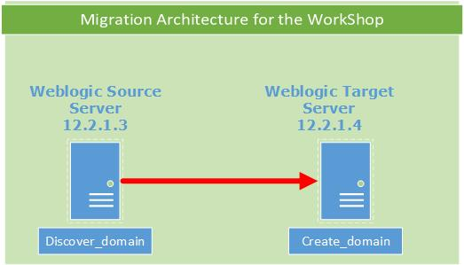
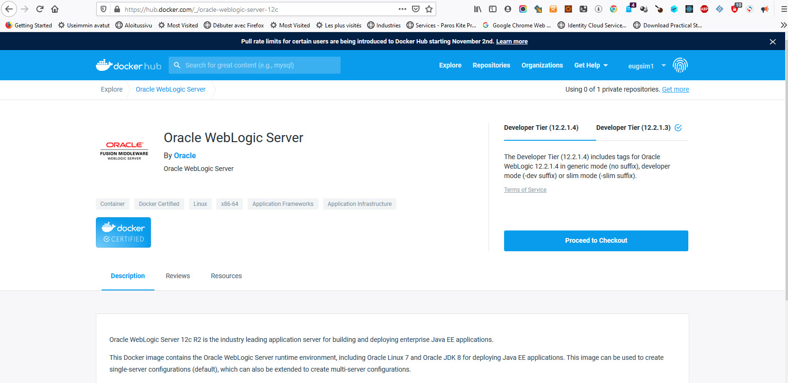

# WebLogic Deploy Workshop  

## Introduction

The following scripts are using the [WDT Weblogic toolkit](https://github.com/oracle/weblogic-deploy-tooling)

The workshop is based on a simple scenario:

1. Introspect a source WebLogic domain
2. Create the domain configuration and its associated artifacts 
3. Apply this configuration to a target WebLogic server 

For this lab you have already installed the Workshop Stack, and downloaded the WebLogic Images from the Docker repository.

The below schema depicts the workshop scenario:

A  WebLogic domain is created on the source server, and our goal is to generate the migration artifacts with the WebLogic tool, and migrate them to another server.

Two docker images will simulate the weblogic servers (source domain server, target domain server for this migration).

The source server [deploys a simple 12.2.1.3 clustered weblogic domain,](https://github.com/oracle/docker-images/tree/master/OracleWebLogic/dockerfiles/12.2.1.3) which will be migrated to the [target 12.2.1.4 server](https://github.com/oracle/docker-images/tree/master/OracleWebLogic/dockerfiles/12.2.1.4).

The target server is installed with the base 12.2.1.4 WebLogic installation, no domains are created.

The migration tool will recreate the source domain to the target server,  and deploy the applications configuration of the initial source domain without any modifications.

In order to run the migration, the WDT tool should be installed and available on both servers.

The migration steps are as below:

1- On the source server the [Discover Domain Tool](https://github.com/oracle/weblogic-deploy-tooling/blob/master/site/discover.md) will introspect the existing domain.

It will create a domain model file in yaml format, an application archive file , and a properties file that has to be used to update password related configurations.

The tool will gather binaries that are accessible from the local system.

If there are any missing files, its up to the operator to correct the issues by adding manually the files to the captured archive.

Further customization are possible in cases that the captured configuration have to been applied to some other domains ie change the domain name, rename the data sources, change the layout of the domain, change the deployed applications.

The tool need the admin user name , and the Admin URL of the source server

2- The generated artifacts will be copied to the target WebLogic Server (scp operation between source and target)

3-On the target server the [Create Domain](https://github.com/oracle/weblogic-deploy-tooling/blob/master/site/create.md) tool will be used to create the target WebLogic domain.

This tool will use the files captured from the source,  password information for the new admin user of the target site.

The target domain layout model is provided as a yaml file





This is the initial source WebLogic domain configuration as depicted from the WebLogic console


=======


In the below sections you will get some details about these scripts.

## Preparing the WebLogic environments

**Check again that you have done the next steps (installed the weblogic docker images ) before to start this lab** :

if you have done this step skip to the **"Start the Labs from here"**

- Log into [Docker hub](https://hub.docker.com/_/oracle-weblogic-server-12c).  You need a docker account to do this, if you don't have such an account follow the instructions on the docker site to create a free account.
- Accept the T&C from Oracle in order to be allowed to download the WebLogic images




- Download the following WebLogic images to your workshop server

  **store/oracle/weblogic:12.2.1.3**

  **store/oracle/weblogic:12.2.1.4**

```
###
### get the following images from the docker hub
##  
###
echo "You_Docker_Password" > ~/my_password.txt
cat ~/my_password.txt | docker login --username Your_Docker_Id --password-stdin
docker pull store/oracle/weblogic:12.2.1.3 
docker pull store/oracle/weblogic:12.2.1.4
```


# Start the Labs from here

Once the the WebLogic images are into your server continue then the lab :


- Then clone the workshop repository scrips as below to your machine , and **relaunch the Docker system** :

```
cd
rm -rf  WLS_deploy_scripts
git clone https://github.com/eugsim1/WLS_deploy_scripts.git
###
### always restart docker daemon to avoid build failures 
###
sudo systemctl  restart docker
sudo systemctl  status docker

cd WLS_deploy_scripts
```

- Then launch the below commands to build the Docker images for the source and the target server.

The Docker files used for this purpose are shared on the [Oracle Github](https://github.com/oracle/weblogic-deploy-tooling/tree/master/samples/docker-domain) .

The source Docker file wil create a WebLogic Installation, and deploy a simple WebLogic Domain

The target Docker file will create a basic WebLogic installation without any domain

```
###
### build the images for the lab
cd /home/oracle/WLS_deploy_scripts
find  . -type f -iname "*.sh" -exec chmod +x {} \;
###
cd /home/oracle/WLS_deploy_scripts/source-12213-domain
cp -R /home/oracle/stage/installers/keys .
./build-docker-image.sh
cd /home/oracle/WLS_deploy_scripts/target-12214-domain
cp -R /home/oracle/stage/installers/keys .
./build-docker-image.sh
```
Having created these images , we need now to create our Workshop infrastructure:

We will Create a local network for our docker servers.

We will instantiate 2 container images for the source, and target server as below:


```
###
### create a network for the docker containers
###
docker network create -d bridge test
```

Create the containers and get the ssh ports to use them for the migration

```
docker run -d -P --name test_sshd_target --network test -p 9001:7001 -p 10001:8001 12214-domain:latest
export DOCKER_PORT_TARGET=`docker port test_sshd_target 22`
export DOCKER_PORT_TARGET=`echo $DOCKER_PORT_TARGET | sed 's/0.0.0.0://g'`
echo $DOCKER_PORT_TARGET
###
###
docker run -d -P --name test_sshd --network test -p 7001:7001 -p 8001:8001 12213-domain-home-in-image-wdt:latest
export DOCKER_PORT_SOURCE=`docker port test_sshd 22`
export DOCKER_PORT_SOURCE=`echo $DOCKER_PORT_SOURCE | sed 's/0.0.0.0://g'`
echo $DOCKER_PORT_SOURCE
docker container ls -a
```

From the previous command you see that the 2 containers are active, so now you can continue by logging into the source container.

```
### start the migration
### log to the source server
cd /home/oracle/WLS_deploy_scripts/source-12213-domain
ssh -i keys/wls_rsa  \
-o "UserKnownHostsFile=/dev/null" \
-o "StrictHostKeyChecking=no"  oracle@localhost -p $DOCKER_PORT_SOURCE

#### use the below script to test the ssh from the target from the host
####ssh -i keys/wls_rsa  \
####-o "UserKnownHostsFile=/dev/null" \
####-o "StrictHostKeyChecking=no"  oracle@localhost -p $DOCKER_PORT_TARGET

```


Once logged into the source server, start the admin server, and check from the logs that the Admin will be up and running

```
### 
### start the admin server 
###
nohup $DOMAIN_HOME/startWebLogic.sh &
tail -f nohup.out
```

Connect to your source WebLogic console , using a browser

And use , the public ip of your vm as host_ip  http://host_ip:7001/console  with the following credentials weblogic/welcome1 ( these are the initial source domain credentials).

Take some time examining the structure of you source domain before to start the migration process with the WDT tool.

Then go to the /home/oracle/WLS_deploy_scripts where the WDT is preinstalled, and check the content of the discover_domain.sh utility
this tool need the following arguments :

- ORACLE_HOME
- DOMAIN_HOME
- location of the archive file (source.zip)
- location of the domain topolgy (source.yaml)
- location of the passwords file source.properties
- domain type (WLS, JRF ...)

During the discovery three artifacts will be created:

1. source.zip 

2. source.properties

3. source.yaml

   


## Discover the existing WebLogic Configuration

- Go to the scripts directory and execute the discovery of the domain

```
###
cd /home/oracle/WLS_deploy_scripts
```


Inspect the discovery domain scrips as below:


```
cat discover_domain.sh
# default to JRF domain which filters out JRF libraries and applications
# If the domain is not JRF, the content would not be present so filterign it out will not make a difference
DOMAIN_TYPE=JRF

# clean up before starting
rm source.* || echo "clean startup"

echo "Discovering the source domain..."
discoverDomain.sh \
    -oracle_home $MW_HOME \
    -domain_home $DOMAIN_HOME \
    -archive_file source.zip \
    -model_file source.yaml \
    -variable_file source.properties \
    -domain_type $DOMAIN_TYPE


if [[ "$(cat source.yaml | grep '@@ORACLE_HOME@@' | wc -l)" != "0" ]]; then
    echo "Some of the application files are located within the ORACLE_HOME and won't be extracted by WDT"
    echo "Extracting those files and updating paths in the model file..."
    rm -rf ./wlsdeploy/
    mkdir -p ./wlsdeploy/applications;
    cp $(cat source.yaml | grep '@@ORACLE_HOME@@' | sed "s|.*: '@@ORACLE_HOME@@\(.*\)'|${ORACLE_HOME}\1|") ./wlsdeploy/applications/;
    zip -r source.zip ./wlsdeploy;
    rm -rf ./wlsdeploy/
    sed -i "s|@@ORACLE_HOME@@|wlsdeploy\/applications|g;" source.yaml
fi
```


Lets execute the introspection of the domain, and generate the domain files by launching the below command on the source server

```
./discover_domain.sh
```

Observe the output of this execution, if there is an error it will be at the end of the diagnostics, in this case you should correct it before continuing.

In our case there are 0 Warnings, 0 Errors

```
#### we skip all the execution results  
####


Issue Log for discoverDomain version 1.9.6 running WebLogic version 12.2.1.3.0 offline mode:

Total:       WARNING :     0    SEVERE :     0

discoverDomain.sh completed successfully (exit code = 0)

```


The discovery script has created three files:

1. source.zip
2. source.properties
3. source.yaml


Looking into the source.yaml file we see that the discovered WebLogic domain is composed from:

1. An admin server
2. one clustered managed server
3. one application is deployed on the cluster

check the topology to get the domain_name
check the cluster 
check the appDeployments

Before going further take some time to answer the below questions ?

What is the domain name ?
What is the Admin-server name ?
How many applications are captured from the domain ?
To which servers of the domains these applications are deployed ?


```
cat source.yaml
domainInfo:
    AdminUserName: '@@PROP:AdminUserName@@'
    AdminPassword: '@@PROP:AdminPassword@@'
topology:
    Name: wdt_domain
    AdminServerName: 'admin-server'
    DomainVersion: 12.2.1.3.0
    Log:
        DomainLogBroadcasterBufferSize: 1
        FileName: wdt_domain.log
    NMProperties:
        JavaHome: /u01/jdk
        weblogic.StartScriptName: startWebLogic.sh
    Cluster:
        'cluster-1':
            DynamicServers:
                ServerNamePrefix: 'managed-server-'
                MaxDynamicClusterSize: 1
                CalculatedListenPorts: false
                MaximumDynamicServerCount: 1
                ServerTemplate: 'cluster-1-template'
                DynamicClusterSize: 1
    Server:
        'admin-server':
            NetworkAccessPoint:
                T3Channel:
                    PublicPort: 30012
                    ListenPort: 30012
            SSL:
                Enabled: true
            ServerDiagnosticConfig:
                WldfDiagnosticVolume: Low
    ServerTemplate:
        'cluster-1-template':
            ListenPort: 8001
            Cluster: 'cluster-1'
            JTAMigratableTarget:
                Cluster: 'cluster-1'
            SSL:
                ListenPort: 8100
appDeployments:
    Application:
        'simple-app':
            SourcePath: 'wlsdeploy/applications/simple-app.war'
            PlanStagingMode: stage
            ModuleType: war
            StagingMode: nostage
            Target: 'cluster-1'

```

Then you should copy the files to the target server.

In order to facilitate the transport we create a zip file of the generated artifacts.


```
###
### create a zip file with all the articats
###
./create_zip_from_discovery.sh
updating: discovery_files/ (stored 0%)
updating: discovery_files/source.properties (deflated 3%)
updating: discovery_files/source.yaml (deflated 63%)
updating: discovery_files/source.zip (stored 0%)

```
And we copy the file to the target server.

```
 ###
 ### copy the file to the target server
 ###
scp -i ~/.ssh/wls_rsa  -o "UserKnownHostsFile=/dev/null" -o "StrictHostKeyChecking=no" \
/home/oracle/WLS_deploy_scripts/discovery_files.zip \
oracle@test_sshd_target:/home/oracle/WLS_deploy_scripts/discovery_files.zip && clear
clear
```


**At this point you have :**

1. discovered a domain, 
2. created the migration templates, and the domain artifacts for the migration, we dont need to carry any modification to the target domain
3. copied the generated files, to the target server 


## Create a new domain based on the captured config

The next step is to log into the target server, and create a domain based on the captured configuration.

Log into the target WebLogic Server (**from your source container NOT FROM THE HOST** ) :

```
ssh -i ~/.ssh/wls_rsa  \
-o "UserKnownHostsFile=/dev/null" \
-o "StrictHostKeyChecking=no" oracle@test_sshd_target

```

For the migration task you need :
To unzip the uploaded files from the migration.
To create the account/password for the admin user of your  new weblogic server
execute the below scripts :

```
cd /home/oracle/WLS_deploy_scripts
unzip discovery_files.zip

```

If you want to rerun the same scripts then you can remove the previous created domains.
In our case the below script is not needed as we are creating a brand new domain.

```
####
#### before to create the domain remover the old one (cleanup )
####
cd /home/oracle/WLS_deploy_scripts

rm -rf $DOMAIN_HOME
mkdir -p $DOMAIN_HOME

```

We need to provide the new credentials for the admin user of the migrated WebLogic domain.

update the content of the source.properties file as below :

```
#### create the new admin user/password
####
cat<<'EOF'>discovery_files/source.properties
AdminPassword=welcome1
AdminUserName=weblogic
EOF
cat discovery_files/source.properties

```
Then create the [create_domain.sh](https://github.com/oracle/weblogic-deploy-tooling/blob/master/site/create.md) script content, which when executed will create the new domain, using the artifacts from the source domain
We are setting in this script all the variables ( systems variable, migration artifacts for the new domain)

```
###
### create the script for the migration 
###

cat<<'EOF'> create_new_domain.sh
 #### https://github.com/oracle/weblogic-deploy-tooling/blob/master/site/create.md
 #### create a domain_home
export WLST_PATH=/u01/oracle/oracle_common
createDomain.sh \
-oracle_home $ORACLE_HOME \
-java_home $JAVA_HOME \
-domain_home $DOMAIN_HOME \
-domain_type WLS \
-variable_file discovery_files/source.properties \
-model_file   discovery_files/source.yaml \
-archive_file discovery_files/source.zip \
-wlst_path    $WLST_PATH
EOF
chmod u+x create_new_domain.sh
```
Then execute the script

```
./create_new_domain.sh
```

Notice at the end of the script output , if there are errors which then you should correct checking  the continent of the yaml file, or the archive file.

The [validate domain tool](https://github.com/oracle/weblogic-deploy-tooling/blob/master/site/validate.md) in this cases can help you with any configuration / customization issue

In our case the domain has been created without any errors or warnings

```
####<Oct 26, 2020 3:17:32 PM> <INFO> <ApplicationDeployer> <__add_applications> <WLSDPLY-09301> <Adding Application simple-app to Domain base_domain>

Issue Log for createDomain version 1.9.6 running WebLogic version 12.2.1.4.0 offline mode:

Total:       WARNING :     0    SEVERE :     0

createDomain.sh completed successfully (exit code = 0)

```
Check now the structure of your new created domain :

```
cd $DOMAIN_HOME
cat config/config.xml
```
Check the below output of  the configuration of your domain

What is the name of your new domain ?
What is the name of the admin server ?
Do you have any clusters ?
Do you have any application deployed to your domains server ?

Try to answer to these question before to continue.


```
<?xml version="1.0" encoding="UTF-8"?>
<domain xsi:schemaLocation="http://xmlns.oracle.com/weblogic/security/wls http://xmlns.oracle.com/weblogic/security/wls/1.0/wls.xsd http://xmlns.oracle.com/weblogic/domain http://xmlns.oracle.com/weblogic/1.0/domain.xsd http://xmlns.oracle.com/weblogic/security http://xmlns.oracle.com/weblogic/1.0/security.xsd http://xmlns.oracle.com/weblogic/security/xacml http://xmlns.oracle.com/weblogic/security/xacml/1.0/xacml.xsd" xmlns="http://xmlns.oracle.com/weblogic/domain" xmlns:sec="http://xmlns.oracle.com/weblogic/security" xmlns:wls="http://xmlns.oracle.com/weblogic/security/wls" xmlns:xsi="http://www.w3.org/2001/XMLSchema-instance">
  <name>wdt_domain</name>
  <domain-version>12.2.1.4.0</domain-version>
  <security-configuration xmlns:xacml="http://xmlns.oracle.com/weblogic/security/xacml" xmlns:pas="http://xmlns.oracle.com/weblogic/security/providers/passwordvalidator">
    <name>wdt_domain</name>
    <realm>
      <sec:authentication-provider xsi:type="wls:default-authenticatorType">
        <sec:name>DefaultAuthenticator</sec:name>
      </sec:authentication-provider>
      <sec:authentication-provider xsi:type="wls:default-identity-asserterType">
        <sec:name>DefaultIdentityAsserter</sec:name>
        <sec:active-type>AuthenticatedUser</sec:active-type>
        <sec:active-type>weblogic-jwt-token</sec:active-type>
      </sec:authentication-provider>
      <sec:role-mapper xsi:type="xacml:xacml-role-mapperType">
        <sec:name>XACMLRoleMapper</sec:name>
      </sec:role-mapper>
      <sec:authorizer xsi:type="xacml:xacml-authorizerType">
        <sec:name>XACMLAuthorizer</sec:name>
      </sec:authorizer>
      <sec:adjudicator xsi:type="wls:default-adjudicatorType">
        <sec:name>DefaultAdjudicator</sec:name>
      </sec:adjudicator>
      <sec:credential-mapper xsi:type="wls:default-credential-mapperType">
        <sec:name>DefaultCredentialMapper</sec:name>
      </sec:credential-mapper>
      <sec:cert-path-provider xsi:type="wls:web-logic-cert-path-providerType">
        <sec:name>WebLogicCertPathProvider</sec:name>
      </sec:cert-path-provider>
      <sec:cert-path-builder>WebLogicCertPathProvider</sec:cert-path-builder>
      <sec:name>myrealm</sec:name>
      <sec:password-validator xsi:type="pas:system-password-validatorType">
        <sec:name>SystemPasswordValidator</sec:name>
        <pas:min-password-length>8</pas:min-password-length>
        <pas:min-numeric-or-special-characters>1</pas:min-numeric-or-special-characters>
      </sec:password-validator>
    </realm>
    <default-realm>myrealm</default-realm>
    <credential-encrypted>{AES256}Y0ub+WHFAeDiumj6/QP+49Ft1iTgjiwiMtOzw8PmTq5BrB5+wslUf2sMrQSuwB9bNKgdzNAB/TrnBKu4QgKMmgTx/fguHuoIk54TDDiY1S1ta8nDHzMWwv6vWDgEDGMh</credential-encrypted>
    <node-manager-username>weblogic</node-manager-username>
    <node-manager-password-encrypted>{AES256}UB7lmnixw7ZRyK1jwzaGP36B08HuwLSakZF/7GfVxYY=</node-manager-password-encrypted>
  </security-configuration>
  <log>
    <name>wdt_domain</name>
    <file-name>wdt_domain.log</file-name>
  </log>
  <server>
    <name>admin-server</name>
    <ssl>
      <name>admin-server</name>
      <enabled>true</enabled>
    </ssl>
    <listen-address/>
    <network-access-point>
      <name>T3Channel</name>
      <listen-port>30012</listen-port>
      <public-port>30012</public-port>
    </network-access-point>
    <server-life-cycle-timeout-val>30</server-life-cycle-timeout-val>
    <startup-timeout>0</startup-timeout>
    <server-diagnostic-config>
      <name>NO_NAME_0</name>
      <wldf-diagnostic-volume>Low</wldf-diagnostic-volume>
    </server-diagnostic-config>
  </server>
  <server-template>
    <name>cluster-1-template</name>
    <ssl>
      <name>cluster-1-template</name>
      <enabled>false</enabled>
      <listen-port>8100</listen-port>
    </ssl>
    <listen-port>8001</listen-port>
    <cluster>cluster-1</cluster>
    <jta-migratable-target>
      <name>${serverName}</name>
      <cluster>cluster-1</cluster>
    </jta-migratable-target>
  </server-template>
  <cluster>
    <name>cluster-1</name>
    <cluster-messaging-mode>unicast</cluster-messaging-mode>
    <dynamic-servers>
      <name>NO_NAME_0</name>
      <server-template>cluster-1-template</server-template>
      <maximum-dynamic-server-count>1</maximum-dynamic-server-count>
      <calculated-listen-ports>false</calculated-listen-ports>
      <server-name-prefix>managed-server-</server-name-prefix>
      <dynamic-cluster-size>1</dynamic-cluster-size>
      <max-dynamic-cluster-size>1</max-dynamic-cluster-size>
    </dynamic-servers>
  </cluster>
  <embedded-ldap>
    <name>wdt_domain</name>
    <credential-encrypted>{AES256}GKG/p9oq/4lh7V5uA6bljzkYIH03nIbuMLDwtEbXY3QF19vNcSxokKDjT/3lMdpE</credential-encrypted>
  </embedded-ldap>
  <configuration-version>12.2.1.4.0</configuration-version>
  <app-deployment>
    <name>simple-app</name>
    <target>cluster-1</target>
    <module-type>war</module-type>
    <source-path>wlsdeploy/applications/simple-app.war</source-path>
    <staging-mode>nostage</staging-mode>
    <plan-staging-mode>stage</plan-staging-mode>
  </app-deployment>
  <admin-server-name>admin-server</admin-server-name>
</domain>

```
Then launch the new WebLogic Domain, to check that the migration has really created your domain as configured from the migration artifacts.

Because we haven't carry nay modification to the yaml files, or to the application deployments you should see the same domain topology as on the source server.

```
nohup $DOMAIN_HOME/startWebLogic.sh &
tail -f nohup.out
```

```
tail -f nohup.out
2020-10-26 15:24:51.434/10.430 Oracle Coherence 12.2.1.4.0 <Info> (thread=[STANDBY] ExecuteThread: '7' for queue: 'weblogic.kernel.Default (self-tuning)', member=n/a): Optional configuration override "/tangosol-coherence-override.xml" is not specified
2020-10-26 15:24:51.443/10.438 Oracle Coherence 12.2.1.4.0 <Info> (thread=[STANDBY] ExecuteThread: '7' for queue: 'weblogic.kernel.Default (self-tuning)', member=n/a): Optional configuration override "cache-factory-config.xml" is not specified
2020-10-26 15:24:51.447/10.443 Oracle Coherence 12.2.1.4.0 <Info> (thread=[STANDBY] ExecuteThread: '7' for queue: 'weblogic.kernel.Default (self-tuning)', member=n/a): Optional configuration override "cache-factory-builder-config.xml" is not specified
2020-10-26 15:24:51.450/10.445 Oracle Coherence 12.2.1.4.0 <Info> (thread=[STANDBY] ExecuteThread: '7' for queue: 'weblogic.kernel.Default (self-tuning)', member=n/a): Optional configuration override "/custom-mbeans.xml" is not specified

Oracle Coherence Version 12.2.1.4.0 Build 74888
 Grid Edition: Development mode
Copyright (c) 2000, 2019, Oracle and/or its affiliates. All rights reserved.

2020-10-26 15:24:51.533/10.528 Oracle Coherence GE 12.2.1.4.0 <Info> (thread=[STANDBY] ExecuteThread: '7' for queue: 'weblogic.kernel.Default (self-tuning)', member=n/a): Configured versioned, multi-cluster Management over ReST

```


Log to the new server console (9001) from your server 
Remember to use the IP of the host that is running your containers !


And Check the deployed applications :


As you see then we have migrated our source WebLogic domain, very easily to a new server.

In the next releases of this workshop we will combine more features , stay tuned

Thanks for your participation ! 