# WLS imagetool workshop 

In this Lab we will use the [Oracle Weblogic Image tool](https://github.com/oracle/weblogic-image-tool) to :

1. Create a Weblogic docker Image using the [Create Image](https://github.com/oracle/weblogic-image-tool/blob/master/site/create-image.md) command 
2. Update a Weblogic docket image with the latest PSU and a domain deployment using the [Update Image](https://github.com/oracle/weblogic-image-tool/blob/master/site/update-image.md) command and the WDT tool to deploy a domain from a model
3. Create a Weblogic docker image from an existing Weblogic image, apply some patch updates using the [Create Image](https://github.com/oracle/weblogic-image-tool/blob/master/site/create-image.md) tool
4. Push a Weblogic docker image to an OCI registry
5. Pull a Weblogic image from an OCI registry

**All the subsequent steps have to be run from the provided compute image**.

Follow the next steps to get the base compute image and install it your tenancy.
Once the import of this images is done, then you should create a new compute node from this image.
You will run all labs from this node

You have to provide a VCN, with a  public subnet, and an Internet Gateway and your public key in order to be able to log into the new compute image and run all the parts of this workshop.

These are the installation steps to import / configure / create your compute node :
Log into your OCI account

A pre-auth request to download the image from the original bucket should be given to you during the workshop.
For the demo we will use a temp pre-aauth request as  : 

https://objectstorage.eu-frankfurt-1.oraclecloud.com/p/0cGx21GaR_ZHfxABGGKpHNdgB7918BrhVOCLZ0jrl6IjOanhoMAypKEp2EYjjN3M/n/oraseemeatechse/b/weblogic/o/wls_base_image 

Click on compute /custom images 


Click on :

1. Import image
2. Give a name to the image
3. Import from object storage bucket URL
4. Copy the pre-auth request to the textbox
5. Choose OCI type
6. Then click import to launch the import of this image to your compartment 


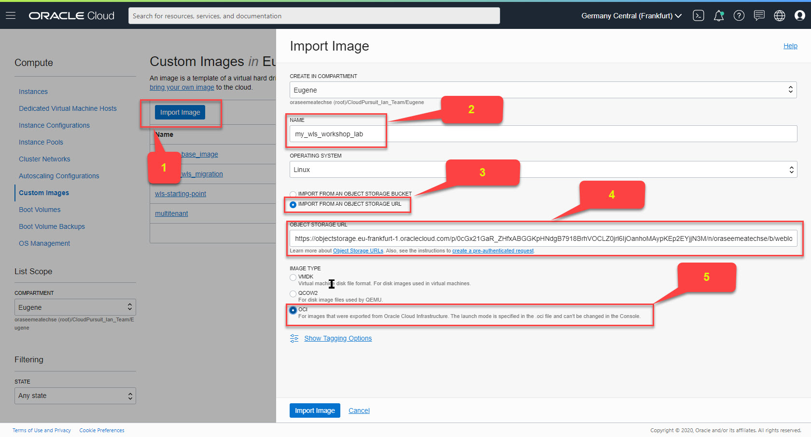


the import task will be launched , and you have to wait until the state of the work request is finished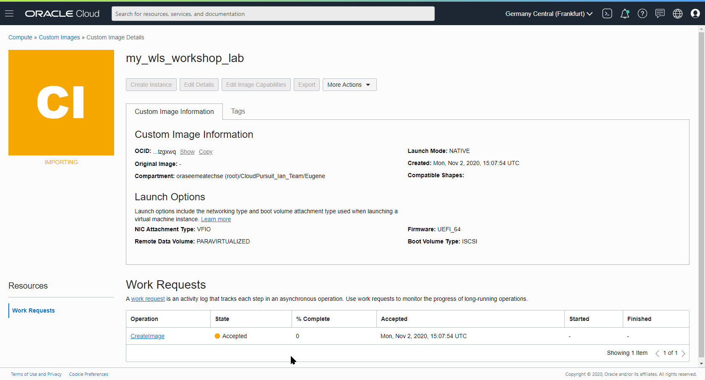

At this stage the inspection of the imported image should be as below

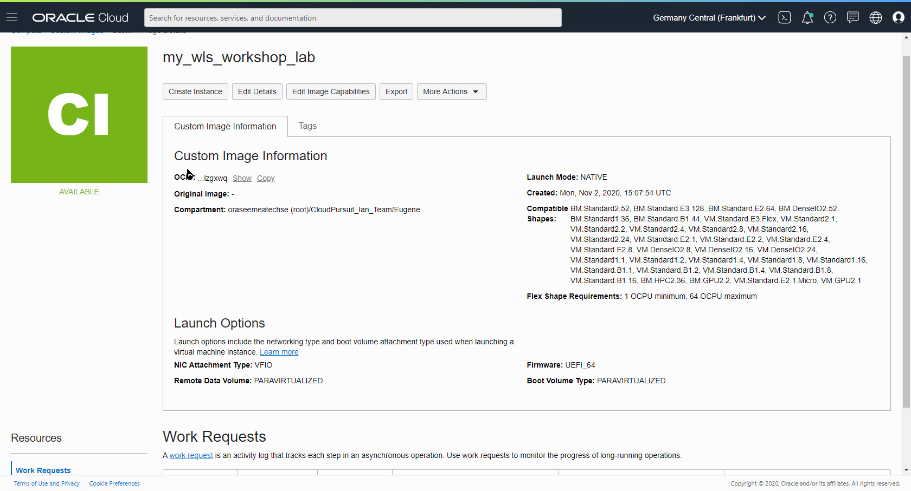


In your tenancy  before to deploy a new compute node from this image, check that you have:

1.  **a vnc, with a regional public subnet, associated with a security list**
2.  **the port 22 open (ssh)**
3. **an internet gateway**

Below you have some examples with the previous settings :

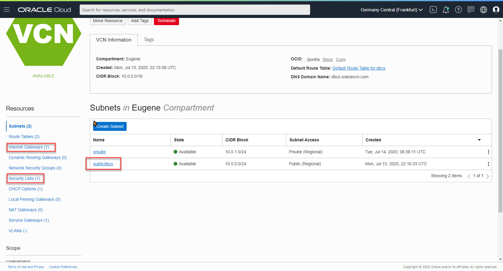


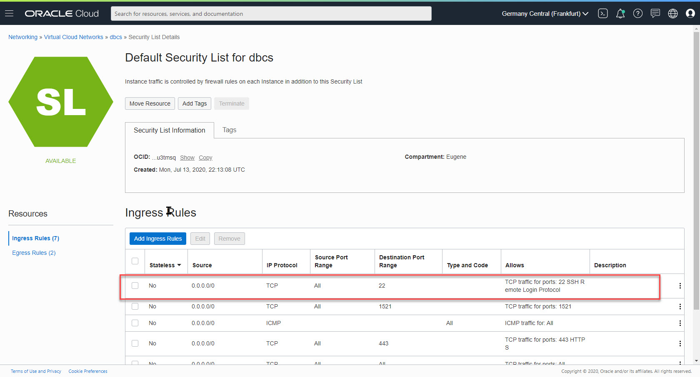


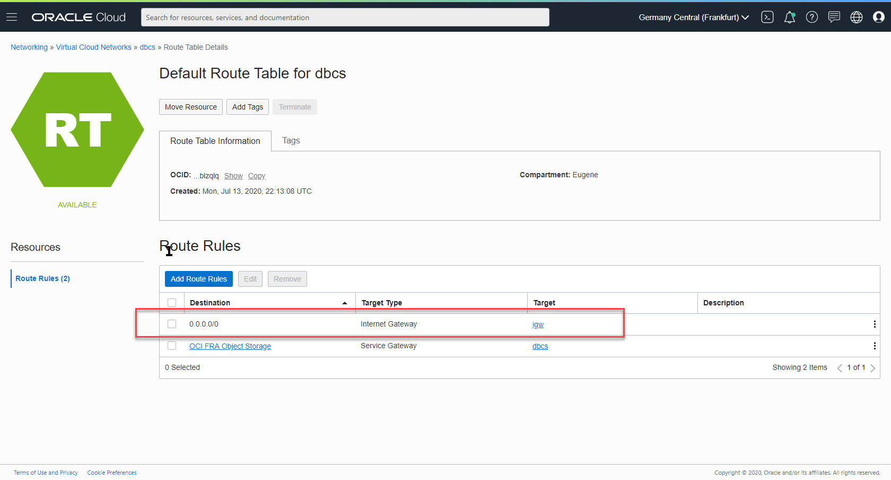


Create you labs compute node as below:

click on Compute/Instances entry of you oci console 

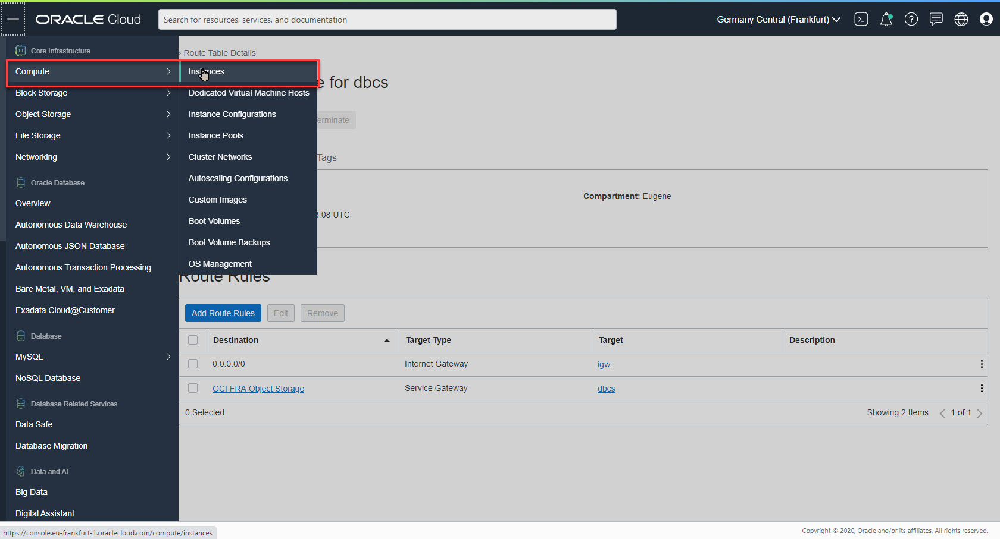

Create an image from Custom Images /wls_lab_base_image
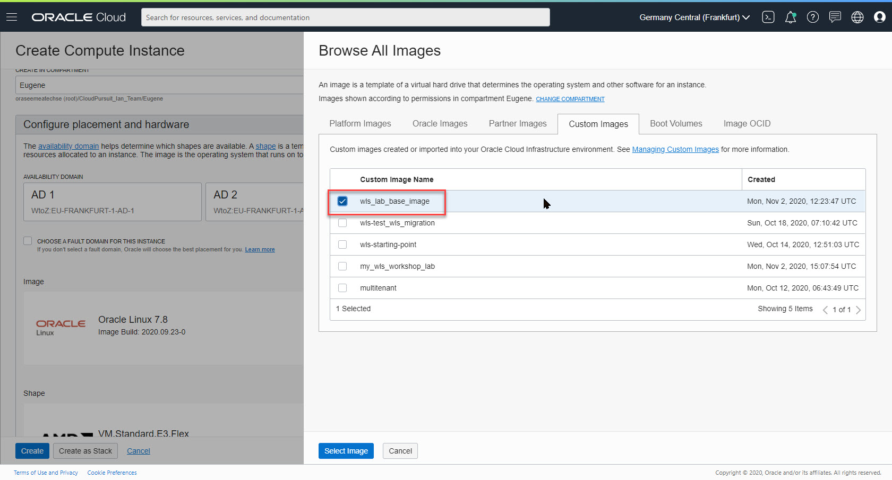

Call you compute node wls_compute_node, choose any AD, check that the node is based on the custom imported image


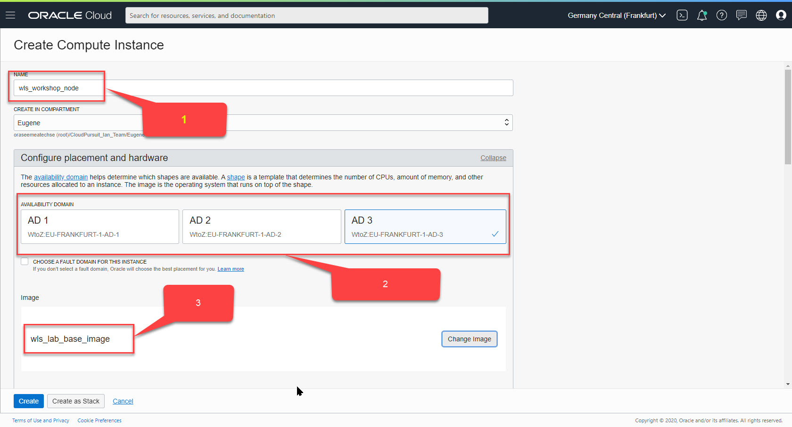

Choose your VCN, with your public regioanl subnet, and assign a public IP

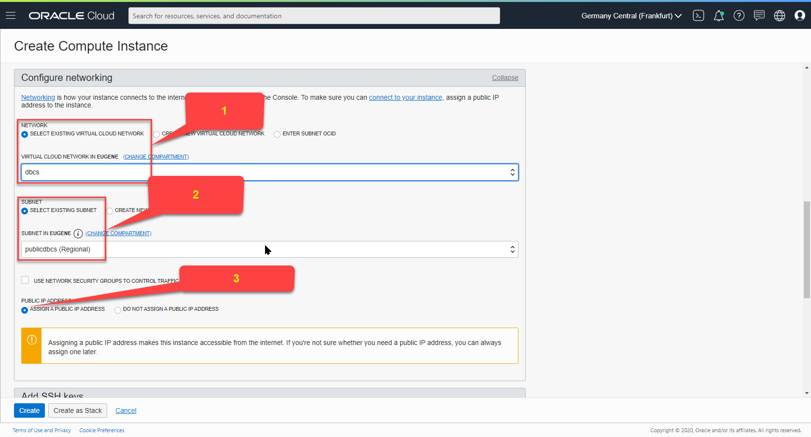

Copy your public key from your private key

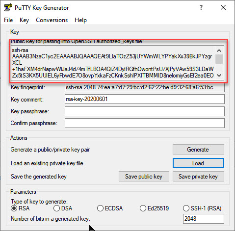

Paste your public ke to the wizzard

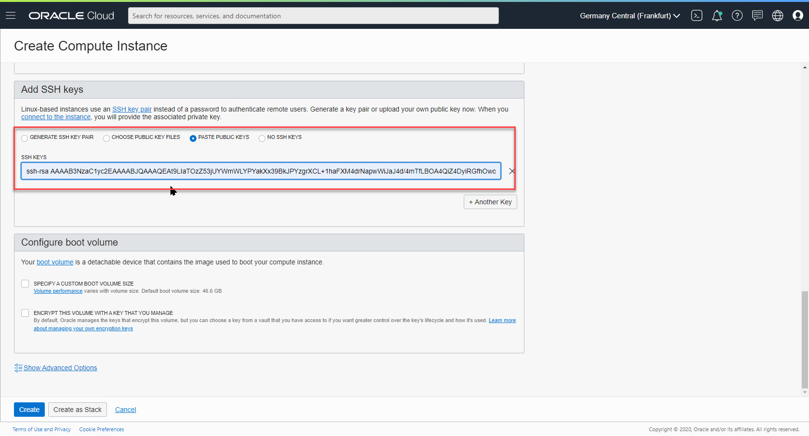

Push the create button to launch the creation of your compute node
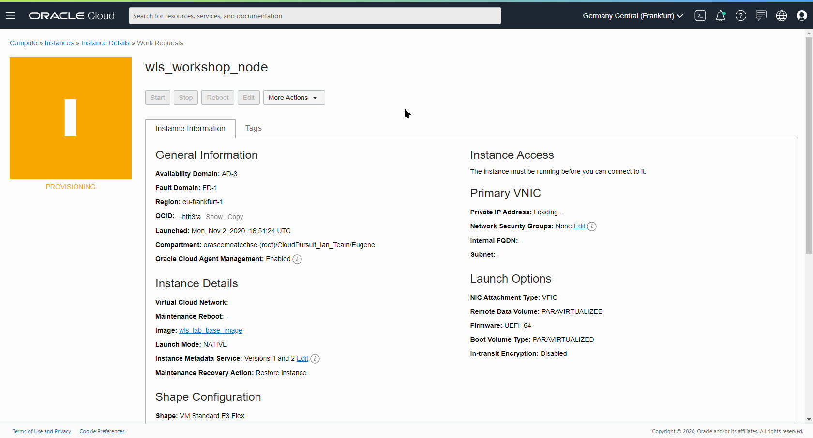

Select the public IP of your compute node and use to to connect to your server

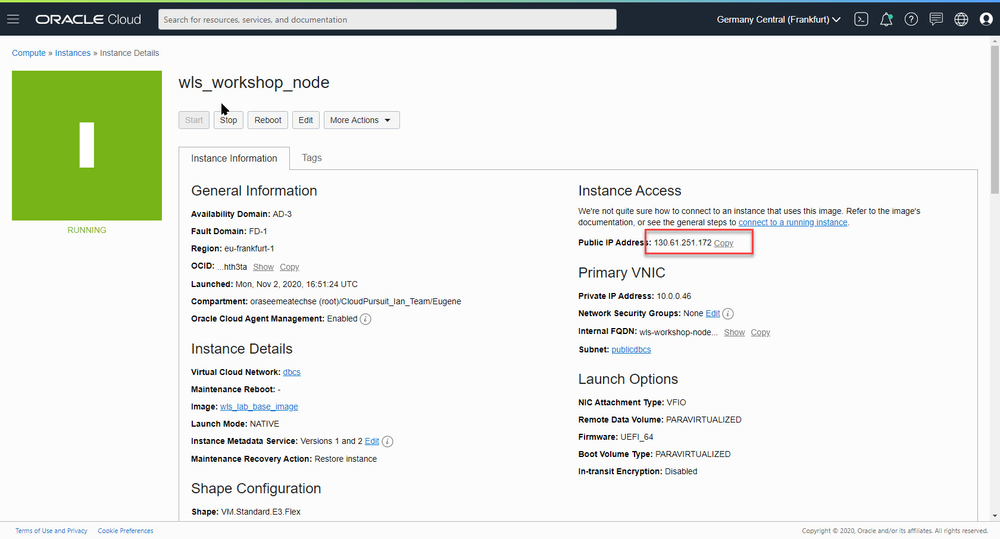

Use your client SSH sofotaware , below is the setting for MobXterm 

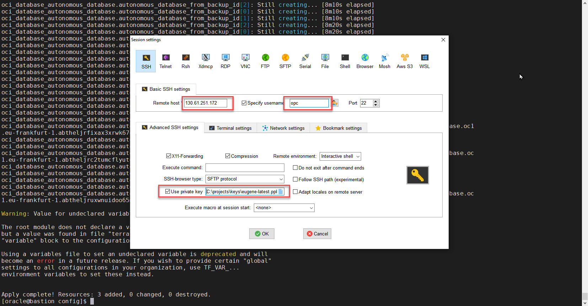


execute the command to change the linux user to oracle :

```
sudo su - oracle
```

Then you have to  switch to the /home/oracle/stage/installers directory from where you should run the workshop


**Before to start this lab we will explain some settings for the Docker Daemon.**

We will activate the buildkit [extention](https://docs.docker.com/develop/develop-images/build_enhancements/) in our Docker builds by adding the flag in out docker build command  
***(check the provided scripts)***.

BuildKit handle docker tag in lower letters.

We will generate the "stubs", or Dockerfiles with the dryrun flag, we will convert the relevant tags in lower letters, and then we will built the docker images with the docker build commands.

```
DOCKER_BUILDKIT=1 docker build .
```

The buildkit can be also globally activated by creating the following json file, we have added the experimental feature as well
**you don't need to modify anything into your compute node !**

```
sudo su <<EOT
cat<<'EOF'>/etc/docker/daemon.json
{
  "features": { "buildkit": true },
  "experimental": true
}
EOF
EOT
```


**We have already pre-installed  your server with :**

1. Imagetool

2. WebLogic Deploy tool

3. WebLogic binaries

4. Patches needed to run the PSU updates 

   The section below is given as an example of our setup

```
su - oracle
mkdir -p /home/oracle/stage/installers
cd stage

### remove any previous installs of the weblogic tools
###
rm -rf imagetool.zip imagetool

####
#### get the latest imagetool version
####
cd /home/oracle/stage/installers
wget https://github.com/oracle/weblogic-image-tool/releases/download/release-1.9.5/imagetool.zip
echo "A" | unzip imagetool.zip
echo "export PATH=/home/oracle/stage/imagetool/bin:$PATH" >> /home/oracle/.bashrc
source  /home/oracle/.bashrc
###
###
### get the weblogic deploy tool
###
cd /home/oracle/stage/installers
wget https://github.com/oracle/weblogic-deploy-tooling/releases/download/release-1.9.5/weblogic-deploy.zip

cd /home/oracle/stage/installers
###
### get the jdk1.8 and the weblogic 12.2.1.4.0 installation media
### ! if the below links are not working the you should download the media from the Oracle site !
### 
wget https://objectstorage.eu-frankfurt-1.oraclecloud.com/p/-wt7k7uBjvr6cNK9RC_3D3Mj-guFrU0VDsVtF2fIqoMY8mpZQOQzF0L0w5PPuDUt/n/oraseemeatechse/b/ords/o/jdk-8u261-linux-x64.tar.gz
tar -xvf jdk-8u261-linux-x64.tar.gz

mv jdk1.8.0_261 /u01/.

### get the weblogic distribution
wget https://objectstorage.eu-frankfurt-1.oraclecloud.com/p/w19Ar-r7e-v8G7PXSP314-khr6kAcPcMRtuwrINpyqjBxQwKVdf-3FZ2arNlucYj/n/oraseemeatechse/b/ords/o/fmw_12.2.1.4.0_wls_Disk1_1of1.zip

echo "export PATH=/u01/jdk1.8.0_261/bin:$PATH" >>        /home/oracle/.bashrc
echo "export CLASSPATH=/u01/jdk1.8.0_261:$CLASSPATH" >> /home/oracle/.bashrc
echo "export JAVA_HOME=/u01/jdk1.8.0_261" >> /home/oracle/.bashrc
echo "alias imagetool=\"imagetool.sh\"" >> /home/oracle/.bashrc
echo "export PATH=/home/oracle/stage/imagetool/bin:$PATH" >>        /home/oracle/.bashrc
echo "alias imagetool=\"imagetool.sh\"" >> /home/oracle/.bashrc

cat /home/oracle/.bashrc
source /home/oracle/.bashrc
java -version

cd /home/oracle/stage/installers


```


Before to start to use the image tool we have to create a ["cache"](https://github.com/oracle/weblogic-image-tool/blob/master/site/cache.md)  with the software that we will use to create out docker images.

During the "updates", if you install PSU or patches the tool will place these artifacts into this cache

In the below code , the cache is already loaded with several items, we will remove all this items with the following command:


```
imagetool cache deleteEntry --key XXX 
```

***(copy paste the below script to your linux image)***  :

```
imagetool cache listItems
```
The resulat will be as below:

```
Cache contents
cache.dir=/home/oracle/cache
31960985_12.2.1.4.0=/home/oracle/cache/p31960985_122140_Generic.zip
wdt_1.9.3=/home/oracle/stage/installers/weblogic-deploy.zip
wls_12.2.1.4.0=/home/oracle/stage/installers/fmw_12.2.1.4.0_wls_Disk1_1of1.zip
jdk_8u261=/home/oracle/stage/installers/jdk-8u261-linux-x64.tar.gz
28186730_13.9.4.2.4=/home/oracle/cache/p28186730_139424_Generic.zip
```

**Clear the cache**
***(copy paste the below script to your linux image)***  :

```
imagetool cache deleteEntry --key 31960985_12.2.1.4.0
imagetool cache deleteEntry --key wdt_1.9.3
imagetool cache deleteEntry --key wls_12.2.1.4.0
imagetool cache deleteEntry --key 28186730_13.9.4.2.4
imagetool cache deleteEntry --key jdk_8u261
```

```
imagetool cache listItems
```
The result will be as below:

```
Cache contents
cache.dir=/home/oracle/cache
```

**Now  load the cache with the installers**

***(copy paste the below script to your linux image)*** : 

 ```
 imagetool cache addInstaller \
 --type jdk --version 8u261      \
 --path /home/oracle/stage/installers/jdk-8u261-linux-x64.tar.gz
 
  imagetool cache addInstaller \
 --type wls \
 --version 12.2.1.4.0 \
 --path /home/oracle/stage/installers/fmw_12.2.1.4.0_wls_Disk1_1of1.zip
 
 imagetool cache addInstaller \
 --type wdt \
 --version 1.9.3 \
 --path /home/oracle/stage/installers/weblogic-deploy.zip
 ```
  The result will be as below:

  ```
 [INFO   ] Successfully added to cache. jdk_8u261=/home/oracle/stage/installers/jdk-8u261-linux-x64.tar.gz
 
 [INFO   ] Successfully added to cache. wls_12.2.1.4.0=/home/oracle/stage/installers/fmw_12.2.1.4.0_wls_Disk1_1of1.zip
 
 [INFO   ] Successfully added to cache. wdt_1.9.3=/home/oracle/stage/installers/weblogic-deploy.zip
  ```

**Clean the system from previous docker artifacts** 

***(copy paste the below script to your linux image)*** : :

```
docker system prune -f
```
The result will be as below:

```
Deleted Images:
deleted: sha256:8b722d221f1cd3d485a00d180c735c8736ce42ac0c53c09de888c95ee6fb8a01

Deleted build cache objects:
k11a0vcxgguccowxrzntqhr38
57zbni2ravjjtjj01w69vreep
vwega7d2ckgtwgoosf5p332im
ywknciuswa62kqdmrrutj4t9a
0nkqw3dxjvs0d4x03uwxeca4u
o8wziypnfxxpamej7gsg8bklm
mig26dtth0xa2d9b6sh49n8wn
sha256:8fe2a58fdb45863a81c59897277d26829eaf277e99962b97619c6bd7f9efdf13

Total reclaimed space: 1.984GB 
```


**Create a text file with your Oracle Support Credentials needed to download patched from the Oracle Support Site**:

***(copy paste the below script to your linux image)*** :

```
cd /home/oracle/stage/installers/
docker system prune -f
export ORACLE_SUPORT_PASSWORD=Your_Oracle_Support_Password
echo $ORACLE_SUPORT_PASSWORD > passwd.txt
```

# PART 1 CREATE A BASIC DOCKER IMAGE

Lets create a basic docker image ***(copy paste the below script to your linux image)*** :

```
export DOCKER_FILE=dockerfile_build_commands_12.2.1.4.0
export IMAGE_NAME=image_tool_12.2.1.4.0_buildkit_step1
echo "************************" 
echo "removing previous image"
echo "************************"
docker image rmi $IMAGE_NAME

time imagetool create --tag $IMAGE_NAME \
--latestPSU --version 12.2.1.4.0 \
--user  your_oracle_support_name@oracle.com \
--jdkVersion=8u261 \
--passwordFile passwd.txt
```
The result will be as below:
```
[INFO   ] Image Tool build ID: 4dc21037-3aa1-4f14-8321-007cef2caa6f
[INFO   ] Temporary directory used for docker build context: /home/oracle/wlsimgbuilder_temp243612593290137457
[INFO   ] Copying /home/oracle/stage/installers/jdk-8u261-linux-x64.tar.gz to build context folder.
[INFO   ] Using middleware installers (wls) version 12.2.1.4.0
[INFO   ] Copying /home/oracle/stage/installers/fmw_12.2.1.4.0_wls_Disk1_1of1.zip to build context folder.
[INFO   ] Oracle WebLogic Server - locating patch number for the latest PSU...
[INFO   ] Oracle WebLogic Server - the latest PSU patch number is 31960985_12.2.1.4.0
[INFO   ] Oracle Coherence - locating patch number for the latest PSU...
[INFO   ] Oracle Coherence - there are no recommended PSUs for version 12.2.1.4.0
[INFO   ] Validating patches
[INFO   ] Validated patch 31960985 for Oracle WebLogic Server 12.2.1.4.0
[INFO   ] No patch conflicts detected
[INFO   ] Could not find key 31960985_12.2.1.4.0 in the cache for patch 31960985
[INFO   ] Downloading patch 31960985...
[INFO   ] Adding patch 31960985_12.2.1.4.0 to cache, path=/home/oracle/cache/p31960985_122140_Generic.zip
[INFO   ] Requesting patch information for patch 28186730
[INFO   ] Could not find key 28186730_13.9.4.2.4 in the cache for patch 28186730
[INFO   ] Downloading patch 28186730...
[INFO   ] Adding patch 28186730_13.9.4.2.4 to cache, path=/home/oracle/cache/p28186730_139424_Generic.zip
[INFO   ] docker cmd = docker build --no-cache --force-rm --tag image_tool_12.2.1.4.0_buildkit_step1 /home/oracle/wlsimgbuilder_temp243612593290137457
[SEVERE ] docker command failed with error: #2 [internal] load .dockerignore
#2 DONE 0.0s

#1 [internal] load build definition from Dockerfile
#1 transferring dockerfile: 3.56kB done
#1 DONE 0.0s

#2 [internal] load .dockerignore
#2 transferring context: 2B done
#2 DONE 0.0s
failed to solve with frontend dockerfile.v0: failed to create LLB definition: failed to parse stage name "OS_UPDATE": invalid reference format: repository name must be lowercase
```

**The last lines are expected errors as the docker build kit need tags in dockerfile with lower letters.**
**we will resolve this issue in the next steps.**

Notice that patches weren't in the cache so they are downloaded to the cache, this operation used your credentials.

If your credentials are wrong the operation will fail.

If during this operation you will get the below error then try to execute again the script

```
[INFO   ] Image Tool build ID: 6151a7c8-4ab1-4898-8289-0d84ec216b28
[INFO   ] Temporary directory used for docker build context: /home/oracle/wlsimgbuilder_temp7367327172036346773
[INFO   ] Copying /home/oracle/stage/installers/jdk-8u261-linux-x64.tar.gz to build context folder.
[INFO   ] Using middleware installers (wls) version 12.2.1.4.0
[INFO   ] Copying /home/oracle/stage/installers/fmw_12.2.1.4.0_wls_Disk1_1of1.zip to build context folder.
[INFO   ] Oracle WebLogic Server - locating patch number for the latest PSU...
[SEVERE ] Unable to retrieve list of Oracle releases from Oracle Updates (ARU). Try again later.
```
***(copy paste the below script to your linux image)*** :

```
imagetool cache listItems
```
The result will be as below:

```
Cache contents
cache.dir=/home/oracle/cache
31960985_12.2.1.4.0=/home/oracle/cache/p31960985_122140_Generic.zip
wdt_1.9.3=/home/oracle/stage/installers/weblogic-deploy.zip
wls_12.2.1.4.0=/home/oracle/stage/installers/fmw_12.2.1.4.0_wls_Disk1_1of1.zip
jdk_8u261=/home/oracle/stage/installers/jdk-8u261-linux-x64.tar.gz
28186730_13.9.4.2.4=/home/oracle/cache/p28186730_139424_Generic.zip
```

Notice that in the cache are now 2 new items downloaded from the Oracle Support.

```
##
### as we are using the build kit we have to generate lower case tags for the docker file
##
### we will use the DOCKER_BUILDKIT=1 feature to accelarate the build time of the image
### https://docs.docker.com/develop/develop-images/build_enhancements/
###

```

We will create the docker file from the tool, we will convert the tags in lower case letters, and then we will build our image.
***(copy paste the below script to your linux image)*** :

```
### now create the Dockerfile of this image
### dryRun will create the Dockerfile needed for the image creation !

cd /home/oracle/stage/installers/
export DOCKER_FILE=dockerfile_build_commands_12.2.1.4.0_step1
cat<<EOF> build_commands_12.2.1.4.0
create
--type wls
--dryRun
--pull
--chown=oracle:root
--latestPSU
--version 12.2.1.4.0
--jdkVersion=8u261
--tag 12.2.1.4.0
--user eugene.simos@oracle.com
--passwordFile passwd.txt
EOF
imagetool @build_commands_12.2.1.4.0 > $DOCKER_FILE
```
The result will be as below:

```
[INFO   ] Image Tool build ID: c9471dd6-abab-4d9f-8f55-fb5407ba21d5
[INFO   ] Temporary directory used for docker build context: /home/oracle/wlsimgbuilder_temp8489398210551330654
[INFO   ] Copying /home/oracle/stage/installers/jdk-8u261-linux-x64.tar.gz to build context folder.
[INFO   ] Using middleware installers (wls) version 12.2.1.4.0
[INFO   ] Copying /home/oracle/stage/installers/fmw_12.2.1.4.0_wls_Disk1_1of1.zip to build context folder.
[INFO   ] Oracle WebLogic Server - locating patch number for the latest PSU...
[INFO   ] Oracle WebLogic Server - the latest PSU patch number is 31960985_12.2.1.4.0
[INFO   ] Oracle Coherence - locating patch number for the latest PSU...
[INFO   ] Oracle Coherence - there are no recommended PSUs for version 12.2.1.4.0
[INFO   ] Validating patches
[INFO   ] Validated patch 31960985 for Oracle WebLogic Server 12.2.1.4.0
[INFO   ] No patch conflicts detected
[INFO   ] Using patch 31960985_12.2.1.4.0 from cache: /home/oracle/cache/p31960985_122140_Generic.zip
[INFO   ] Requesting patch information for patch 28186730
[INFO   ] Using patch 28186730_13.9.4.2.4 from cache: /home/oracle/cache/p28186730_139424_Generic.zip
[INFO   ] docker cmd = docker build --no-cache --force-rm --tag 12.2.1.4.0 --pull /home/oracle/wlsimgbuilder_temp8489398210551330654
[INFO   ] Dry run complete.  No image created.
```
***(copy paste the below script to your linux image)*** :
```
cat $DOCKER_FILE
```
You will see the content of your dockerfile as:

```
########## BEGIN DOCKERFILE ##########
#
# Copyright (c) 2019, 2020, Oracle and/or its affiliates.
#
# Licensed under the Universal Permissive License v 1.0 as shown at https://oss.oracle.com/licenses/upl.
#
#
FROM oraclelinux:7-slim as OS_UPDATE
LABEL com.oracle.weblogic.imagetool.buildid="c9471dd6-abab-4d9f-8f55-fb5407ba21d5"
USER root

RUN yum -y --downloaddir=/tmp/imagetool install gzip tar unzip libaio \
 && yum -y --downloaddir=/tmp/imagetool clean all \
 && rm -rf /var/cache/yum/* \
 && rm -rf /tmp/imagetool

## Create user and group
RUN if [ -z "$(getent group root)" ]; then hash groupadd &> /dev/null && groupadd root || exit -1 ; fi \
 && if [ -z "$(getent passwd oracle)" ]; then hash useradd &> /dev/null && useradd -g root oracle || exit -1; fi \
 && mkdir /u01 \
 && chown oracle:root /u01 \
 && chmod 775 /u01

# Install Java
FROM OS_UPDATE as JDK_BUILD
LABEL com.oracle.weblogic.imagetool.buildid="c9471dd6-abab-4d9f-8f55-fb5407ba21d5"

ENV JAVA_HOME=/u01/jdk

COPY --chown=oracle:root jdk-8u261-linux-x64.tar.gz /tmp/imagetool/

USER oracle


RUN tar xzf /tmp/imagetool/jdk-8u261-linux-x64.tar.gz -C /u01 \
 && $(test -d /u01/jdk* && mv /u01/jdk* /u01/jdk || mv /u01/graal* /u01/jdk) \
 && rm -rf /tmp/imagetool \
 && rm -f /u01/jdk/javafx-src.zip /u01/jdk/src.zip


# Install Middleware
FROM OS_UPDATE as WLS_BUILD
LABEL com.oracle.weblogic.imagetool.buildid="c9471dd6-abab-4d9f-8f55-fb5407ba21d5"

ENV JAVA_HOME=/u01/jdk \
    ORACLE_HOME=/u01/oracle \
    OPATCH_NO_FUSER=true

RUN mkdir -p /u01/oracle \
 && mkdir -p /u01/oracle/oraInventory \
 && chown oracle:root /u01/oracle/oraInventory \
 && chown oracle:root /u01/oracle

COPY --from=JDK_BUILD --chown=oracle:root /u01/jdk /u01/jdk/

COPY --chown=oracle:root fmw_12.2.1.4.0_wls_Disk1_1of1.zip wls.rsp /tmp/imagetool/
COPY --chown=oracle:root oraInst.loc /u01/oracle/

    COPY --chown=oracle:root p28186730_139424_Generic.zip /tmp/imagetool/opatch/

    COPY --chown=oracle:root patches/* /tmp/imagetool/patches/

USER oracle


RUN echo "INSTALLING MIDDLEWARE" \
 && echo "INSTALLING wls" \
 && unzip -q /tmp/imagetool/fmw_12.2.1.4.0_wls_Disk1_1of1.zip "*.jar" -d /tmp/imagetool && \
    /u01/jdk/bin/java -Xmx1024m -jar /tmp/imagetool/fmw_12.2.1.4.0_wls.jar -silent ORACLE_HOME=/u01/oracle \
    -responseFile /tmp/imagetool/wls.rsp -invPtrLoc /u01/oracle/oraInst.loc -ignoreSysPrereqs -force -novalidation \
 && chmod -R g+r /u01/oracle

RUN cd /tmp/imagetool/opatch \
 && /u01/jdk/bin/jar -xf /tmp/imagetool/opatch/p28186730_139424_Generic.zip \
 && /u01/jdk/bin/java -jar /tmp/imagetool/opatch/6880880/opatch_generic.jar -silent -ignoreSysPrereqs -force -novalidation oracle_home=/u01/oracle

RUN /u01/oracle/OPatch/opatch napply -silent -oh /u01/oracle -phBaseDir /tmp/imagetool/patches \
 && test $? -eq 0 \
 && /u01/oracle/OPatch/opatch util cleanup -silent -oh /u01/oracle \
 || (cat /u01/oracle/cfgtoollogs/opatch/opatch*.log && exit 1)


FROM OS_UPDATE as FINAL_BUILD

ARG ADMIN_NAME
ARG ADMIN_HOST
ARG ADMIN_PORT
ARG MANAGED_SERVER_PORT

ENV ORACLE_HOME=/u01/oracle \
    JAVA_HOME=/u01/jdk \
    LC_ALL=${DEFAULT_LOCALE:-en_US.UTF-8} \
    PATH=${PATH}:/u01/jdk/bin:/u01/oracle/oracle_common/common/bin:/u01/oracle/wlserver/common/bin:/u01/oracle

LABEL com.oracle.weblogic.imagetool.buildid="c9471dd6-abab-4d9f-8f55-fb5407ba21d5"

    COPY --from=JDK_BUILD --chown=oracle:root /u01/jdk /u01/jdk/

COPY --from=WLS_BUILD --chown=oracle:root /u01/oracle /u01/oracle/


USER oracle
WORKDIR /u01/oracle

#ENTRYPOINT /bin/bash


########## END DOCKERFILE ##########

```

As you see the image tool create a ***multi stage build***, with sever tags as : 

**OS_UPDATE, JDK_BUILD, JDK_BUILD,FINAL_BUILD**

**we have to modify some sections to lower letters**
***(copy paste the below script to your linux image)*** :


```
### we have to modify some sections to lower letters

export DOCKER_FILE=dockerfile_build_commands_12.2.1.4.0_step1

sed 's/EXPOSE/EXPOSE 22/g'  $DOCKER_FILE \
 | sed 's/WDT_BUILD/wdt_build/g'   \
 | sed 's/FINAL_BUILD/final_build/g' \
 | sed 's/OS_UPDATE/os_update/g'    \
 | sed 's/JDK_BUILD/jdk_build/g'  \
 | sed 's/WLS_BUILD/wls_build/g' > ${DOCKER_FILE}_corr

cat ${DOCKER_FILE}_corr

```
You will get the following content :

```
########## BEGIN DOCKERFILE ##########
#
# Copyright (c) 2019, 2020, Oracle and/or its affiliates.
#
# Licensed under the Universal Permissive License v 1.0 as shown at https://oss.oracle.com/licenses/upl.
#
#
FROM oraclelinux:7-slim as os_update
LABEL com.oracle.weblogic.imagetool.buildid="c9471dd6-abab-4d9f-8f55-fb5407ba21d5"
USER root

RUN yum -y --downloaddir=/tmp/imagetool install gzip tar unzip libaio \
 && yum -y --downloaddir=/tmp/imagetool clean all \
 && rm -rf /var/cache/yum/* \
 && rm -rf /tmp/imagetool

## Create user and group
RUN if [ -z "$(getent group root)" ]; then hash groupadd &> /dev/null && groupadd root || exit -1 ; fi \
 && if [ -z "$(getent passwd oracle)" ]; then hash useradd &> /dev/null && useradd -g root oracle || exit -1; fi \
 && mkdir /u01 \
 && chown oracle:root /u01 \
 && chmod 775 /u01

# Install Java
FROM os_update as jdk_build
LABEL com.oracle.weblogic.imagetool.buildid="c9471dd6-abab-4d9f-8f55-fb5407ba21d5"

ENV JAVA_HOME=/u01/jdk

COPY --chown=oracle:root jdk-8u261-linux-x64.tar.gz /tmp/imagetool/

USER oracle


RUN tar xzf /tmp/imagetool/jdk-8u261-linux-x64.tar.gz -C /u01 \
 && $(test -d /u01/jdk* && mv /u01/jdk* /u01/jdk || mv /u01/graal* /u01/jdk) \
 && rm -rf /tmp/imagetool \
 && rm -f /u01/jdk/javafx-src.zip /u01/jdk/src.zip


# Install Middleware
FROM os_update as wls_build
LABEL com.oracle.weblogic.imagetool.buildid="c9471dd6-abab-4d9f-8f55-fb5407ba21d5"

ENV JAVA_HOME=/u01/jdk \
    ORACLE_HOME=/u01/oracle \
    OPATCH_NO_FUSER=true

RUN mkdir -p /u01/oracle \
 && mkdir -p /u01/oracle/oraInventory \
 && chown oracle:root /u01/oracle/oraInventory \
 && chown oracle:root /u01/oracle

COPY --from=jdk_build --chown=oracle:root /u01/jdk /u01/jdk/

COPY --chown=oracle:root fmw_12.2.1.4.0_wls_Disk1_1of1.zip wls.rsp /tmp/imagetool/
COPY --chown=oracle:root oraInst.loc /u01/oracle/

    COPY --chown=oracle:root p28186730_139424_Generic.zip /tmp/imagetool/opatch/

    COPY --chown=oracle:root patches/* /tmp/imagetool/patches/

USER oracle


RUN echo "INSTALLING MIDDLEWARE" \
 && echo "INSTALLING wls" \
 && unzip -q /tmp/imagetool/fmw_12.2.1.4.0_wls_Disk1_1of1.zip "*.jar" -d /tmp/imagetool && \
    /u01/jdk/bin/java -Xmx1024m -jar /tmp/imagetool/fmw_12.2.1.4.0_wls.jar -silent ORACLE_HOME=/u01/oracle \
    -responseFile /tmp/imagetool/wls.rsp -invPtrLoc /u01/oracle/oraInst.loc -ignoreSysPrereqs -force -novalidation \
 && chmod -R g+r /u01/oracle

RUN cd /tmp/imagetool/opatch \
 && /u01/jdk/bin/jar -xf /tmp/imagetool/opatch/p28186730_139424_Generic.zip \
 && /u01/jdk/bin/java -jar /tmp/imagetool/opatch/6880880/opatch_generic.jar -silent -ignoreSysPrereqs -force -novalidation oracle_home=/u01/oracle

RUN /u01/oracle/OPatch/opatch napply -silent -oh /u01/oracle -phBaseDir /tmp/imagetool/patches \
 && test $? -eq 0 \
 && /u01/oracle/OPatch/opatch util cleanup -silent -oh /u01/oracle \
 || (cat /u01/oracle/cfgtoollogs/opatch/opatch*.log && exit 1)


FROM os_update as final_build

ARG ADMIN_NAME
ARG ADMIN_HOST
ARG ADMIN_PORT
ARG MANAGED_SERVER_PORT

ENV ORACLE_HOME=/u01/oracle \
    JAVA_HOME=/u01/jdk \
    LC_ALL=${DEFAULT_LOCALE:-en_US.UTF-8} \
    PATH=${PATH}:/u01/jdk/bin:/u01/oracle/oracle_common/common/bin:/u01/oracle/wlserver/common/bin:/u01/oracle

LABEL com.oracle.weblogic.imagetool.buildid="c9471dd6-abab-4d9f-8f55-fb5407ba21d5"

    COPY --from=jdk_build --chown=oracle:root /u01/jdk /u01/jdk/

COPY --from=wls_build --chown=oracle:root /u01/oracle /u01/oracle/


USER oracle
WORKDIR /u01/oracle

#ENTRYPOINT /bin/bash


########## END DOCKERFILE ##########

```

The image is build as below 

***(copy paste the below script to your linux image)*** :


```
### rebuild the image now
cd /home/oracle/stage/installers/
export IMAGE_NAME=frm_${DOCKER_FILE}_corr
echo "rebuild the image $IMAGE_NAME"

docker container rm $IMAGE_NAME -f
docker rmi $IMAGE_NAME -f
## --no-cache=true \
time DOCKER_BUILDKIT=1  docker image build  \
--tag $IMAGE_NAME  \
--force-rm=true \
--squash \
--rm=true \
--file ${DOCKER_FILE}_corr .
```

The result is :

```
[+] Building 22.7s (22/22) FINISHED
 => [internal] load build definition from dockerfile_build_commands_12.2.1.4.0_step1_corr                                                        0.0s
 => => transferring dockerfile: 3.64kB                                                                                                           0.0s
 => [internal] load .dockerignore                                                                                                                0.0s
 => => transferring context: 2B                                                                                                                  0.0s
 => [internal] load metadata for docker.io/library/oraclelinux:7-slim                                                                            0.0s
 => [internal] load build context                                                                                                                6.6s
 => => transferring context: 1.07GB                                                                                                              6.6s
 => [os_update 1/3] FROM docker.io/library/oraclelinux:7-slim                                                                                    0.0s
 => CACHED [os_update 2/3] RUN yum -y --downloaddir=/tmp/imagetool install gzip tar unzip libaio  && yum -y --downloaddir=/tmp/imagetool clean   0.0s
 => CACHED [os_update 3/3] RUN if [ -z "$(getent group root)" ]; then hash groupadd &> /dev/null && groupadd root || exit -1 ; fi  && if [ -z "  0.0s
 => CACHED [jdk_build 1/2] COPY --chown=oracle:root jdk-8u261-linux-x64.tar.gz /tmp/imagetool/                                                   0.0s
 => CACHED [jdk_build 2/2] RUN tar xzf /tmp/imagetool/jdk-8u261-linux-x64.tar.gz -C /u01  && $(test -d /u01/jdk* && mv /u01/jdk* /u01/jdk || mv  0.0s
 => CACHED [final_build 1/3] COPY --from=jdk_build --chown=oracle:root /u01/jdk /u01/jdk/                                                        0.0s
 => CACHED [wls_build 1/9] RUN mkdir -p /u01/oracle  && mkdir -p /u01/oracle/oraInventory  && chown oracle:root /u01/oracle/oraInventory  && ch  0.0s
 => CACHED [wls_build 2/9] COPY --from=jdk_build --chown=oracle:root /u01/jdk /u01/jdk/                                                          0.0s
 => CACHED [wls_build 3/9] COPY --chown=oracle:root fmw_12.2.1.4.0_wls_Disk1_1of1.zip wls.rsp /tmp/imagetool/                                    0.0s
 => CACHED [wls_build 4/9] COPY --chown=oracle:root oraInst.loc /u01/oracle/                                                                     0.0s
 => CACHED [wls_build 5/9] COPY --chown=oracle:root p28186730_139424_Generic.zip /tmp/imagetool/opatch/                                          0.0s
 => CACHED [wls_build 6/9] COPY --chown=oracle:root patches/* /tmp/imagetool/patches/                                                            0.0s
 => CACHED [wls_build 7/9] RUN echo "INSTALLING MIDDLEWARE"  && echo "INSTALLING wls"  && unzip -q /tmp/imagetool/fmw_12.2.1.4.0_wls_Disk1_1of1  0.0s
 => CACHED [wls_build 8/9] RUN cd /tmp/imagetool/opatch  && /u01/jdk/bin/jar -xf /tmp/imagetool/opatch/p28186730_139424_Generic.zip  && /u01/jd  0.0s
 => CACHED [wls_build 9/9] RUN /u01/oracle/OPatch/opatch napply -silent -oh /u01/oracle -phBaseDir /tmp/imagetool/patches  && test $? -eq 0  &&  0.0s
 => CACHED [final_build 2/3] COPY --from=wls_build --chown=oracle:root /u01/oracle /u01/oracle/                                                  0.0s
 => CACHED [final_build 3/3] WORKDIR /u01/oracle                                                                                                 0.0s
 => exporting to image                                                                                                                           0.0s
 => => exporting layers                                                                                                                          0.0s
 => => writing image sha256:10503f4e457a55c672f14be228d0943248f81eec9f88154fb3f14d2bc8a6c6b1                                                     0.0s
 => => naming to docker.io/library/frm_dockerfile_build_commands_12.2.1.4.0_step1_corr                                                           0.0s

real    0m22.719s
user    0m2.680s
sys     0m1.020s
```

Check that the image is created 
***(copy paste the below script to your linux image)*** :

```
docker images
```
The result will be as below:

```
REPOSITORY                                             TAG                 IMAGE ID            CREATED             SIZE
frm_dockerfile_build_commands_12.2.1.4.0_step1_corr    latest              36d592f24e87        6 minutes ago       1.41GB
```


Lets connect to the container and check the patch info from the xml files
***(copy paste the below script to your linux image)*** :

```
docker run --rm -it --name test_$IMAGE_NAME $IMAGE_NAME /bin/bash

cd  /u01/oracle/inventory/patches
ls
31960985.xml
cat 31960985.xml
```

```
<?xml version = '1.0' encoding = 'UTF-8' standalone = 'yes'?>
<patch-def unique-patch-id="23842278" patch-id="31960985" description="WLS PATCH SET UPDATE 12.2.1.4.201001" rollbackable="true" location="oneoffs/31960985" installer-version="13.9.4.0.0" xmlns:ns2="http://xmlns.oracle.com/cie/gdr/dei" xmlns:ns3="http://xmlns.oracle.com/cie/gdr/nfo" xmlns:ns4="http://xmlns.oracle.com/cie/gdr/rgy" xmlns="http://xmlns.oracle.com/cie/gdr/pch">
```

As we see we have a basic wls 12.2.1.4 installation with the associated patches installed


Now lets cleanup our environment before to run the next session 
***(copy paste the below script to your linux image)***:

```
docker rmi $IMAGE_NAME
unset DOCKER_FILE IMAGE_NAME
docker system prune -f
```
The result will be as below:

```
Untagged: frm_dockerfile_build_commands_12.2.1.4.0_step1_corr:latest
Deleted: sha256:36d592f24e87cddb43fba1ddff673bb5e08b52e94e43734904dfc9f253608735
Deleted: sha256:476af9e5ec19c804173e8dbc2d4a4df7a84f73b69e1b163b285b6df8aedef18e
 unset DOCKER_FILE IMAGE_NAME
 docker system prune -f
Total reclaimed space: 0B
```


# PART 2 CREATE AN UPDATED IMAGE WITH A WEBLOGIC DOMAIN


During this lab we will add instructions to Dockerfile to add rpm to our docker image, and we will create a new docker image updated with the latest PSU, and we will install a Domain obtained from a previous migration with the wdt tool.

As before we will generate a Dockerfile, we will convert the tags to lower case, and we will build the Dockerfile.
***(copy paste the below script to your linux image)***

```
#### create a docker file to inspect the content

####
cd /home/oracle/stage/installers/
export DOCKER_FILE=dockerfile_build_commands_step2
export IMAGE_NAME=frm_${DOCKER_FILE}

cat<<EOF> build_commands
create
--type wls
--dryRun
--additionalBuildCommands  add_build_commands.txt
--pull
--chown=oracle:root
--version 12.2.1.4.0
--jdkVersion=8u261
--tag 12.2.1.4.0
--user eugene.simos@oracle.com
--passwordFile passwd.txt
--wdtModel=./DiscoveredDemoDomain.yaml \
--wdtArchive=./DiscoveredDemoDomain.zip \
--wdtDomainHome=/u01/oracle/user_projects/domains/onprem-domain \
--wdtVariables=./DiscoverDemoDomain.properties \
--wdtVersion=1.9.3
EOF

imagetool @build_commands > $DOCKER_FILE
```
The result is :

```
[INFO   ] Image Tool build ID: 4972aa91-fe91-433f-9ac2-0ac6d0f07f75
[INFO   ] Temporary directory used for docker build context: /home/oracle/wlsimgbuilder_temp1863744201572624302
[INFO   ] Copying /home/oracle/stage/installers/jdk-8u261-linux-x64.tar.gz to build context folder.
[INFO   ] Using middleware installers (wls) version 12.2.1.4.0
[INFO   ] Copying /home/oracle/stage/installers/fmw_12.2.1.4.0_wls_Disk1_1of1.zip to build context folder.
[INFO   ] Copying /home/oracle/stage/installers/weblogic-deploy.zip to build context folder.
[INFO   ] docker cmd = docker build --no-cache --force-rm --tag 12.2.1.4.0 --pull /home/oracle/wlsimgbuilder_temp1863744201572624302
[INFO   ] Dry run complete.  No image created.

```

We will create our custom section to add this to the generated docker file as 
***(copy paste the below script to your linux image)***:

```
cat<<'EOF'> add_docker.txt
USER root

COPY --chown=oracle:root keys/.  /home/oracle/.ssh/.
COPY --chown=oracle:root letsEncryptCerts.jks /u01/oracle/.
RUN echo "installing yum rpms " && \
    yum install -y --downloaddir=/tmp/imagetool more openssh-server openssh-clients vi sudo shadow-utils sed zip git wget && \
    echo "oracle ALL=(ALL) NOPASSWD: ALL" >> /etc/sudoers && echo 'root:Welcome1412#' chpasswd && \
echo 'oracle:Welcome1412#' | chpasswd && \
sed -i 's/#*PermitRootLogin prohibit-password/PermitRootLogin yes/g' /etc/ssh/sshd_config && \
sed -i 's/#Banner none/Banner \/home\/oracle\/WLS_deploy_scripts\/welcome_source.txt/g' /etc/ssh/sshd_config && \
sed -i 's@session\s*required\s*pam_loginuid.so@session optional pam_loginuid.so@g' /etc/pam.d/sshd && \
/usr/bin/ssh-keygen -A  \
 && yum -y --downloaddir=/tmp/imagetool clean all \
 && rm -rf /var/cache/yum/* \
 && rm -rf /tmp/imagetool && \
        echo ". /u01/oracle/user_projects/domains/onprem-domain/bin/setDomainEnv.sh" >> /home/oracle/.bashrc && \
        chmod go-rwx /home/oracle/.ssh/*


EXPOSE $ADMIN_PORT $MANAGED_SERVER_PORT 22

WORKDIR /u01/oracle/
RUN wget https://github.com/oracle/weblogic-deploy-tooling/releases/download/release-1.9.5/weblogic-deploy.zip && \
    chown oracle:root /u01/oracle/weblogic-deploy.zip

### switch to user oracle to let the image be patched by the tooling 
USER  oracle
WORKDIR /u01/oracle/user_projects/domains/onprem-domain
#ENTRYPOINT /bin/bash

### start sshd for this server

CMD ["sudo","/usr/sbin/sshd", "-D"]
EOF
```

add this file to our dockerfile
***(copy paste the below script to your linux image)***:

```
cat add_docker.txt >> $DOCKER_FILE
```


Then convert the tags to lower case, and build the new docker image 
***(copy paste the below script to your linux image)***:

```
### convert sections to lower letters

sed 's/WDT_BUILD/wdt_build/g'   $DOCKER_FILE \
 | sed 's/FINAL_BUILD/final_build/g' \
 | sed 's/OS_UPDATE/os_update/g'    \
 | sed 's/JDK_BUILD/jdk_build/g'  \
 | sed 's/WLS_BUILD/wls_build/g' > ${DOCKER_FILE}_corr

cat  ${DOCKER_FILE}_corr


### rebuild the image now

export IMAGE_NAME=frm_${DOCKER_FILE}_corr_part2
docker container rm $IMAGE_NAME -f
docker rmi $IMAGE_NAME -f


time DOCKER_BUILDKIT=1  docker image build  \
--tag $IMAGE_NAME  \
--force-rm=true \
--squash \
--rm=true \
--file ${DOCKER_FILE}_corr .

```

The result will be as below:


```
[+] Building 276.7s (37/37) FINISHED
 => [internal] load build definition from dockerfile_build_commands_step2_corr                                                                   0.0s
 => => transferring dockerfile: 7.47kB                                                                                                           0.0s
 => [internal] load .dockerignore                                                                                                                0.0s
 => => transferring context: 2B                                                                                                                  0.0s
 => [internal] load metadata for docker.io/library/oraclelinux:7-slim                                                                            0.0s
 => [internal] load build context                                                                                                                6.0s
 => => transferring context: 1.01GB                                                                                                              5.9s
 => [os_update 1/3] FROM docker.io/library/oraclelinux:7-slim                                                                                    0.0s
 => CACHED [os_update 2/3] RUN yum -y --downloaddir=/tmp/imagetool install gzip tar unzip libaio  && yum -y --downloaddir=/tmp/imagetool clean   0.0s
 => CACHED [os_update 3/3] RUN if [ -z "$(getent group root)" ]; then hash groupadd &> /dev/null && groupadd root || exit -1 ; fi  && if [ -z "  0.0s
 => [jdk_build 1/5] COPY --chown=oracle:root jdk-8u261-linux-x64.tar.gz /tmp/imagetool/                                                         20.9s
 => [jdk_build 2/5] RUN yum install -y openssh-server openssh-clients vi sudo shadow-utils sed zip git wget && yum -y --downloaddir=/tmp/image  23.8s
 => [jdk_build 3/5] WORKDIR /u01/oracle/                                                                                                         0.1s
 => [jdk_build 4/5] RUN wget https://github.com/oracle/weblogic-deploy-tooling/releases/download/release-1.9.5/weblogic-deploy.zip               1.7s
 => [jdk_build 5/5] RUN tar xzf /tmp/imagetool/jdk-8u261-linux-x64.tar.gz -C /u01  && $(test -d /u01/jdk* && mv /u01/jdk* /u01/jdk || mv /u01/g  8.2s
 => [wls_build 1/5] RUN mkdir -p /u01/oracle  && mkdir -p /u01/oracle/oraInventory  && chown oracle:root /u01/oracle/oraInventory  && chown ora  0.4s
 => [wls_build 2/5] COPY --from=jdk_build --chown=oracle:root /u01/jdk /u01/jdk/                                                                 5.2s
 => [wls_build 3/5] COPY --chown=oracle:root fmw_12.2.1.4.0_wls_Disk1_1of1.zip wls.rsp /tmp/imagetool/                                          17.0s
 => [wls_build 4/5] COPY --chown=oracle:root oraInst.loc /u01/oracle/                                                                            0.0s
 => [wls_build 5/5] RUN echo "INSTALLING MIDDLEWARE"  && echo "INSTALLING wls"  && unzip -q /tmp/imagetool/fmw_12.2.1.4.0_wls_Disk1_1of1.zip "  72.1s
 => [wdt_build 1/8] COPY --chown=oracle:root weblogic-deploy.zip /tmp/imagetool/                                                                 0.2s
 => [wdt_build 2/8] RUN mkdir -p /u01/wdt     && chown oracle:root /u01/wdt                                                                      0.5s
 => [wdt_build 3/8] RUN cd /u01/wdt     && mkdir -p /u01/wdt/models     && mkdir -p $(dirname /u01/oracle/user_projects/domains/onprem-domain)   0.7s
 => [wdt_build 4/8] COPY --chown=oracle:root DiscoveredDemoDomain.yaml /u01/wdt/models/                                                          0.2s
 => [wdt_build 5/8] COPY --chown=oracle:root DiscoveredDemoDomain.zip /u01/wdt/models/                                                           0.0s
 => [wdt_build 6/8] COPY --chown=oracle:root DiscoverDemoDomain.properties /u01/wdt/models/                                                      0.0s
 => [wdt_build 7/8] RUN unzip -q /tmp/imagetool/weblogic-deploy.zip -d /u01/wdt                                                                  0.6s
 => [wdt_build 8/8] RUN cd /u01/wdt/weblogic-deploy/bin         &&  ./createDomain.sh         -oracle_home /u01/oracle         -domain_home /u  41.2s
 => CACHED [final_build 1/11] COPY --from=jdk_build --chown=oracle:root /u01/jdk /u01/jdk/                                                       0.0s
 => [final_build 2/11] COPY --from=wls_build --chown=oracle:root /u01/oracle /u01/oracle/                                                       17.9s
 => [final_build 3/11] COPY --from=wdt_build --chown=oracle:root /u01/oracle/user_projects/domains/onprem-domain /u01/oracle/user_projects/doma  0.1s
 => [final_build 4/11] RUN chmod g+w /u01/oracle/user_projects/domains/onprem-domain                                                             0.5s
 => [final_build 5/11] WORKDIR /u01/oracle/user_projects/domains/onprem-domain                                                                   0.1s
 => [final_build 6/11] COPY --chown=oracle:root keys/.  /home/oracle/.ssh/.                                                                      0.1s
 => [final_build 7/11] COPY --chown=oracle:root letsEncryptCerts.jks /u01/oracle/.                                                               0.0s
 => [final_build 8/11] RUN echo "installing yum rpms " &&     yum install -y --downloaddir=/tmp/imagetool more openssh-server openssh-clients   24.6s
 => [final_build 9/11] WORKDIR /u01/oracle/                                                                                                      0.1s
 => [final_build 10/11] RUN wget https://github.com/oracle/weblogic-deploy-tooling/releases/download/release-1.9.5/weblogic-deploy.zip &&     c  1.7s
 => [final_build 11/11] WORKDIR /u01/oracle/user_projects/domains/onprem-domain                                                                  0.1s
 => exporting to image                                                                                                                          10.2s
 => => exporting layers                                                                                                                         10.2s
 => => writing image sha256:5d4b7ca290b0c89ad031172e8c5d63b89794b293ab696ddaa52902238e9657be                                                     0.0s
 => => naming to docker.io/library/frm_dockerfile_build_commands_step2_corr_part2                                                                0.0s

real    4m36.769s
user    0m3.130s
sys     0m1.239s
```


Great ! in a few minutes we have a new Weblogic Docker image with a new domain, and with the latest patches 


Now lets explorer this container 
***(copy paste the below script to your linux image)***:

```
docker system prune -f
docker images
```
The result will be as below:


```
Deleted Images:
deleted: sha256:5d4b7ca290b0c89ad031172e8c5d63b89794b293ab696ddaa52902238e9657be

Deleted build cache objects:
yghcxdhi9ywuamoy19d5ezgoi
qqt6124nuk86gt4p7570o9mub
937nr7mhxti2jmm7kw3elvam7
wz3dm2iebqursbl6c1unalmy2

Total reclaimed space: 5.709GB

REPOSITORY                                             TAG                 IMAGE ID            CREATED             SIZE
frm_dockerfile_build_commands_step2_corr_part2         latest              1d3d3044dcf1        3 minutes ago       1.54GB
```
***(copy paste the below script to your linux image)***:
```
docker run -d -it  \
-p 9000:22 -p 7001:7001 \
--name $IMAGE_NAME $IMAGE_NAME 
docker container ls -a
```
**Notice that the container exposes the ports 7001, 8001 and the ssh port is mapped to the host port 9000**

```
cb0bdc976001ecbb5058d09caa9cde66a9e8fdca139df84f9e5e62055864e65a
 docker container ls -a
CONTAINER ID        IMAGE                                            COMMAND                  CREATED             STATUS              PORTS                                                    NAMES
cb0bdc976001        frm_dockerfile_build_commands_step2_corr_part2   "sudo /usr/sbin/sshd…"   3 seconds ago       Up 2 seconds        0.0.0.0:7001->7001/tcp, 8001/tcp, 0.0.0.0:9000->22/tcp   frm_dockerfile_build_commands_step2_corr_part2

```


lets ssh into the container
***(copy paste the below script to your linux image)*** :

```
ssh -i ~/.ssh/priv.txt  -o "UserKnownHostsFile=/dev/null" \
-o "StrictHostKeyChecking=no"  \
oracle@localhost  -p 9000
```
The result is :
```
Warning: Permanently added '[localhost]:9000' (ECDSA) to the list of known hosts.
[oracle@cb0bdc976001 onprem-domain]$
```


Lets start the Weblogic admin Server
***(copy paste the below script to your linux image)***:

```
ls -la
```
The result is  :

```
total 24
drwxrwxr-x 15 oracle root 4096 Oct 30 10:05 .
drwxr-xr-x  3 oracle root   27 Oct 30 10:05 ..
drwxrwx---  2 oracle root   24 Oct 30 10:05 autodeploy
drwxrwx---  2 oracle root   31 Oct 30 10:05 backup_config
drwxrwx---  6 oracle root 4096 Oct 30 10:05 bin
drwxrwx---  3 oracle root   16 Oct 30 10:05 common
drwxrwx---  8 oracle root  124 Oct 30 10:05 config
drwxrwx---  2 oracle root   24 Oct 30 10:05 console-ext
-rw-rw----  1 oracle root  327 Apr 26  2019 fileRealm.properties
drwxrwx---  3 oracle root 4096 Oct 30 10:05 init-info
drwxrwx---  2 oracle root   24 Oct 30 10:05 lib
drwxrwx---  2 oracle root   63 Oct 30 10:05 nodemanager
drwxrwx---  2 oracle root    6 Apr 26  2019 resources
drwxrwx---  2 oracle root 4096 Oct 30 10:05 security
drwxrwx---  3 oracle root   26 Oct 30 10:05 servers
-rwxrwx---  1 oracle root  263 Oct 30 10:05 startWebLogic.sh
drwxrwx---  3 oracle root   26 Oct 30 10:05 wlsdeploy
```
***(copy paste the below script to your linux image)***:
```
nohup ./startWebLogic.sh &
```

```
[1] 75
nohup: ignoring input and appending output to ‘nohup.out’
```
***(copy paste the below script to your linux image)***:

```
tail -f nohup.out
```
The result is as below:

```
is opened. All server side log events will be written to this file.>
<Oct 30, 2020 10:16:04,887 AM UTC> <Notice> <Security> <BEA-090946> <Security pre-initializing using security realm: myrealm>
<Oct 30, 2020 10:16:05,409 AM UTC> <Notice> <Security> <BEA-090947> <Security post-initializing using security realm: myrealm>
<Oct 30, 2020 10:16:06,241 AM UTC> <Notice> <Security> <BEA-090082> <Security initialized using administrative security realm: myrealm>
<Oct 30, 2020 10:16:06,592 AM UTC> <Notice> <JMX> <BEA-149512> <JMX Connector Server started at service:jmx:iiop://172.17.0.2:7001/jndi/weblogic.management.mbeanservers.runtime.>
<Oct 30, 2020 10:16:07,074 AM UTC> <Notice> <JMX> <BEA-149512> <JMX Connector Server started at service:jmx:iiop://172.17.0.2:7001/jndi/weblogic.management.mbeanservers.edit.>
<Oct 30, 2020 10:16:07,114 AM UTC> <Notice> <JMX> <BEA-149512> <JMX Connector Server started at service:jmx:iiop://172.17.0.2:7001/jndi/weblogic.management.mbeanservers.domainruntime.>
<Oct 30, 2020 10:16:07,922 AM UTC> <Notice> <WebLogicServer> <BEA-000365> <Server state changed to STANDBY.>
<Oct 30, 2020 10:16:07,922 AM UTC> <Notice> <WebLogicServer> <BEA-000365> <Server state changed to STARTING.>
<Oct 30, 2020 10:16:07,995 AM UTC> <Notice> <Log Management> <BEA-170036> <The Logging monitoring service timer has started to check for logged message counts every 30 seconds.>
<Oct 30, 2020 10:16:08,884 AM UTC> <Notice> <Log Management> <BEA-170027> <The server has successfully established a connection with the Domain level Diagnostic Service.>
<Oct 30, 2020 10:16:09,006 AM UTC> <Notice> <WebLogicServer> <BEA-000365> <Server state changed to ADMIN.>
<Oct 30, 2020 10:16:09,050 AM UTC> <Notice> <WebLogicServer> <BEA-000365> <Server state changed to RESUMING.>
<Oct 30, 2020 10:16:09,118 AM UTC> <Notice> <Server> <BEA-002613> <Channel "Default" is now listening on 172.17.0.2:7001 for protocols iiop, t3, ldap, snmp, http.>
<Oct 30, 2020 10:16:09,118 AM UTC> <Notice> <Server> <BEA-002613> <Channel "Default[1]" is now listening on 127.0.0.1:7001 for protocols iiop, t3, ldap, snmp, http.>
<Oct 30, 2020 10:16:09,118 AM UTC> <Notice> <Server> <BEA-002613> <Channel "Default" is now listening on 172.17.0.2:7001 for protocols iiop, t3, ldap, snmp, http.>
<Oct 30, 2020 10:16:09,119 AM UTC> <Notice> <Server> <BEA-002613> <Channel "Default[1]" is now listening on 127.0.0.1:7001 for protocols iiop, t3, ldap, snmp, http.>
<Oct 30, 2020 10:16:09,118 AM UTC> <Notice> <WebLogicServer> <BEA-000331> <Started the WebLogic Server Administration Server "admin-server" for domain "onprem_domain" running in development mode.>
<Oct 30, 2020 10:16:09,152 AM UTC> <Notice> <WebLogicServer> <BEA-000360> <The server started in RUNNING mode.>
<Oct 30, 2020 10:16:09,163 AM UTC> <Notice> <WebLogicServer> <BEA-000365> <Server state changed to RUNNING.>
2020-10-30 10:16:10.702/11.273 Oracle Coherence 12.2.1.4.0 <Info> (thread=[STANDBY] ExecuteThread: '1' for queue: 'weblogic.kernel.Default (self-tuning)', member=n/a): Loaded operational configuration from "jar:file:/u01/oracle/coherence/lib/coherence.jar!/tangosol-coherence.xml"
2020-10-30 10:16:10.755/11.326 Oracle Coherence 12.2.1.4.0 <Info> (thread=[STANDBY] ExecuteThread: '1' for queue: 'weblogic.kernel.Default (self-tuning)', member=n/a): Loaded operational overrides from "jar:file:/u01/oracle/coherence/lib/coherence.jar!/tangosol-coherence-override-dev.xml"
2020-10-30 10:16:10.758/11.329 Oracle Coherence 12.2.1.4.0 <Info> (thread=[STANDBY] ExecuteThread: '1' for queue: 'weblogic.kernel.Default (self-tuning)', member=n/a): Optional configuration override "/tangosol-coherence-override.xml" is not specified
2020-10-30 10:16:10.762/11.333 Oracle Coherence 12.2.1.4.0 <Info> (thread=[STANDBY] ExecuteThread: '1' for queue: 'weblogic.kernel.Default (self-tuning)', member=n/a): Optional configuration override "cache-factory-config.xml" is not specified
2020-10-30 10:16:10.765/11.335 Oracle Coherence 12.2.1.4.0 <Info> (thread=[STANDBY] ExecuteThread: '1' for queue: 'weblogic.kernel.Default (self-tuning)', member=n/a): Optional configuration override "cache-factory-builder-config.xml" is not specified
2020-10-30 10:16:10.767/11.338 Oracle Coherence 12.2.1.4.0 <Info> (thread=[STANDBY] ExecuteThread: '1' for queue: 'weblogic.kernel.Default (self-tuning)', member=n/a): Optional configuration override "/custom-mbeans.xml" is not specified

Oracle Coherence Version 12.2.1.4.0 Build 74888
 Grid Edition: Development mode
Copyright (c) 2000, 2019, Oracle and/or its affiliates. All rights reserved.

2020-10-30 10:16:10.851/11.422 Oracle Coherence GE 12.2.1.4.0 <Info> (thread=[STANDBY] ExecuteThread: '1' for queue: 'weblogic.kernel.Default (self-tuning)', member=n/a): Configured versioned, multi-cluster Management over ReST
```

The domain is configuration can be seen here :


This is the end of part 2 , we need this docker image as a source for the next lab


# PART 3 CREATE AND DEPLOY AN IMAGE WITH A WEBLOGIC DOMAIN TO OCI REGISTRY FROM AN EXISTING IMAGE

For this lab we will use the image created in part2.

We will apply a simple patch upgrade to see the Dockerfile created by the tool.

The image will be tagged accordingly tp our OCI account registry, then this image will uploaded to the registry and download when needed.

An overview of the registry service is given [here](https://docs.cloud.oracle.com/en-us/iaas/Content/Registry/Concepts/registryoverview.htm)

In our configuration we are working in Frankfurt and the endpoint to use is : https://fra.ocir.io

We have to prepare our target images for this registry the tag annotation as described [here](https://docs.cloud.oracle.com/en-us/iaas/Content/Registry/Tasks/registrypushingimagesusingthedockercli.htm) should be as :
**<region-key>.ocir.io/<tenancy-namespace>/<repo-name>/<image-name>:<tag>**

We will get these information from our tenancy


First log into your cloud account to get information about your registry


Choose the login method either federated user , or local user this depends on your own acount configuration.

In our case we are using federated accounts


Click on oracle SSO button 


Provide your SSO account details :


Provide the SFA auth code


On your OCI console navigate to Developer Services /Container Registry


Get the name of the registry namespace


The images then should be tagged as

```
fra.ocir.io/oraseemeatechse/mydockerwls/image_name:version
mydockerwls will be the repository which will hold our images
```

***(copy paste the below script to your linux image)***


```
cd /home/oracle/stage/installers/
docker system prune -f
docker images
```

```
REPOSITORY                                             TAG                 IMAGE ID            CREATED             SIZE
frm_dockerfile_build_commands_step2_corr_part2         latest              1d3d3044dcf1        2 hours ago         1.54GB
```

```
###
### remove previous traces
###
rm -rf build_args_update_from_image

## use the image frm_dockerfile_build_commands_step2_corr_part2 as the base build
## create the target image with the correct oci registry tag
export FROM_IMAGE=frm_dockerfile_build_commands_step2_corr_part2
export TARGET_NEW_IMAGE="fra.ocir.io/eugsim/wls:12.2.1.4.0-psu"
echo ${TARGET_NEW_IMAGE}
echo ${FROM_IMAGE}
##fra.ocir.io/eugsim/wls:12.2.1.4.0-psu

cat<<EOF> build_args_update_from_image
update
--tag=${TARGET_NEW_IMAGE}:latest
--fromImage=${FROM_IMAGE}
--dryRun
--pull
--chown=oracle:root
--latestPSU
--user eugene.simos@oracle.com
--passwordFile passwd.txt
EOF
cat build_args_update_from_image

imagetool @build_args_update_from_image  > frm_dockerfile_update_from_image

```

```
[INFO   ] Image Tool build ID: 6cef1988-bb3c-4cbf-8255-5cb4d557bce2
[INFO   ] Temporary directory used for docker build context: /home/oracle/wlsimgbuilder_temp4935018499196576771
[INFO   ] Requesting patch information for patch 28186730
[INFO   ] Using patch 28186730_13.9.4.2.4 from cache: /home/oracle/cache/p28186730_139424_Generic.zip
[INFO   ] Updating OPatch in final image from version 13.9.4.2.1 to version 13.9.4.2.4
[INFO   ] Oracle WebLogic Server - locating patch number for the latest PSU...
[INFO   ] Oracle WebLogic Server - the latest PSU patch number is 31960985_12.2.1.4.0
[INFO   ] Oracle Coherence - locating patch number for the latest PSU...
[INFO   ] Oracle Coherence - there are no recommended PSUs for version 12.2.1.4.0
[INFO   ] Validating patches
[INFO   ] Validated patch 31960985 for Oracle WebLogic Server 12.2.1.4.0
[INFO   ] No patch conflicts detected
[INFO   ] Using patch 31960985_12.2.1.4.0 from cache: /home/oracle/cache/p31960985_122140_Generic.zip
[INFO   ] docker cmd = docker build --no-cache --force-rm --tag fra.ocir.io/eugsim/wls:12.2.1.4.0-psu:latest --pull /home/oracle/wlsimgbuilder_temp4935018499196576771
[INFO   ] Dry run complete.  No image created.
```

inspect the dockerfile
***(copy paste the below script to your linux image)***

```
cat frm_dockerfile_update_from_image

```

The result will be as below:

```
########## BEGIN DOCKERFILE ##########
#
# Copyright (c) 2019, 2020, Oracle and/or its affiliates.
#

# Licensed under the Universal Permissive License v 1.0 as shown at https://oss.oracle.com/licenses/upl.
#
#

FROM frm_dockerfile_build_commands_step2_corr_part2 as FINAL_BUILD
USER root

ENV OPATCH_NO_FUSER=true


LABEL com.oracle.weblogic.imagetool.buildid="6cef1988-bb3c-4cbf-8255-5cb4d557bce2"

USER oracle

    COPY --chown=oracle:root p28186730_139424_Generic.zip /tmp/imagetool/opatch/
    RUN cd /tmp/imagetool/opatch \
    && /u01/jdk/bin/jar -xf /tmp/imagetool/opatch/p28186730_139424_Generic.zip \
    && /u01/jdk/bin/java -jar /tmp/imagetool/opatch/6880880/opatch_generic.jar -silent -ignoreSysPrereqs -force -novalidation oracle_home=/u01/oracle \
    && rm -rf /tmp/imagetool
    
    COPY --chown=oracle:root patches/* /tmp/imagetool/patches/
    
    RUN /u01/oracle/OPatch/opatch napply -silent -oh /u01/oracle -phBaseDir /tmp/imagetool/patches \
    && /u01/oracle/OPatch/opatch util cleanup -silent -oh /u01/oracle \
    && rm -rf /tmp/imagetool

########## END DOCKERFILE ##########
```


Create the image
***(copy paste the below script to your linux image)***

```
DOCKER_BUILDKIT=1  docker image build  \
--tag ${TARGET_NEW_IMAGE}  \
--force-rm=true \
--file  frm_dockerfile_update_from_image .
```
The result of this comand should be as below :
```
[+] Building 80.9s (10/10) FINISHED
 => [internal] load build definition from frm_dockerfile_update_from_image                                                                       0.0s
 => => transferring dockerfile: 1.17kB                                                                                                           0.0s
 => [internal] load .dockerignore                                                                                                                0.0s
 => => transferring context: 2B                                                                                                                  0.0s
 => [internal] load metadata for docker.io/library/frm_dockerfile_build_commands_step2_corr_part2:latest                                         0.0s
 => [internal] load build context                                                                                                                0.4s
 => => transferring context: 64.02MB                                                                                                             0.4s
 => [1/5] FROM docker.io/library/frm_dockerfile_build_commands_step2_corr_part2                                                                  0.0s
 => => resolve docker.io/library/frm_dockerfile_build_commands_step2_corr_part2:latest                                                           0.0s
 => [2/5] COPY --chown=oracle:root p28186730_139424_Generic.zip /tmp/imagetool/opatch/                                                           0.9s
 => [3/5] RUN cd /tmp/imagetool/opatch     && /u01/jdk/bin/jar -xf /tmp/imagetool/opatch/p28186730_139424_Generic.zip     && /u01/jdk/bin/java  17.4s
 => [4/5] COPY --chown=oracle:root patches/* /tmp/imagetool/patches/                                                                             0.2s
 => [5/5] RUN /u01/oracle/OPatch/opatch napply -silent -oh /u01/oracle -phBaseDir /tmp/imagetool/patches     && /u01/oracle/OPatch/opatch util  57.8s
 => exporting to image                                                                                                                           4.2s
 => => exporting layers                                                                                                                          4.2s
 => => writing image sha256:cb71838939bb70da99f77c1ce73840a7804f020668500be94701e06da28f1fd0                                                     0.0s
 => => naming to fra.ocir.io/eugsim/wls:12.2.1.4.0-psu  


```


To upload this image to the OCIR we need to have / create a token

To create a token click on the right part of the OCI concole


Then click on the line just after the Profile string ie your user account , and on the lower left side click on Auth Tokens


Then click on generate Token , give the name OCIR , and then copy the content of the token to your notepad.
The TOKEN content will not be available any more for the console.
You can repeat this process if you need to recreate this token

 


You need this token and you account info to log into the registry as :
***(copy paste the below script to your linux image)***


```
echo "THE_CONTENT_OF_YOUR_TOKEN" > token
cat token | docker login  fra.ocir.io --username 'oraseemeatechse/oracleidentitycloudservice/YOUR_OCI_ID_AS_YOU_SEE_IT_IN_THE_CONSOLE@oracle.com' \
--password-stdin
```
The result will be :

```
WARNING! Your password will be stored unencrypted in /home/oracle/.docker/config.json.
Configure a credential helper to remove this warning. See
https://docs.docker.com/engine/reference/commandline/login/#credentials-store

Login Succeeded
```

Push the image to the OCI repo
***(copy paste the below script to your linux image, AND REPLACE THE strings with your own settings)***

```
docker tag fra.ocir.io/eugsim/wls:12.2.1.4.0-psu fra.ocir.io/oraseemeatechse/mydockerwls/wls:12.2.1.4.0-psu
docker push "fra.ocir.io/oraseemeatechse/mydockerwls/wls:12.2.1.4.0-psu"
##The push refers to repository [fra.ocir.io/oraseemeatechse/mydockerwls/wls]
```
The result of this command should be as below:

```
7c947ec9f6ec: Layer already exists
bf3ef6f35c4e: Layer already exists
c24e9adaa438: Layer already exists
53f6b19fbfad: Layer already exists
b81acd24e1d9: Layer already exists
12.2.1.4.0-psu: digest: sha256:dcf02cd1cf1d39c65290c2089b3af8f9866e5d1e63996a09fb30a90f59b4348a size: 1380
```


Check on your oci repo about this image :

 


get the info from the docker cli
***(copy paste the below script to your linux image)***

```
 docker images fra.ocir.io/oraseemeatechse/mydockerwls/wls
```
The result is :
```
REPOSITORY                                    TAG                 IMAGE ID            CREATED             SIZE
fra.ocir.io/oraseemeatechse/mydockerwls/wls   1                   cb71838939bb        35 minutes ago      1.92GB
fra.ocir.io/oraseemeatechse/mydockerwls/wls   12.2.1.4.0-psu      cb71838939bb        35 minutes ago      1.92GB
```


```

```