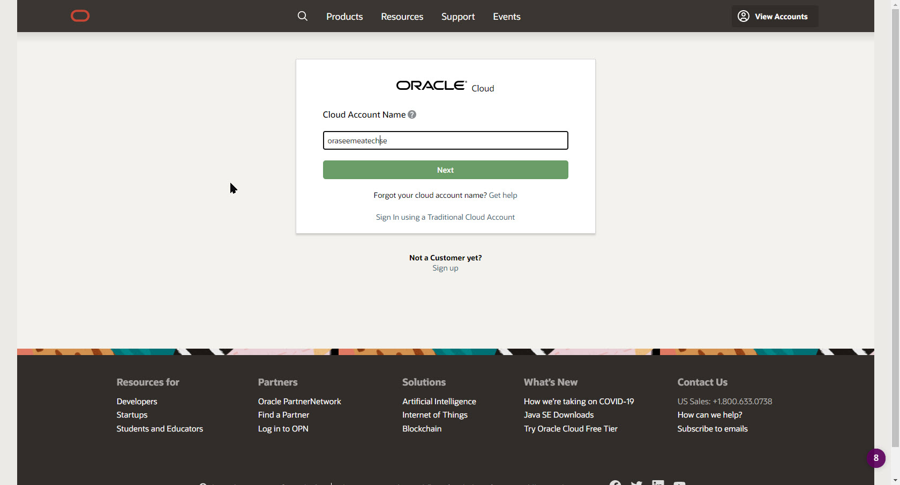
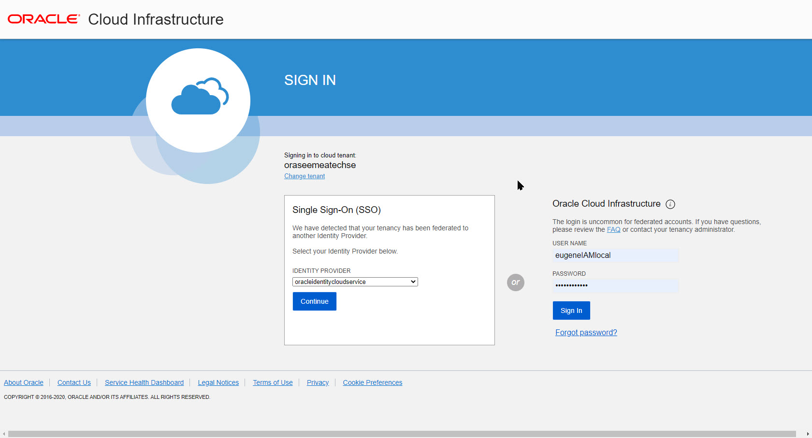
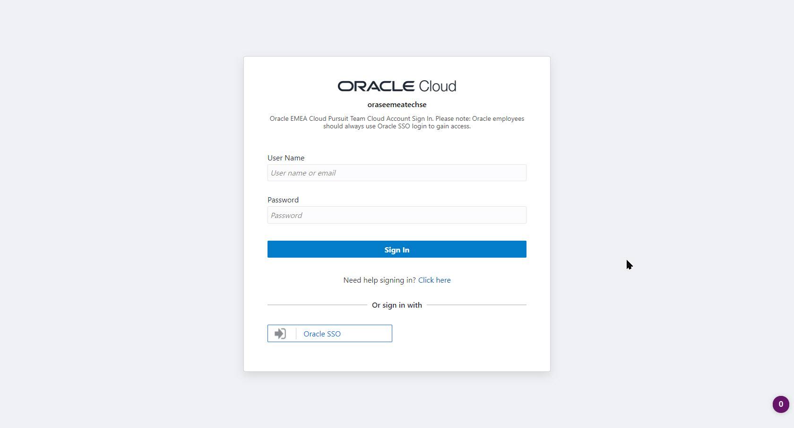
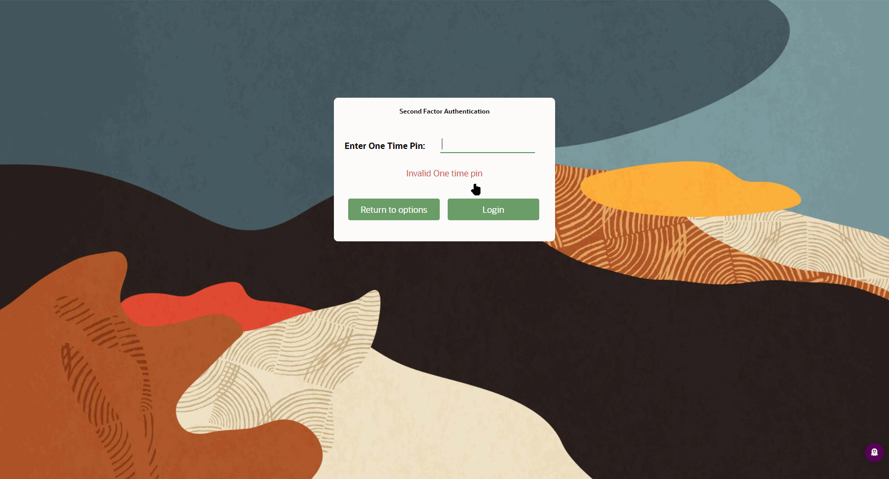
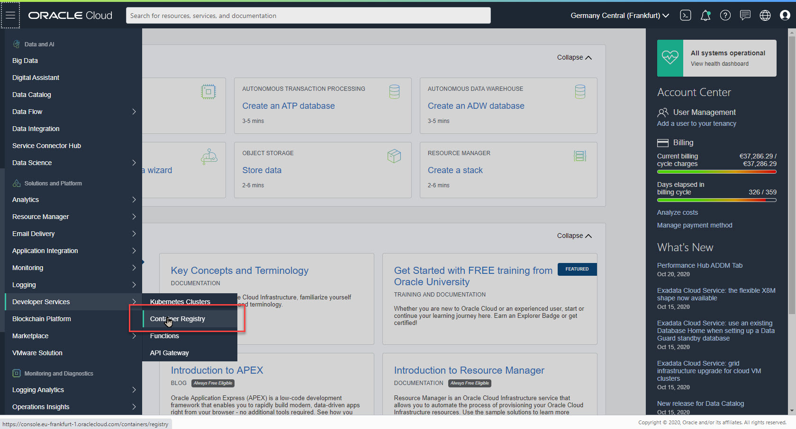
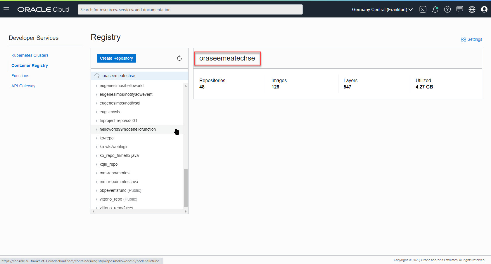
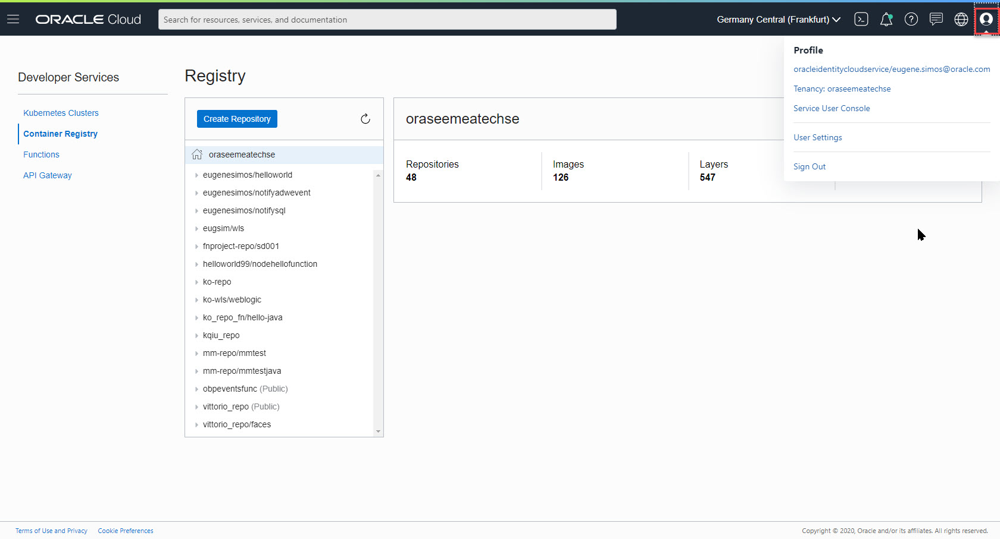
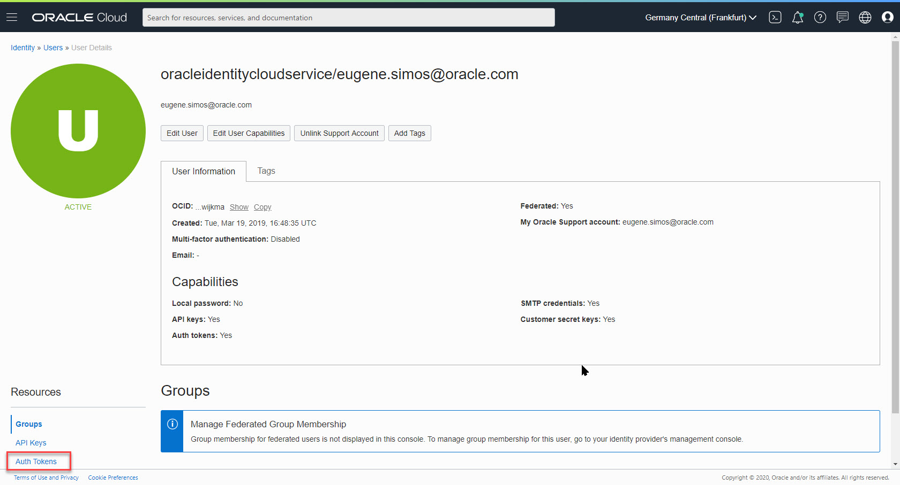
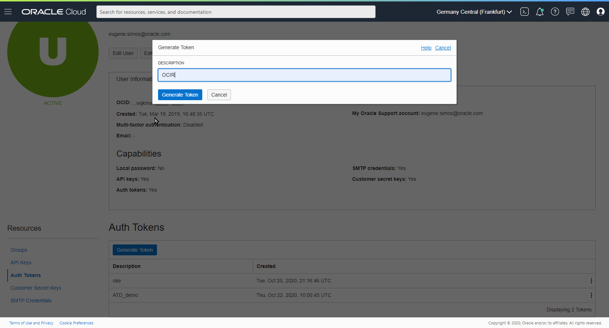
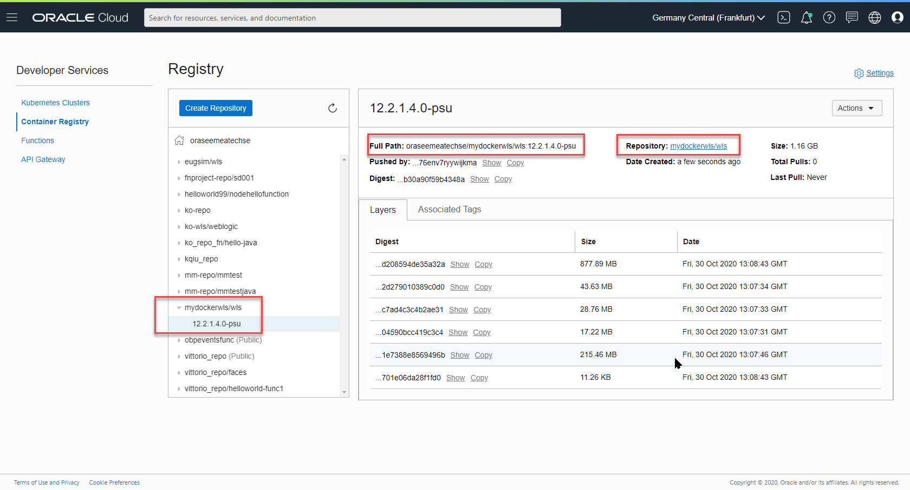

# WLS image tool workshop 

In this Lab we will use the [Oracle Weblogic Image tool](https://github.com/oracle/weblogic-image-tool) to :

1. Create a Weblogic docker Image using the [Create Image](https://github.com/oracle/weblogic-image-tool/blob/master/site/create-image.md) command 
2. Update a Weblogic docker image with the latest PSU and with a domain deployment using the [Update Image](https://github.com/oracle/weblogic-image-tool/blob/master/site/update-image.md) command and the WDT tool to deploy a domain from a model
3. Create a Weblogic docker image from an existing Weblogic image, apply some patch updates using the [Create Image](https://github.com/oracle/weblogic-image-tool/blob/master/site/create-image.md) tool
4. Push a Weblogic docker image to an [OCI registry](https://docs.cloud.oracle.com/en-us/iaas/Content/Registry/Concepts/registryoverview.htm)
5. Pull a Weblogic image from an [OCI registry](https://docs.cloud.oracle.com/en-us/iaas/Content/Registry/Concepts/registryoverview.htm)

**All the subsequent steps for this workshop should be run from your workshop compute node**.
**We have already pre-installed  your server with the below features don't try to modify it during the workshop:**

1. Imagetool

2. WebLogic Deploy tool

3. WebLogic binaries

4. Patches needed to run the PSU updates 

After having created a compute node from the delivered stack, you should be able to log to this Linux server as oracle user and check the directory /home/oracle/stage/installers 
which contains all the artifacts needed for the next workshop labs.

Your Linux system is already preinstalled with the latest version of Docker.

Additional optimizations are activated in order to speed up the Docker image creation process by using the [buildkit](https://docs.docker.com/develop/develop-images/build_enhancements/) feature.

This [optimization](https://docs.docker.com/develop/develop-images/build_enhancements/) is done on the Docker daemon configuration explained in the below link ( /etc/daemon.json) .

The buildkit [extention](https://docs.docker.com/develop/develop-images/build_enhancements/) can also used by adding a flag in the Docker build command.

BuildKit scripts handle docker tag in ***lower letters***, you have to  convert  the generated tags  for theses Docker files from the image tool, to lower letter case,  in order to compile the Dockerfiles to  images 

**In case that your docker installations will not use the BuildKit feature, then you don't need to convert the generated Docker file tags in lower letters, and all the labs can run without the conversion scripts.**

The WebLogic image tool can be used to **create /rebase/ update** Docker images with WebLogic software, ***but one important function is the generation of "Dockerfiles" with dryRun flag.***

The stubs generated can be further customized,  by using custom Docker commands and this is the approach that we will adopt during this workshop.

We will generate the "stubs", or Dockerfiles with the dryRun flag.

We will convert the relevant tags in lower letters, and then we will built the docker images, adding more features,  with the docker build commands.

# Lab 1 Introduction to the Image Tool


Before to start to use the image tool,  we have to create a ["cache"](https://github.com/oracle/weblogic-image-tool/blob/master/site/cache.md)  with the software that we will use to create out docker images.

During the "update" process of your docker images (ie ) installation of  PSU or patches) ,  the tool will place the patches  into the cache.

In the below code , the command 

```
imagetool cache listItems
```

 will show you the loaded items into the cache and their location into a local file system.


The result will be as below:

```
Cache contents
cache.dir=/home/oracle/cache
31960985_12.2.1.4.0=/home/oracle/cache/p31960985_122140_Generic.zip
wdt_1.9.3=/home/oracle/stage/installers/weblogic-deploy.zip
wls_12.2.1.4.0=/home/oracle/stage/installers/fmw_12.2.1.4.0_wls_Disk1_1of1.zip
jdk_8u261=/home/oracle/stage/installers/jdk-8u261-linux-x64.tar.gz
28186730_13.9.4.2.4=/home/oracle/cache/p28186730_139424_Generic.zip
```

We will copy some of the downloaded patches from the  "cache filesystem" into precise filesystem locations.

We can use them during the customization of our images.

The removal of the cached items from the cache, is done with the command **imagetool cache deleteEntry --key XXXX.**

In the previous example, we see that the key associated with the the patch  **p31960985_122140_Generic.zip is 31960985_12.2.1.4.0**  **is located to /home/oracle/cache/p31960985_122140_Generic.zip**.

The removal of this artifact from the cache then is done with the below command :


```
imagetool cache deleteEntry --key 31960985_12.2.1.4.0
```

Before to launch any operation with the Image tool we have to load the cache with the software that will be used by the Image creation process.

For our labs we need to use the :

- jdk-8u261-linux-x64.tar.gz
- fmw_12.2.1.4.0_wls_Disk1_1of1.zip
- weblogic-deploy.zip

You should load your cache with the below code :


 ```
cd /home/oracle/stage/installers/imagetool
imagetool cache addInstaller \
 --type jdk --version 8u261      \
 --path /home/oracle/stage/installers/jdk-8u261-linux-x64.tar.gz
 
  imagetool cache addInstaller \
 --type wls \
 --version 12.2.1.4.0 \
 --path /home/oracle/stage/installers/fmw_12.2.1.4.0_wls_Disk1_1of1.zip
 
 imagetool cache addInstaller \
 --type wdt \
 --version 1.9.3 \
 --path /home/oracle/stage/installers/weblogic-deploy.zip
 ```

Removing unused images from the system is always a good habit, and saves you a lot of space from your building system.

The command below will be used for this cleanup


```
docker system prune -f
```

You need to provide support credentials to be able to use the "patch" feature of the image tool.

For this purpose create a text file with your Oracle Support Credentials


```
cd /home/oracle/stage/installers/
export ORACLE_SUPORT_PASSWORD=Your_Oracle_Support_Password
echo $ORACLE_SUPORT_PASSWORD > passwd.txt
```
At this point of the Lab :

1. You have loaded you cache with the software bit that needed to create your images.
2. Yoy have created your support credentials needed for the patching process.


# PART 1 CREATE A BASIC DOCKER IMAGE

Lets create a basic docker image with the image tool.

The image will be patched with the latestPSU for the WebLogic version 12.2.1.4 ( the software is installed already loaded in the cache).

The docker image will use the jdk 18u261 (loaded already in the cache).

Execute the below code:


```
export DOCKER_FILE=dockerfile_build_commands_12.2.1.4.0
export IMAGE_NAME=image_tool_12.2.1.4.0_buildkit_step1


time imagetool create \
--tag $IMAGE_NAME \
--latestPSU --version 12.2.1.4.0 \
--user  your_oracle_support_name@oracle.com \
--jdkVersion=8u261 \
--passwordFile passwd.txt
```

The result will be as below:

Notice all the steps taken by the build tool:

1. the installers are copied to a temp location
2. the tool tries to load relevant patches, and then downloads them back to the cache
3. once all software bits are downloaded,  then the tool tries to build the DockerImage, **but in our case as we use the latest docker optimization, we see a failure.**

**"OS_UPDATE": invalid reference format: repository name must be lowercase.**


```
[INFO   ] Image Tool build ID: 4dc21037-3aa1-4f14-8321-007cef2caa6f
[INFO   ] Temporary directory used for docker build context: /home/oracle/wlsimgbuilder_temp243612593290137457
[INFO   ] Copying /home/oracle/stage/installers/jdk-8u261-linux-x64.tar.gz to build context folder.
[INFO   ] Using middleware installers (wls) version 12.2.1.4.0
[INFO   ] Copying /home/oracle/stage/installers/fmw_12.2.1.4.0_wls_Disk1_1of1.zip to build context folder.
[INFO   ] Oracle WebLogic Server - locating patch number for the latest PSU...
[INFO   ] Oracle WebLogic Server - the latest PSU patch number is 31960985_12.2.1.4.0
[INFO   ] Oracle Coherence - locating patch number for the latest PSU...
[INFO   ] Oracle Coherence - there are no recommended PSUs for version 12.2.1.4.0
[INFO   ] Validating patches
[INFO   ] Validated patch 31960985 for Oracle WebLogic Server 12.2.1.4.0
[INFO   ] No patch conflicts detected
[INFO   ] Could not find key 31960985_12.2.1.4.0 in the cache for patch 31960985
[INFO   ] Downloading patch 31960985...
[INFO   ] Adding patch 31960985_12.2.1.4.0 to cache, path=/home/oracle/cache/p31960985_122140_Generic.zip
[INFO   ] Requesting patch information for patch 28186730
[INFO   ] Could not find key 28186730_13.9.4.2.4 in the cache for patch 28186730
[INFO   ] Downloading patch 28186730...
[INFO   ] Adding patch 28186730_13.9.4.2.4 to cache, path=/home/oracle/cache/p28186730_139424_Generic.zip
[INFO   ] docker cmd = docker build --no-cache --force-rm --tag image_tool_12.2.1.4.0_buildkit_step1 /home/oracle/wlsimgbuilder_temp243612593290137457
[SEVERE ] docker command failed with error: #2 [internal] load .dockerignore
#2 DONE 0.0s

#1 [internal] load build definition from Dockerfile
#1 transferring dockerfile: 3.56kB done
#1 DONE 0.0s

#2 [internal] load .dockerignore
#2 transferring context: 2B done
#2 DONE 0.0s
failed to solve with frontend dockerfile.v0: failed to create LLB definition: failed to parse stage name "OS_UPDATE": invalid reference format: repository name must be lowercase
```


To workaround then this issue,  **we will not create an image** but we will generate the associated Dockerfile, and we will compile it in a subsequent step.

If your support credentials are wrong the operation will fail and then you have to correct them and re launch the same operation.

Copy the patches from the cache to the file system are they will be referenced by the Dockerfiles during the build process of the images.

Copy the below code again to your Linux terminal (the patches will be used from the Dockerfiles) :


```
cd /home/oracle/stage/installers/
mkdir -p /home/oracle/stage/installers/patches
cp /home/oracle/cache/p31960985_122140_Generic.zip patches/.
cp /home/oracle/cache/p28186730_139424_Generic.zip .
### relaunch the docker daemon
sudo systemctl  restart docker
```


In some rare cases you might get a timeout on the communication between the tool and the oracle support site.

You will get the below error, in this case try to re execute your script !


```
[INFO   ] Image Tool build ID: 6151a7c8-4ab1-4898-8289-0d84ec216b28
[INFO   ] Temporary directory used for docker build context: /home/oracle/wlsimgbuilder_temp7367327172036346773
[INFO   ] Copying /home/oracle/stage/installers/jdk-8u261-linux-x64.tar.gz to build context folder.
[INFO   ] Using middleware installers (wls) version 12.2.1.4.0
[INFO   ] Copying /home/oracle/stage/installers/fmw_12.2.1.4.0_wls_Disk1_1of1.zip to build context folder.
[INFO   ] Oracle WebLogic Server - locating patch number for the latest PSU...
[SEVERE ] Unable to retrieve list of Oracle releases from Oracle Updates (ARU). Try again later.
```


Although the build process of DockerImage has failed the cache has been updated from the support downloaded patches.

Examine the content of your "updated" cache again :


```
imagetool cache listItems
```


The result will be as below:

Do you seen any difference ?

Can you describe the new elements , and their physical location into your servers filesystem ?


```
Cache contents
cache.dir=/home/oracle/cache
31960985_12.2.1.4.0=/home/oracle/cache/p31960985_122140_Generic.zip
wdt_1.9.3=/home/oracle/stage/installers/weblogic-deploy.zip
wls_12.2.1.4.0=/home/oracle/stage/installers/fmw_12.2.1.4.0_wls_Disk1_1of1.zip
jdk_8u261=/home/oracle/stage/installers/jdk-8u261-linux-x64.tar.gz
28186730_13.9.4.2.4=/home/oracle/cache/p28186730_139424_Generic.zip
```


Now we will create our Dockerfiles, and make some lower case conversions, in order  to be able to build our images much faster with the buildkit feature.

Enter the below script to your Linux system :

**! REMEMBER TO REPLACE THE USER WITH YOUR USER AND YOUR SUPPORT CREDENTIALS !**


```
### now create the Dockerfile of this image
### dryRun will create the Dockerfile needed for the image creation !

cd /home/oracle/stage/installers/
export DOCKER_FILE=dockerfile_build_commands_12.2.1.4.0_step1
cat<<EOF> build_commands_12.2.1.4.0
create
--type wls
--dryRun
--pull
--chown=oracle:root
--latestPSU
--version 12.2.1.4.0
--jdkVersion=8u261
--tag 12.2.1.4.0
--user YOUR_USER_ID@oracle.com
--passwordFile passwd.txt
EOF
imagetool @build_commands_12.2.1.4.0 > $DOCKER_FILE
```


This command creates the configuration for image tool to create a wls server.

1. We will pull out the latest base image for our Docker images ( we will later that is a linux7 thin)
2. We will use our weblogic installation media 
3. The installation will be patched with the latest PSU patches, and will use the jkd 18u261
4. The flag dryRun will create the associated Dockerfile but it will not run the build image proccess, we will do this step later.

Lets follow the output of this command:


```
[INFO   ] Image Tool build ID: c9471dd6-abab-4d9f-8f55-fb5407ba21d5
[INFO   ] Temporary directory used for docker build context: /home/oracle/wlsimgbuilder_temp8489398210551330654
[INFO   ] Copying /home/oracle/stage/installers/jdk-8u261-linux-x64.tar.gz to build context folder.
[INFO   ] Using middleware installers (wls) version 12.2.1.4.0
[INFO   ] Copying /home/oracle/stage/installers/fmw_12.2.1.4.0_wls_Disk1_1of1.zip to build context folder.
[INFO   ] Oracle WebLogic Server - locating patch number for the latest PSU...
[INFO   ] Oracle WebLogic Server - the latest PSU patch number is 31960985_12.2.1.4.0
[INFO   ] Oracle Coherence - locating patch number for the latest PSU...
[INFO   ] Oracle Coherence - there are no recommended PSUs for version 12.2.1.4.0
[INFO   ] Validating patches
[INFO   ] Validated patch 31960985 for Oracle WebLogic Server 12.2.1.4.0
[INFO   ] No patch conflicts detected
[INFO   ] Using patch 31960985_12.2.1.4.0 from cache: /home/oracle/cache/p31960985_122140_Generic.zip
[INFO   ] Requesting patch information for patch 28186730
[INFO   ] Using patch 28186730_13.9.4.2.4 from cache: /home/oracle/cache/p28186730_139424_Generic.zip
[INFO   ] docker cmd = docker build --no-cache --force-rm --tag 12.2.1.4.0 --pull /home/oracle/wlsimgbuilder_temp8489398210551330654
[INFO   ] Dry run complete.  No image created.
```

The content of the Dockerfile generated can be seen with the following command:

Take some time to read the content of this file !


```
cat $DOCKER_FILE
```


```
########## BEGIN DOCKERFILE ##########
#
# Copyright (c) 2019, 2020, Oracle and/or its affiliates.
#
# Licensed under the Universal Permissive License v 1.0 as shown at https://oss.oracle.com/licenses/upl.
#
#
FROM oraclelinux:7-slim as OS_UPDATE
LABEL com.oracle.weblogic.imagetool.buildid="c9471dd6-abab-4d9f-8f55-fb5407ba21d5"
USER root

RUN yum -y --downloaddir=/tmp/imagetool install gzip tar unzip libaio \
 && yum -y --downloaddir=/tmp/imagetool clean all \
 && rm -rf /var/cache/yum/* \
 && rm -rf /tmp/imagetool

## Create user and group
RUN if [ -z "$(getent group root)" ]; then hash groupadd &> /dev/null && groupadd root || exit -1 ; fi \
 && if [ -z "$(getent passwd oracle)" ]; then hash useradd &> /dev/null && useradd -g root oracle || exit -1; fi \
 && mkdir /u01 \
 && chown oracle:root /u01 \
 && chmod 775 /u01

# Install Java
FROM OS_UPDATE as JDK_BUILD
LABEL com.oracle.weblogic.imagetool.buildid="c9471dd6-abab-4d9f-8f55-fb5407ba21d5"

ENV JAVA_HOME=/u01/jdk

COPY --chown=oracle:root jdk-8u261-linux-x64.tar.gz /tmp/imagetool/

USER oracle


RUN tar xzf /tmp/imagetool/jdk-8u261-linux-x64.tar.gz -C /u01 \
 && $(test -d /u01/jdk* && mv /u01/jdk* /u01/jdk || mv /u01/graal* /u01/jdk) \
 && rm -rf /tmp/imagetool \
 && rm -f /u01/jdk/javafx-src.zip /u01/jdk/src.zip


# Install Middleware
FROM OS_UPDATE as WLS_BUILD
LABEL com.oracle.weblogic.imagetool.buildid="c9471dd6-abab-4d9f-8f55-fb5407ba21d5"

ENV JAVA_HOME=/u01/jdk \
    ORACLE_HOME=/u01/oracle \
    OPATCH_NO_FUSER=true

RUN mkdir -p /u01/oracle \
 && mkdir -p /u01/oracle/oraInventory \
 && chown oracle:root /u01/oracle/oraInventory \
 && chown oracle:root /u01/oracle

COPY --from=JDK_BUILD --chown=oracle:root /u01/jdk /u01/jdk/

COPY --chown=oracle:root fmw_12.2.1.4.0_wls_Disk1_1of1.zip wls.rsp /tmp/imagetool/
COPY --chown=oracle:root oraInst.loc /u01/oracle/

    COPY --chown=oracle:root p28186730_139424_Generic.zip /tmp/imagetool/opatch/

    COPY --chown=oracle:root patches/* /tmp/imagetool/patches/

USER oracle


RUN echo "INSTALLING MIDDLEWARE" \
 && echo "INSTALLING wls" \
 && unzip -q /tmp/imagetool/fmw_12.2.1.4.0_wls_Disk1_1of1.zip "*.jar" -d /tmp/imagetool && \
    /u01/jdk/bin/java -Xmx1024m -jar /tmp/imagetool/fmw_12.2.1.4.0_wls.jar -silent ORACLE_HOME=/u01/oracle \
    -responseFile /tmp/imagetool/wls.rsp -invPtrLoc /u01/oracle/oraInst.loc -ignoreSysPrereqs -force -novalidation \
 && chmod -R g+r /u01/oracle

RUN cd /tmp/imagetool/opatch \
 && /u01/jdk/bin/jar -xf /tmp/imagetool/opatch/p28186730_139424_Generic.zip \
 && /u01/jdk/bin/java -jar /tmp/imagetool/opatch/6880880/opatch_generic.jar -silent -ignoreSysPrereqs -force -novalidation oracle_home=/u01/oracle

RUN /u01/oracle/OPatch/opatch napply -silent -oh /u01/oracle -phBaseDir /tmp/imagetool/patches \
 && test $? -eq 0 \
 && /u01/oracle/OPatch/opatch util cleanup -silent -oh /u01/oracle \
 || (cat /u01/oracle/cfgtoollogs/opatch/opatch*.log && exit 1)


FROM OS_UPDATE as FINAL_BUILD

ARG ADMIN_NAME
ARG ADMIN_HOST
ARG ADMIN_PORT
ARG MANAGED_SERVER_PORT

ENV ORACLE_HOME=/u01/oracle \
    JAVA_HOME=/u01/jdk \
    LC_ALL=${DEFAULT_LOCALE:-en_US.UTF-8} \
    PATH=${PATH}:/u01/jdk/bin:/u01/oracle/oracle_common/common/bin:/u01/oracle/wlserver/common/bin:/u01/oracle

LABEL com.oracle.weblogic.imagetool.buildid="c9471dd6-abab-4d9f-8f55-fb5407ba21d5"

    COPY --from=JDK_BUILD --chown=oracle:root /u01/jdk /u01/jdk/

COPY --from=WLS_BUILD --chown=oracle:root /u01/oracle /u01/oracle/


USER oracle
WORKDIR /u01/oracle

#ENTRYPOINT /bin/bash


########## END DOCKERFILE ##########

```


1. What is the base image of our future DockerContainer ?
2. What components are installed ?
3. In which order ?
4. Are there any "system updates" if yes why ?
5. Can you see when and how the weblogic installation is patched ?

As you see, the image tool create a ***multi stage build***, with several tags as : 

**OS_UPDATE, JDK_BUILD, JDK_BUILD,FINAL_BUILD**

**we have to modify these upper letter sections to lower letters in order to compile our image with the buildkit !**

Enter the following script to your linux terminal in order to generate a new Dockerfile

```
### we have to modify some sections to lower letters

export DOCKER_FILE=dockerfile_build_commands_12.2.1.4.0_step1

sed 's/EXPOSE/EXPOSE 22/g'  $DOCKER_FILE \
 | sed 's/WDT_BUILD/wdt_build/g'   \
 | sed 's/FINAL_BUILD/final_build/g' \
 | sed 's/OS_UPDATE/os_update/g'    \
 | sed 's/JDK_BUILD/jdk_build/g'  \
 | sed 's/WLS_BUILD/wls_build/g' > ${DOCKER_FILE}_corr

cat ${DOCKER_FILE}_corr

```


The image is build with the below command using the generated Dockerfile


```
### rebuild the image now
cd /home/oracle/stage/installers/
export IMAGE_NAME=frm_${DOCKER_FILE}_corr
echo "rebuild the image $IMAGE_NAME"

docker container rm $IMAGE_NAME -f
docker rmi $IMAGE_NAME -f
## 
time DOCKER_BUILDKIT=1  docker image build  \
--tag $IMAGE_NAME  \
--no-cache=true \
--force-rm=true \
--squash \
--rm=true \
--file ${DOCKER_FILE}_corr .
```


The result of this command is as below:
Several steps are executed and the final image frm_dockerfile_build_commands_12.2.1.4.0_step1_corr is now created


```
[+] Building 22.7s (22/22) FINISHED
 => [internal] load build definition from dockerfile_build_commands_12.2.1.4.0_step1_corr                                                        0.0s
 => => transferring dockerfile: 3.64kB                                                                                                           0.0s
 => [internal] load .dockerignore                                                                                                                0.0s
 => => transferring context: 2B                                                                                                                  0.0s
 => [internal] load metadata for docker.io/library/oraclelinux:7-slim                                                                            0.0s
 => [internal] load build context                                                                                                                6.6s
 => => transferring context: 1.07GB                                                                                                              6.6s
 => [os_update 1/3] FROM docker.io/library/oraclelinux:7-slim                                                                                    0.0s
 => CACHED [os_update 2/3] RUN yum -y --downloaddir=/tmp/imagetool install gzip tar unzip libaio  && yum -y --downloaddir=/tmp/imagetool clean   0.0s
 => CACHED [os_update 3/3] RUN if [ -z "$(getent group root)" ]; then hash groupadd &> /dev/null && groupadd root || exit -1 ; fi  && if [ -z "  0.0s
 => CACHED [jdk_build 1/2] COPY --chown=oracle:root jdk-8u261-linux-x64.tar.gz /tmp/imagetool/                                                   0.0s
 => CACHED [jdk_build 2/2] RUN tar xzf /tmp/imagetool/jdk-8u261-linux-x64.tar.gz -C /u01  && $(test -d /u01/jdk* && mv /u01/jdk* /u01/jdk || mv  0.0s
 => CACHED [final_build 1/3] COPY --from=jdk_build --chown=oracle:root /u01/jdk /u01/jdk/                                                        0.0s
 => CACHED [wls_build 1/9] RUN mkdir -p /u01/oracle  && mkdir -p /u01/oracle/oraInventory  && chown oracle:root /u01/oracle/oraInventory  && ch  0.0s
 => CACHED [wls_build 2/9] COPY --from=jdk_build --chown=oracle:root /u01/jdk /u01/jdk/                                                          0.0s
 => CACHED [wls_build 3/9] COPY --chown=oracle:root fmw_12.2.1.4.0_wls_Disk1_1of1.zip wls.rsp /tmp/imagetool/                                    0.0s
 => CACHED [wls_build 4/9] COPY --chown=oracle:root oraInst.loc /u01/oracle/                                                                     0.0s
 => CACHED [wls_build 5/9] COPY --chown=oracle:root p28186730_139424_Generic.zip /tmp/imagetool/opatch/                                          0.0s
 => CACHED [wls_build 6/9] COPY --chown=oracle:root patches/* /tmp/imagetool/patches/                                                            0.0s
 => CACHED [wls_build 7/9] RUN echo "INSTALLING MIDDLEWARE"  && echo "INSTALLING wls"  && unzip -q /tmp/imagetool/fmw_12.2.1.4.0_wls_Disk1_1of1  0.0s
 => CACHED [wls_build 8/9] RUN cd /tmp/imagetool/opatch  && /u01/jdk/bin/jar -xf /tmp/imagetool/opatch/p28186730_139424_Generic.zip  && /u01/jd  0.0s
 => CACHED [wls_build 9/9] RUN /u01/oracle/OPatch/opatch napply -silent -oh /u01/oracle -phBaseDir /tmp/imagetool/patches  && test $? -eq 0  &&  0.0s
 => CACHED [final_build 2/3] COPY --from=wls_build --chown=oracle:root /u01/oracle /u01/oracle/                                                  0.0s
 => CACHED [final_build 3/3] WORKDIR /u01/oracle                                                                                                 0.0s
 => exporting to image                                                                                                                           0.0s
 => => exporting layers                                                                                                                          0.0s
 => => writing image sha256:10503f4e457a55c672f14be228d0943248f81eec9f88154fb3f14d2bc8a6c6b1                                                     0.0s
 => => naming to docker.io/library/frm_dockerfile_build_commands_12.2.1.4.0_step1_corr                                                           0.0s

real    0m22.719s
user    0m2.680s
sys     0m1.020s
```


Check that the image is created with the below command:


```
docker images
```


The result will be as below:


```
REPOSITORY                                             TAG                 IMAGE ID            CREATED             SIZE
frm_dockerfile_build_commands_12.2.1.4.0_step1_corr    latest              36d592f24e87        6 minutes ago       1.41GB
```


Lets inspect this image by running the below command:


```
docker run --rm -it --name test_$IMAGE_NAME $IMAGE_NAME /bin/bash

### now you are logged into the docker image check the patches
cd  /u01/oracle/inventory/patches
ls
###31960985.xml
cat 31960985.xml
### exit to return to the host after inspection !

```

```
<?xml version = '1.0' encoding = 'UTF-8' standalone = 'yes'?>
<patch-def unique-patch-id="23842278" patch-id="31960985" description="WLS PATCH SET UPDATE 12.2.1.4.201001" rollbackable="true" location="oneoffs/31960985" installer-version="13.9.4.0.0" xmlns:ns2="http://xmlns.oracle.com/cie/gdr/dei" xmlns:ns3="http://xmlns.oracle.com/cie/gdr/nfo" xmlns:ns4="http://xmlns.oracle.com/cie/gdr/rgy" xmlns="http://xmlns.oracle.com/cie/gdr/pch">
```


As we see we have a basic wls 12.2.1.4 installation with the associated patches installed

Enter exit to return to your host,  then lets cleanup our environment before to run the next session 


```
docker rmi $IMAGE_NAME
unset DOCKER_FILE IMAGE_NAME
docker system prune -f
```


# PART 2 CREATE AN UPDATED WEBLOGIC IMAGE WITH A WEBLOGIC DOMAIN

During this lab we will:

1. Add instructions to Dockerfile to add rpms to our docker image.
2. We will create a new docker image updated with the latest PSU, and we will install a Domain obtained from a previous migration with the wdt tool.
3. We will convert the tags to lower case, and we will build the Dockerfile.


Run the below command to your linux terminal


```
#### create a docker file to inspect the content
####
cd /home/oracle/stage/installers/
export DOCKER_FILE=dockerfile_build_commands_step2
export IMAGE_NAME=frm_${DOCKER_FILE}

cat<<EOF> build_commands
create
--type wls
--dryRun
--pull
--chown=oracle:root
--version 12.2.1.4.0
--jdkVersion=8u261
--tag 12.2.1.4.0
--user YOUR_USER_ID@oracle.com
--passwordFile passwd.txt
--wdtModel=./DiscoveredDemoDomain.yaml \
--wdtArchive=./DiscoveredDemoDomain.zip \
--wdtDomainHome=/u01/oracle/user_projects/domains/onprem-domain \
--wdtVariables=./DiscoverDemoDomain.properties \
--wdtVersion=1.9.3
EOF

imagetool @build_commands > $DOCKER_FILE
```


What you notice about the additional flags ?

--wdtModel

--wdtDomainHome

--wdtDomainHome


1. Can you check the associated files ?
2. What domain you will inject into your docker file ?
3. Are there any applications that there will be deployed ?
4. What is the name of the Weblogic Admin user, and what will be the associated password ?

Check out the result, and the Dockerfile generated


```
[INFO   ] Image Tool build ID: 4972aa91-fe91-433f-9ac2-0ac6d0f07f75
[INFO   ] Temporary directory used for docker build context: /home/oracle/wlsimgbuilder_temp1863744201572624302
[INFO   ] Copying /home/oracle/stage/installers/jdk-8u261-linux-x64.tar.gz to build context folder.
[INFO   ] Using middleware installers (wls) version 12.2.1.4.0
[INFO   ] Copying /home/oracle/stage/installers/fmw_12.2.1.4.0_wls_Disk1_1of1.zip to build context folder.
[INFO   ] Copying /home/oracle/stage/installers/weblogic-deploy.zip to build context folder.
[INFO   ] docker cmd = docker build --no-cache --force-rm --tag 12.2.1.4.0 --pull /home/oracle/wlsimgbuilder_temp1863744201572624302
[INFO   ] Dry run complete.  No image created.

```

Now we will add some rpm to this Dockerfile.

Run again this command from the Linux terminal :

```
cat<<'EOF'> add_docker.txt
USER root

COPY --chown=oracle:root keys/.  /home/oracle/.ssh/.
COPY --chown=oracle:root letsEncryptCerts.jks /u01/oracle/.
RUN echo "installing yum rpms " && \
    yum install -y --downloaddir=/tmp/imagetool more openssh-server openssh-clients vi sudo shadow-utils sed zip git wget && \
    echo "oracle ALL=(ALL) NOPASSWD: ALL" >> /etc/sudoers && echo 'root:Welcome1412#' chpasswd && \
echo 'oracle:Welcome1412#' | chpasswd && \
sed -i 's/#*PermitRootLogin prohibit-password/PermitRootLogin yes/g' /etc/ssh/sshd_config && \
sed -i 's/#Banner none/Banner \/home\/oracle\/WLS_deploy_scripts\/welcome_source.txt/g' /etc/ssh/sshd_config && \
sed -i 's@session\s*required\s*pam_loginuid.so@session optional pam_loginuid.so@g' /etc/pam.d/sshd && \
/usr/bin/ssh-keygen -A  \
 && yum -y --downloaddir=/tmp/imagetool clean all \
 && rm -rf /var/cache/yum/* \
 && rm -rf /tmp/imagetool && \
        echo ". /u01/oracle/user_projects/domains/onprem-domain/bin/setDomainEnv.sh" >> /home/oracle/.bashrc && \
        chmod go-rwx /home/oracle/.ssh/*


EXPOSE $ADMIN_PORT $MANAGED_SERVER_PORT 22

WORKDIR /u01/oracle/
RUN wget https://github.com/oracle/weblogic-deploy-tooling/releases/download/release-1.9.5/weblogic-deploy.zip && \
    chown oracle:root /u01/oracle/weblogic-deploy.zip
    
### switch to user oracle to let the image be patched by the tooling 
USER  oracle
WORKDIR /u01/oracle/user_projects/domains/onprem-domain
#ENTRYPOINT /bin/bash
### start sshd for this server
CMD ["sudo","/usr/sbin/sshd", "-D"]
##WORKDIR /u01/oracle
EOF
```

This is quite easy as we have the Dockerfile, and we have our own section ( see below which will be added to the one generated by the tool !)

1. Can you see what rpm we add ?
2. Do you see some new features in the Dockerfile ?


And then concatenate the 2 Dockerfiles for the final build.

Then convert the tags to lower case, and build the new docker image :

```
cat add_docker.txt >> $DOCKER_FILE

### convert sections to lower letters

sed 's/WDT_BUILD/wdt_build/g'   $DOCKER_FILE \
 | sed 's/FINAL_BUILD/final_build/g' \
 | sed 's/OS_UPDATE/os_update/g'    \
 | sed 's/JDK_BUILD/jdk_build/g'  \
 | sed 's/WLS_BUILD/wls_build/g' > ${DOCKER_FILE}_corr

cat  ${DOCKER_FILE}_corr


### rebuild the image now

export IMAGE_NAME=frm_${DOCKER_FILE}_corr_part2
docker container rm $IMAGE_NAME -f
docker rmi $IMAGE_NAME -f


time DOCKER_BUILDKIT=1  docker image build  \
--tag $IMAGE_NAME  \
--no-cache=true \
--force-rm=true \
--squash \
--rm=true \
--file ${DOCKER_FILE}_corr .

```


The result will be as below:


```
[+] Building 276.7s (37/37) FINISHED
.....
.....
 => => exporting layers                                                                                                                         10.2s
 => => writing image sha256:5d4b7ca290b0c89ad031172e8c5d63b89794b293ab696ddaa52902238e9657be                                                     0.0s
 => => naming to docker.io/library/frm_dockerfile_build_commands_step2_corr_part2                                                                0.0s

real    4m36.769s
user    0m3.130s
sys     0m1.239s
```


Great ! in a few minutes we have a new Weblogic Docker image with a new domain, and with the latest patches 

Now lets explorer this container 

Enter the following commands to your Linux system:


```
docker system prune -f
docker images

#### run the container in detached mode, we map the ssh port to the host 9000 ...
docker run --rm -d -it  \
-p 9000:22 -p 7001:7001 \
--name $IMAGE_NAME $IMAGE_NAME 
docker container ls -a
```


**Notice that the container exposes the ports 7001, 8001 and the ssh port is mapped to the host port 9000**

The result of this command is below :


```
cb0bdc976001ecbb5058d09caa9cde66a9e8fdca139df84f9e5e62055864e65a
 docker container ls -a
CONTAINER ID        IMAGE                                            COMMAND                  CREATED             STATUS              PORTS                                                    NAMES
cb0bdc976001        frm_dockerfile_build_commands_step2_corr_part2   "sudo /usr/sbin/sshd…"   3 seconds ago       Up 2 seconds        0.0.0.0:7001->7001/tcp, 8001/tcp, 0.0.0.0:9000->22/tcp   frm_dockerfile_build_commands_step2_corr_part2

```


The container is having a "custom ssh server installed" lets ssh into the container


```
ssh -i keys/wls_rsa  \
-o "UserKnownHostsFile=/dev/null" \
-o "StrictHostKeyChecking=no"  \
oracle@localhost  -p 9000
```


Lets start the Weblogic admin Server

copy the following line to your Linux terminal


```
ls -la
nohup ./startWebLogic.sh &
tail -f nohup.out
```


The domain is configuration can be seen here :


This is the end of part 2 , we need this docker image as a source for the next lab


# PART 3 CREATE AND DEPLOY AN IMAGE WITH A WEBLOGIC DOMAIN TO OCI REGISTRY FROM AN EXISTING IMAGE

For this lab we will:

1. Use the image created in part2.
2. We will apply a simple patch upgrade to see the Dockerfile created by the tool.

3. The image will be tagged accordingly to our OCI account registry
4. This image will uploaded to the registry and download when needed.

An overview of the registry service is given [here](https://docs.cloud.oracle.com/en-us/iaas/Content/Registry/Concepts/registryoverview.htm)

In our configuration we are working in Frankfurt and the endpoint to use is : https://fra.ocir.io

We have to prepare our target images for this registry the tag annotation as described [here](https://docs.cloud.oracle.com/en-us/iaas/Content/Registry/Tasks/registrypushingimagesusingthedockercli.htm) should be as :
**<region-key>.ocir.io/<tenancy-namespace>/<repo-name>/<image-name>:<tag>**

We will get these information from our tenancy

First log into your cloud account to get information about your registry




Choose the login method either federated user , or local user this depends on your own acount configuration.

In our case we are using federated accounts


Click on oracle SSO button 



Provide your SSO account details :


Provide the SFA auth code



On your OCI console navigate to Developer Services /Container Registry




Get the name of the registry namespace



The images then should be tagged as

```
fra.ocir.io/oraseemeatechse/mydockerwls/image_name:version
mydockerwls will be the repository which will hold our images
```

Enter the below script to your linux terminal


```
cd /home/oracle/stage/installers/
docker system prune -f
docker images

###
### remove previous traces
###
rm -rf build_args_update_from_image

## use the image frm_dockerfile_build_commands_step2_corr_part2 as the base build
## create the target image with the correct oci registry tag
export FROM_IMAGE=frm_dockerfile_build_commands_step2_corr_part2
export TARGET_NEW_IMAGE="fra.ocir.io/eugsim/wls:12.2.1.4.0-psu"
echo ${TARGET_NEW_IMAGE}
echo ${FROM_IMAGE}
##fra.ocir.io/eugsim/wls:12.2.1.4.0-psu

cat<<EOF> build_args_update_from_image
update
--tag=${TARGET_NEW_IMAGE}:latest
--fromImage=${FROM_IMAGE}
--dryRun
--pull
--chown=oracle:root
--latestPSU
--user YOUR_USER_ID@oracle.com
--passwordFile passwd.txt
EOF
cat build_args_update_from_image

imagetool @build_args_update_from_image  > frm_dockerfile_update_from_image

```
Follow the execution result :
```
[INFO   ] Image Tool build ID: 6cef1988-bb3c-4cbf-8255-5cb4d557bce2
[INFO   ] Temporary directory used for docker build context: /home/oracle/wlsimgbuilder_temp4935018499196576771
[INFO   ] Requesting patch information for patch 28186730
[INFO   ] Using patch 28186730_13.9.4.2.4 from cache: /home/oracle/cache/p28186730_139424_Generic.zip
[INFO   ] Updating OPatch in final image from version 13.9.4.2.1 to version 13.9.4.2.4
[INFO   ] Oracle WebLogic Server - locating patch number for the latest PSU...
[INFO   ] Oracle WebLogic Server - the latest PSU patch number is 31960985_12.2.1.4.0
[INFO   ] Oracle Coherence - locating patch number for the latest PSU...
[INFO   ] Oracle Coherence - there are no recommended PSUs for version 12.2.1.4.0
[INFO   ] Validating patches
[INFO   ] Validated patch 31960985 for Oracle WebLogic Server 12.2.1.4.0
[INFO   ] No patch conflicts detected
[INFO   ] Using patch 31960985_12.2.1.4.0 from cache: /home/oracle/cache/p31960985_122140_Generic.zip
[INFO   ] docker cmd = docker build --no-cache --force-rm --tag fra.ocir.io/eugsim/wls:12.2.1.4.0-psu:latest --pull /home/oracle/wlsimgbuilder_temp4935018499196576771
[INFO   ] Dry run complete.  No image created.
```

inspect the dockerfile

Execute again the below command to our Linux terminal

```
cat frm_dockerfile_update_from_image

```

The result will be as below:

```
########## BEGIN DOCKERFILE ##########
#
# Copyright (c) 2019, 2020, Oracle and/or its affiliates.
#

# Licensed under the Universal Permissive License v 1.0 as shown at https://oss.oracle.com/licenses/upl.
#
#

FROM frm_dockerfile_build_commands_step2_corr_part2 as FINAL_BUILD
USER root

ENV OPATCH_NO_FUSER=true


LABEL com.oracle.weblogic.imagetool.buildid="6cef1988-bb3c-4cbf-8255-5cb4d557bce2"

USER oracle

    COPY --chown=oracle:root p28186730_139424_Generic.zip /tmp/imagetool/opatch/
    RUN cd /tmp/imagetool/opatch \
    && /u01/jdk/bin/jar -xf /tmp/imagetool/opatch/p28186730_139424_Generic.zip \
    && /u01/jdk/bin/java -jar /tmp/imagetool/opatch/6880880/opatch_generic.jar -silent -ignoreSysPrereqs -force -novalidation oracle_home=/u01/oracle \
    && rm -rf /tmp/imagetool
    
    COPY --chown=oracle:root patches/* /tmp/imagetool/patches/
    
    RUN /u01/oracle/OPatch/opatch napply -silent -oh /u01/oracle -phBaseDir /tmp/imagetool/patches \
    && /u01/oracle/OPatch/opatch util cleanup -silent -oh /u01/oracle \
    && rm -rf /tmp/imagetool

########## END DOCKERFILE ##########
```

1. What are the actions for this Dockerfile ?


Create  the final docker image by running the below command to your Linux terminal

```
DOCKER_BUILDKIT=1  docker image build  \
--tag ${TARGET_NEW_IMAGE}  \
--no-cache=true \
--force-rm=true \
--rm=true \
--file  frm_dockerfile_update_from_image .
```
The result of this command should be as below :
```
[+] Building 80.9s (10/10) FINISHED
.....
 => [1/5] FROM docker.io/library/frm_dockerfile_build_commands_step2_corr_part2                                                                  0.0s
 => => resolve docker.io/library/frm_dockerfile_build_commands_step2_corr_part2:latest                                                           0.0s
 => [2/5] COPY --chown=oracle:root p28186730_139424_Generic.zip /tmp/imagetool/opatch/                                                           0.9s
 => [3/5] RUN cd /tmp/imagetool/opatch     && /u01/jdk/bin/jar -xf /tmp/imagetool/opatch/p28186730_139424_Generic.zip     && /u01/jdk/bin/java  17.4s
 => [4/5] COPY --chown=oracle:root patches/* /tmp/imagetool/patches/                                                                             0.2s
 => [5/5] RUN /u01/oracle/OPatch/opatch napply -silent -oh /u01/oracle -phBaseDir /tmp/imagetool/patches     && /u01/oracle/OPatch/opatch util  57.8s
 => exporting to image                                                                                                                           4.2s
 => => exporting layers                                                                                                                          4.2s
 => => writing image sha256:cb71838939bb70da99f77c1ce73840a7804f020668500be94701e06da28f1fd0                                                     0.0s
 => => naming to fra.ocir.io/eugsim/wls:12.2.1.4.0-psu  
```


To upload this image to the OCIR we need to have / [create a token](https://docs.cloud.oracle.com/en-us/iaas/Content/Registry/Tasks/registrygettingauthtoken.htm)

To create a token click on the right part of the OCI console



Then click on :

1. the line just after the Profile string ie your user account , 
2. and on the lower left side click on AUTH Tokens



Then 

1. click on generate Token , 
2. give the name OCIR , 
3. and then copy the content of the token to your notepad.

The TOKEN content will not be visible any more from  the console.

You can repeat this process if you need to recreate this token.


 

1. You need the token 
2. and you account info 

to log into your OICI Registry  ( run again the below command to your Linux terminal)

```
echo "THE_CONTENT_OF_YOUR_TOKEN" > token
cat token | docker login  fra.ocir.io --username 'oraseemeatechse/oracleidentitycloudservice/YOUR_OCI_ID_AS_YOU_SEE_IT_IN_THE_CONSOLE@oracle.com' \
--password-stdin
```
The result will be :

```
WARNING! Your password will be stored unencrypted in /home/oracle/.docker/config.json.
Configure a credential helper to remove this warning. See
https://docs.docker.com/engine/reference/commandline/login/#credentials-store

Login Succeeded
```

Then Push the image to the OCI repo by running the below command to your linux terminal again :


```
docker tag fra.ocir.io/eugsim/wls:12.2.1.4.0-psu fra.ocir.io/oraseemeatechse/mydockerwls/wls:12.2.1.4.0-psu
docker push "fra.ocir.io/oraseemeatechse/mydockerwls/wls:12.2.1.4.0-psu"
##The push refers to repository [fra.ocir.io/oraseemeatechse/mydockerwls/wls]
```
The result of this command should be as below:

```
7c947ec9f6ec: Layer already exists
bf3ef6f35c4e: Layer already exists
c24e9adaa438: Layer already exists
53f6b19fbfad: Layer already exists
b81acd24e1d9: Layer already exists
12.2.1.4.0-psu: digest: sha256:dcf02cd1cf1d39c65290c2089b3af8f9866e5d1e63996a09fb30a90f59b4348a size: 1380
```


Check on your oci repo about this image :

 


get the info from the docker cli by running again the below command:

```
 docker images fra.ocir.io/oraseemeatechse/mydockerwls/wls
```
The result is :
```
REPOSITORY                                    TAG                 IMAGE ID            CREATED             SIZE
fra.ocir.io/oraseemeatechse/mydockerwls/wls   1                   cb71838939bb        35 minutes ago      1.92GB
fra.ocir.io/oraseemeatechse/mydockerwls/wls   12.2.1.4.0-psu      cb71838939bb        35 minutes ago      1.92GB
```

your image is stored to the OCI Registry and can be reused by pulling it for this registry

Congratulation with the image tool we are able to create your tailored WebLogic software images, and distribute them to any OCI process through the OCI registry.

Thanks for your participation

eugene.simos@oracle.com