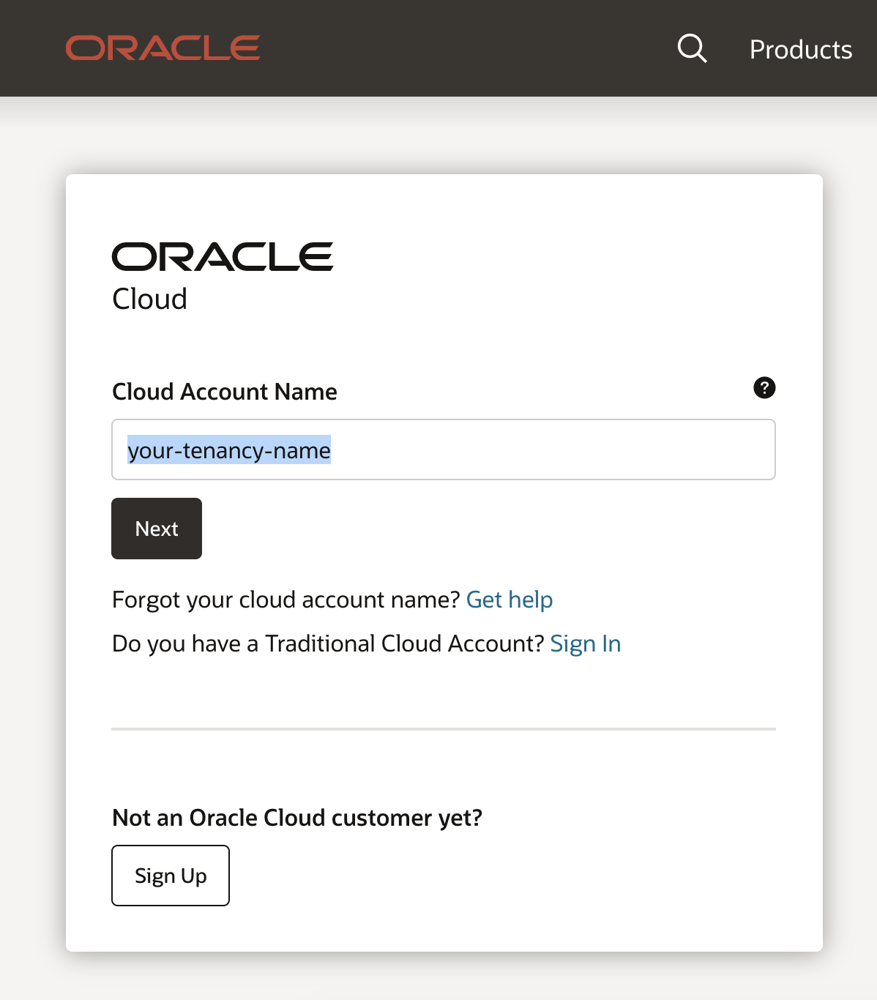
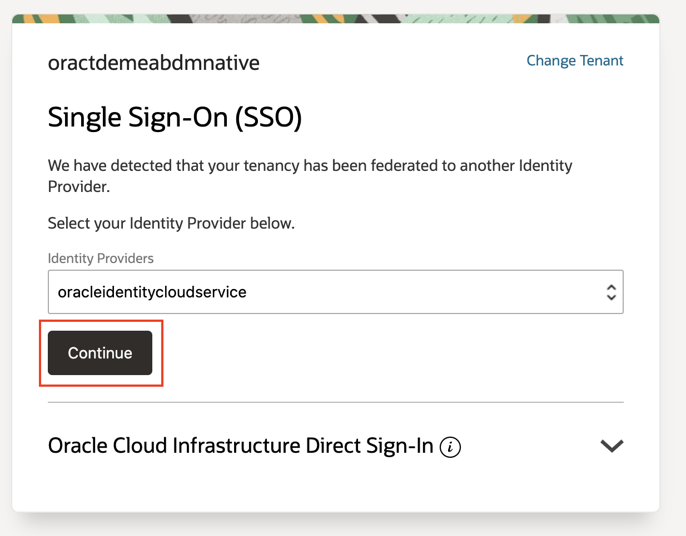
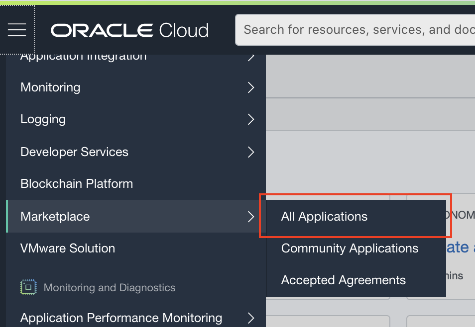
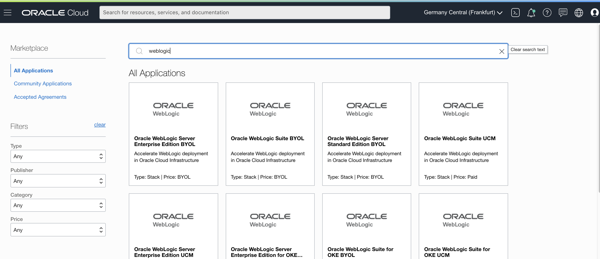

# WebLogic for OCI - pre-lab check

## Objective

This page allows you to check the ability to work with Oracle cloud and the Marketplace Stack mechanism.

In some exceptional cases we have noted that very **restictive corporate firewalls or VPN settings** might stop you from correctly working with the WebLogic for OCI marketplace solution.  

You can use the below steps to quickly check if your corporate environment is correctly configured, for example as a preparation to a hands-on lab that will be executed.

It is important to use a **configuration that is representative** of what the majority of participants will be using, especially with respect to any constraints on use of VPN, firewalls or browser plug-ins that might be standard in your environment.

## 1. Log in to an Oracle OCI tenancy

- You can obtain a **free tier** account via [this link](https://signup.oraclecloud.com/).

- Open the console of your cloud tenancy via https://www.oracle.com/cloud/sign-in.html and login to your tenancy

  - **Cloud Account Name** : this is the name of your tenancy, not your username!
  
  

- Choose Single Sign On:

- Login with your cloud account *User Name* and *Password* 

## Check you can start the stack creation process

- Use the Hamburger Menu and scroll down to *Solutions and Platform* -> *Marketplace -> All Application*:

- Type the word **weblogic** in the marketplace search box :

- Choose *WebLogic Server Enterprise Edition UCM*; This brings you to the Stack Overview page:

- Accept the *Oracle Terms of Use*:

- Hit the **Launch Stack** button
- Validate you get the **Create Stack** dialog shown below, without any errors or warnings :

==> **Congratulations**, you are all set to run the lab !

In case you are having issues to visualize the **Create Stack** dialog, please get in touch with your usual Oracle contact person to receive assistance.

