# WebLogic for OCI - non JRF

## with provided cloud environment

This Hands on Lab will go through the process of creating a non JRF type of WebLogic for OCI Instance - using Oracle Cloud Marketplace - and through the steps of deploying a simple application. A provided and partially preconfigured (lab) cloud environment will be used.

### Step 1. Create WebLogic for OCI Stack

- Go to https://console.eu-frankfurt-1.oraclecloud.com/ and login to the lab cloud environment
- Choose **oractdemeabdmnative** as Cloud Tenant:

- Choose Single Sign On:

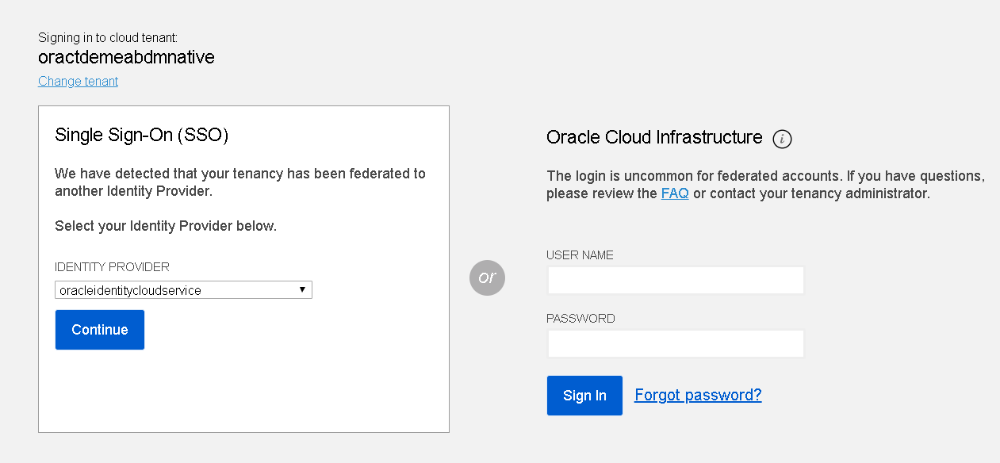

- Login with *User Name* and *Password*; Use the credentials from the Self Registration

- After logging in, go to Hamburger Menu, *Solutions and Platform* -> *Marketplace*:

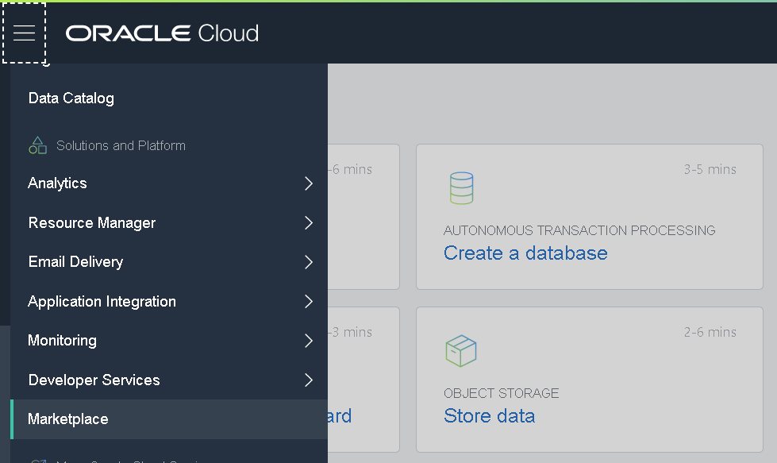

- You can choose to browser-search for *WebLogic Server*, or you can apply the filters:
  - **Type**: *Stack*
  - **Publisher**: *Oracle*
  - **Category**: *Application Development*

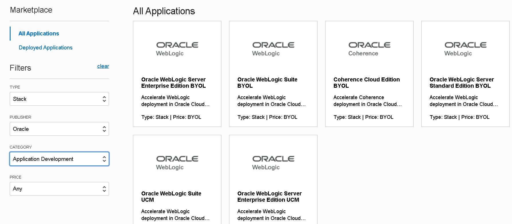

- Choose *WebLogic Server Enterprise Edition UCM*; This brings you to the Stack Overview page:

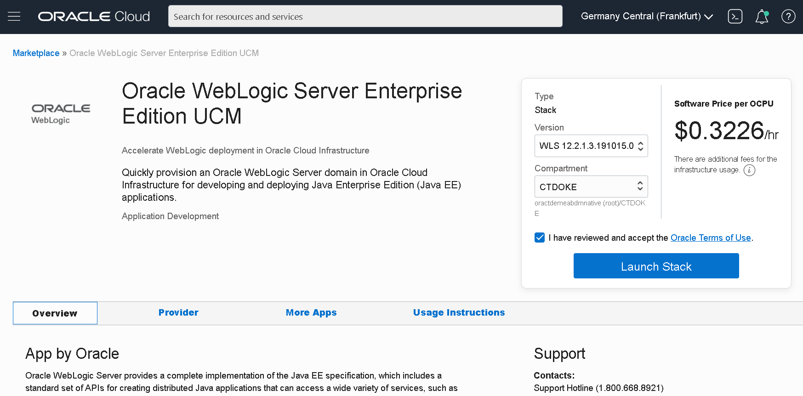

- Make sure *CTDOKE* compartment is selected and to accept *Oracle Terms of Use*:

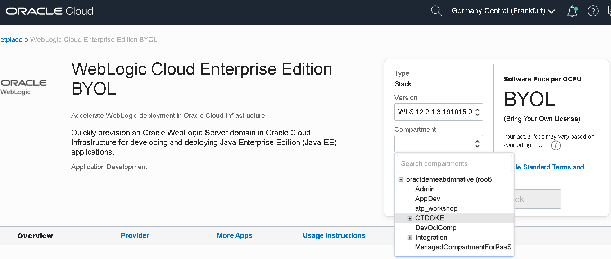

- Fill in Stack information:
  - **Name**: *WLSCNN* - where **NN** is your unique suffix given by the instructor
  - **Description**: Any meaningful description, maybe type in your name/initials
- Click **Next**

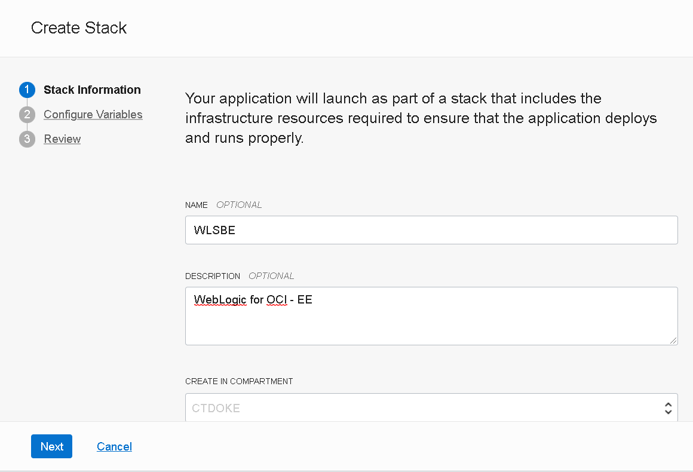

- Start to fill in details:

  - **Resource Name Prefix**: *WLSCNN* - where **NN** your unique suffix
  - **WebLogic Server Shape**: *VM.Standard2.1*
  - **SSH Public Key**: copy and paste the content from the provided **wls_ssh_public.key** file; it contains the public key in RSA format; be sure to include the whole content in one line, including *ssh-rsa* part at the beginning

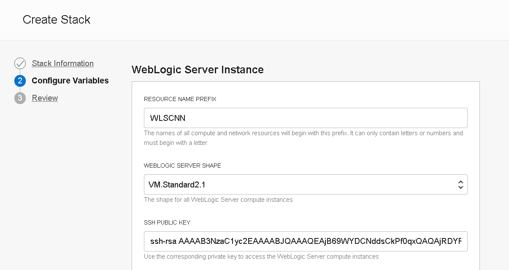

- Continue setting up:

  - **WebLogic Server Availability Domain**: choose one of the three ADs
  
  - **WebLogic Server Node count**: *2* (we will create a WebLogic cluster with two nodes / managed servers)
  
  - **Admin user name**: *weblogic*
  
  - **Secrets OCID for WebLogic Server Admin Password**: 
  
    - if you are using the CTD (Cloud Test Drive) environment enter: 
      - *ocid1.vaultsecret.oc1.eu-frankfurt-1.amaaaaaaqrgb7baabjve3m5xzqac5y7jeqwintdxsgmyxezuwjm35n3r55la*
      - a bit of context: the WebLogic Server Admin Password it's stored in an OCI Vault as an OCI Secret (encrypted with an OCI Encryption Key); during WebLogic Domain creation, the provisioning scripts will setup the admin password by getting it from the OCI Secret instead of having it as a Terraform variable; in a similar way - if talking about an JRF enabled domains - the database admin password will be referred from an OCI Secret
  
    - if you are using your own environment and you have followed the *Prerequisites* lab, fill in the OCI Secret OCID that you have created at step *Create OCI Secret for WebLogic Admin password* > *Create OCI Secret*

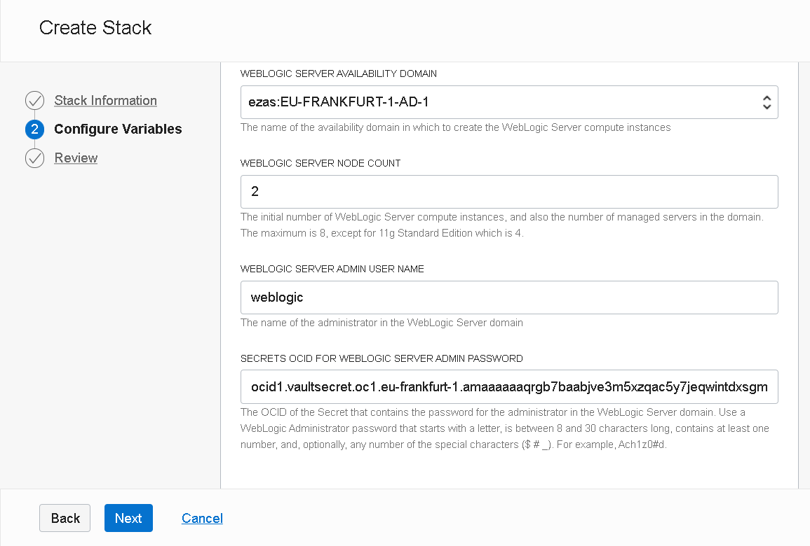

- Don't change WebLogic Server Advanced Configuration, choose the same *CTDOKE* Compartment and *Use existing VCN* for **Virtual Cloud Network Strategy**: 

- We have pre-configured part of the networking resources; choose for:
  - **Existing network**: *WLSCB2-WLSCloudVCN*
  - **Subnet Strategy**: *Use Existing Subnet*
  - **Subnet Type**: *Use Public Subnet*
  - **Subnet Span**: *Regional Subnet*

- Finalize network configuration with:
  - **Existing Subnet for WebLogic Server**: *WLSCB2-wls-subnet*
  - Tick to **Provision Load Balancer**
  - **Existing Subnet For Load Balancer**: *WLSCB2-lb-subnet-1*
  - **Load Balancer Shape**: *100Mbps*
  - Tick to **Prepare Load Balancer for Https**

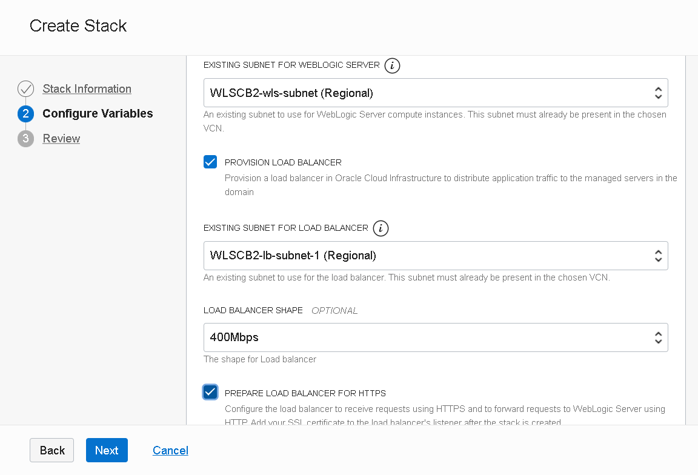

- Finally, leave Identity Cloud Service Integration as default (no integration) and *No Database* for **Database Strategy**

- Review the Stack configuration and Click **Create**:

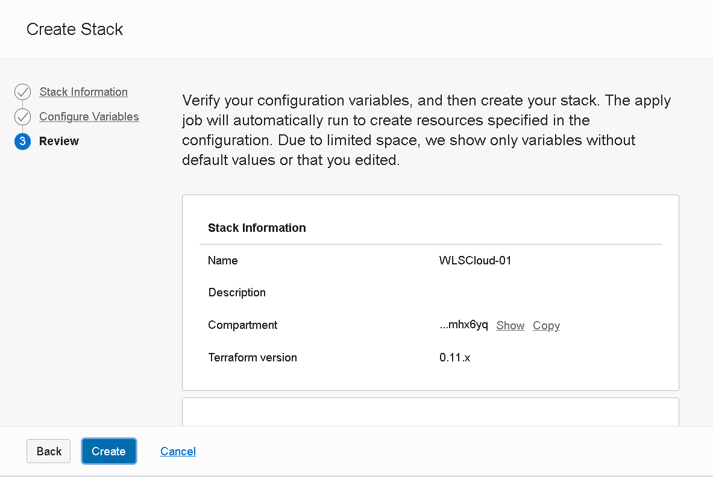

- A Stack Job is being run and our WebLogic Server is being provisioned:

- While all resources being created we can check the Job Logs; it helps fixing potentially configuration errors if the provisioning fails:

- After a while, the Job should complete with success:

- We can check the *Outputs* section of Job Resources and check for two important values:
  - Sample Application URL (we can can try it at this moment, but the out of the box sample application won't load as we need to finish the SSL configuration of the Load Balancer)
  - WebLogic Server Administration Console

- Let's check the WLS admin console of the newly created WebLogic Server; as we have chosen a Public Subnet for the WLS network, both Compute instances that have been created have public IPs associated 
- Instead of *http://< public IP >:7001/console*, open *https://< public IP >:7002/console*; we'll prevent sending the WebLogic admin credentials in plain text mode, insecurely; (change *http* with **https** and *7001* port with **7002** port)
- Login with **weblogic** username and the plain text provided password; check the *weblogic_password_plaintext.txt* file

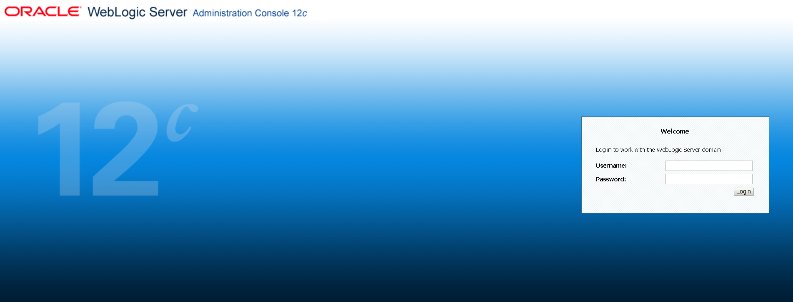

- We can see that our domain has one admin server and two managed servers:

- We can check the Compute Instances to see what has been provisioned; From general hamburger menu choose *Core Infrastructure* -> *Compute* -> *Instances*:

- We can see two instances having our prefix mentioned during Stack configuration; one of them runs the admin server and a managed server and the other runs the second managed server:

- Congratulations! Your WLS domain is up&running! 

### Step 2. Configure SSL Load Balancer

- We need to do some additional configurations to the created Load Balancer in order to support SSL traffic; From the main menu, go to *Core Infrastructure* -> *Networking* -> *Load Balancers*:

- Identify the Load Balancer that has your unique WLSC*NN* prefix:

- Click the Load Balancer Link and go to Resources sub menu; choose *Hostnames*:

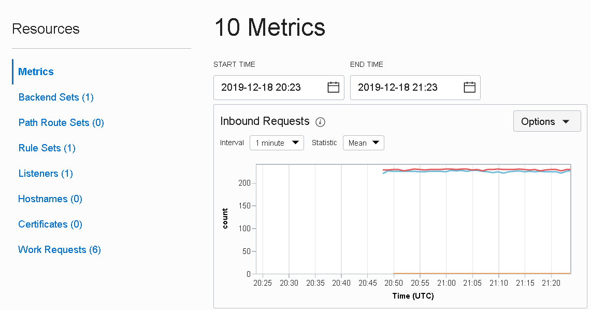

- Let's create a new hostname; Click **Create Hostname**: 

- Fill in:
  - **Name**: *wlschostname*
  - **Hostname**: *weblogiccloud*

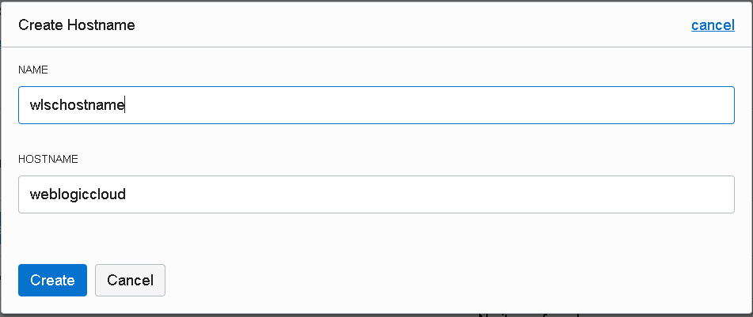

- Shortly, the hostname will be created:

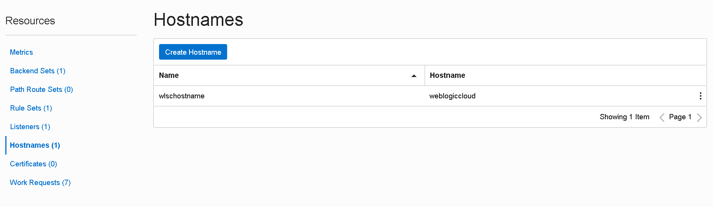

Now, choose *Certificates* from *Resources* sub menu:

- Here, we'll add a Load Balancer certificate that it's required for our SSL listener; configure as following:
  - **Certificate Name**: *weblogiccloud-cert*
  - **SSL Certificate File**: upload provided *weblogiccloud_cert.pem* file (don't confuse with the *_key.pem* file that contains the private key)
  - Tick **Specify CA Certificate**:

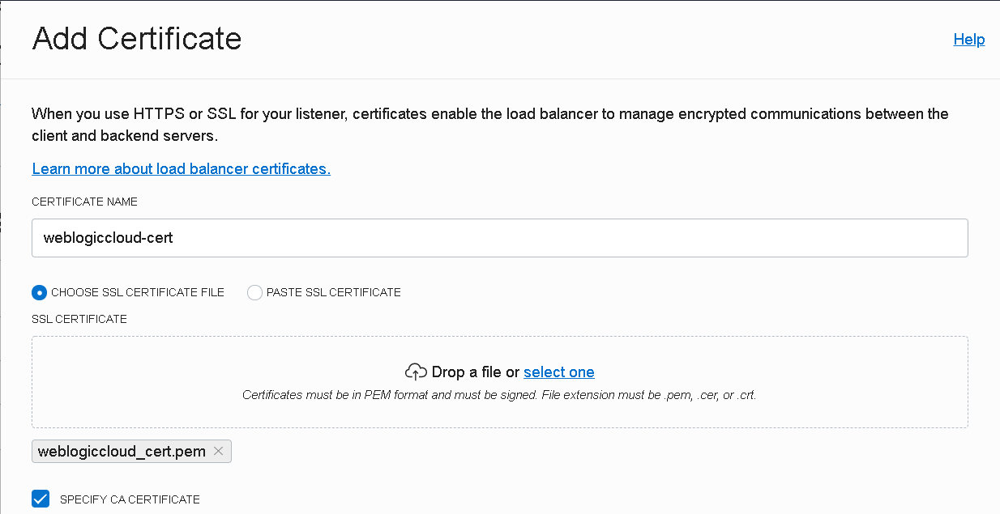

- As we use a demo self signed certificate, upload the same *weblogiccloud_cert.pem* file for **CA Certificate File**;
- For **Private Key File**, upload the *weblogiccloud_dec_key.pem* file (this file contains the decrypted private key)
- Enter the provided key passphrase for **Private Key Passphrase**; check *weblogiccloud_key_passphrase.txt* file content
- Click **Add Certificate**:

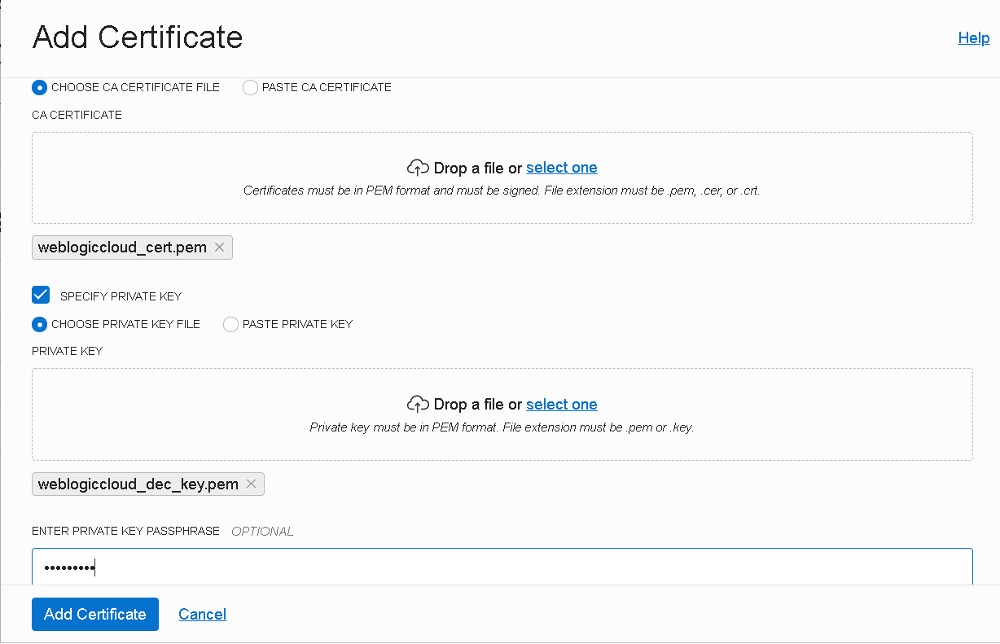

- Shortly, the SSL certificate is available:

- Finally, we need to configure the SSL listener; From the *Resources* sub menu, go to *Listeners* and edit existing listener:

- Configure as following and Save Changes:
  - **Name**: choose existing *wlschostname* hostname
  - Tick **USE SSL** checkbox
  - **Certificate Name**: choose *weblogiccloud-cert*
  - leave default backend set

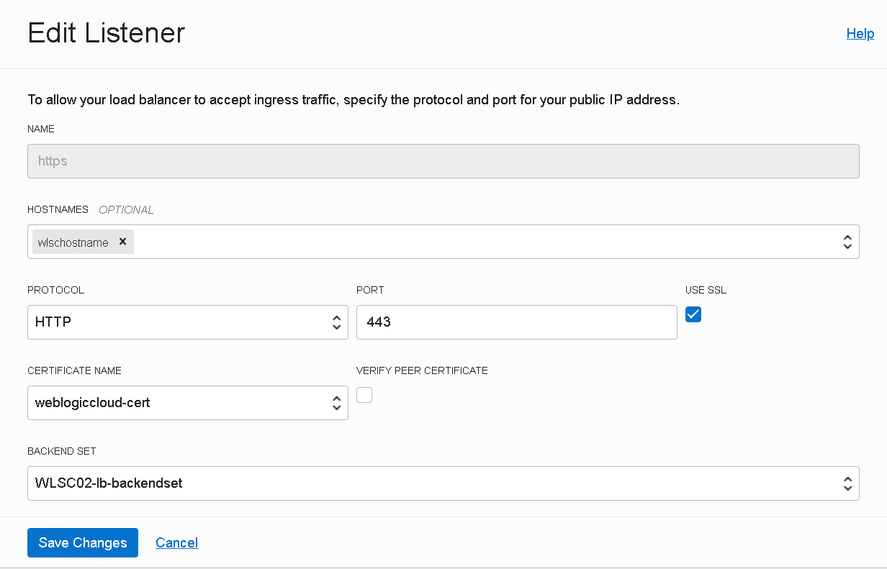

- Shortly, the listener should get updated:

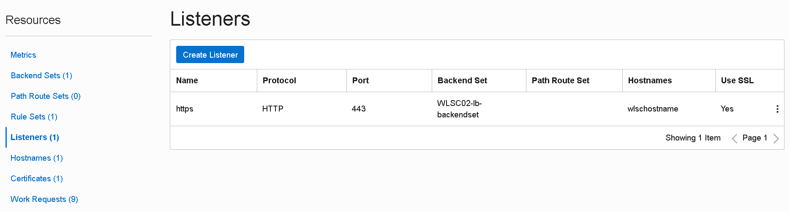

- We can check now if the out of the box deployed application is loading; From the Stack Job Outputs, open the Sample Application URL; now it's loading, but we have to bypass the browser warning as we're using a Self Signed Certificate;
- Click **Advanced** button and **Proceed to ...** to continue:

- The out of the box deployed sample application is being served through a secured SSL Load Balancer Listener:

### Step 3. Deploy custom sample application

- Let's go back to the WebLogic Server admin console to deploy our sample web application:

- Go to *Domain Structure* menu, *Deployments*; **Lock & Edit** to switch to edit mode; Click **Install**:

Follow **Upload your files** link and upload provided [SampleWebApp.war](resources/SampleWebApp.war) web archive file:

- Click **Next**, **Next**, leave *Install de deployment as an application* default option; click **Next**:

- Choose deploying the application on WebLogic Cluster; click **Next**:

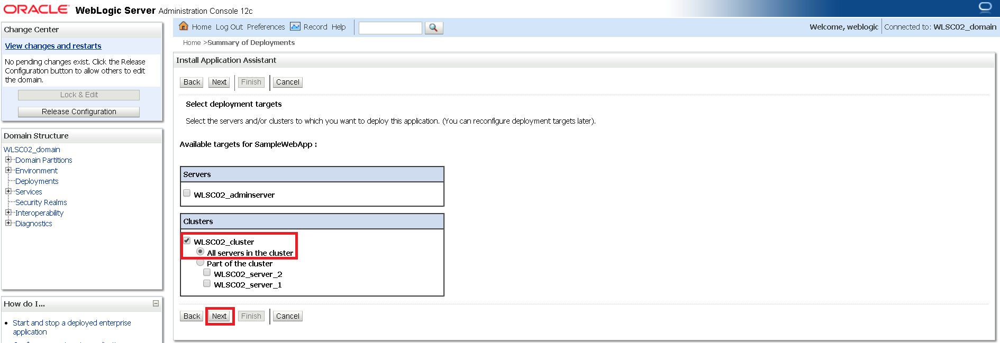

- Leave default setting and click **Next**:

- Choose *No, I will review the configuration later* and click **Finish**

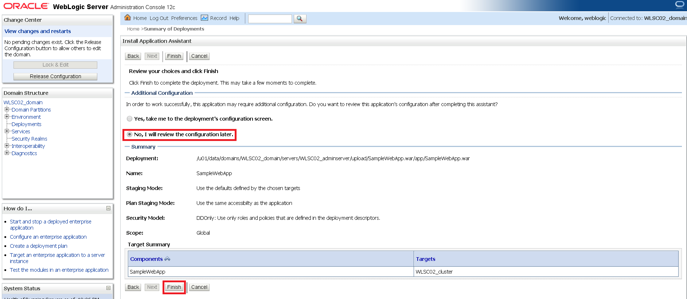

- **Activate Changes**:

- The application is now in *Prepared* state; switch to *Control* tab:

- Select the *SampleWebApp* web application and click **Start** -> **Serving all requests**; Click **Next** in the following screen:

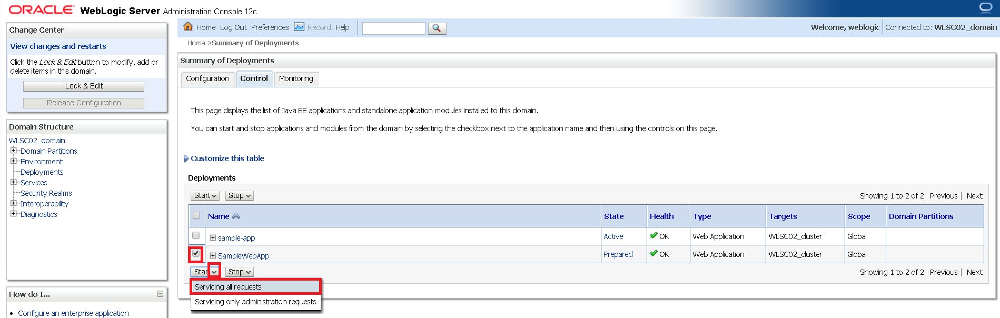

- The *SampleWebApp* web application is in the *Active* State now:

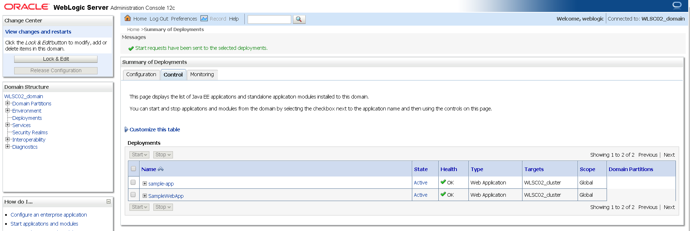

- Now, test this new application at *https://< public load balancer IP >/SampleWebApp/*

 

- Click on the link to test this sample application:

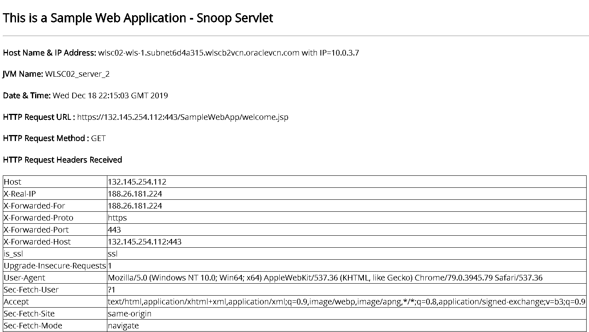

- This is just another sample application, but you can deploy any other application; Congratulations!