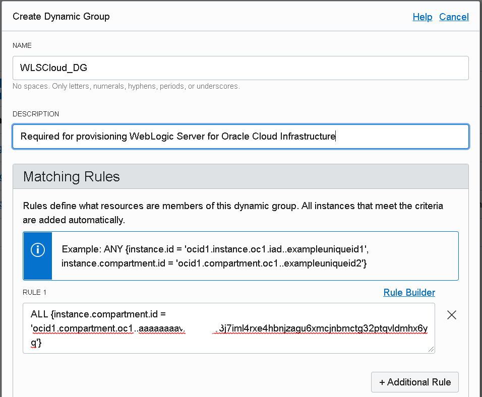

# WebLogic Cloud - non JRF

## prerequisites

If you want go through the Hands on Lab (*non JRF type of WebLogic Cloud Instance - using Oracle Cloud Marketplace*) using your cloud environment, follow this guide to setup some prerequisites. If you will use the provided Cloud Test Drive environment, skip this Lab.

### Step 1. Prepare OCI Compartment

When provisioning WebLogic for OCI through Marketplace, you need to specify an OCI Compartment where all resources will be created.

Make sure you have a Compartment that you can use or create a new one.

Take note of the compartment **OCID**:

The Compartment name is referred as **CTDOKE** in the Hands on Lab.

### Step 2. Encrypt WebLogic Admin password

When you provision WebLogic for you need to pass the WebLogic Admin password encrypted. An OCI Key is required for this.  

##### Create a Key Vault

Go to *Governance and Administration* > *Security* > *Key Management*:

Create a new Shared Vault:

The new Vault should be listed as Active:

Take a look at the Vault Information and note the  **Cryptographic Endpoint**:

Create an new Key:

Give the key a Name and leave the other settings as default:

The new key should be listed as *Enabled*:

Click on the key and note the key's **OCID**:

##### Encrypt WebLogic Admin password

User OCI Cloud shell:

Shell appears in the bottom of the screen:

First, we need to encode the WebLogic Admin password in base64 format:

Command:

> echo -n 'WebLogic Admin password' | base64

Then, we'll use the Vault Key to encrypt the base64 encoded password:

Command:

> oci kms crypto encrypt --key-id Key_OCID --endpoint Vault_Cryptographic_Endpoint --plaintext Base64_Encoded_Password

The *ciphertext* value from the response represents the encrypted password. Use this value instead of the provided sample from the Hand on Lab given in **weblogic_password_encrypted.txt** text file.

Use your Key OCID and Vault Cryptographic Endpoint values as the **Key Management Service Key Id**
and **Key Management Service Cryptographic Endpoint** parameters instead of sample values mentioned in the Hands on Lab.

### Step 3.  Create required policy for accessing the Vault Key

##### Create a Dynamic Group

We need to create a Dynamic Group that will group all instances in the compartment.

Go to *Governance and Administration* -> *Identity* -> *Dynamic Groups*

Create a new Dynamic Group:

Give a meaningful name and description.

For the matching rule use:

> ALL {instance.compartment.id = 'your compartment ocid'}

##### Create Policy for Dynamic Group

We need to create a policy that will allow stack scripts to access the key vault and decrypt encrypted WebLogic Admin password.

Go to *Governance and Administration* -> *Identity* -> *Policies*

Create a new Policy:

Give a name and description.

For the policy statement use:

> Allow dynamic-group <dynamic group name> to use keys in compartment <compartment name>

Specify Dynamic Group's name created earlier and your compartment name.

### Step 4. Network Configuration

The Hands on Lab guide uses an existing Virtual Cloud Network and pre-configured Subnets for the WebLogic compute nodes and for the Load Balancer.

 If running the lab in a different cloud environment, the easiest way is to choose for creation of required network resources during provisioning.

When filling in Stack form choose to *Create New VCN* for Virtual Cloud Network Strategy. Setup a VCN name. You can leave default Network CIDR value or change it.

You can leave default options for Subnet configuration:

Also for the Load Balancer:

###  Step 5. Create ssh keys

You need to generate a public and private ssh key pair. During provisioning using Marketplace, you have to specify the ssh public key that will be associated with each of the WebLogic VM nodes.

You can choose one of the options below:

###### Using ssh-keygen

> ssh-keygen -t rsa -b 4096

You'll be asked to specify the filename to save the private key. The public key will be saved at the same location, with the extension .pub added to the private key filename.

###### Using PuTTYgen

Launch the PuTTYgen tool and use the *Generate* button to generate a new private/public key pair.

After key generation, don't forget to save the public and private key. If not using Putty as ssh client, you'll need to save the key in OpenSSH format (*Conversions* -> *Export OpenSSL key*).

The public key filename is referred as **wls_ssh_public.key** in the Hands on Lab.

### Step 6. Load balancer SSL configuration

For security reasons it's a good practice - if not mandatory - to allow only secured traffic between clients and WebLogic Server applications. Therefore, after provisioning WebLogic for OCI by choosing to setup a Load Balancer, it's necessary to manually finish SSL configuration by adding a SSL certificate to the load balancer's listener.

##### Create Self Signed certificate

We can use Openssl tool to generate a Self Signed certificate:

> openssl req -x509 -newkey rsa:4096 -keyout weblogiccloud_key.pem -out weblogiccloud_cert.pem -days 365

The openssl dialog will request setting up a PEM pass phrase and several fields for certificate information.

You can choose any PEM pass phrase, the one used by the Hands on Lab is referred from the **weblogiccloud_key_passphrase.txt** text file.

Then, we need to decrypt the private key:

> openssl rsa -in weblogiccloud_key.pem -out weblogiccloud_dec_key.pem

Note that above examples use the same names for the certificate and private key as in the Hands on Lab: **weblogiccloud_cert.pem** and **weblogiccloud_dec_key.pem**.

You should be able now to run the Hands on Lab on your own cloud environment.