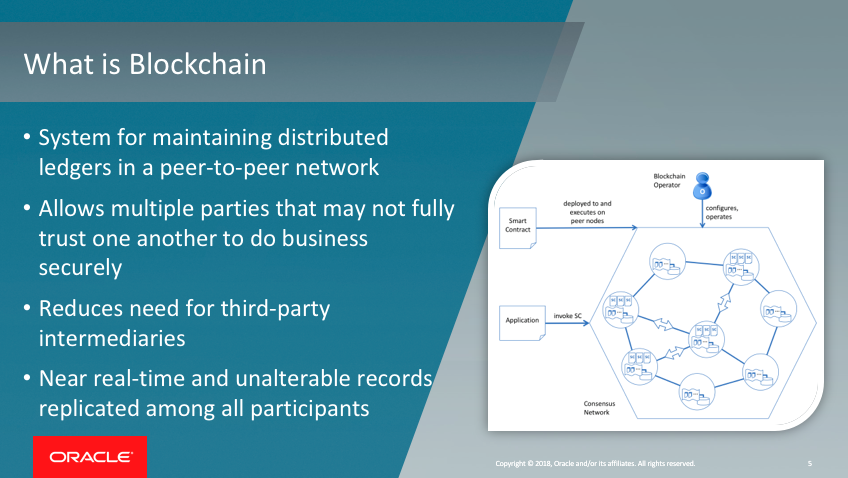
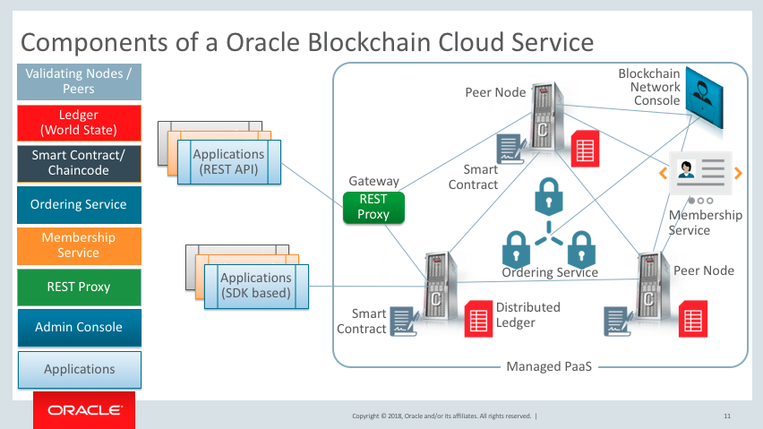
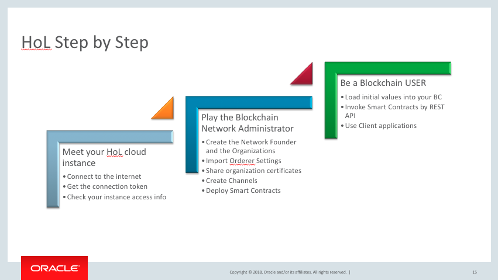

[Go to the Cloud Test Drive Overview](../README.md)

# Blockchain Cloud Service Lab #

## Introduction - what is Blockchain ? ##

## What will you do with Blockchain in this Lab ? ##

## Let's start ! ##

This lab is composed of a series of steps.  Your instructor will inform you which sequence will be run in your lab.

+ Download the tutorial by clicking on the links below, and then **use the "Download" button** .  
Attention ! To come back to this page, hit the "Back" button of your browser !

  - [Optional] Lab 1 - [creating a network with 3 orgs](Lab1_BCS_Network_HOL%20FOR_VM.docx) - This step is only required if you are using your own "fresh" Blockchain instance. 
  - Lab 2 - [working with the Blockchain network](Lab2_BCS_Network_HOL.docx)
  - Lab 3 - Using the Blockchain Sample App & REST API, [part 3a](Lab3a_BCS_Network_1Hour_Transactions.docx) and [part 3b](Lab3b_BCS_Network_1Hour_REST_API.docx)
+ Log in to the environment with the URL and the credentials that have been provided

---

[Go to the Cloud Test Drive Overview](../README.md)