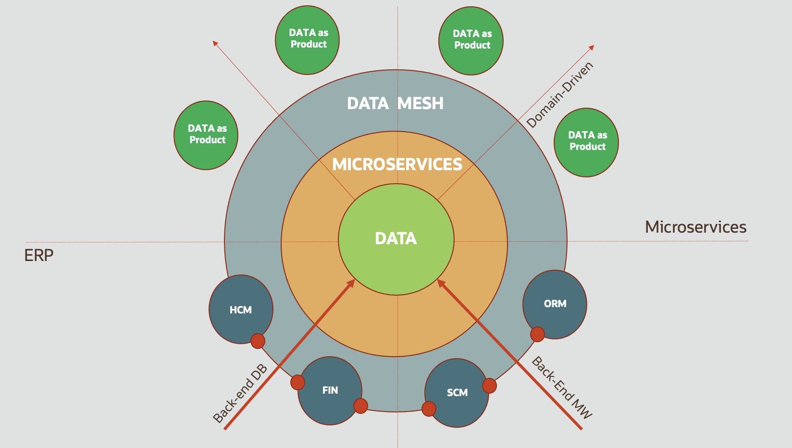
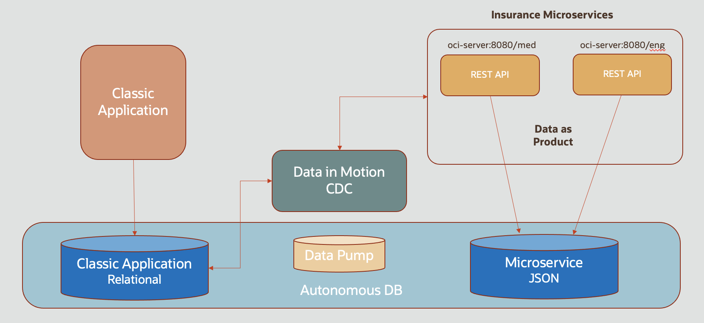

# Introduction and Prerequisites

## Objective of this lab

This Lab will walk you through the steps to set up a Data Mesh to organize your data flows between classic Monolith applications, typically using a relational database schema, and various other applications, for example microserviceq that run in a different location and store their data as JSON text.

### What is a Data Mesh?

Content to be finalized (tbc)

### What will we do in this lab?

In this lab we will walk you through the following steps : 

- Set up an Autonomous Database and 3 schemas: one representing the monolith applciation, one representing the Data Pump environment , and one representing a microservice using JSON
- Creating the GoldenGate Data Pump: create an instance of the OCI GoldenGate cloud service
- Create a VM where we will run the microservices that will act as consumers
- Create 3 schemas in the database: one representing the monolith applciation, one representing the Data Pump environment , and one representing a microservice using JSON
- Configure Source and Target systems in the GoldenGate environment to manage the data flows
- Observe the resulting data flows in the various applications and data sources

### Lab Architecture

## Prerequisites

### 1. An Oracle Cloud environment

To run these labs you will need access to an Oracle Cloud Account.  

<u>We assume you are using your own Oracle Cloud Tenancy,</u> either via a **Free Tier**, using a **Pay-as-you-Go** account, or using the **Corporate account** of your organization.  

==> If you do not have an account yet, you can obtain  an Oracle Free Tier account by [clicking here.](https://signup.cloud.oracle.com/?sourceType=:em:lw:pety:cpo:::RC_WWMK210617P00118:Lab_WeblogicOCI0709)

### 2. Service limits

Going through the hands on labs you will create the following main components in your tenancy:

- a VCN network with public access
- one Autonomous database of the type "Transactional"
- one Compute instance of shape "tbc"
- one OCI GoldenGate instance

(tbc with any additional resources used)

You may now proceed to the next Lab Step, use the navigation on the left.
