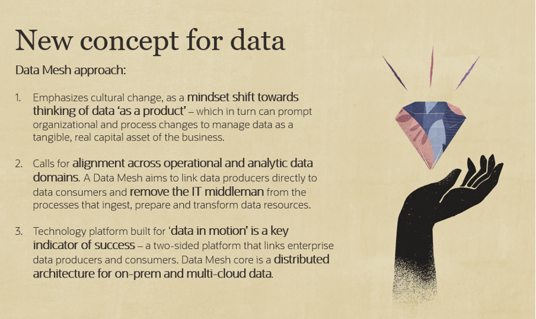

# Introduction and Prerequisites

## Objective of this lab

This Lab will walk you through the steps to set up a Data Mesh to organize your data flows between classic Monolith applications, typically using a relational database schema, and various other applications, for example microservices that run in a different location and store their data in different ways, for example as JSON text.

### What will we do in this lab?

In this lab we will walk you through the following steps : 

- Set up two Autonomous Databases and a database schema for each: one representing the monolith application, and one representing the Domain DWH exposing some data of the domain to external applications through ORDS
- Set up the GoldenGate Data Integration environment by creating an instance of the OCI GoldenGate cloud service
- Configure the data flows in the GoldenGate environment: set up an Extractor and a Replicat.
- Observe the resulting data flows in the various applications and data sources

### Lab Architecture

The below picture represents the various components of the lab:

## Introduction to Data Mesh
Data Mesh is an emerging hot topic for enterprise software that puts focus on new ways of thinking about data. Data Mesh aims to improve business outcomes of data-centric solutions, as well as to drive adoption of modern data architectures. 

From the business point of view, Data Mesh introduces new ideas around ‘data product thinking’ and how it can help to drive a more cross-functional approach to business domain modeling and creating high-value data products. 

From the technology side, there are three important and new focus areas for data-driven architecture: 
- distributed, decentralized data architecture that help organizations move away from monolithic architectures 
- event-driven data ledgers for enterprise data in motion 
- streaming-centric pipelines to replace legacy batch type tooling, handle real-time events, and provide more timely analytics 

Oracle’s focus on the Data Mesh has been in providing a platform that can address these emerging technology requirements, including tools for data products, decentralized event-driven architectures, and streaming patterns for data in motion. 

Investing in a Data Mesh can yield impressive benefits, including: 
- total clarity into data’s value chain, through applied ‘data product thinking’ best practices 
- \>99.999% operational data availability, using microservices based data pipelines for data consolidation and data migrations
- 10x faster innovation cycles, shifting away from ETL, to continuous transformation and loading (CTL) 
- ~ 70% reduction in data engineering, gains in CI/CD, no-code and self-serve data pipeline tooling, and agile development 

For more information:
- eBook: https://www.oracle.com/a/ocom/docs/datamesh-ebook.pdf
- Tech Paper: https://www.oracle.com/a/ocom/docs/techbrief-enterprisedatameshandgoldengate.pdf

## Step 1 - Access to an Oracle Cloud environment

To run these labs you will need access to an Oracle Cloud Account.  

<u>We assume you are using your own Oracle Cloud Tenancy,</u> either via a **Free Tier**, using a **Pay-as-you-Go** account, or using the **Corporate account** of your organization.  

==> If you do not have an account yet, you can obtain  an Oracle Free Tier account by [clicking here.](https://signup.cloud.oracle.com/?sourceType=:em:lw:pety:cpo:::RC_WWMK210617P00118:Lab_WeblogicOCI0709)

## Step 2 - Download the files for this lab

We will be using some scripts and application code during this lab.  They have been grouped in a zipfile to be downloaded to your laptop.

- Download the zip file with the various scripts, db schema's and the source code of the microservice to your local machine via **[this link](code/labfiles.zip)**.  
- Unzip the file on your laptop, and remember the location, we will be using these files in the following steps.

## Step 3 - Local notebook

Along this lab we will ask you to note down a series of elements for use later in the lab : IP addresses, hostnames, passwords, compartment names etc.

Make sure you have a **text notebook** open to cut and paste these elements to.  

We advise you to use a **simple text editor** that does not add any layout to the text: for example in Word, you might see simple quotes replaced by an opening quote and a closing quote, which will result in syntax errors when you copy this in a parameter definition file of OCI Goldengate.

## Step 4 - Service limits (Optional)

This lab can be run on a Trial tenancy provided by Oracle, during the initial period of 1 month and assuming you have remaining free credits in this environment.

**Remark** : this lab cannot be executed beyond the first month, when you can only use the **Always Free** entitlements, as OCI Goldengate is not part of the Always Free components. 

Incase you are running this lab on a **paying personal or corporate tenancy**, you might need to check you have the required service limits assigned to your tenancy or compartment :

Going through the hands on labs you will create the following main components in your tenancy:

- a VCN network with public access
- two Autonomous database of the type "Transactional"
- one OCI GoldenGate instance

You may now proceed to the next Lab Step, use the navigation on the left.
