# Creating the Infrastructure components 

This section will explain how to create the infrastructure components needed in this lab:

- A **Virtual Network**, comprising a public subnet.  In this lab we will configure all components on this public subnet for easy access, in a real setup you would place most of these elements in a privat network, using a bastion server to access the environments.
- Two **Autonomous database instances**, one for the Source Classic application, and one for the Target micorservices
- An Deployment of **OCI GoldenGate** to manage the data flow between the two systems

## Task 1: Create a VCN and subnet

1. Open the **Navigation Menu**, navigate to **Networking**, and select **Virtual Cloud Networks**.

   

2. Click **Start VCN Wizard**.

3. Select **VCN with Internet Connectivity**, and then click **Start VCN Wizard.**

   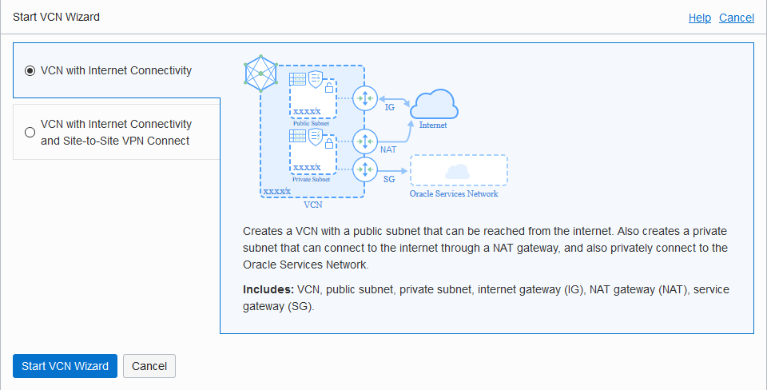

4. Enter a name for the VCN, select a compartment, and then click **Next**.

   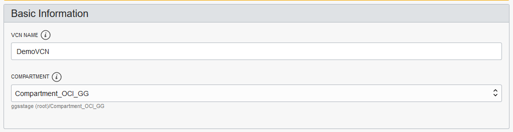

5. Verify the configuration, and then click **Create**.

   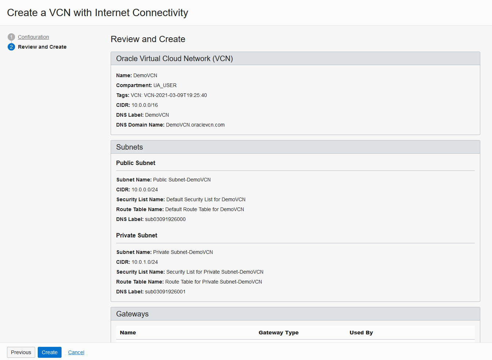

You can click View VCN Details and see both a Public and Private subnet were created.

## Task 2: Create an ATP Instance - SourceATP

1. Open the **Navigation Menu**, navigate to **Oracle Database**, and select **Autonomous Transaction Processing**.

   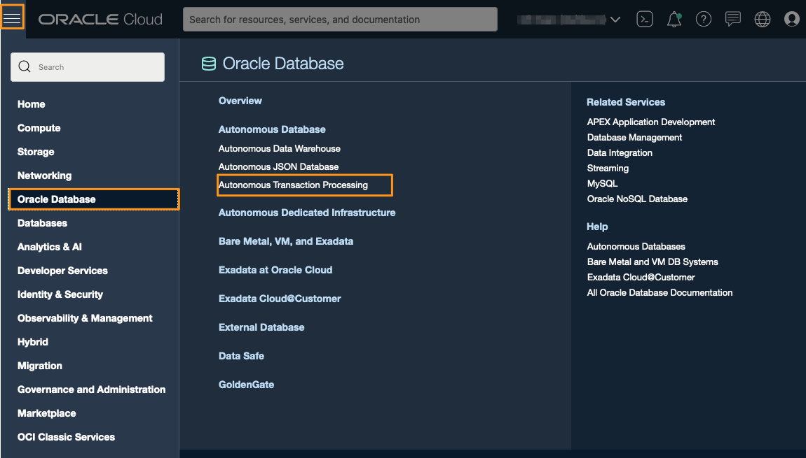

2. Click **Create Autonomous Database**.

   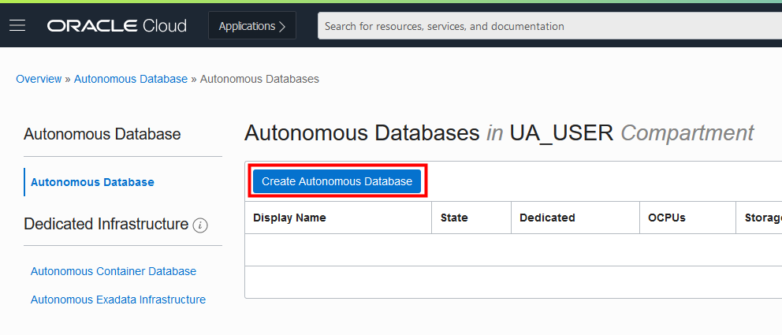

3. Select **Compartment** by clicking on the drop-down list. (Note that yours will be different - do not select **ManagedCompartmentforPaaS**)

   - Enter **SourceATP** for **Display Name** 
   - Enter **SourceATP** for **Database Name**

   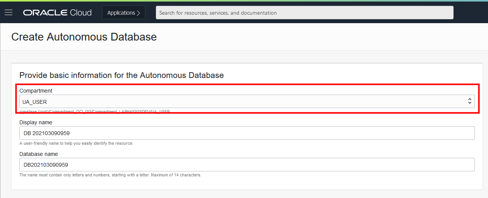

4. Under **Choose a workload type**, select **Transaction Processing**.

   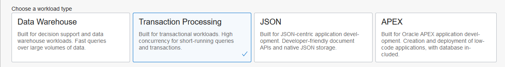

5. Under **Choose a deployment type**, select **Shared Infrastructure**.

   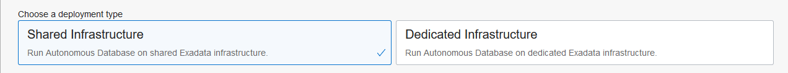

6. Under **Configure the database**, leave **Choose database version** and **Storage (TB)** and **OCPU Count** as they are.

   

7. Add a password. Take note of the password, you will need it later in this lab.

   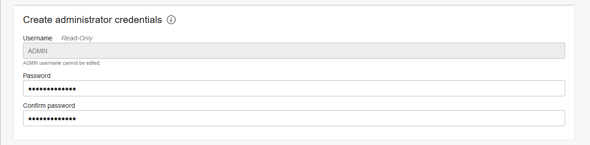

8. Under **Choose a license type**, select **License Included**.

   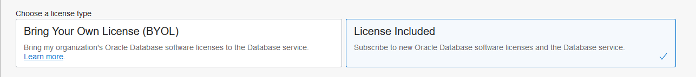

9. Click **Create Autonomous Database**. Once it finishes provisioning, you can click on the instance name to see details of it.

## Task 3: Create an second ATP Instance - TargetATP

Repeat the steps of the previous lab to create a second DB - the DB used by our target Microservice, using the same steps as before except for the name of the instance :

- Enter **TargetATP** for **Display Name** 
- Enter **TargetATP** for **Database Name**

## Task 4: Create a GoldenGate Deployment

*Note that the compartment names in the screenshots may differ from values that appear in your environment.*

1. Open the **Navigation Menu**, navigate to **Oracle Database**, and select **GoldenGate**.

   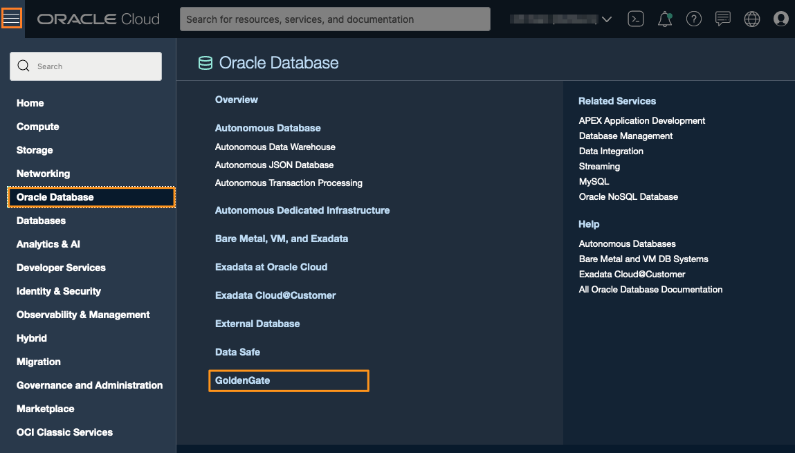

   You're brought to the **Deployments** page.

   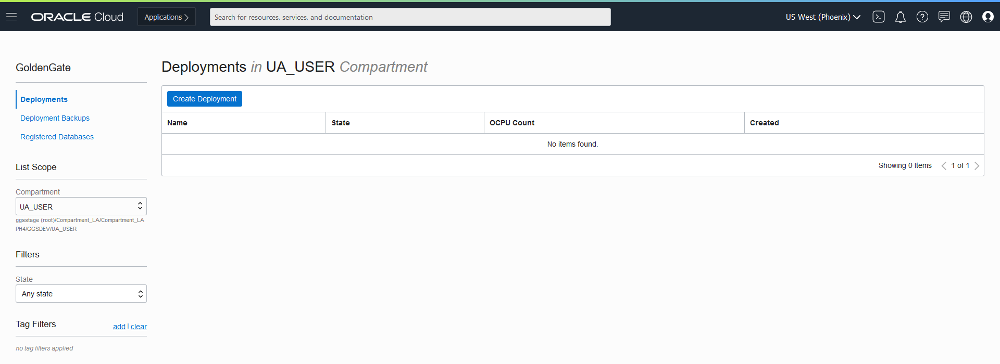

2. If you're prompted to select a compartment, select the compartment associated to your LiveLab workshop. For example, if your LiveLab username is LL1234-user, select the compartment **LL1234-COMPARTMENT**.

3. On the Deployments page, click **Create Deployment**.

   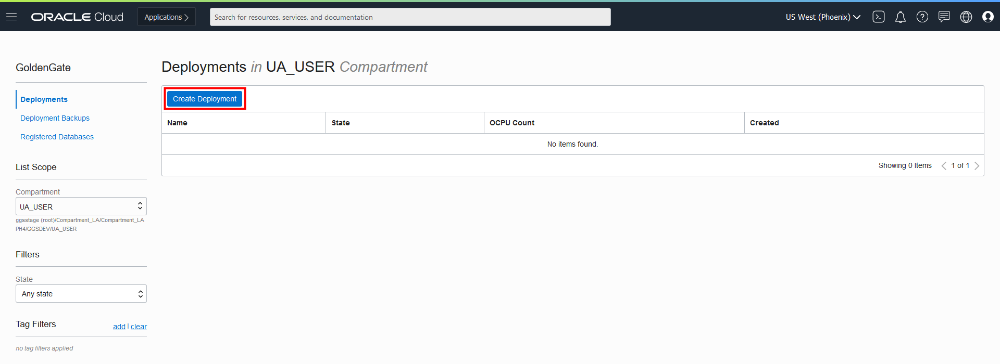

4. In the Create Deployment panel, enter **GGDeployment** for Name.

5. From the Compartment dropdown, select a compartment.

6. For OCPU Count, enter **2**.

7. For Subnet, select **Public Subnet**.

8. For License type, select **Bring You Own License (BYOL)**.

9. Click **Show Advanced Options**, and then select **Create Public Endpoint**.

   

10. Click **Next**.

11. For GoldenGate Instance Name, enter **ogginstance**.

12. For Administrator Username, enter **oggadmin**.

13. For Administrator Password, enter a password. Take note of this password.

14. Click **Create**.

You're brought to the Deployment Details page. It takes about five minutes for the instance to be come available.  Its status will change from CREATING to ACTIVE when it is ready for you to use.

==> While the instance is creating, **we can continue with the next chapter** of this lab

