# Creating a VM for running microservices


## Objective

This chapter will go through the process of creating a Virtual Compute environment to run your microservices

## Step 1 - Creating the VM Instance

- Navigate to the Compute Instance page to launch a new virtual machine where we will run the microservice application

  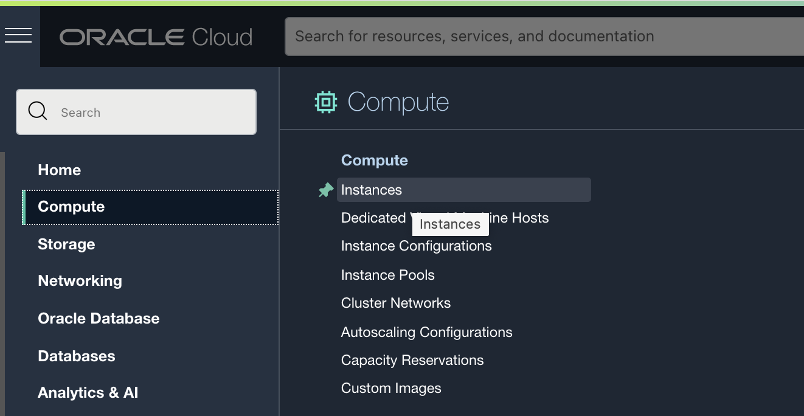

- Use the **Create instance** button to launch the wizard

- Enter a name for the VM, for example *myVM*

- Keep the default AD selection (in this case there are 3 AD's available, with AD 1 selected)

  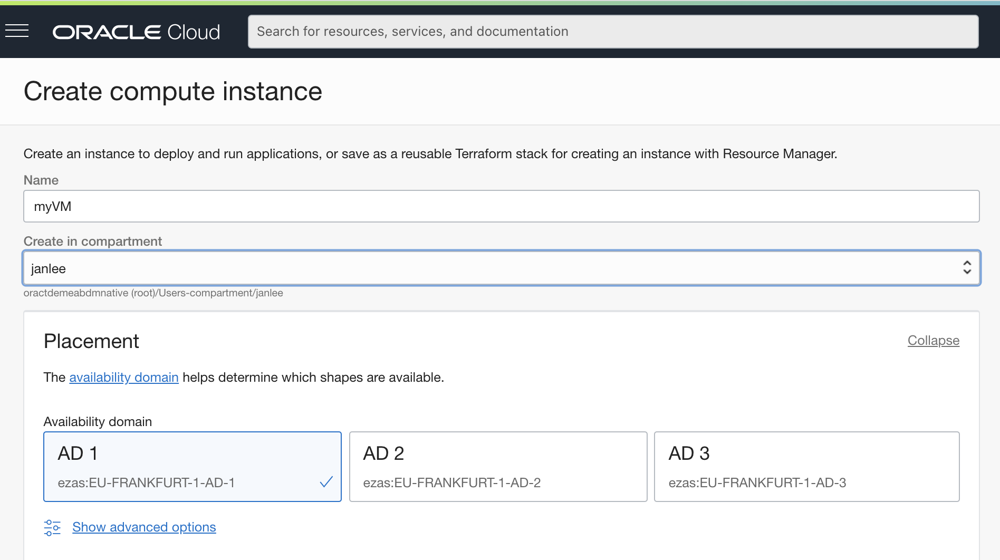

- Use the **Change Image** button to select the image called **Oracle Linux Cloud Developer** and don't forget to click the checkbox to accept the T&C.

  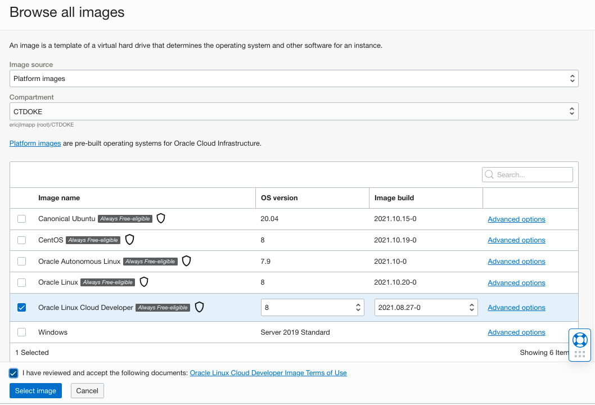

- Keep the default  **Shape** proposed

  

  

- Select the Virtual network you created earlier, and make sure to be on the **public** subnet

- Also ensure the **Assign a public Iv4 address** option is selected

  

- Be sure to generate a public/private key pair, and **download both the public and private key** to your laptop.  You will need them to connect to your machine in a minute.

- Leave the **Boot volume** parameters as per the defaults

  

The VM is now being generated, wait for the status to pass from **Provisioning** to **Running**

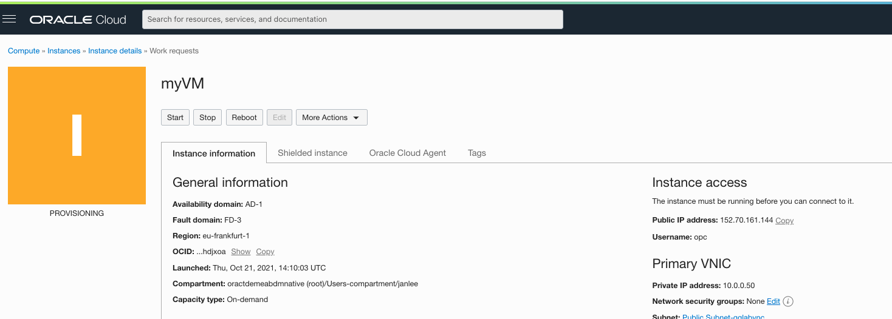

and a minute later : 

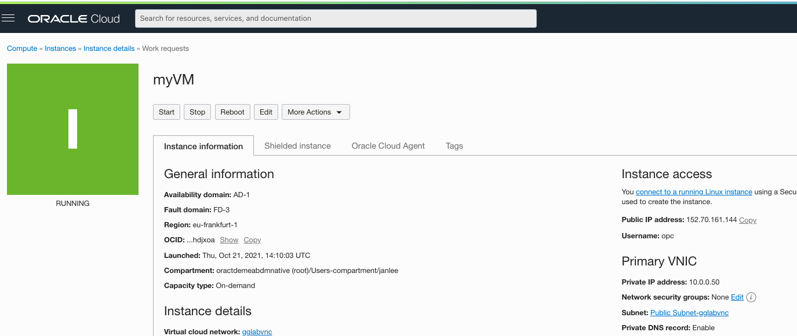

- Note the **Public IP Address** of your instance, you will need it to connect to your instance.

## Step 2 - Setting up the VM Instance

- Open the **Cloud Shell** of your console

  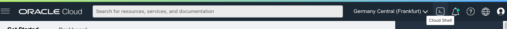

- Now drag and drop the **private** key file you downloaded earier on the console.  This will upload the key to your cloud shell :

  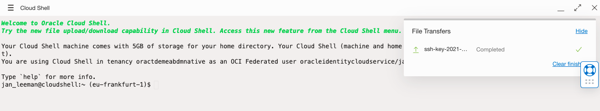

- While we are copying files, let's also copy the microservice source code that was in the zip file you downladed earlier over to the cloudshelll environment: drag & drop the file **msapi.js** onto the console.

- Set restrictive permissions on the key file as required by ssh 
  (replace the name with the name of **your** file)

  ```
  chmod 400 ssh-key-2021-10-21.key
  ```

- First copy the Microservice code from the console into the VM we just created, using the private key (replace the IP address with the public IP address of **your** instance, and the keyfile name with **your** keyfile name ! )

  ```
  scp -i ssh-key-2021-10-21.key msapi.js opc@152.70.161.144:msapi.js
  ```

- Now ssh into your VM with the below command
  (replace the IP address with the public IP address of **your** instance, and the keyfile name with **your** keyfile name ! )

  ```
  ssh -i ssh-key-2021-10-21.key opc@152.70.161.144
  ```

- As this is a fresh Linux instance, we need to install a few components to get our microservices running

- Install Express with the following command :

  ```
  npm install express
  ```

  You will get some warnings, this is OK.

- Install the faraday gem for the Ruby microservice:

  ```
  gem install faraday
  ```

  

- You should now be able to launch your microservice with the following command:

  ```
  node msapi.js
  ```

  Resulting output: 

  


## Step 3 - Network configuration

- Open a second console on your Virtual machine

  - Simply open a second browser window, and copy the URL of your first window into the 2nd browser window.  This will open a second cloud shell

  - Next re-issue the below ssh command to log into your virtual machine

    ```
    ssh -i ssh-key-2021-10-21.key opc@152.70.161.144
    ```

We now need to make sure we can access the port 9002 on which this service is listening is accesible from the internet : we need to add the port in the firewall rules of the Linux OS, and add a rule in the security list of the public virtual network.

- On the command line of the Virtual machine, add the port to the Linux firewall:

  ```
  sudo firewall-cmd --zone=public --add-port=9002/tcp --permanent
  
  sudo firewall-cmd --reload
  ```

- In the cloud console, navigate to the virtual machine you created (via the menu **Compute** then **Instances**) and in the Overview screen click on the subnet of the instance:

  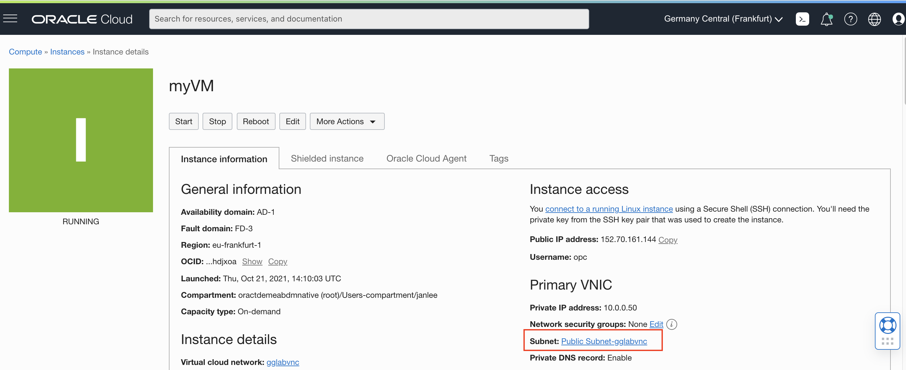

- This will display the details of the subnet, where you need to click on the Default Security Rule for the subnet:  

  

- You now see the Ingress rules that are open by default - we need to add a rule to allow port 9002 to be accessed: click on **Add Ingress Rules**

  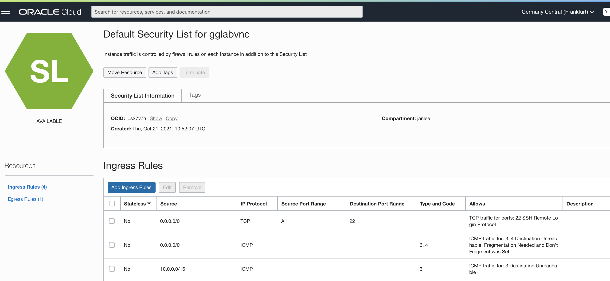


Configure a rule to allow access from everywhere on ports 9002 and 443: 9002 for the microservice itself, and 443 for https access to a gateway we will configure later in the lab.

- Enter the source CIDR as 0.0.0.0/0

- Leave Source Port Range blank (all sources)

- Enter 9002,443 in destination port

- Click on the **Add Ingress Rules** button

  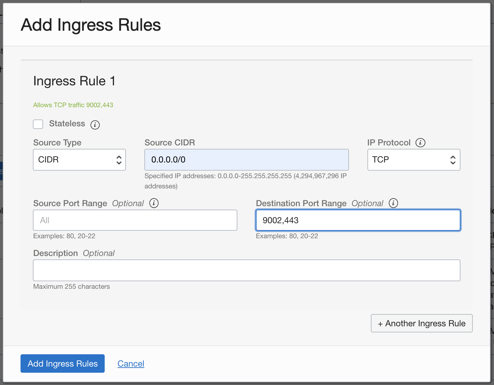

Now verify access to your microservice by opening a new tab on your browser, and accessing the service using an URL that looks like the one below - you need to **replace the IP address** with the public IP address of your VM machine:

```
http://132.226.204.234:9002/med
```

This should return :

```
{}
```


## Step 4 - Configure an API Gateway for HTTPS access

Because an ATP database is only allowing external calls to HTTPS endpoints, we need to also configure a gateway in front of our microservice that listens on port 443 and re-routes the request to our service.

- Open the menu and select first **Developer Services**, then under API Management select **Gateways**

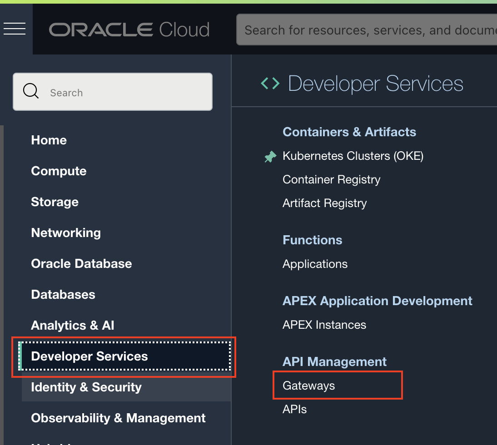


- Click the **Create Gateway** button

  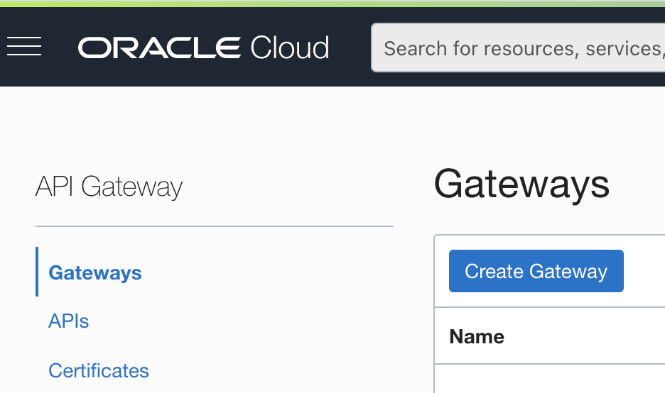

- Enter the following fields:

  - **Name** : the name of your gateway, for example **MyGW**
  - **Type** must be public
  - **Virtual Cloud Network** : select the VCN you created earlier
  - **Subnet**: select the **Public** subnet of your VCN
  - Leave all other fields untouched, and click the **Create Gateway** button

  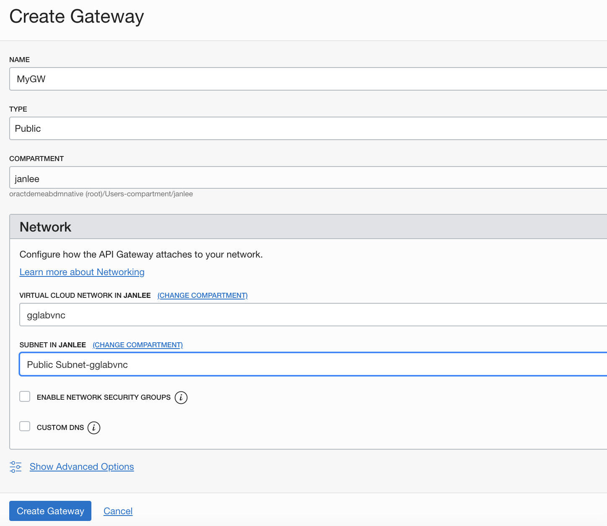

- Wait a few moments for the Gateway to become Active, then open the **Deployments** menu on the left

- Click the **Create Deployment** button, and fill in the parameters

- Select the **From Scratch** option

- **Name**: a name for your deployment, for example **myDepl**

- **Path Prefix**: enter **/ms**

- Leave all other parameters as is and click the **Next** button

- 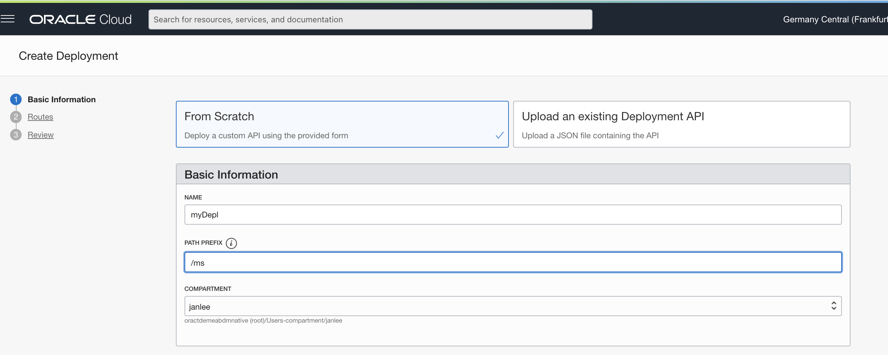

Now we will configure a Route consistent with the path of your microservice.

- **Path**: /med

- **Methods** : PUT and GET

- **Type**: HTTP

- **URL** : replace the IP address with the public IP address of your VM machine

  ```
  http://132.226.204.234:9002/med
  ```

- Leave the other parameters as par default

  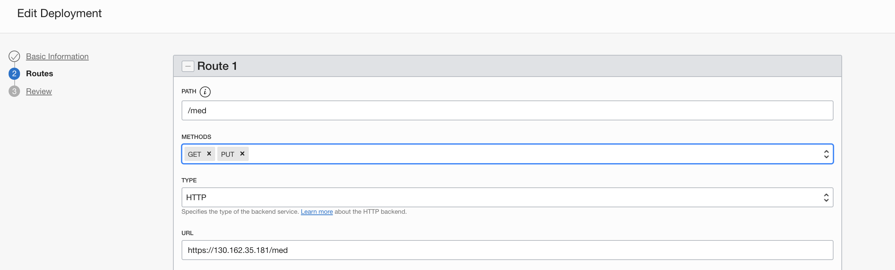

- When finished adding the route, create the deployment by clicking the button **Next**, then **Create**.

After a few moments your deployment should be **Active**

- On the Gateway Information screen, locate the **Hostname** of your gateway and copy it over to your notebook for future use.  Use the **Show** button to display the name, or the **Copy** button to cut and paste it over to a notebook.

  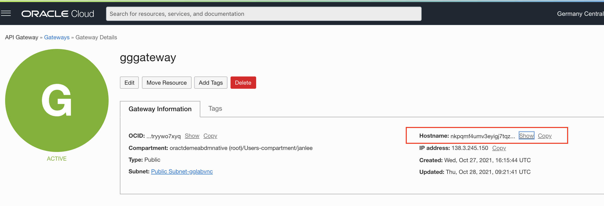

- Now test access to your microservice through the gateway: in a browser tab, access the following URL:

```
https://<your gateway hostname>/ms/med
```

For example: https://nkpqmf4umv3eyighkjhuenla.apigateway.eu-frankfurt-1.oci.customer-oci.com/ms/med

Again you should see an empty accolade as a return, with no errors displayed:

```
{}
```


You can now navigate to the next chapter of this lab !
