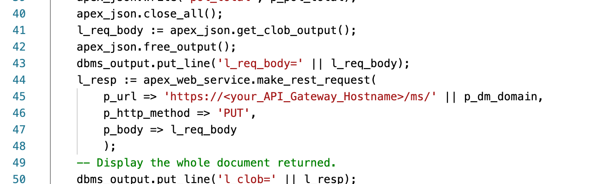
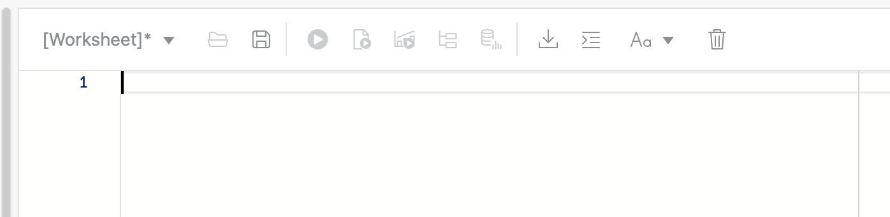
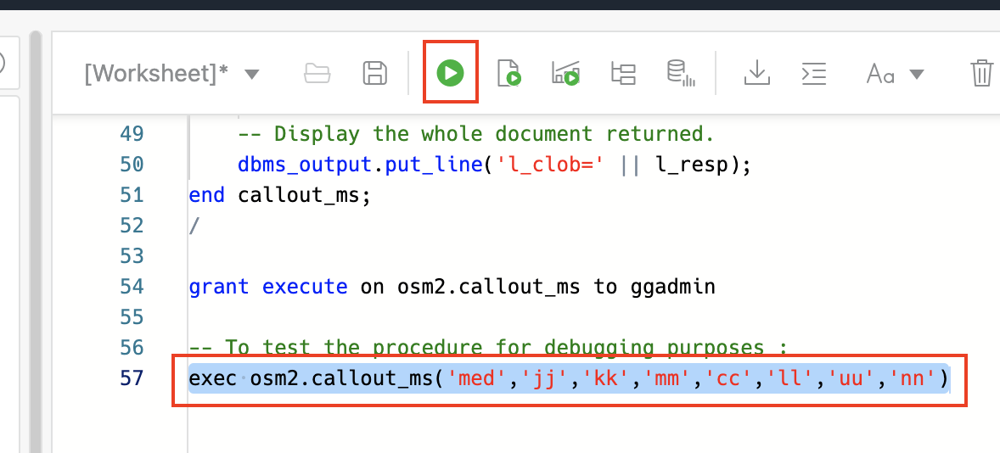
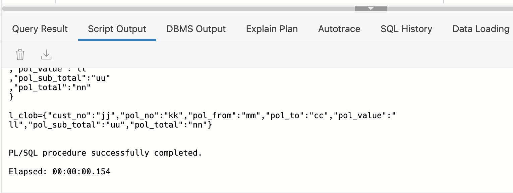

# Set up your database schemas

### Set up the database environments: Monolith, Data Pump and Microservice


## Objective

This chapter will go through the process of creating database objects representing the 3 environments we need for this lab.


## Step 1. Setting up the Monolith schema

First step is to set up the monolith application DB schema in the database **SourceATP**

- Navigate back to the location where you created the Autonomous Database, and select the **SourceATP** database

  

  

- Click on the database named **SourceATP **to go to the detail screen of the DB Instance, 
  and click on the **Tools** tab, then open the **Database Actions**

  

  

- Login using the username **Admin** and the password you specified during the creation process

  This will take you to the Launchpad, where you can select **SQL**

  

  

  


- Open the script file you downloaded via the zipfile called **dmlab.sql**, and copy the content 

- In the **Worksheet** field, paste the content

- Now hit the **Run Script** button to execute the whole script

  

You can now verify all the commands executed correctly - only the very first command (dropping the osm schema) can give an error, if this is the initial run of the script.


- Now refresh the browser window to update the list of schema's in the database, and in the **Navigator** expand the list of schema's and select **OSM**

  

- You can now see the list of tables created via the script :

  

## Step 2 - Creation of the schema for the Goldengate environment

Now we'll repeat this operation to set up the environment for the GoldenGate instance

- On your laptop, open the file **osm2_schema.sql** with a code editor of your choice, and locate the call to the microservice on line 45 :

  

  

- You need to instert the name of the API Gateway host you noted down previously, so the resulting line 45 should look like : 

  ```
  p_url => 'https://bqv5fqdoadccddeepk7knx6wsm.apigateway.eu-frankfurt-1.oci.customer-oci.com/ms/' || p_dm_domain, 
  ```

  

- First delete the script you executed just before in the **Worksheet** window: put your cursor in the window, then hit the **Select All** shortcut (on Mac: Command-A, on PC: Control-A) and hit the **Delete** button.  Make sure no text remains in the display

  

- Now cut and paste the content of the edited script **osm2_schema.sql**, and execute the whole script using the **Run Script** button.

- Validate all commands executed without error, except for the first "drop user" command where you can expect an error.

- You can verify the correct callout to the microservice you already set up by executing the command on the last line of the script :

  ```
  exec callout_ms('med','jj','kk','mm','cc','ll','uu','nn')
  ```

  

- Just uncomment the line, and select it :

  

- This time use the button **Run Statement** to only execute the highlighted part of the script.

  The result should be:

  


## Step 3: Enable the ggadmin user for the Source Database

The ggadmin user will be used to connect to the source and target database from the OCI GoldenGate environment, and perform the necessary capture or instertion actions.  Although the ggadmin user is created during the database creation process, it is disabled by default. The following steps guide you through how to enable the ggadmin user.

- Under **Administration**, click **Database Users**.

  

1. From the list of users, locate **GGADMIN**, and then click the ellipsis (three dots) icon and select **Edit**.

   

2. In the Edit User panel, deselect **Account is Locked**, enter a password for the ggadmin user, and then click **Apply Changes**.

   

   Note that the user icon changes from a blue padlock to a green checkmark.


## Step 4 - Prepare the target database schema

- Return to the Autonomous database overview screen, and select the **TargetATP** database

- Repeat the steps to open the SQL utility: open the details of the database by clicking on the database name **TargetATP**, select the tab **Tools**, then select the **Database Actions** button, and finally select the **SQL** tile.

- Open the file **osm3_schema.sql** on your laptop and copy the content over to the **Worksheet** pane.

- Execute the script via the button **Run Script** and verify the correct execution of the commands - again, the **Drop** of the schema will fail upon first execution.

  

## Step 5 - Enable the ggadmin user for the Target Database

Repeat the operations of Step 3 - enabling the ggadmin user - for the target database.

- Use the menu on the top left to select **Database Users** from the Administration section

- **Edit** the ggadmin user, enter a password and **unlock** the account

  


You can now navigate to the next chapter of this lab

