# Set up your database schemas

### Set up the database environments: Monolith, Data Pump and Microservice


## Objective

This chapter will go through the process of creating database objects representing the 2 environments we need for this lab.

- We will set up a schema in the **SourceATP** database for the Monolith application, called OSM
- We'll enable the GoldenGate user of the **SourceATP** so we can use it to set up the dataflows later in the lab
- We'll prepare the target DB schema called OSM3 in the **TargetADW** DB
- And finally we'll also enable the GoldenGate user of the **TargetADW** database.

Estimated Lab Time: 15 minutes


## Step 1 - Setting up the Monolith schema

First step is to set up the monolith application DB schema in the database **SourceATP**

- Navigate back to the location where you created the Autonomous Database, and select the **SourceATP** database

  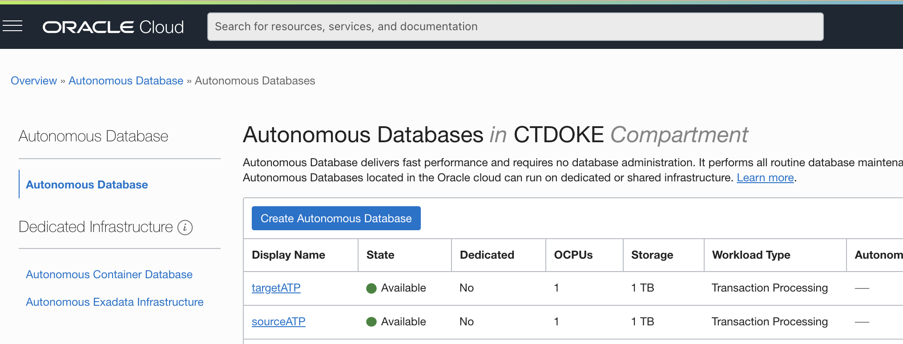

  

- Click on the database named **SourceATP** to go to the detail screen of the DB Instance, 
  and click on the **Tools** tab, then open the **Database Actions**

  

  

- Login using the username **Admin** and the password you specified during the creation process

  This will take you to the Launchpad, where you can select **SQL**

  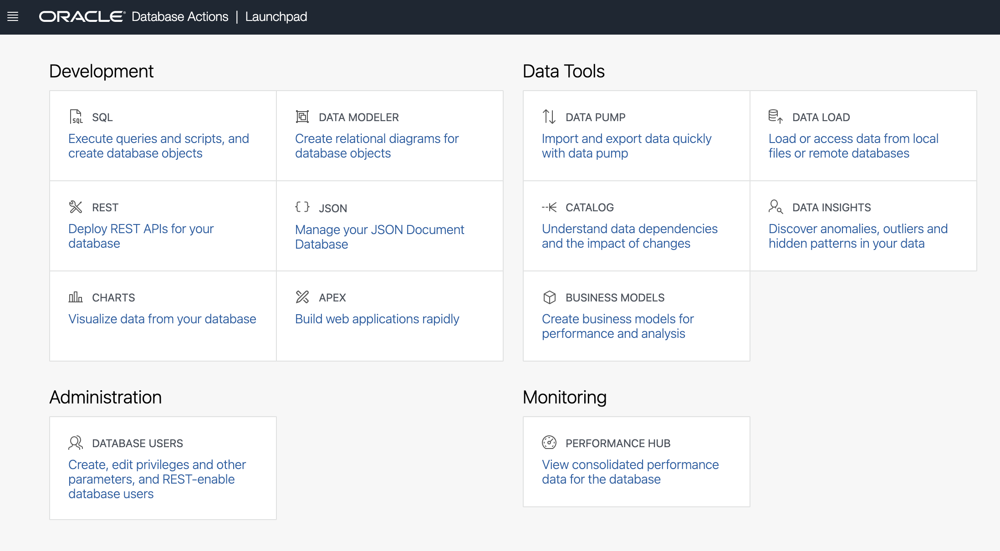

  

  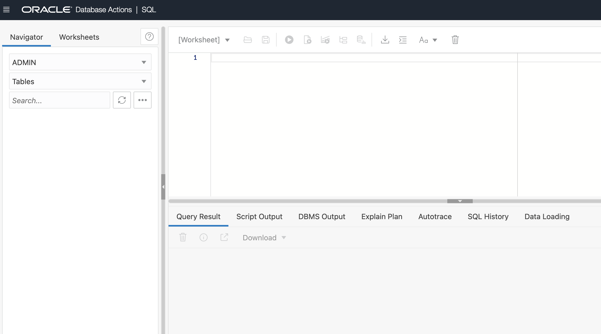


- Open the script file you downloaded via [the zipfile](../01-intro/code/labfiles.zip) called **dmlab.sql**, and copy the content 

- In the **Worksheet** field, paste the content

- Now hit the **Run Script** button to execute the whole script

  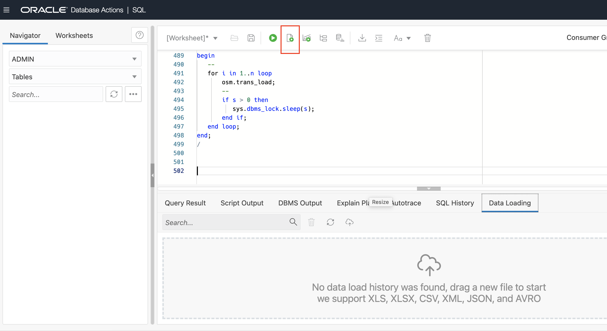

You can now verify all the commands executed correctly - only the very first command (dropping the osm schema) can give an error, if this is the initial run of the script.

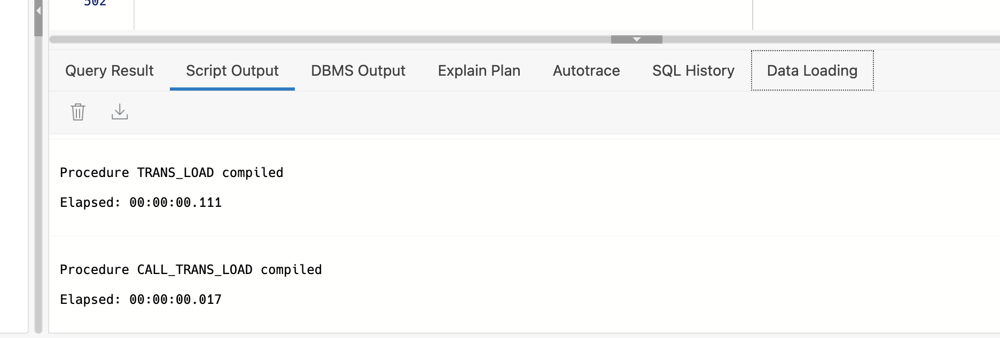

- Now refresh the browser window to update the list of schema's in the database, and in the **Navigator** expand the list of schema's and select **OSM**

  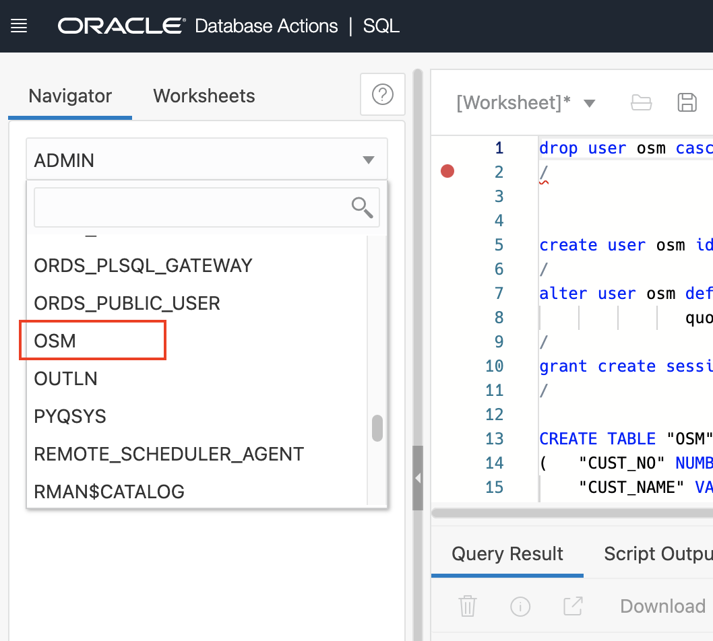

- You can now see the list of tables created via the script :

  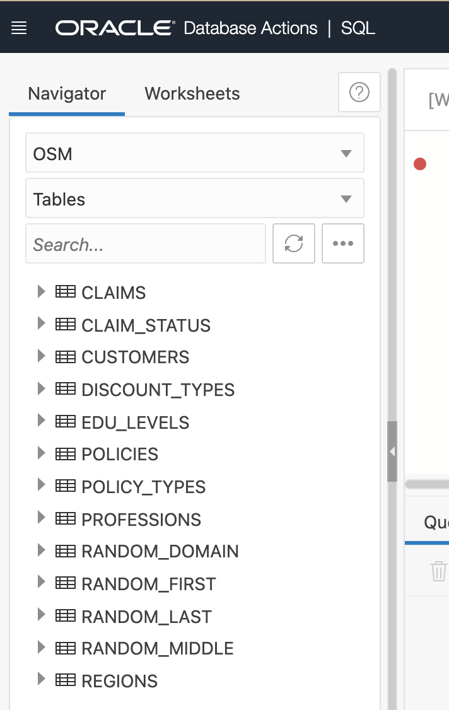


## Step 3 - Enable the ggadmin user for the Source Database

The ggadmin user will be used to connect to the source and target database from the OCI GoldenGate environment, and perform the necessary capture or instertion actions.  Although the ggadmin user is created during the database creation process, it is disabled by default. The following steps guide you through how to enable the ggadmin user.

- Under **Administration**, click **Database Users**.

  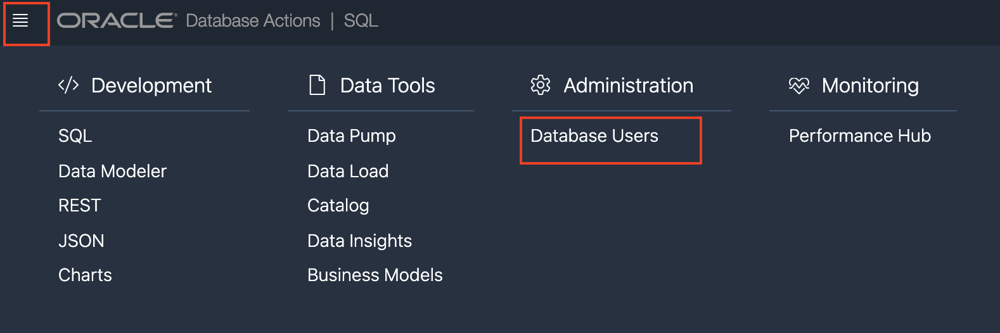

1. From the list of users, locate **GGADMIN**, and then click the ellipsis (three dots) icon and select **Edit**.

   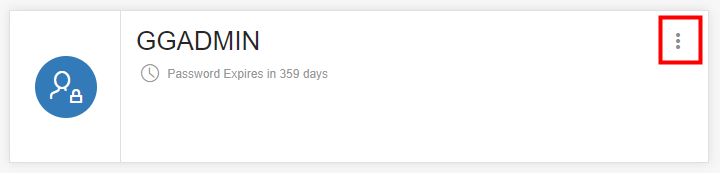

2. In the Edit User panel, deselect **Account is Locked**, enter a password for the ggadmin user, and then click **Apply Changes**.

   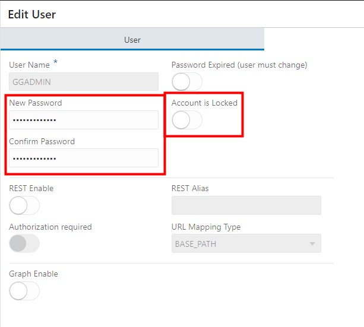

   Note that the user icon changes from a blue padlock to a green checkmark.


## Step 4 - Prepare the target database schema

- Return to the Autonomous database overview screen, and select the **TargetADW** database
- Repeat the steps to open the SQL utility: open the details of the database by clicking on the database name **TargetADW**, select the tab **Tools**, then select the **Database Actions** button, and finally select the **SQL** tile.
- Open the file **osm3_schema.sql** on your laptop and copy the content over to the **Worksheet** pane.
- Execute the script via the button **Run Script** and verify the correct execution of the commands - again, the **Drop** of the schema will fail upon first execution.

We will be using this database to offer access to our data to other domains.  A very convenient way to do this is to use ORDS (Oracle Rest Data Services) to enable REST access to JSON formatted data that is present in the database.  The following steps will unlock some data from the **customers** table to other domains of your application landscape.

-  In the menu on the top left, select the **REST** under the development menu:

  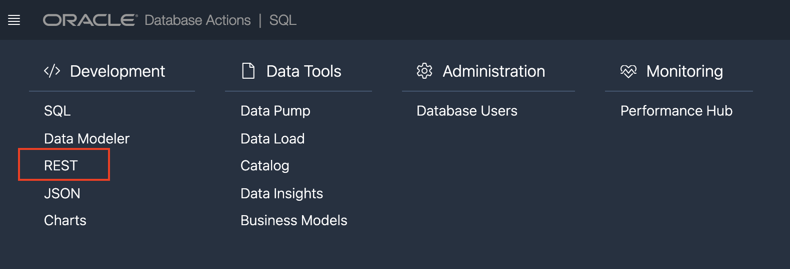

-  On the overview screen, select **Modules** from the top menu:

  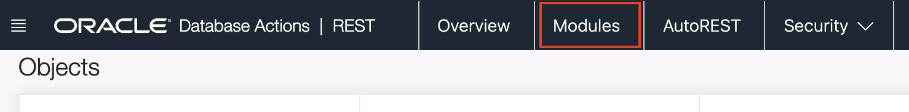

-  Use the **Create Module** button on the top right to create a first module :

-  Enter the name of the module : **com.oracle.mydomain.mymodule**

-  Enter the **Base Path**: **`/datadomain/`**

-  Select **Not Protected** for the parameter **Protected By Privilege**.  

-  Click **Create**

  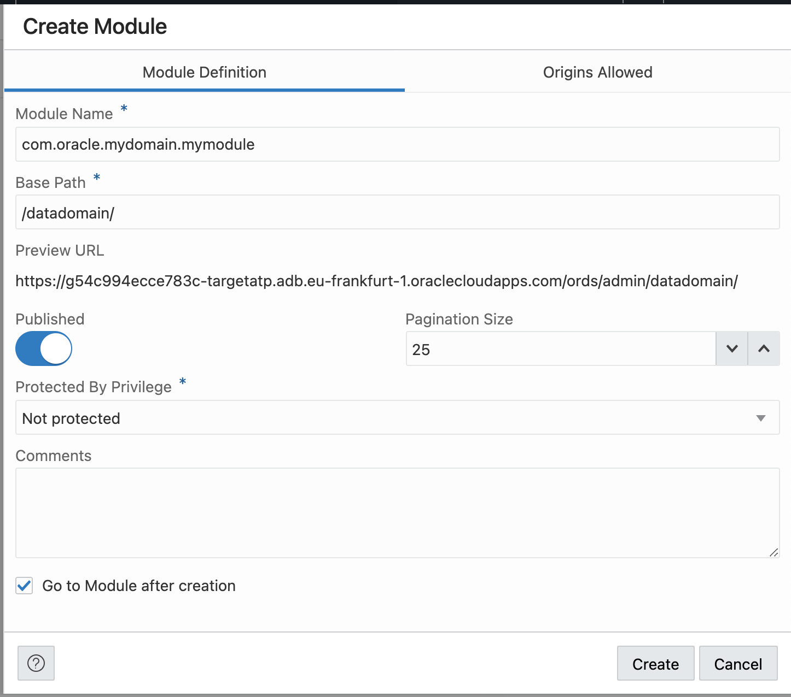

-  The Module screen will open up, select the **Create Template** button on the right

-  In the Create Template screen, enter the URI Template : **demographics**

-  Leave all other parameters at their default and click the **Create** button

  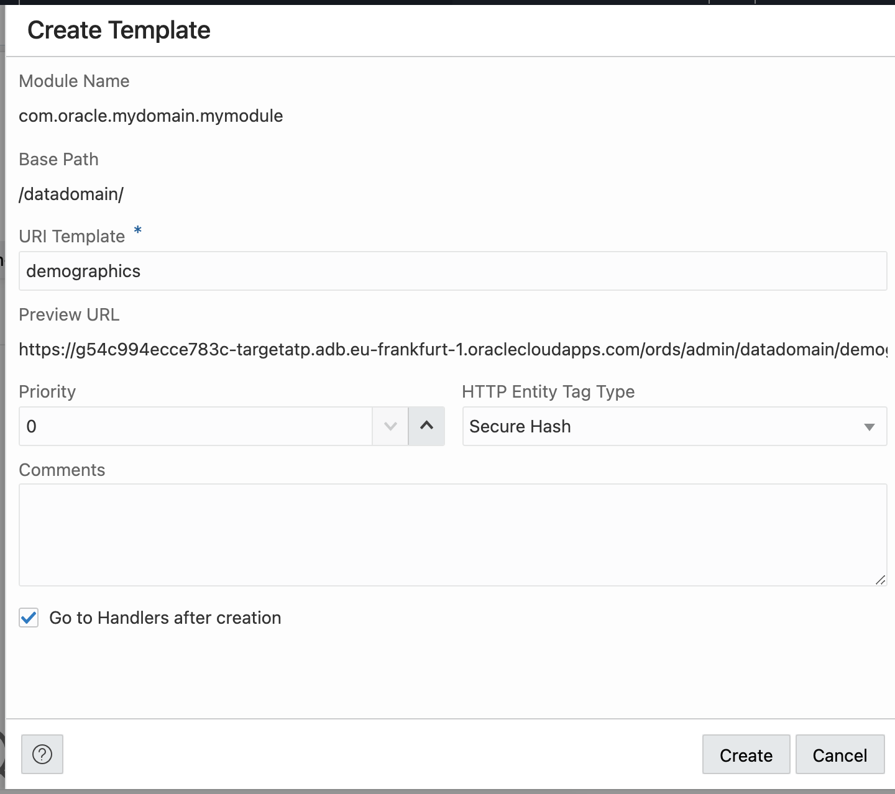

-  Now click the **Create Handlers** button, and enter the following SQL statement :

  ```
  <copy>SELECT
  cust_age as age,
  DECODE(REG_ID,
    'NORTH','North',
    'SOUTH','South',
    'EAST', 'East',
    'WEST', 'West',
    'CENT', 'Central'
  ) region,
  DECODE (edul_id,
    'UG', 'Graduate',
    'HS', 'High School',
    'DIP', 'College',
    'MD', 'Masters',
    'PHD', 'PhD',
    'None') qualification,
   DECODE(PROF_ID,
    'ENG', 'Technical',
    'IT', 'Technical',
    'PLOT', 'Technical',
    'MD', 'Medical',
    'NRS', 'Medical',
    'UW', 'Financial',
    'Other') career
  FROM OSM3.customers</copy>
  ```

-  Change the parameter **Items Per Page** to **0** : this will select all records from the table in one go.  In a real deployment your application should handle the pagination of the results, we simplified here for clarity of the application.

-  Clidk **Create**

   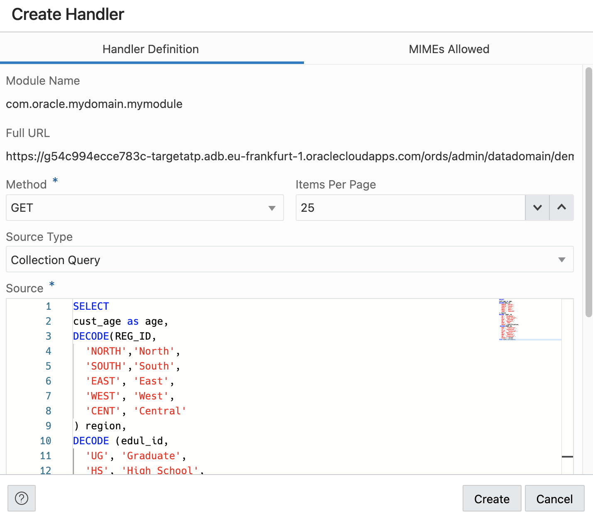

-  Your REST API is now available! Try it out by visiting the URL through a broowser via the link icon on the right of the Handler overview

  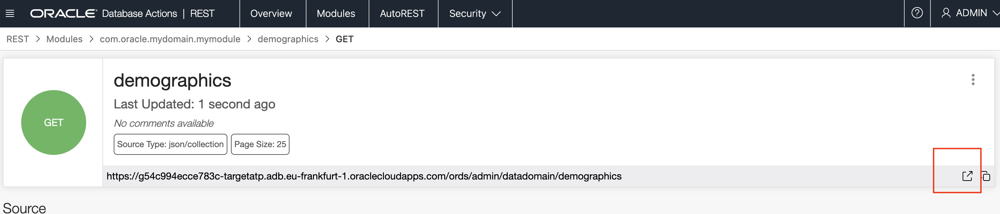

You should see the JSON payload of your query, which will return no entries at this point in the lab :

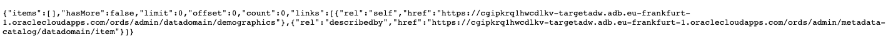

**Attention!** Later we will use this URL to enable other domains to access this data, 
so make sure to **note down this URL**


## Step 5 - Enable the ggadmin user for the Target Database

Repeat the operations of Step 3 - enabling the ggadmin user - for the target database.

- Use the menu on the top left to select **Database Users** from the Administration section

- **Edit** the ggadmin user, enter a password and **unlock** the account

  


You can now navigate to the next chapter of this lab

