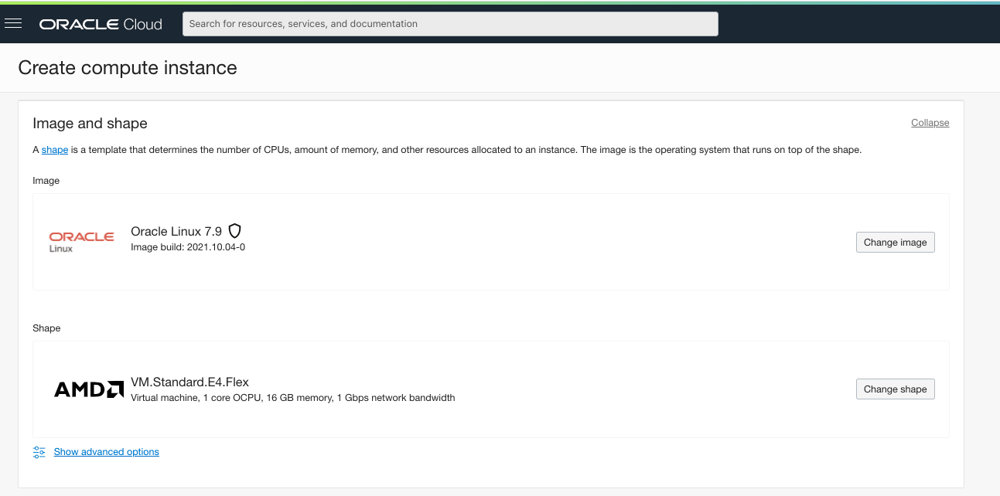
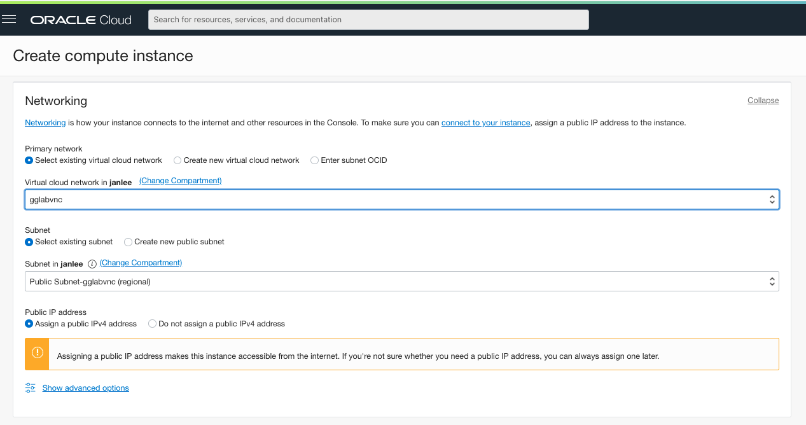
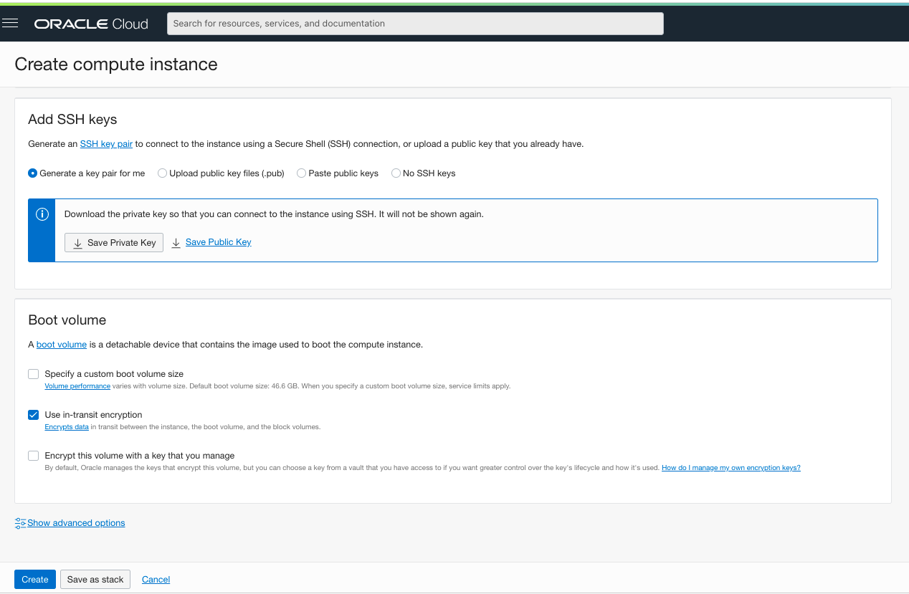
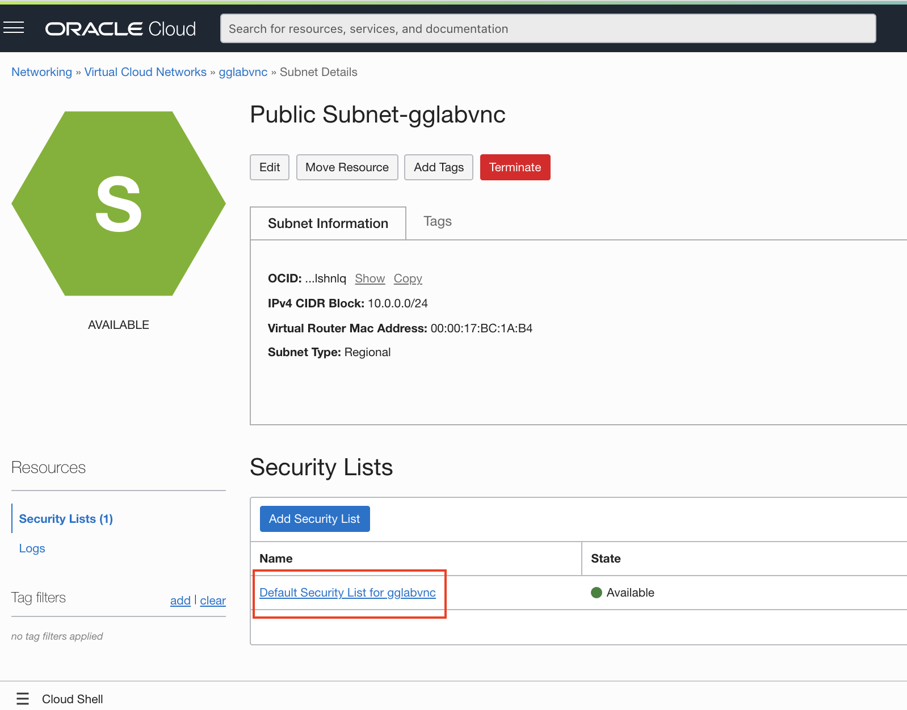

# Creating a VM for running microservices


## Objective

This chapter will go through the process of creating a Virtual Compute environment to run your microservices

- First copy the node source code of the microservice to your local machine by 
  **right-clicking** [on this link](code/msapi.js), and selecting **Save Link As**, this will download the file msapi.js

- Navigate to the Compute Instance page to launch a new virtual machine where we will run the microservice application

  

- Use the **Create instance** button to launch the wizard

- Enter a name for the VM, for example *myVM*

- Keep the default AD selection (in this case there are 3 AD's available, with AD 1 selected)

  

- Keep the default **Image** and **Shape** proposed as below:

  

- Select the Virtual network you created earlier, and make sure to be on the **public** subnet

- Also ensure the **Assign a public Iv4 address** option is selected

  

- Be sure to generate a public/private key pair, and **download both the public and private key** to your laptop.  You will need them to connect to your machine in a minute.

- Leave the **Boot volume** parameters as per the defaults

  

The VM is now being generated, wait for the status to pass from **Provisioning** to **Running**


and a minute later : 


- Note the **Public IP Address** of your instance, you will need it to connect to your instance.

- Open the **Cloud Shell** of your console

  

- Now drag and drop the **private** key file you downloaded earier on the console.  This will upload the key to your cloud shell :

  

- While we are copying files, let's also copy the microservice source code you downladed earlier over to the cloudshelll environment: drag & drop the file **msapi.js** also onto the console.

- Set restrictive permissions on the key file as required by ssh 
  (replace the name with the name of **your** file)

  ```
  chmod 400 ssh-key-2021-10-21.key
  ```

- First copy the Microservice code from the console into the VM we just created, using the private key (replace the IP address with the public IP address of **your** instance, and the keyfile name with **your** keyfile name ! )

  ```
  scp -i ssh-key-2021-10-21.key msapi.js opc@152.70.161.144:msapi.js
  ```

- Now ssh into your VM with the below command
  (replace the IP address with the public IP address of **your** instance, and the keyfile name with **your** keyfile name ! )

  ```
  ssh -i ssh-key-2021-10-21.key opc@152.70.161.144
  ```

- As this is a fresh Linux instance, we need to install a few components to get our microservice running : node and Express

- Run the below command to configure the yum repositories by installing the `oracle-nodejs-release-el7` or `oracle-nodejs-release-el6`

  ```
  sudo yum install -y oracle-nodejs-release-el7 oracle-release-el7
  ```

- This will update a number of packages, wait for the message below to appear: 

  

- Next perform the actual node installation : 

  ```
  sudo yum install nodejs
  ```

- you might be prompted to confirm installation of some elements :

  

- Wait for the message below to appear:

  

- Now install Express with the following command :

  ```
  npm install express --save
  ```

  You will get some warnings, this is OK.

- You should now be able to launch your microservice with the following command:

  ```
  node msapi.js
  ```

  Resulting output: 

  


- Open a second console on your Virtual machine

  - Simply open a second browser window, and copy the URL of your first window into the 2nd browser window.  This will open a second cloud shell

  - Next re-issue the below ssh command to log into your virtual machine

    ```
    ssh -i ssh-key-2021-10-21.key opc@152.70.161.144
    ```

We now need to make sure we can access the port 9002 on which this service is listening is accesible from the internet : we need to add the port in the firewall rules of the Linux OS, and add a rule in the security list of the public virtual network.

- On the command line of the Virtual machine, add the port to the Linux firewall:

  ```
  sudo firewall-cmd --zone=public --add-port=9002/tcp --permanent
  
  sudo firewall-cmd --reload
  ```

- In the cloud console, navigate to the virtual machine you created (via the menu **Compute** then **Instances**) and in the Overview screen click on the subnet of the instance:

  

- This will display the details of the subnet, where you need to click on the Default Security Rule for the subnet:  

  

- You now see the Ingress rules that are open by default - we need to add a rule to allow port 9002 to be accessed: click on **Add Ingress Rules**

  


Configure a rule to allow access from everywhere on port 9002:

- Enter the source CIDR as 0.0.0.0/0

- Leave Source Port Range blank (all sources)

- Enter 9002 in destination port

- Click on the **Add Ingress Rules** button

  


You can now navigate to the next chapter of this lab !
