# Configure GoldenGate flows

## Introduction

This lab walks you through the steps to create an Extract and a Replicat in the Oracle GoldenGate Deployment Console.

Estimated Lab Time: 10 minutes

### About Extracts and Replicats
An Extract is a process that extracts, or captures, data from a source database. A Replicat is a process that delivers data to a target database.

### Objectives

In this lab, you will:
* Log in to the Oracle GoldenGate deployment console
* Add transaction data and a checkpoint table
* Add and run an Extract
* Add and run a Replicat


## Step 1 - Register the databases in GoldenGate

We will first register our 2 databases so we can use them in our Goldenate environments

- Log in to Oracle Cloud Infrastructure, open the navigation menu, and then select **GoldenGate** from the **Oracle Database** services.

- Select the **Registered Databases** tab

  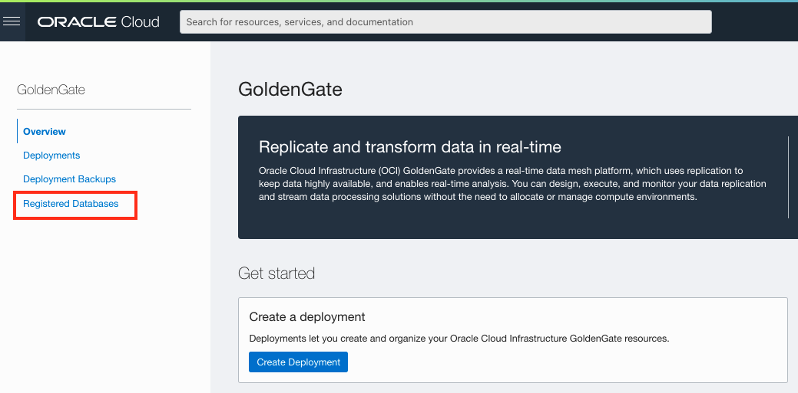

- Click **Register Database**.

  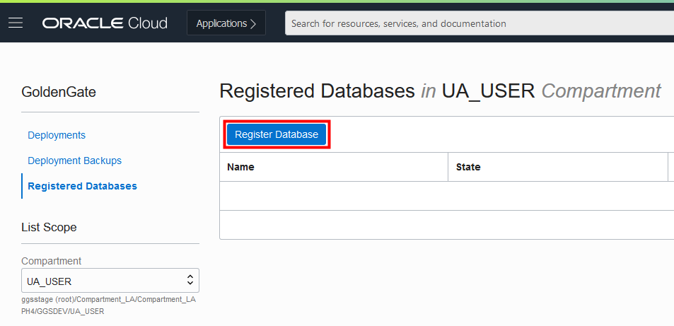

- In the Register Database panel, for Name and Alias, enter **SourceATP**.

- From the Compartment dropdown, select a compartment.

- Click **Select Database**.

- From the Database Type dropdown, select **Autonomous Database**.

- If necessary, select the compartment where your DB's were created

- Enter the database's password in the Password field, and then click **Register**.

  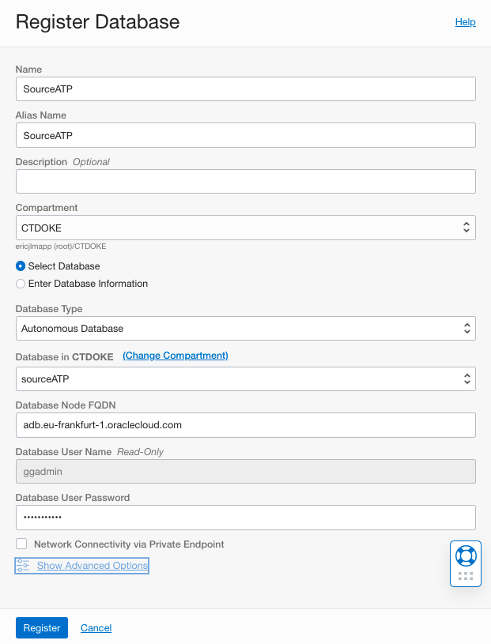

  The database becomes Active after a few minutes.

  

- Now repeat this process to register the **TargetADW** database.


## Step 2 - Log in to the Oracle GoldenGate deployment console

1.  Select Deployments menu on the left where you can see the GoldenGate deployment you created earlier.  It should be in the **Active** state.

2. Click on your deployment to see the Deployment Details.

3. On the Deployment Details page, click **Launch Console**.

    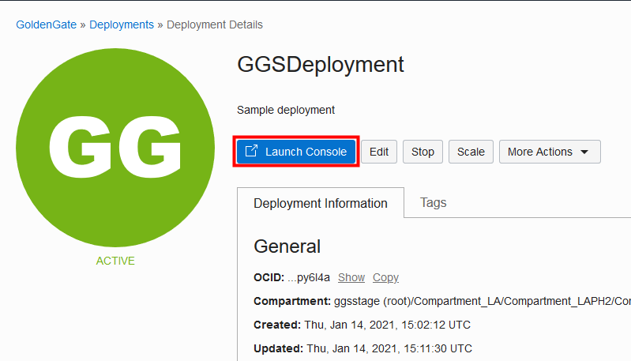

4. On the OCI GoldenGate Deployment Console sign in page, enter **oggadmin** for User Name and the password you provided when you created the deployment, and then click **Sign In**.

    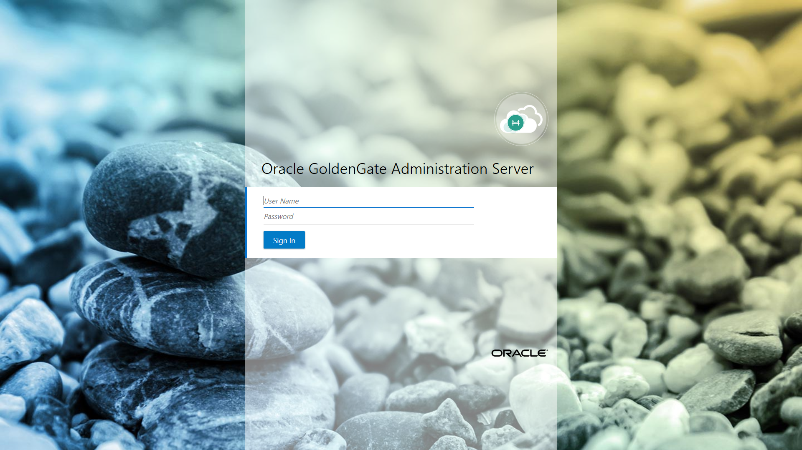

    You're brought to the OCI GoldenGate Deployment Console Home page after successfully signing in.

## Step 3 - Add Transaction Data and a Checkpoint Table

1.  Open the navigation menu and then click **Configuration**.

    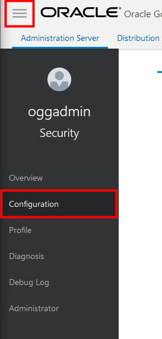

2.  Click **Connect to database SourceATP**.

    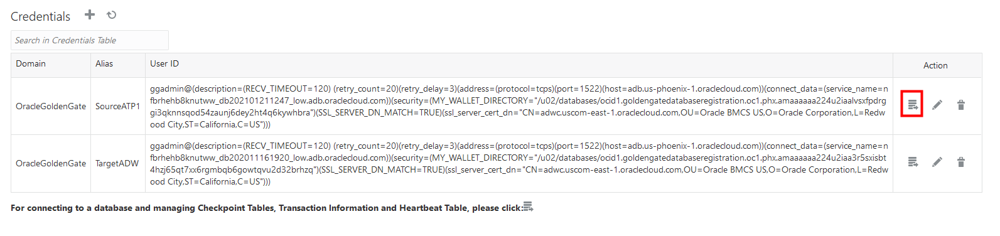

3.  Next to **TRANDATA Information** click **Add TRANDATA**.

    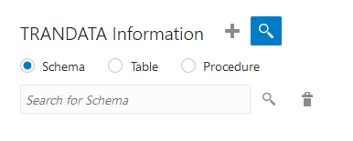

4.  For **Schema Name**, enter **OSM**, and then click **Submit**.

5.  To verify, you can enter **OSM** into the Search field and click **Search**.

    

6.  Click **Connect to database TargetADW**.

    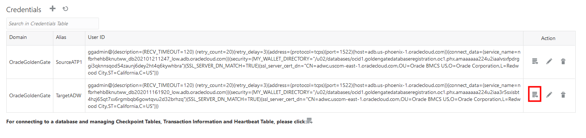

7.  Next to Checkpoint, click **Add Checkpoint**.

    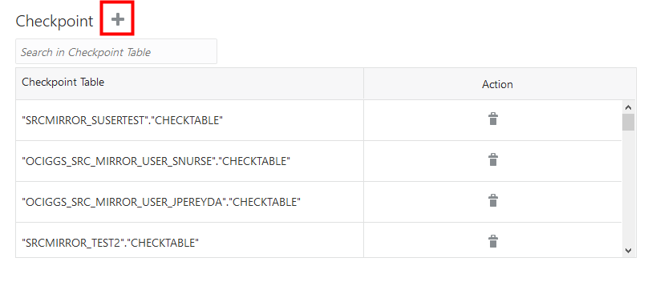

8.  For **Checkpoint Table**, enter **"OSM3"."CHECKTABLE"**, and then click **Submit**.

    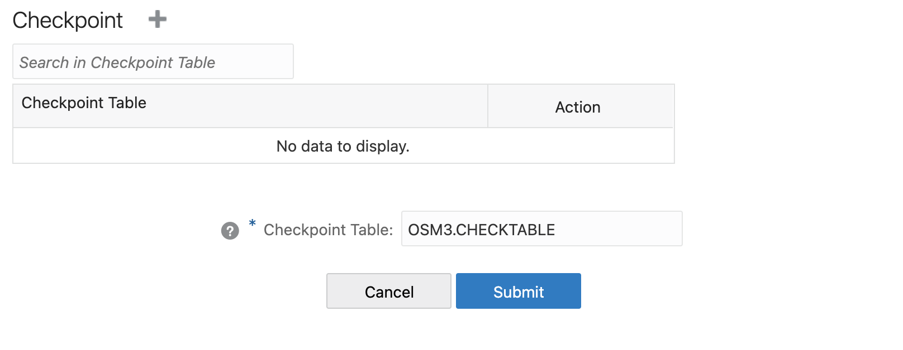
    
    

- Now return to the GoldenGate Deployment Console Home page:  click **Overview** in the left navigation.


## Step 4 - Add and Run an Extract

1.  On the GoldenGate Deployment Console Home page, click the plus (+) icon for Extracts.

    

2.  On the Add Extract page, select **Integrated Extract**, and then click **Next**.

3.  For **Process Name**, enter UAEXT.

4.  For **Trail Name**, enter E1.

    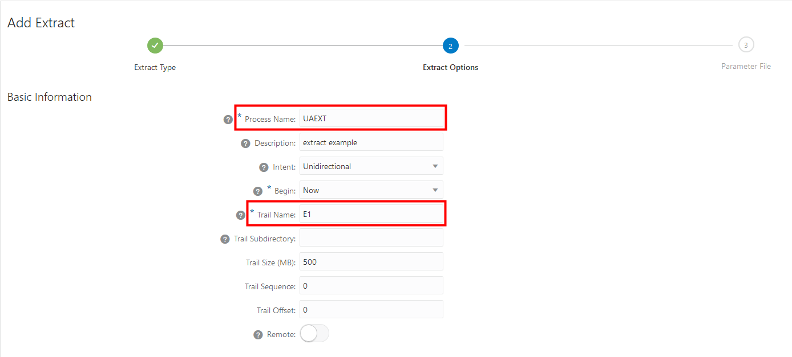

5.  Under **Source Database Credential**, for **Credential Domain**, select **OracleGoldenGate**.

6.  For **Credential Alias**, select the **SourceATP**.

    

7.  Under Managed Options, enable **Critical to deployment health**.

8.  Click **Next**.

9. On the Parameter File page, in the text area, add a new line and the following text:

    ```
    TABLE OSM.*, 
    ```
    
10. Click **Create**. You're returned to the OCI GoldenGate Deployment Console Home page.

11. In the UAEXT **Actions** menu, select **Start**. In the Confirm Action dialog, click **OK**.

    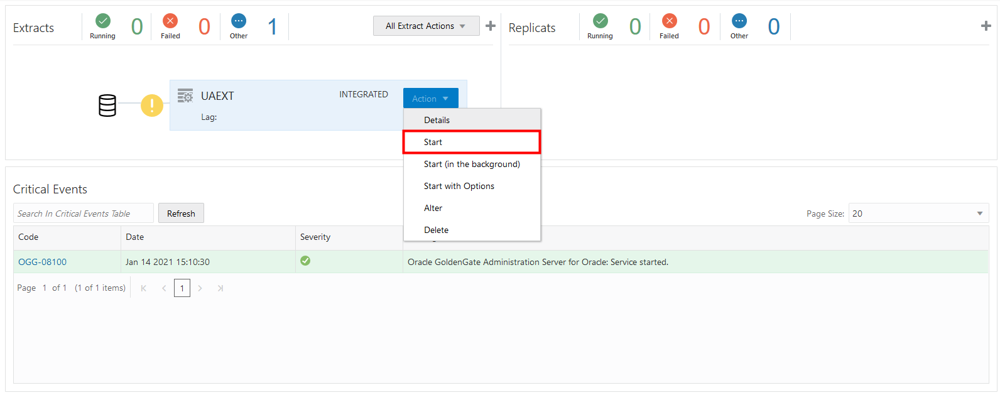

    The yellow exclamation point icon changes to a green checkmark.

    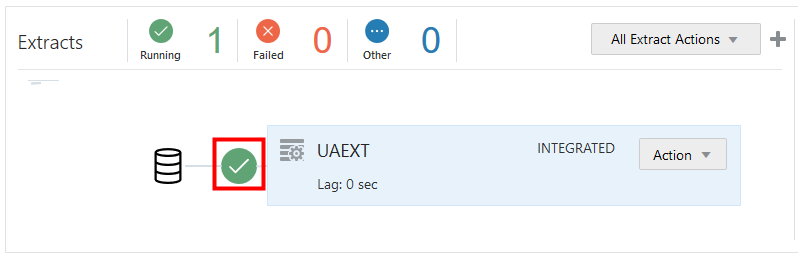

## Step 5 - Add and Run the Replicat

1.  On the GoldenGate Deployment Console Home page, click the plus (+) icon for Replicats.

    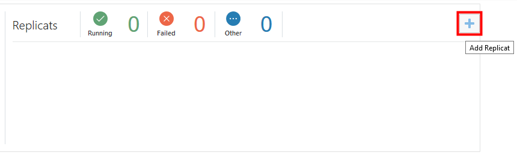

2.  On the Add Replicat page, select **Nonintegrated Replicat**, and then click **Next**.

3.  On the Replicate Options page, for **Process Name**, enter **Rep**.

4.  For **Credential Domain**, select **OracleGoldenGate**.

5.  For **Credential Alias**, select **TargetADW**.

6.  For **Trail Name**, enter E1.

7.  For **Checkpoint Table**, select **"OSM3","CHECKTABLE"**.

    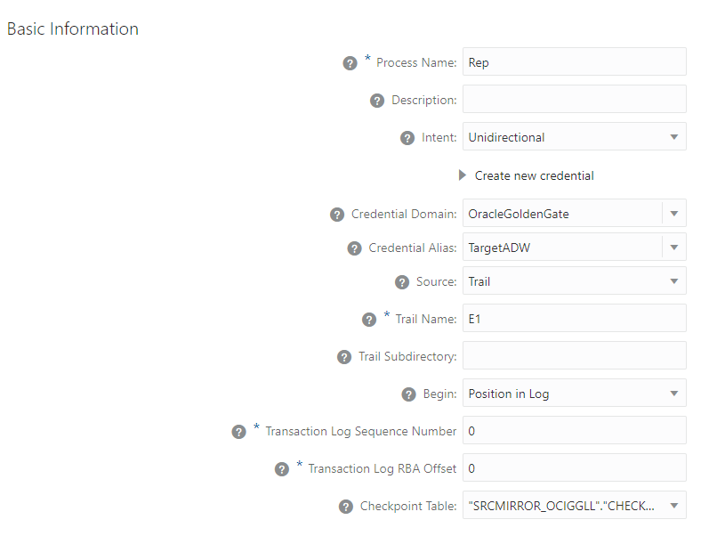

6.  Under **Managed Options**, enable **Critical to deployment health**.

7.  Click **Next**.

7.  Click **Create**.

11. In the Rep Replicat **Action** menu, select **Start**.

    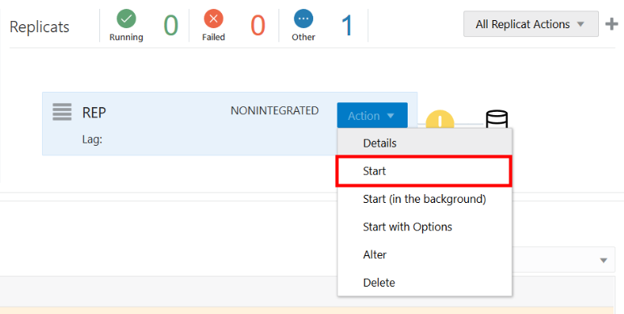

    The yellow exclamation point icon changes to a green checkmark.


## Step 6 - Validate the integrations are working correctly

We will now execute a PLSQL procedure on the source database to simulate activity of the traditional monolith application, resulting in various data being entered continuously in the various tables of the OSM schema.

In this lab we will focus on the table **Customers**, and we'll observe both on the level of the databases as well as on the level of the two microservices how the data is flowing.

Our **Microservice** will use the ORDS mechanism of the database to consume a Data Service made available as an API delivering the data in JSON format

- Open a **second Cloud Console** window, and open a **Cloud Shell**
  
- In this console, launch the **microservice**
  where you pass the link to the ORDS service we set up previously

  ```
  ruby consumer.rb <your-ORDS-Link-address>
  ```

  You will see the content of a query to the ORDS service, once data starts flowing in the number of records will increase


- Make sure you have two browser tabs open with the SQL tool : one  for the **SourceATP** database and one for the  **TargetADW** database.

- In the SQL tool of the **TargetADW**  Database, enter and execute the following command :

  ```
  select count(*) from osm3.customers
  ```

  This should result in a resulting query result of **Count(\*)** = 0. This means no records are present in this table.

- Now switch to the **SourceATP** window, and **prepare - do not yet run !**  following two commands in the Worksheet pane:

  ```
  exec osm.call_trans_load;
  
  select count(*) from osm.customers;
  ```

- Now **select the first line** and execute this command by using the **Run Statement** button.

- Now **select the second line** and execute this command with the **Run Statement** button.

  You should see a count(\*) result of for example 70.  Repeat the execution of this last command and you will see the count(\*) number increase, indicating records are being insterted in the table.  So our Classic  application is working ...

- On the Cloud Console of the microservice, you will see anonymized data flowing into the Consumer view exposed through ORDS

- Switch to the **TargetADW** SQL window and execute the count command repeatedly : you will see the count increase as the records are being pumped from one DB to the other.

- Now switch to the GoldenGate Admin console and open the **UAEXT** extract.  Click on the **Statistics** tab and you will see the nb of records captured : 

  

**Congratulations**, you have reached the end of this hands-on tutorial.


