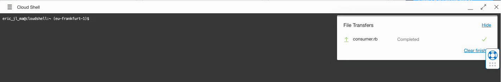
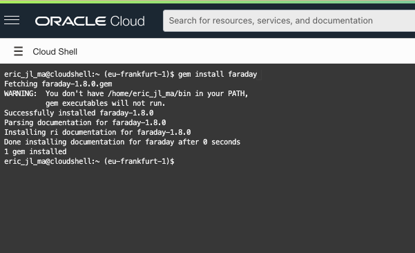
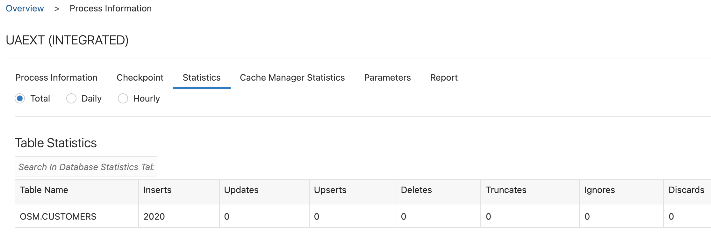

# Running the Data flows

## Introduction

This lab walks you through the steps to run and validate the flow of data in the various environments

Estimated Lab Time: 10 minutes

### Objectives

In this lab, you will:
* Set up your Cloud Shell for running a microservice
* Start a load simulator on the side of the Monolith application
* Check the flow of data in the databases, the GoldenGate console and the Microservice application

Estimated Lab Time: 10 minutes


## Step 1 - Set up your Cloud Shell for running a microservice

- Open the **Cloud Shell** of your console

  

  

- Now drag and drop the **consumer.rb** microservices source code files that are in the zip file you downladed earlier over to the cloudshelll environment.   This will upload the key to your cloud shell :

  

- Because this application is written in Ruby, and is using a library called **faraday**, we need to install tjhis in our environment before we can run the application, by running the below command : 

  ```
  gem install faraday
  ```

  

- Now launch the application with the following command:

  where you need to **replace** the ORDS URL with the one you set up in your environment :

  ```
  ruby consumer.rb https://g54c994eece783c-targetatp.adb.eu-frankfurt-1.oraclecloudapps.com/ords/admin/datadomain/demographics
  ```

  


## Step 2 - Run the Monolith Load simulator

We will now execute a PLSQL procedure on the source database to simulate activity of the traditional monolith application, resulting in various data being entered continuously in the various tables of the OSM schema.

In this lab we will focus on the table **Customers**, and we'll observe both on the level of the databases as well as on the level of the microservice how the data is flowing.


- Make sure you have two browser tabs open with the SQL tool : one  for the **SourceATP** database and one for the  **TargetADW** database.

- In the SQL tool of the **TargetADW**  Database, enter and execute the following command :

  ```
  select count(*) from osm3.customers
  ```

  This should result in a resulting query result of **Count(\*)** = 0. This means no records are present in this table.

- Now switch to the **SourceATP** window, and **prepare - do not yet run !**  following two commands in the Worksheet pane:

  ```
  exec osm.call_trans_load;
  
  select count(*) from osm.customers;
  ```

- Now **select the first line** and execute this command by using the **Run Statement** button.

- Now **select the second line** and execute this command with the **Run Statement** button.

  You should see a count(\*) result of for example 70.  Repeat the execution of this last command and you will see the count(\*) number increase, indicating records are being insterted in the table.  So our Classic  application is working ...

- On the Cloud Console of the microservice, you will see anonymized data flowing into the Consumer view exposed through ORDS

- Switch to the **TargetADW** SQL window and execute the count command repeatedly : you will see the count increase as the records are being pumped from one DB to the other.

- Now switch to the GoldenGate Admin console and open the **UAEXT** extract.  Click on the **Statistics** tab and you will see the nb of records captured : 

  

**Congratulations**, you have reached the end of this hands-on tutorial.


