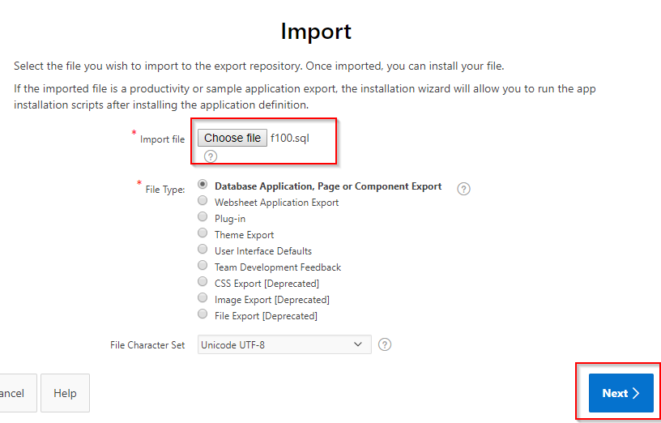

# Lab: Create an in-database ML model and operationalize it with an APEX application
In this lab we will add machine learning to an existing APEX application. The actual machine learning logic takes place in the database and the APEX application will pick up the predictions. As an example, we will apply machine learning on a sales scenario, in this case we will predict which customers are most likely to buy a certain product. 

The product is called "Y Box Games". Our fictional company has been moderately successful in selling this product so far. Although some of our customers already own this product, we believe we could do much better. The problem is that it's very difficult to understand what type of customer is interested in it. That's why we're calling in the help of machine learning!

We will use [Apache Zeppelin](http://www.oracle.com/technetwork/database/options/oml/overview/index.html), which comes pre-installed with the autonomous database. This will be our frontend for the Machine Learning algorithms in the database. For more background on machine learning in the database see [Oracle Advanced Analytics documentation](https://docs.oracle.com/en/database/oracle/oracle-database/12.2/dmapi/mining-fuctions.html#GUID-3BC8FD92-9B6A-4612-A458-7E5FFDDC5EA7).

## Objectives
- Become familiar with in-database machine learning, in particular OML4SQL.
- Understand how APEX can be used to operationalize ML models.
- Get familiar with the business value of identifying customers that are likely to buy a certain product.

# Prerequisites

You require the following:

- An Oracle Cloud tenancy. Please follow these [prerequisites](../prereq1/lab.md) first in case you don't have this yet.
- An Autonomous Transaction Processing instance. Please follow these [prerequisites](../prereq4/lab.md) first in case you don't have this yet.

# Steps

## Prepare the APEX workspace

  - Go to the details of the autonomous database and open the Service Console.

  
  
  - There's a section called "Oracle Application Express". Click on "Open APEX".
 
  - You will see the login page fof APEX Administration Services. Use the ADMIN password that you entered when you provisioned ATP.

  

  - Follow the instructions to create a new workspace.
  
  

  - The workspace (and database user) -must be- named "WORKSHOPATP".
    (there is some hardcoding in the installation scripts to use this schema name).
    Keep a note of the password as you will need it later.

  

## Import the APEX application

  - First download the application that we will install. You can find it [here](./install/f100.sql). 
  
  To download it first click the link, then click the Download button of GIT and then Right Click "Save As" as f100.sql in your browser.
  
  

  - If you're in APEX, then first Log out.

  - Now login to the workspace that we created earlier.
  
  Workspace name: WORKSHOPATP, User name: WORKSHOPATP, use the password that you entered when you created the workspace.
  
  

  - Import the example APEX application.
    Go to "App Builder", then "Import".
  
  
  
  - Select the file that you downloaded earlier, then "Import", "Next" and "Install Application".
  
  

  - On the dialog for supporting objects, choose "Next", then "Install". You should now see the following:

  
  
## Review the APEX application (situation before ML)

- Open the existing application by clicking on "Run Application".

  

- Login using the password that you used when creating the workspace.

  

- You see the Customer Service Application, with a list of customers.

  

- Our goal is to upsell something to these customers. We want to alert our employee whenever he/she has a customer on the screen that is a good candidate for a particular product that we're trying to sell.
  In practice this means that we want to add a column on this screen that shows whether it's a good idea to try to upsell to this customer.
  This will be the topic for the rest of the exercise.
  
  

## Create an Oracle Machine Learning user

We will develop the machine learning model using Zeppelin, which comes included in the autonomous database. Zeppelin is a web-based notebook environment that allows us to analyse and experiment with data. In our case we will be using it to build a machine learning model.
First we will set up a user for Zeppelin.

- Go to the Service Console of ATP.

  
  
- Next, select "Administration" and "Manage ML Users".
  
  
  
- Create a user called "MLUSER1".

  

- Go back to the Service Console, then Development, then ML SQL Notebooks.

  

- Sign in with the new user MLUSER1.

  

- Navigate around to get familiar with the ML pages. Click on "Examples".

  

- Note the various ML notebook examples. Feel free to review some of these. We will be creating a new ML notebook in this lab.

  

- Click on the upper left icon to bring back the menu.  Then select "Notebooks" and "Create". Name the new notebook "Predict Y Box Games".

  

# Build the machine learning model with Zeppelin

  In this case we will build a model by letting it learn from existing customers. 

- Review the following table with customer information that we'll use as input data for the model:
  
  ```
  SELECT * FROM SH.SUPPLEMENTARY_DEMOGRAPHICS
  ```
  
  Result:
  
  
  
  See the column "Y_BOX_GAMES", which tells us whether the customer already owns Y Box Games.
  And we see many other attributes of which we believe they may have some influence on whether a customer owns Y Box Games.
  For example, the level of education might be an influencing factor for Y Box Games ownership, and so may  Occupation, Household Size, et cetera.

  The *magic* of machine learning is that it will find out exactly what the relationships are between these variables and our target variable, Y Box Games.
  
- Split the input data into two sets: 60% for training and 40% for testing.

  ```
  CREATE TABLE N1_TRAIN_DATA AS SELECT * FROM SH.SUPPLEMENTARY_DEMOGRAPHICS SAMPLE (60) SEED (1);
  ```
  
  ```
  CREATE TABLE N1_TEST_DATA AS SELECT * FROM SH.SUPPLEMENTARY_DEMOGRAPHICS MINUS SELECT * FROM N1_TRAIN_DATA;
  ```
  
  
  
- The model will contain the defintion of the relationship between the driving attributes and the target attribute (Y Box Games).
  Creating those relationships is done during the training phase. 
  Defining a model requires several parameters. We first store those parameters in a table. This table can have any name. 
  In our case the only parameter is the type of algorithm, in this case a decision tree model.
  
  Enter the following SQL to create the parameters table.

  ```
  CREATE TABLE N1_BUILD_SETTINGS (SETTING_NAME VARCHAR2(30), SETTING_VALUE VARCHAR2(4000));
  ```
  
  ```
  INSERT INTO N1_BUILD_SETTINGS (SETTING_NAME, SETTING_VALUE) VALUES ('ALGO_NAME', 'ALGO_DECISION_TREE');
  ```

  

- Now we are ready to create and train the model.
  Run the following PL/SQL to do this.

  ```
  %script
  CALL DBMS_DATA_MINING.CREATE_MODEL('N1_CLASS_MODEL', 'CLASSIFICATION', 
    'N1_TRAIN_DATA', 'CUST_ID', 'Y_BOX_GAMES', 'N1_BUILD_SETTINGS');
  ```

  The parameters mean the following:
  1. The name that our model will have. This is stored in the database as a special type of object.
  2. Whether it's a classification or a regression algorithm. In this case it's a classification algorithm, because we're predicting a class (ownership yes/no) rather than a continuous value.
  3. The name of the table to use for training. We created this earlier when we split the dataset.
  4. The name of the column that uniquely identifies each row in the training data. In this case the customer ID.
  5. The name of the target column that we want to find the driving factors for, Y Box Games.
  6. Lastly, the name of the hyperparameters table. In this case it only contains a parameter with the type of model (decision tree).
  
  The result:
  
  
  

## Validate the results and the quality of the model

- We would like to know in what percentage of the cases, the model makes a correct prediction of Y Box Games ownership.
  This is where the test set, that we created earlier, comes in handy. Since the test set contains real customers, we know whether they actually own Y Box Games.
  We will verify the performance by letting our model predict Y Box Games for those same records.
  This will allow us to verify if the predicted value of Y Box Games is the same as the actual value.
  
  First, create a new placeholder column in the test set that will hold the predicted value.
  
  `ALTER TABLE N1_TEST_DATA ADD Y_BOX_GAMES_PRED NUMBER(1);`
  
  Next, actually make the prediction.

  ```  
  UPDATE N1_TEST_DATA SET Y_BOX_GAMES_PRED = PREDICTION(N1_CLASS_MODEL USING *);
  ```
  
  

  You see that this uses special SQL syntax. The above means that we want to predict the value using model 'N1_CLASS_MODEL' and all of the driving columns in the dataset will be used.

- Let's see the result:

  ```
  SELECT CUST_ID, Y_BOX_GAMES, Y_BOX_GAMES_PRED FROM N1_TEST_DATA;
  ```

  

- Let's see in what percentage of cases our prediction is correct.

  ```
  SELECT TO_CHAR(((SELECT COUNT(*) FROM N1_TEST_DATA WHERE Y_BOX_GAMES = Y_BOX_GAMES_PRED) 
                  / (SELECT COUNT(*) FROM N1_TEST_DATA)) * 100, '999.99') CORRECT_PRED_PERCENTAGE FROM DUAL;
  ```

  
  
  The result is an accuracy of about 90%.
  
- We can look into this number in more detail with a [confusion matrix](https://en.wikipedia.org/wiki/Confusion_matrix).

  This can easily be created by grouping on the two Y Box Games columns.
  
  ```
  SELECT Y_BOX_GAMES, Y_BOX_GAMES_PRED, COUNT(*) 
  FROM N1_TEST_DATA GROUP BY Y_BOX_GAMES, Y_BOX_GAMES_PRED ORDER BY 1, 2;
  ```
  
  
  
  We see, from top to bottom: 1. The true negatives, 2. The false positives, 3. The false negatives and 4. The true positives.
  
## Run the prediction

  So far we've built and validated the model.
  You can basically run the prediction in two ways:
  1. In batch. Make a prediction for ALL customers at a certain point in time.
  2. Case by case. Make a prediction per customer when it is needed. For example when opening the customer details screen.

  In our case we are going to do this in batch.

  We select all the customers that don't have Y Box Games yet, then predict whether they are likely to be interested in a purchase.

  ```
  CREATE TABLE CUST_PREDICTION AS 
    SELECT CUST_ID, PREDICTION(N1_CLASS_MODEL USING *) PREDICTION, 
    PREDICTION_PROBABILITY(N1_CLASS_MODEL USING *) PRED_PROBABILITY 
    FROM SH.SUPPLEMENTARY_DEMOGRAPHICS WHERE Y_BOX_GAMES = 0;
  ```

  

  Note that we could go a step further and schedule this prediction, but this is not part of the workshop today.

# Integrate the result into the APEX application

- Now let's tie it all together and go back to the APEX application.
  
  Remember, we want to show a recommendation to our employee when the customer he's speaking to it a likely candidate to buy Y Box Games.
  
  For the APEX application (schema WORKSHOPATP) to be able to access the prediction results, we have to give it access to the machine learning schema (MLUSER1).

  ```
  grant select on cust_prediction to workshopatp;
  ```

  
  
- Open APEX. You can do this from Service Console of the database, then Development, then APEX.

  
  
  
  
  - Login to the workspace that we created earlier.
  
  Workspace name: WORKSHOPATP, User name: WORKSHOPATP, use the password that you entered when you created the workspace.
  
- Open the "Customer Service App" application for editing.

  
  
  
  
- Edit the Customers page.
  
  

  Find out what view is being used to show the customer information.
  
  
  
  You see that the data comes from the CUSTOMER_V view.
  
- We are going to edit the definition of this view to add a column that contains our recommendation.

  Find the view in APEX. Open the SQL Workshop, then Object Browser, and then our view.
  
   
  
  Have a look at the view definition. It basically selects all its values from the SH.CUSTOMERS table.
  
- We will extend the view by adding a "RECOMMENDATION" column to it.

  Open the new view definition from [here](./install/customers_v_new_SQL.sql).
  
  
  
  Note how this SQL will add a column "Recommendation", and it will be a text that explains whether the employee should try to upsell Y Box Games to this customer. In addition, the recommendation will only be added when the probability of an upsell is high enough.

  Open the SQL Workshop and execute the SQL script to overwrite the view with the new definition.
  
  
  
  Paste in the SQL that you have just downloaded. Execute it.

- Go back to the APEX application and edit the Customers page. Choose Customers section in Content body. Add the "RECOMMENDATION" column in the select statement at the right.
  **Don't forget the comma just after the previous column.**
  Then Save the page.

  
  
  


# Review the ML-enabled APEX application

- Run the APEX application

- In the main screen you see that for most customers it's not recommended to try to upsell Y Box Games. 
  It's unlikely that these customers will be interested.

  

- Now look for a customer with first name "Connor" and last name "Clark".
  Note that in this case we see a recommendation to try to upsell Y Box Games, because the customer is very likely to be interested in this offer.

  

# Conclusion

  One added column in an application might not look like much, but the value to the business can be significant.
  In this case an employee receives very valuable advise on which customer to try to upsell a product to and he/she can use that to be more effective.

  - You have learned how to predict values (a classifier in this case) based on sample training data.
  - Specifically, you have learned how to predict which customer may be interested in a certain product.
  - You have learned how to operate the Zeppelin notebooks.
  - You have learned how to integrate the prediction in an APEX application.


# Follow-up questions


[jeroen.kloosterman@oracle.com](mailto:jeroen.kloosterman@oracle.com)
