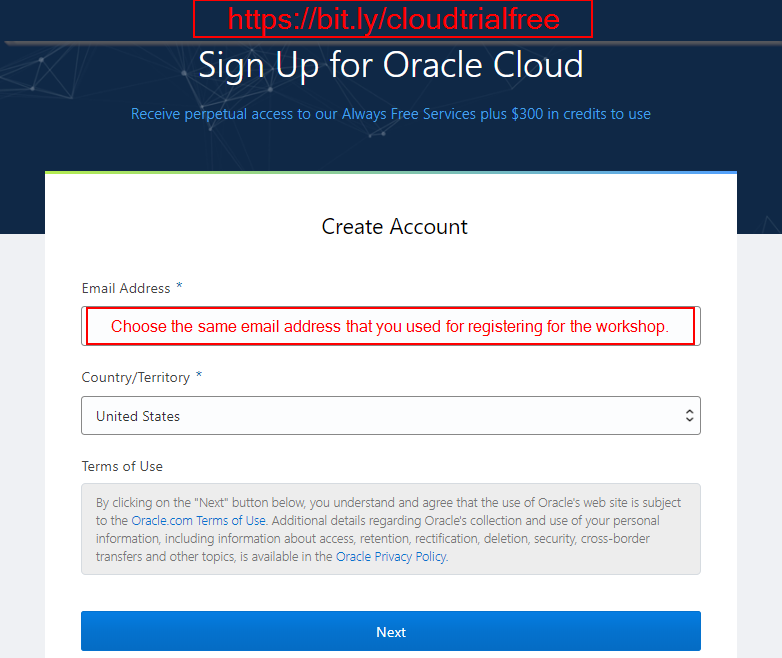
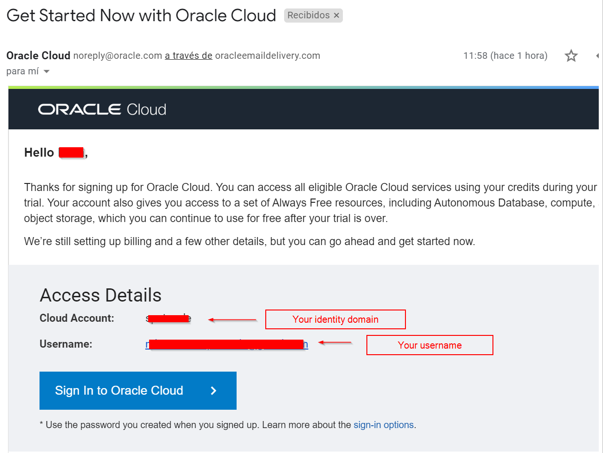

<!--The following explains how to request a free trial of Oracle Cloud. 
If you already have an Oracle Cloud tenancy, you may continue to [Prerequisite 2: Provision Data Science service](../prereq1/lab.md).
-->

We highly recommend that you request a NEW Oracle Cloud Trial to do the workshop. If instead you use a trial that you've requested on an earlier occasion, it may not have enough credits to do the workshop.
In that case, please contact us and we will try to find a solution.

## Prerequisite 1: Request an Oracle Cloud Free Tier account

Sign up here: [https://bit.ly/getfreecloudtrial](https://bit.ly/getfreecloudtrial). 

Please use the SAME email address that you used for registering for the workshop.

### Account Details
- On the next page you will be asked for the Cloud Account Name. This is what will uniquely identify your cloud environment. You will see it as part of the URL when you access it later.
- You will also be asked for the "Home Region". This is the location of the physical data center. Choose you nearest location.

At the end of this process, you can login directly using the credentials you just created.

### Logging in at a later point
- You will have received an email titled "Get Started Now with Oracle Cloud".
- Use the button "Sign in to Oracle Cloud".
- Use the same email address that you used for registration, you can see it in this email as "username".
- If you have to choose your identify domain, this is the value listed as "Cloud Account" in the email.

## Next

Continue to [Prerequisite 2: Provision Data Science service](../prereq2/lab.md).
