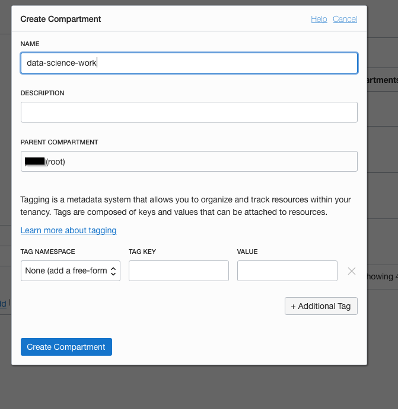
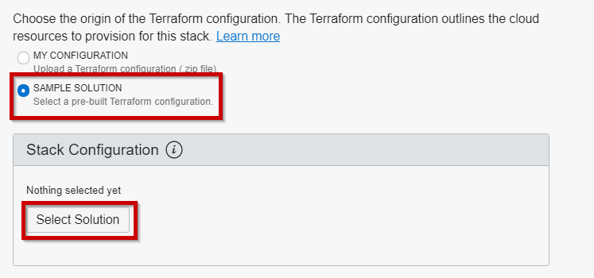
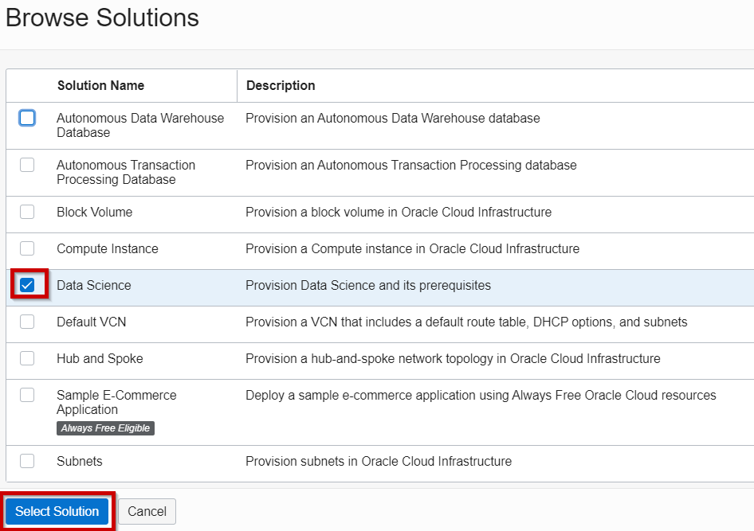

## Prerequisite 2: Provision the Data Science service and its dependencies

There are two ways to do this:
- Option 1 (Recommended): Automated provisioning, recommended if you are doing this in a new Oracle Cloud tenancy that is "empty", e.g. you have just created your trial. Please go [here](../prereq1/lab.md) first in case you don't have an Oracle Cloud Trial yet.
- Option 2: In all other cases we recommend manual step-by-step provisioning of the Data Science service and its dependencies. In this case, follow the manual instructions so that you can control and review each step of the process as you go along and, if necessary, adapt it to your unique situation.

### Option 1: Automated provisioning of network resources and the Data Science service

This is the recommend approach in case you are working in an Oracle Cloud tenancy that is "empty", e.g. you have just created your Cloud Trial. This is the fastest way to provision these resources.

- In your Oracle Cloud console, open the menu.

<!--- Near the bottom of the menu, go to Identity and Administration -> Identity -> Compartments.

- Create a new subcompartment within your root compartment, name it "data-science-work". Also put "data-science-work" in the description.

- Open the menu again.

-->

- Select Resource Manager -> Stacks.

<!---->

- Click the "Create Stack" button.

- Now we are going to choose a predefined Stack for the Data Science service and all its prerequisites. Choose "Sample Solution" and click the button "Select Solution".

- Check the "Data Science" solution and click "Select Solution".

- Choose a compartment that you've created or use Root.

- Click "Next".

- Configure the Stack. We recommend you choose VM.Standard2.2 as the shape. 

- Disable the option "Enable Vault Support". Then click "Next".

- The screen shows a summary. Now click "Create".

- Run the job by going to "Terraform Actions" and choosing "Apply".

- Click Apply once more to confirm the submission of the job.

Provisioning should take about 10 minutes after which the status of the Job should become "Succeeded".

### Option 2: Manual installation steps to provision network resources and the Data Science service

This approach is recommended if you already have other services / configurations made in your Oracle Cloud tenancy. 

This consists of the following:
- Create a user group for your data scientists.
- Create a compartment for your data science work.
- Create the VCN and subnet necessary to give your data scientists egress access to the public internet from a notebook session.
- Create the proper policies to give your data scientists access to the data science service.
- Provision the Data Science service (Project and Notebook)

If this is the case, please follow the detailed provisioning steps [here](https://docs.cloud.oracle.com/en-us/iaas/data-science/data-science-tutorial/tutorial/get-started.htm#concept_tpd_33q_zkb).

## Next

Continue to [Prerequisite 3: Install Oracle Analytics Desktop](../prereq3/lab.md).
