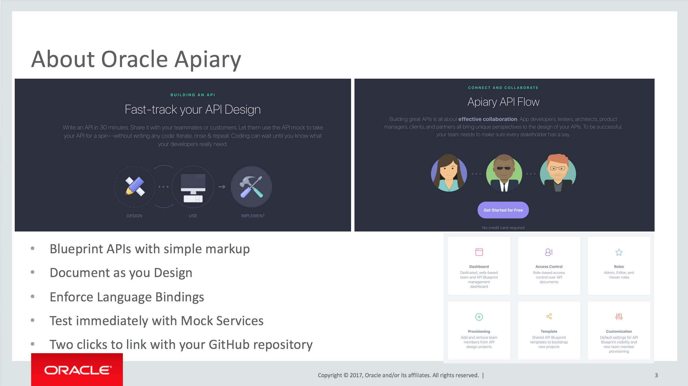
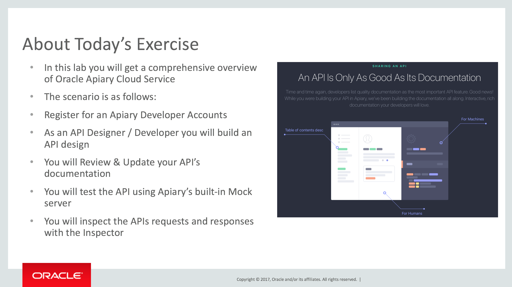

[Go to the Cloud Test Drive Overview](../README.md)

# API Platform Cloud Service API Design First Lab #

## Introduction - what is Apiary? ##

## What will you do with Apiary in this Lab ? ##

## Let's start ! ##

+ Download the tutorial by the link below, and then click on "Download". 
  - Attention ! To come back to this page, hit the "Back" button of your browser !
  - [Link to use](Lab%201.0%20-%20APIPCS%20API%20Design%20First%20Lab%20Latest%20(1).docx)
+ Log in to the environment with the URL and the username/password that has been provided

---

[Go to the Cloud Test Drive Overview](../../README.md)