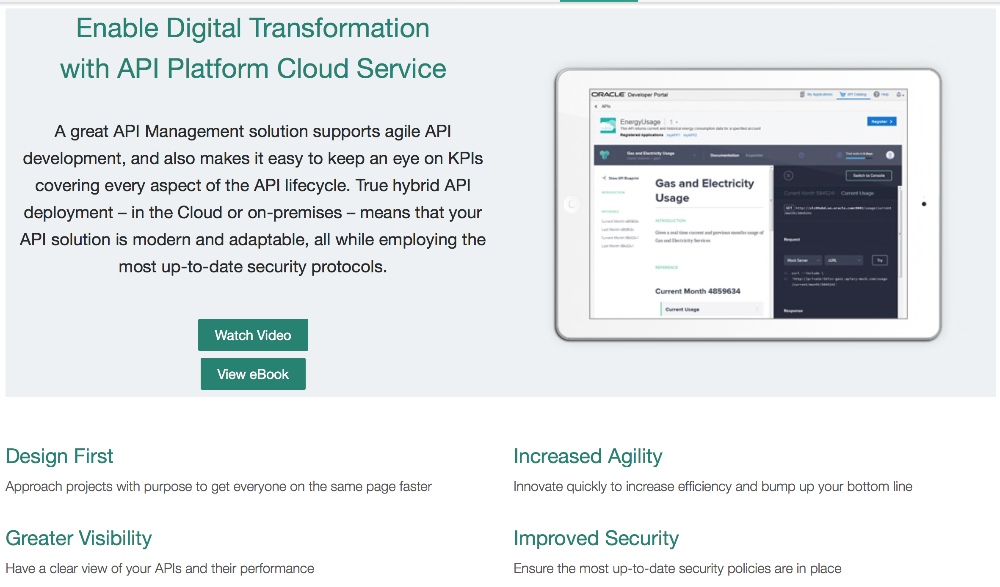
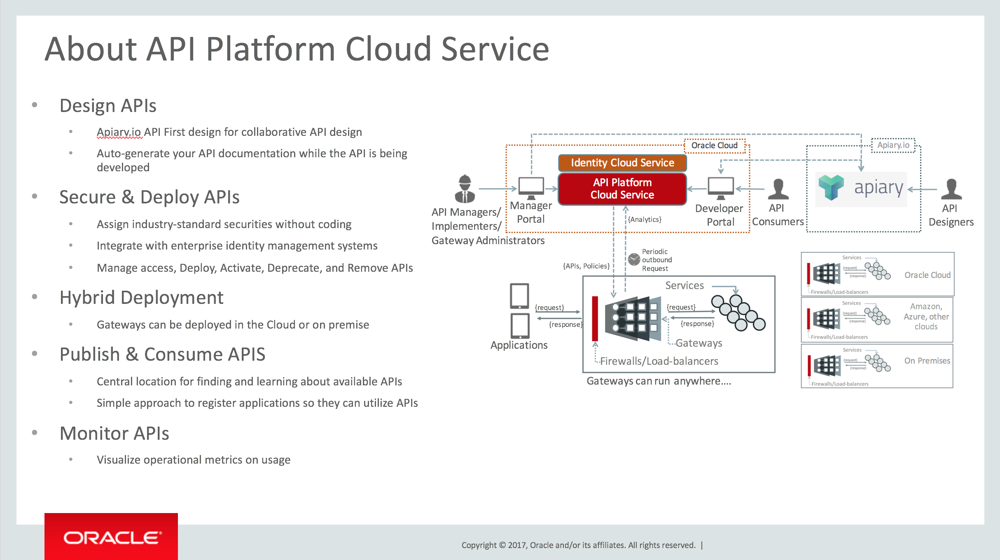

[Go to the Cloud Test Drive Overview](../README.md)

# API Platform Cloud Service API Manager Lab #

## Introduction - what is API-P CS ? ##

## What will you do with API-P CS in this Lab ? ##

## Let's start ! ##

+ Download the tutorial by the link below, and then click on "Download". 
  - Attention ! To come back to this page, hit the "Back" button of your browser !
  - [Link to use](Lab%201.0%20-%20APIPCS%20API%20Manager%20Latest.docx)

+ Log in to the environment with the URL and the username/password that has been provided

---

## License ##
Copyright (c) 2014, 2017 Oracle and/or its affiliates
The Universal Permissive License (UPL), Version 1.0   
[Details](../../common/LICENSE.md)

---
[Go to the Cloud Test Drive Overview](../../README.md)

