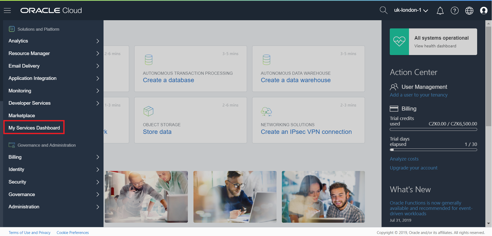
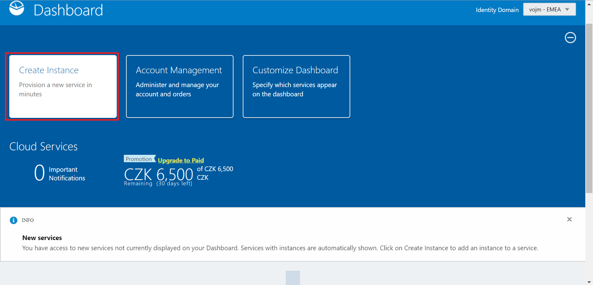
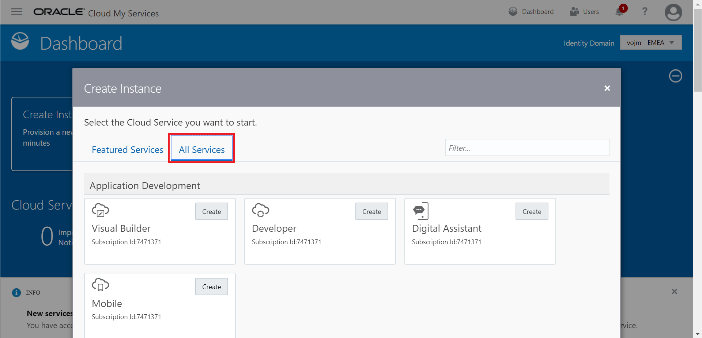
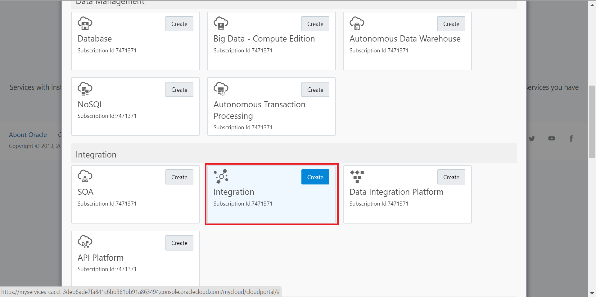
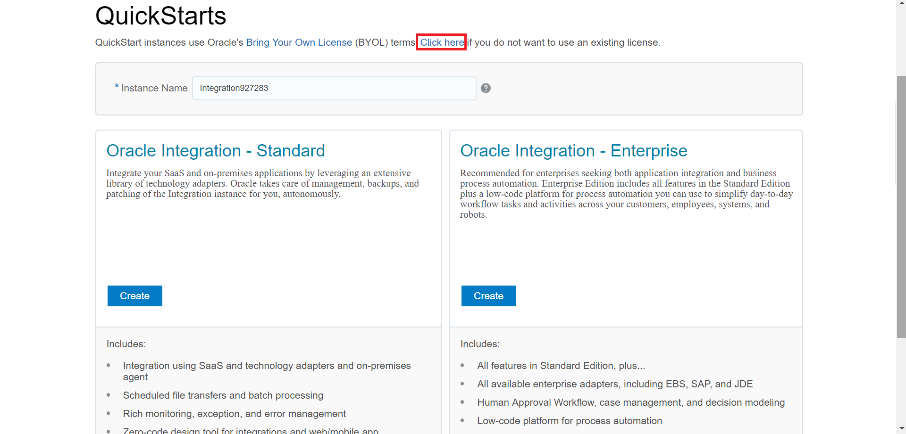
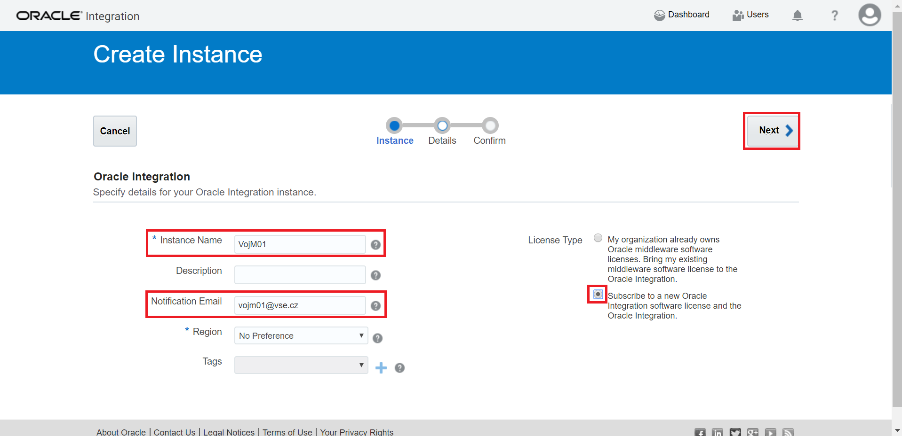
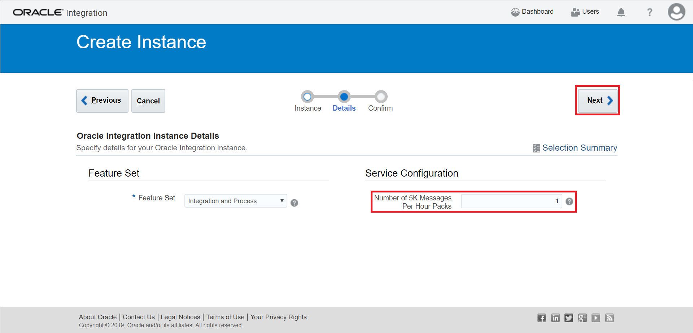
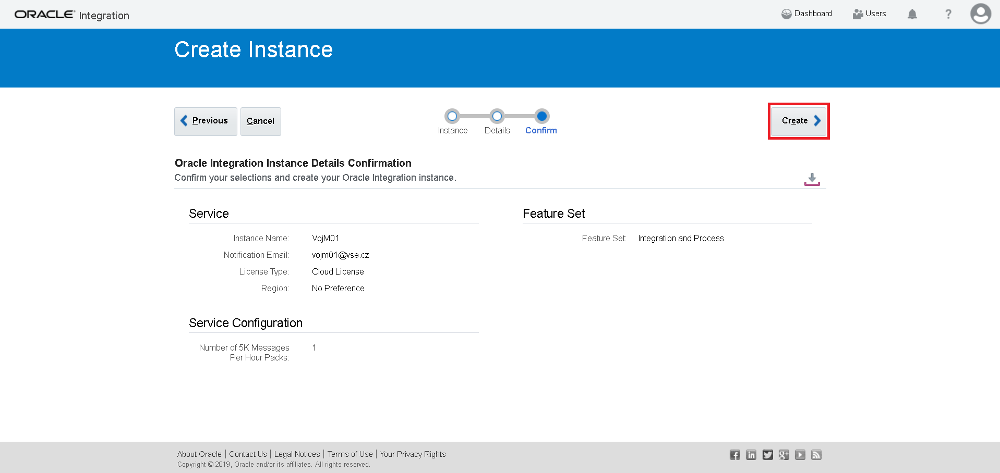
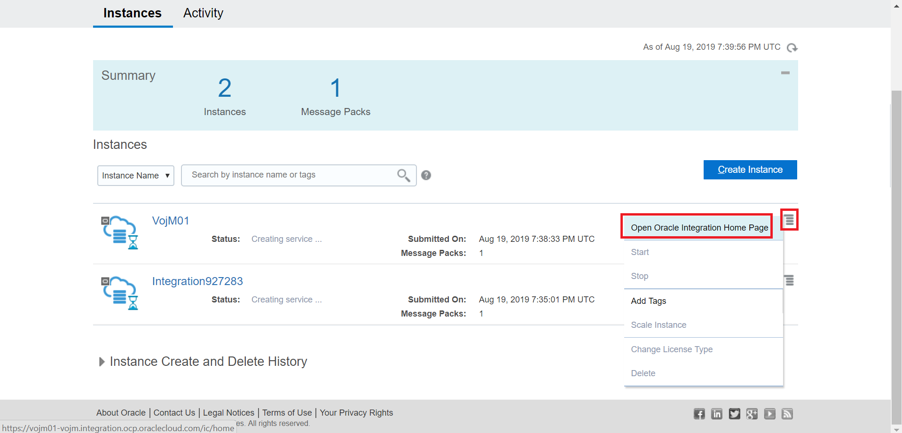
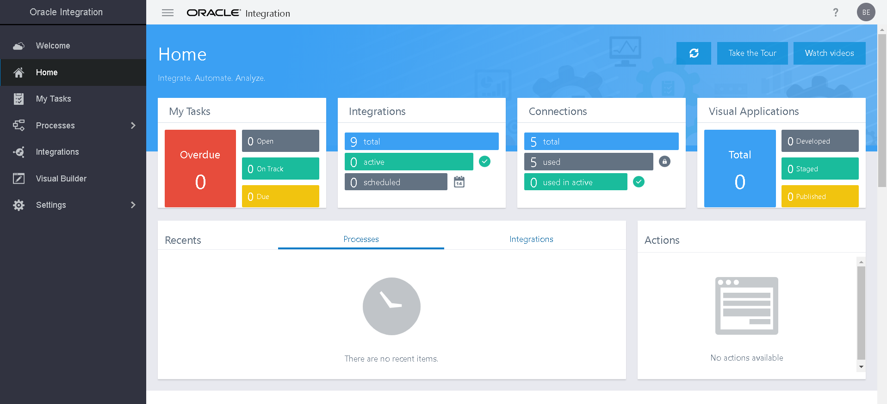

# JAM Workshop (Journey of App Modernization)
This hands-on, instructor-led workshop supplements live presentations and demos in order to cover both technical architecture and innovation use cases, strategies when taking application networks to the cloud and introduce you the tools required for successful implementation.
No expertise or previous experience is required.

## Prerequisites

This lab covers a set of prerequisites for running workshop hands-on activities

### Create Oracle Integration Cloud instance

-	Login to your Oracle Cloud Trial Account. Click on the **hamburger menu** on the top left corner

-	Click on **My Services Dashboard**

-	Click on **Create Instance**

-	Click on **All Services**

-	Click on **Integration**

-	Click on **Click here** link to provide more details 

-	Fill up Instace details:
	* Enter **Instance Name**, **Notification Email**
	* Select **eu-frankfurt-1** for **Region** 
	* Choose to **Subscribe to a new Oracle Integration software license**
	* Click **Next**

-	Add **1** as **Number of 5K Messages Per Hour Packs** and click **Next**

-	Click on **Create**

-	Once the instance provisioned, click on **hamburger menu** next to your instance name and click on **Open Oracle Integration Home Page**

-	This opens in a new tab the Home Page of your **Oracle Integration Cloud** Instance

