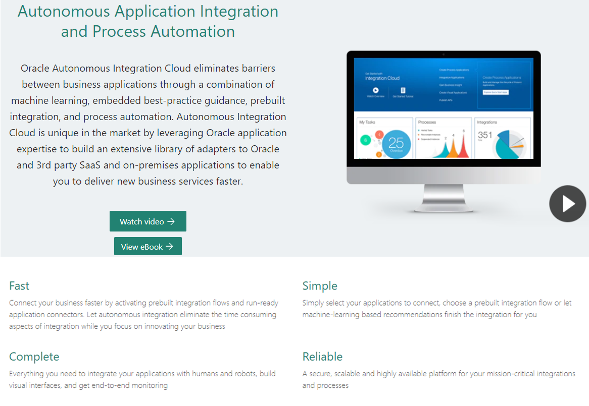
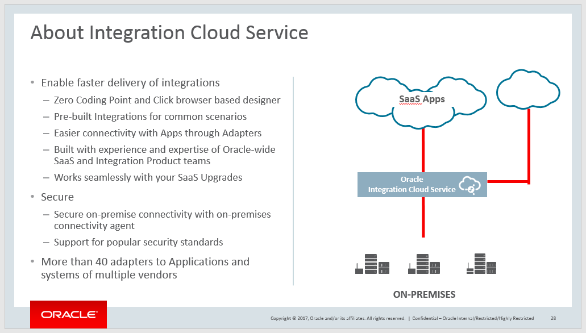
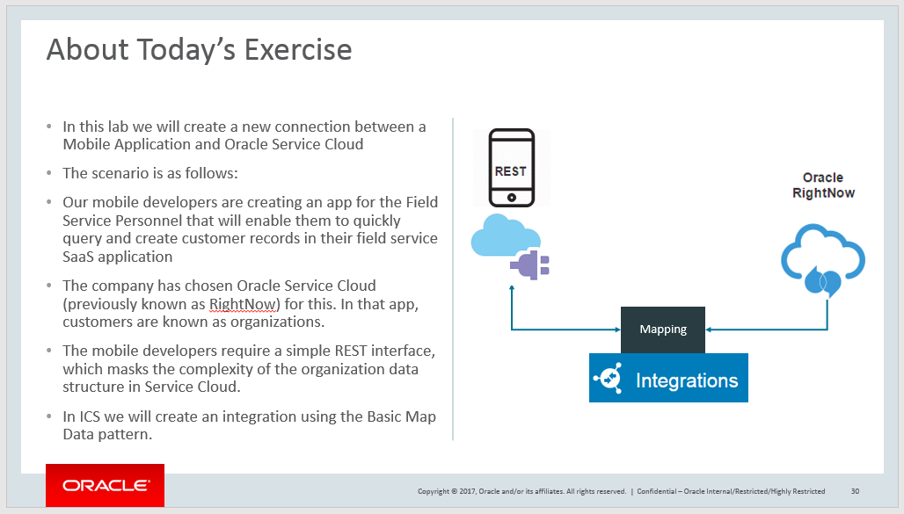

[Go to the Cloud Test Drive Overview](../README.md)

# Integration Cloud Service Lab #

## Introduction - what is ICS ? ##

## What will you do with ICS in this Lab ? ##

## Let's start ! ##

+ Download the tutorial by the link below, and then click on "Download". 
  - Attention ! To come back to this page, hit the "Back" button of your browser !
  - [Link to use](ICS%20Lab%20-%20Basic%20Data%20Mapping%20-%20v17.docx)

+ Log in to the environment with the URL and the username/password that has been provided

---
[Go to the Cloud Test Drive Overview](../README.md)
