# Oracle Integration Cloud Lab1
## Building a Workflow Application

### Purpose of the lab

This lab will show you how to create a process application, use the Process
WebForm tool to modify GUI forms as well as understand the basics of a process
flow. It will also allow you to bind your process to an integration in order to
realize the power of having both Integration and Process in the same solution

The objectives of this lab are to:

1.  Make you more familiar with the basic components of a process application.

2.  Study and understand the features of WebForm, the GUI tool built-in the
    Process component.

3.  Understand the basics of BPMN.

4.  Understand the concept of QuickStart

5.  Learn how to leverage an integration

### OIC Primer

For those of you completely new to OIC (Oracle Integration Cloud):

There are essentially three key components in OIC:

-   The **Integration**: It allows you to build integrations and connections to
    a variety of systems, Oracle (E-business Suite, ERP Cloud, ServiceCloud,
    SalesCloud, etc.) or non-Oracle (SAP, SalesForce, Google Mail, Facebook,
    EverNote, etc.)

-   The **Process Builder** 

    -   Create Workflows

    -   Create GUI to handle the human tasks of these workflows

-   The **Visual Builder Cloud Service**, from which you can

    -   Create Applications for PCs or Mobile

    -   Have them leverage business objects

    -   Update those business objects in Database or Integration

    -   As a side benefit, you can also invoke a Process from VBCS

**HINT:** When to use the Process tool to create your GUI, and when to use
        VBCS?

-    If you come with an *Application* mindset, that is:

        -   You want to build a collection of pages calling one another

        -   You have business objects to update, such as rows in a database

        -   Workflow is secondary in your mind

>   *… then you should start with VBCS.*

-   If you come with a *Workflow* mindset, that is:

        -   You want your application to handle a succession of tasks that need to
            be dispatched to a variety of persons depending on their roles. You want
            that workflow to handle escalations, policies, rules and exceptions

        -   Some are human tasks, others are system tasks such as integrations to
            back-end system

>   *… then you should start with Process…* which is what **we will focus on
>   today.**

### Pre-requisites

-   You must have access to an OIC instance, with your credentials.

-   **IMPORTANT NOTE**: If you are likely to use a shared instance, please make
    sure you use your initials or your first name , as a way to     differentiate your work from the work of others.

### STEP 1: Creating the initial application from QuickStart

**Login to OICS**

-   Log in OICS with your credentials, or those given to you:

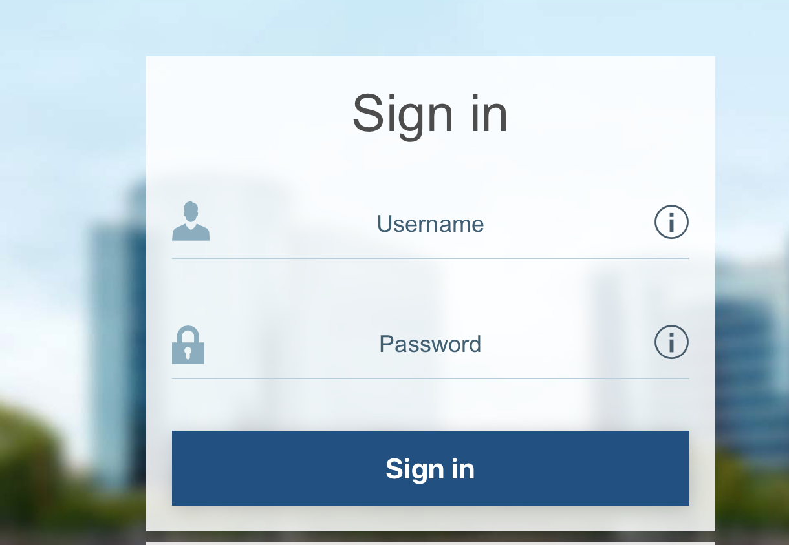

1.  From the main **Home** page, you can see all the components that constitute
    the OICS solution, such as Integration, Process and Visual Builder.

2.  We will focus on building processes, therefore click on the *Processes*
    tab on the left pane

*Creating our first Process Application*

    Let’s start developing our first process application.

    First, we are going to create our own Space, this will allow us to shield from
    other users. This is specially useful if you are sharing your OIC instance with
    other participants

3.  Click on the *Spaces* tab, from the left pane

4.  In the right corner of the blue band, click **Create**

5.  Name it the way you like. NOTE: if you are on a shard environment, **:
    MySpaceXX (Note :** XX is your personal identifier given by the instructor)

    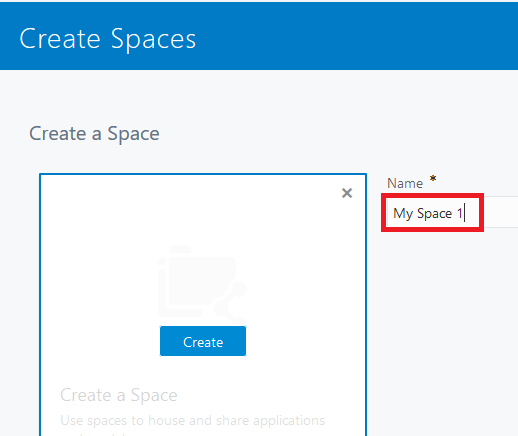

6.  Return to the *Process Application* tab.

7.  In the right corner of the top blue band, Click **Create**

8.  Choose *Start with QuickStart*

    

9.  Select the *Travel Approval* application Quickstart template (bottom right) by clicking
    **Create**

    >   **Name:** We recommend the name: *XXTravelApp* where *XX is your initials*, particularly in the case where you work on a    shared environment

    >   If not already selected, choose **“MySpaceXX”**’ from the Space drop down
    >   (where XX is your initials)

    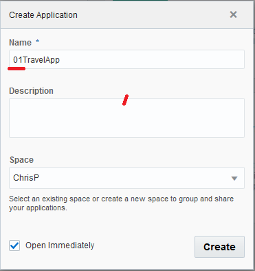

10.  Click **Create**

    When the application has been created, you will see a screen where you can
    configure a variety of choices. This is for business users who can customize the
    application and make it run, without need for deep knowledge of the solution. In
    our case, we will switch to advanced mode in order to get deeper knowledge, so
    you need to click on *“Switch to Application View”* (top right)

    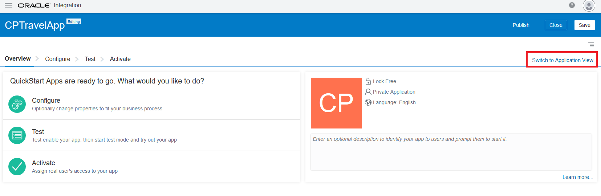

11.  You will see the detailed components of your application in the left pane of
    this Process builder tool. You can see that the "first class citizens" of a process application are:
    *processes*, *forms* (the GUI), *business types* (to define business
    objects), *Decisions* (to create rules), *Integrations* (to link with
    pre-defined integrations), and *Indicators* (for KPI and reporting).

    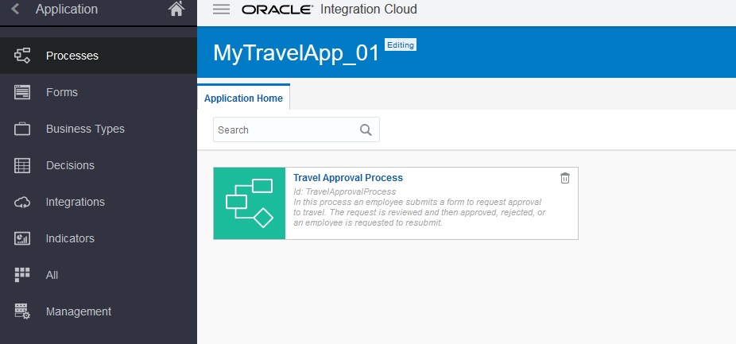

12.  Note: Depending on the versions, it could rather be with the components on
    the right, in a drop-down list:

    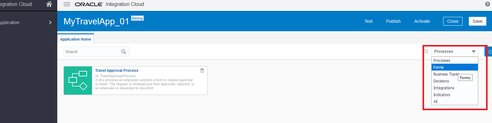

13.  Open the *Travel Approval* process by clicking on it.

-   In the next section we will learn how to configure it.

    **KEY LEARNING POINT: You can very quickly create a full-featured,
    ready-to-run, application just by selecting amongst a list of pre-defined
    templates. This list of templates evolves with every new version.**

### STEP 2: Configuring the form

**WHAT WE WANT TO ACCOMPLISH**: The Travel Approval template comes with a GUI
Form that is needed for the human tasks. We want to augment this form with a
variety of additional components, such as new fields, rules and access to
predefined integrations

**Opening a form**

1.  If not already done, open your application by clicking on it. From the left
    black panel, choose *Forms* and open the *TravelRequestForm*.

    -   Note: depending on the version of the tool, the components could be visible
    from a drop-down list on the right, in which case you would have to open the form as shown below:

    

2.  Take a moment to study the form building tool:

    -   On the left, you have the **Properties** screen. This is where you will be
    able to set up the design and parameters of your form

    -   In the middle, you have the **Canvas**. This is where you will organize your
    form using Drag & Drop.

    -   On the right, you have the **Palette** screen. This is where you will take
    all your components from

    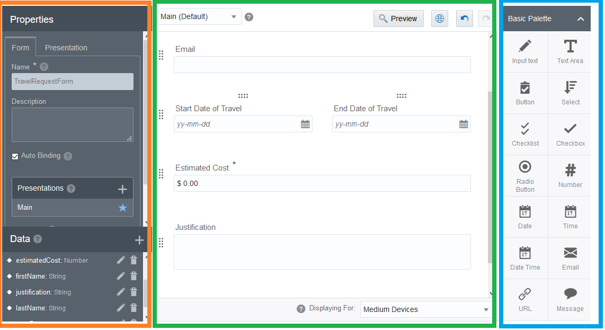

    **Configuring the new form fields**

    We will now:

    \- Add a new Drop-down list component to our form.

    \- Create a Dynamic business rule

3.  From the palette of the From designer,

    -   Drag and drop a field of type “Select” (a drop-down list) from the *Basic
    Palette* on the **Canvas o**n top of *“Estimated Cost”*

    

4.  Click on this newly added field, and from the **Properties** screen on the
    left, change the name to *Country*, and the label to *Country of
    Destination*

    -   After Tab-out, this will automatically update the label of the field on the
    canvas

5.  While still focused on your new field (country of destination), scroll down
    on the left “Properties” pane until you see Options Source.

    -   Make sure the Static box is toggled, and under “options Names” and “options
    Values”, enter:

    -   *France France*

    -   *Germany Germany*

    -   *Croatia Croatia*

    

### STEP 3: Adding a Dynamic behavior to a Form

We will now implement a Business Rule and add dynamic behavior to our form

You need to select the “*Estimated Cost*” component on your form by clicking on
it.

We want our form to *hide the validation field if the amount is less than 2000*,
so

go to the **Properties** pane on the left and:

1.  Scroll down and reach the **Event** line and click the “+” sign to create an event. Select “On Change”

    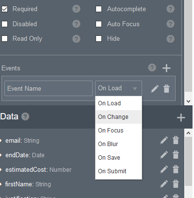

2.  Edit the event by clicking on the pencil

3.  Click on “**If**” and replicate the picture below for the “**If**” condition
    by selecting: *Control\> Estimated Cost \> value Is less than Constant \>
    2000*

    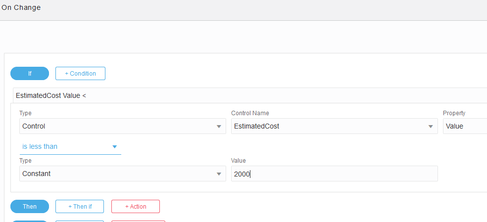

4.  We will then configure the **action** linked to this condition.

    -   Click on **+Action** in front of *Then*

5.  Choose the control name “justification”

6.  Select the action to “*Hide*”, then the **+else Action** to show.

    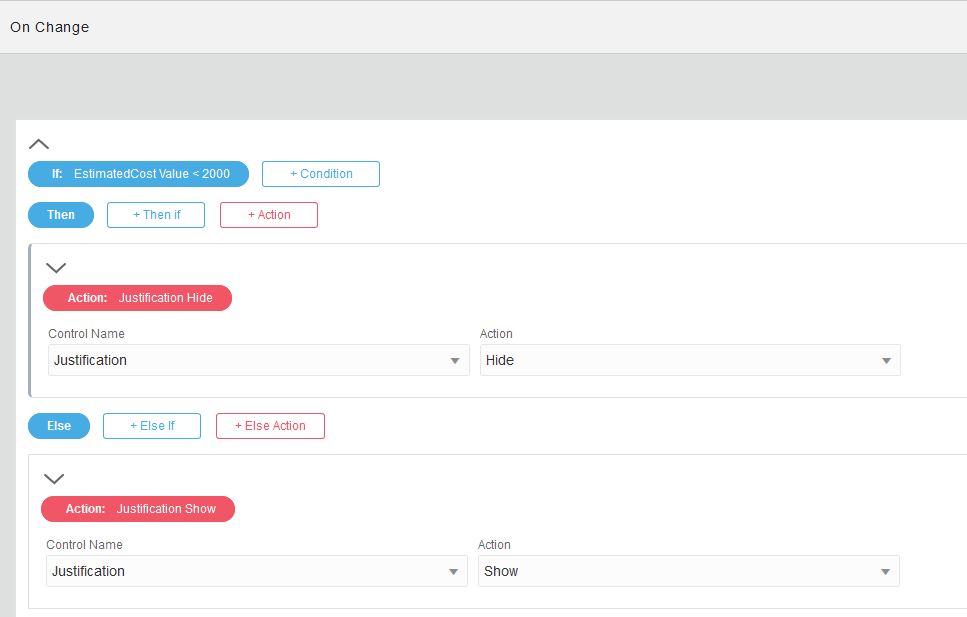

7.  Click *OK* at the bottom right*.*

### STEP 4: Testing a Form

We will now test our form to see if it looks and behaves the way we want.

1.  Click the *Preview* button:

2.  Verify that your form behaves the way you like: When your form is in preview
    mode, you can simulate the business rules:

3.  Try to enter a value less than 2000, then tab-out. You should see the
    *Travel Justification field* disappear.

    >   **HINT**: Change the type of device, and see how your form adapts.

4.  To close the *preview* and return to the previous screen: click the X in the
    top right hand corner.

5.  Save your work by clicking the *Save* button on the top right. *This is a
    good habit to do once in a while.*

### STEP 5: Adding a new presentation to a Form

We are now going to add another *presentation* to our form.

Presentations are a smart way to create variations of a form without having to
recreate it from scratch.

In our case, we just want a few fields to remain, and we will also add a new
message to that form.

1.  From the form’s properties (Make sure you have *not* clicked on any fields:
    You may need to click somewhere on the from, out of a field), scroll down to
    *Presentations*

2.  Click the “+” sign to add a new presentation

    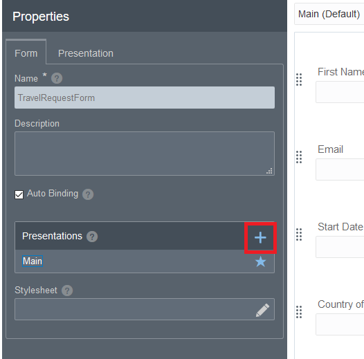

3.  Use the "Clone" option in the middle. This will clone your new presentation
    based on the previous one. It is useful if you want to maintain some of the
    fields.

4.  Name your presentation *TravelApproved*

5.  Click the **Create** button

    On your new form:

6.  Remove the fields and simply leave *First Name, Last Name*, and *Estimated
    Cost* by highlighting each field and clicking on the trash:  icon

7.  Add a new message by drag and drop on top of First Name – Last Name. 
    (The message  widget is at the bottom of the basic palette)

    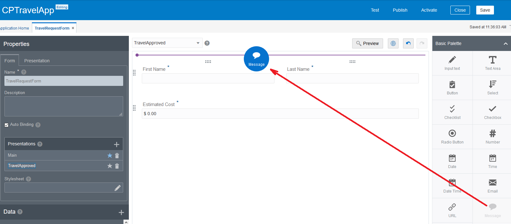

8.  From the *Properties* of your new message field, under *General* tab, add an
    appropriate message in the *Default Text* field. ,such as “Congratulations,
    your Travel has been approved”, or anything you like.

    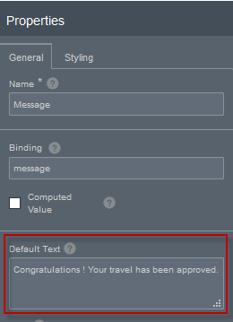

9.  Click on the *Styling* tab, go down *to Font Size* and choose *x-large:*

10.  Change the *Control Alignment* to *Center*

11.  Preview you form. It should look like that:

    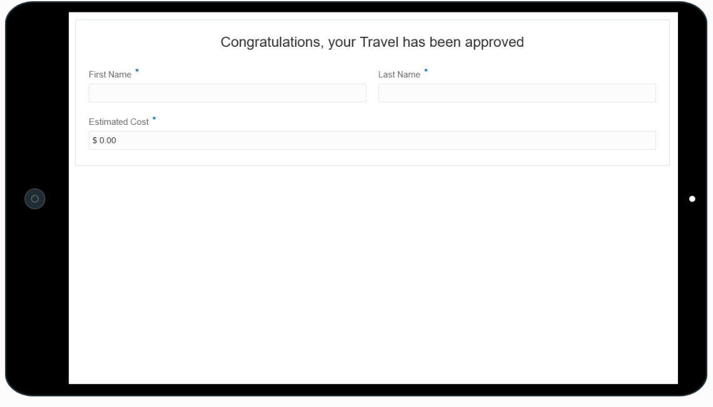

>   Save Your Work

>   **KEY LEARNING POINT: the WebForms tool allows the creation of
>   multi-devices-friendly screens. In addition, you can add fairly
>   sophisticated dynamic validation rules and you can create several
>   presentations of the same form.**

### STEP 6: Using an Integration to populate data

**Adding the Integration**

The ability to seamlessly bind a pre-built integration to a process is more
than a simple feature. It is a significant competitive advantage of Oracle
Integration Cloud, because it bridges two separate worlds:

    - The world of IT, connecting various back-end systems. It requires a deep
    technical knowledge of "what" to connect and when.

    - The world of business management, where people have the knowledge of "how"
    to connect things and "when" (workflow).

These two worlds are quite distinct, and often do not talk very well with one another.
We will see how OIC helps us to easily bridge these two worlds.

#### Let us do it:

1.  From the _Home_ screen of OIC, go to _Integration_

2.  Search the *GetCountry* integration. It may already have been imported by someone
    else doing the same lab as you. If this is the case, *you can skip the rest of this paragraph* and go
    directly to "STEP 7: Make the integration known to your Process Application".

3.  If it is not present, then download the pre-defined integration file on your PC, that you can find
    here: [link](./dependencies/GETCOUNTRYLIST_01.00.0000.iar)
    
4.  import it by clicking "import" at the right of the top blue band. 

5.  Open it (*Edit*, from the right Stacked bars menu). This integration is very simple and is essentially
    accepting a REST request (with no parameters) and returning an array of _Country_ values: Albania,
    Belgium, etc. 
    This array will be used to replace the hard-coded country list that we currently have on our existing form.

    a.  Open the data mapping. (the round blue action in the middle)

    b.  See that it essentially returns an array of predefined countries:

    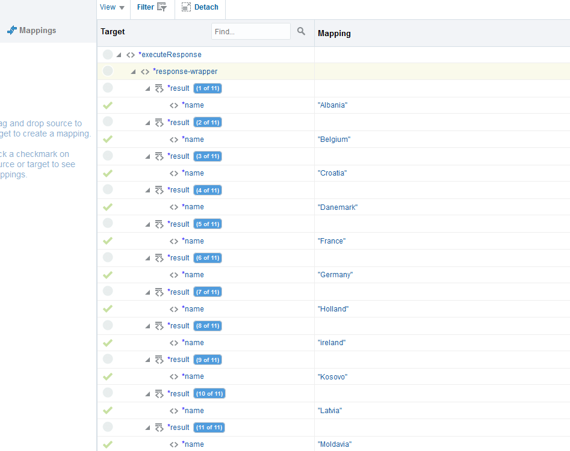

    **Activating the Integration**

6.  From the main integration screen where you can see your GetCountry
    integration, just pull the slider on the right.

    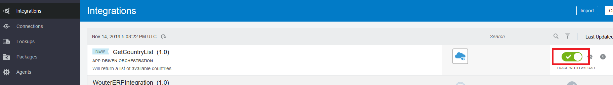

7.  Make sure you check the box *Enable Tracing* and *Include Payload.*

    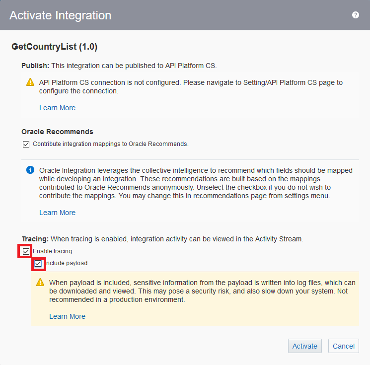

 ### STEP 7: Making the integration known to your Process Application

1.  From *OIC Home Page,* go to *Process -\> Process Application* and open your
    *XXTravelApp* application

2.  Click Integration on the black left pane and the click the blue **Create**
    button on the right. Choose "use an Integration"

    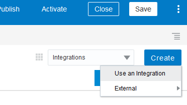

3.  Choose *GetCountryList*

    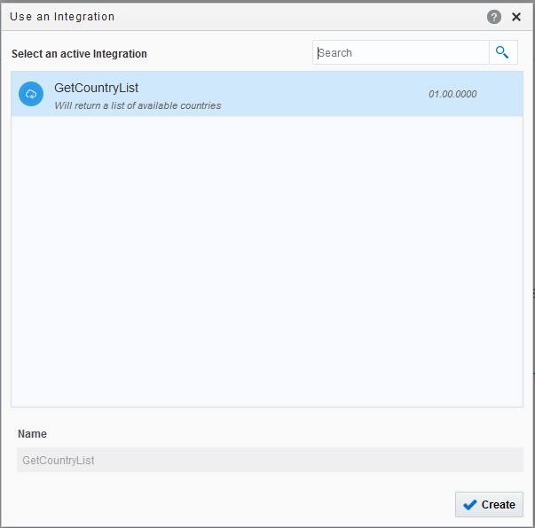

    **Changing the WebForm to access the integration**

5.  Open the *TravelRequestForm* form.

6.  Select the *Country of Destination* field. Check the *source* by scrolling
    down the left pane. Notice that it is static and the values for statuses are
    hard coded.

    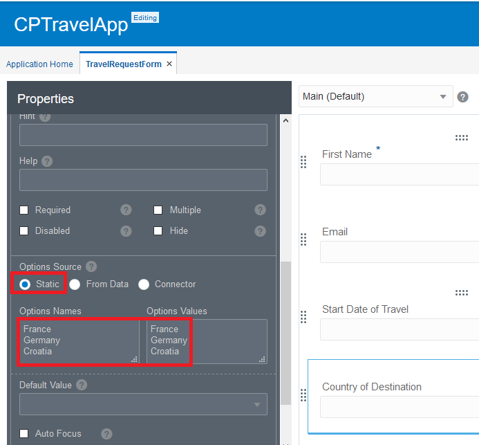

7.  Run the form in Preview mode, and open the *country of destination* field to
    see the (static) list of available countries:

    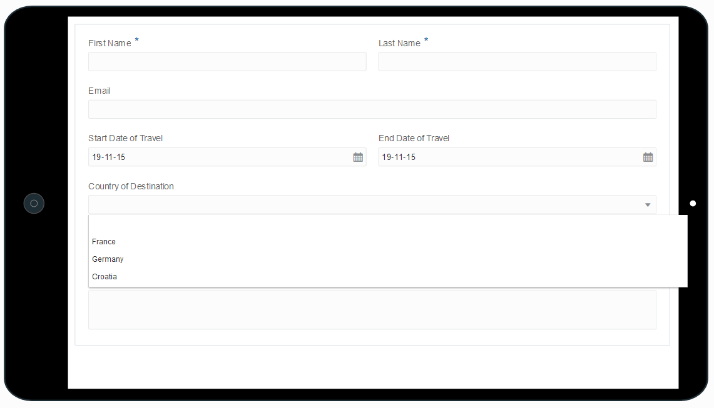

    We want to change that in order to get some values dynamically from an
    existing integration. For this:

8.  Check the *Connector* Options source instead of *Static*.

9.  In the *Connector* definition, chose *GetCountryList*

    

10.  Resource: *Resources*

11.  Operation: *GetResources*

12.  Response: Option list: *response.result*

13.  Label Binding: *name*

14.  Value Binding: *name*

    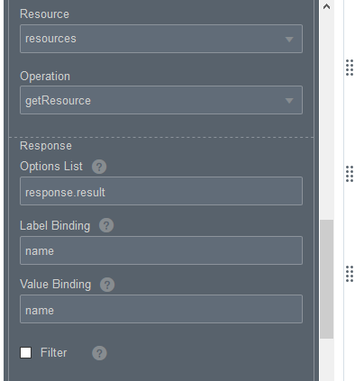

Save your form and preview it:

15.  Click on the *Preview* button on the top right.

16.  You form will be tested and will actually pull the real data from the
    integration. You should be able to drop-down the *Country of Destination*
    select field and see a different, more complete, list of available
    countries:

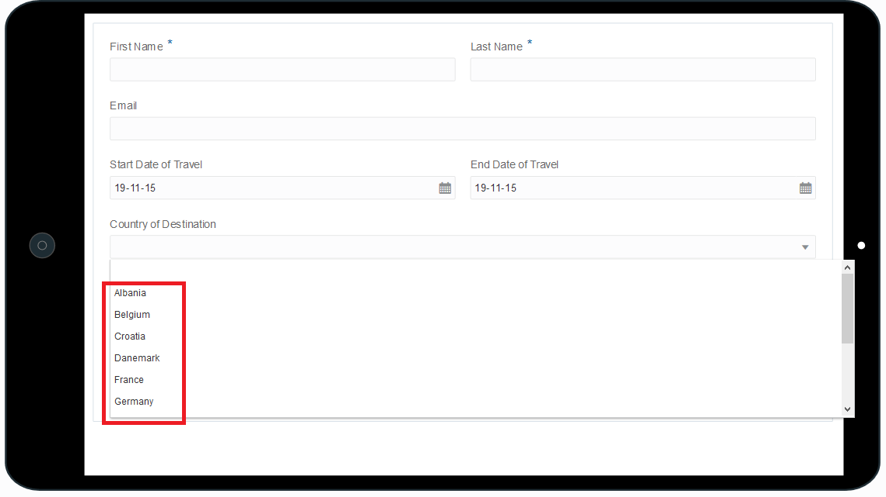

**KEY LEARNING POINT**: OIC binds very tightly Processes and Integrations. You can
easily leverage the result of an integration within a process, whether a step in
a process or, like here, to fill a field on a form.

### STEP 8: Modifying the Process

**Add a Human Task**

>   We will modify our process and add a new task that will appear to the user
>   in order to let them know that their trip has been approved. For this, we
>   will add a human task (Green) to the Employee lane.

-   Go to the **Process** tab and open *TravelApproval* Process

-   Modify the process:

1.  From the BPMN palette on the right, please select a “*Submit*” component in
    the "*Human*" family: 

    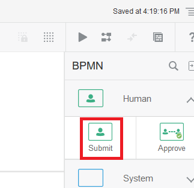

2.  Drag & drop the “Submit” component into the **Employee** SwimLane

    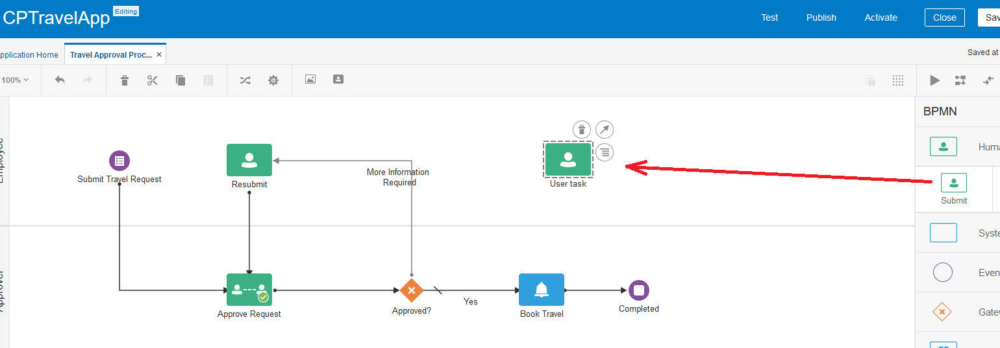

3.  Click on the arrow that links the blue “Book Travel” Box to the “Completed”
    circle, pick the tip of it and attach it to your new green user task,
    instead:

    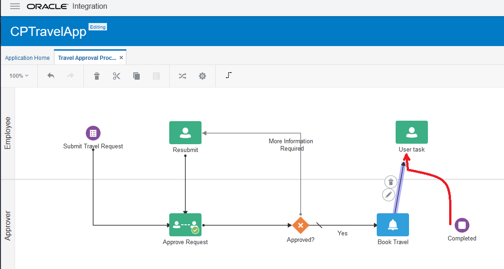

4.  Click on your new user task, grab the arrow and link your new User Task to
    the “*Completed*” task

5.  Your process should look like this:

    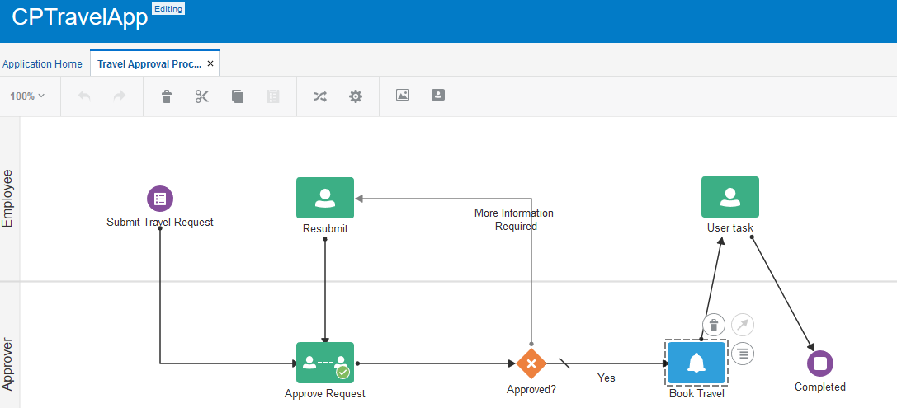

    **Configure the Human Task:**

7.  Select the “User task “Component, and chose its name (by double clicking on
    the word “user Task” just below the green box. Re-name it to “Travel
    Approved”

8.  Then, open the properties panel by clicking on the burger menu:

    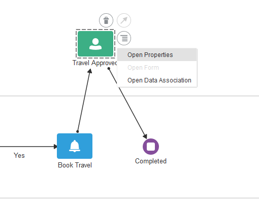

9.  In the *Form* field, click the magnifying glass and add your form to the
    task (there is only one form: *TravelRequestForm*)

10.  In the *Presentation* field, select the presentation named “*Travel
    Approved*” instead of "*Main*".

11.  In the *Title* field, add a title to your task: Click the expression editor
    (*fx*) instead of the plain editor (*abc*) :

    

12.  In the expression editor, cut-and-paste the following expression: **"Request
    Approved for: [" + TravelRequestForm.firstName + " ]"**

    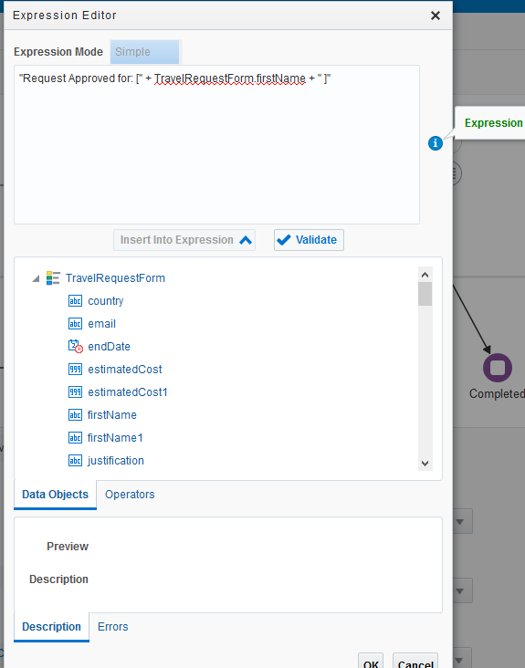

13.  Add a description to your task, whichever you like

    

14.  Configure the Data Association. This is a key element to understand: If you
    want a task to inherit values from a previous task, you will need to
    associate the data between them. For this, click on the stacked bar menu at
    the top right of your new task, and choose Data Association:

    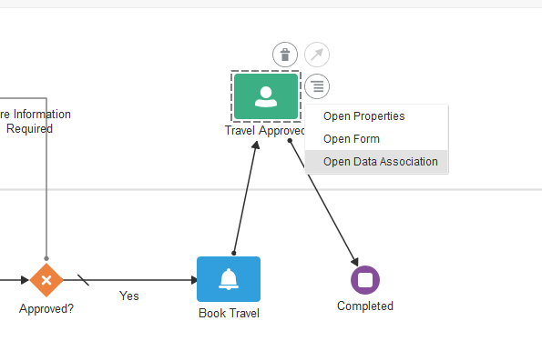

15.  Expand the _TravelApprovalProcess_ element on the left, and then do the same
    for _DataObject_, and then again for _TravelRequestFormDataObject_. You will now
    see all the "variables" (data object) that have been created by the simple
    fact of creating a form.

16.  On the right, do the same for _TravelRequestForm_.

17.  We now need to associate the value residing in the data objects
    "*FirstName*", "*LastName*", and "*EstimatedCost*", and map those to the
    three new fields that were created when we added a new Presentation to our
    existing form. In effect, when said we wanted to clone from the existing
    presentation, *all the data objects have been cloned, with the same name but
    with a number*. As such, *FirstName* became *FirstName1*, *LastName* became
    *LastName1*, etc…

>   You need to drag-and-drop the three variable from the left side to the
>   matching three variables on the right side.

 -   _FirstName_ needs to associate with _FirstName1_

 -   _LastName_ on the left needs to associate with _LastName1_

 -   _EstimatedCost_ needs to associate with _EstimatedCost1_

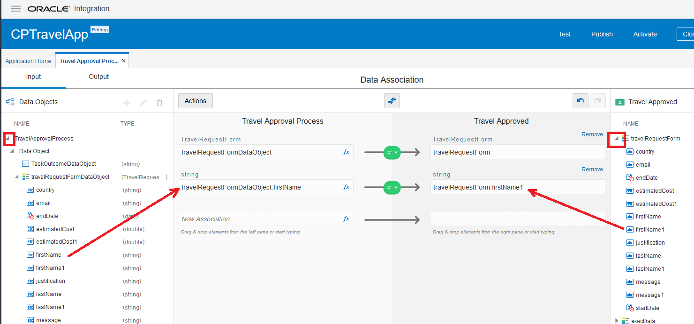

>   Click the *Apply* button on the top right.
>   Save your work.

>   **You have now completed the changes to your process.**

**QUIZZ**: Can you think of a way that could have avoided the need to do this data mapping?

_ANSWER_: When you created the presentation, you could have gone to the left of the panel, and corrected the name of the field that were mapped: instead of _First Name_ mapped to **FirstName1**, you could have mapped it to the existing field **FirstName**. This would have avoided the need to map fields in the Data Association part, because the same variable (_FirstName_, etc.) would have been used for **both** the _Default_ presentation as well as your _TravelApproved_ presentation

### STEP 9: Test your work

1.  Clicke the _Test_ button (top right)
2.  Activate your application (top right button). This means that it is published to the "test"
    repository:

    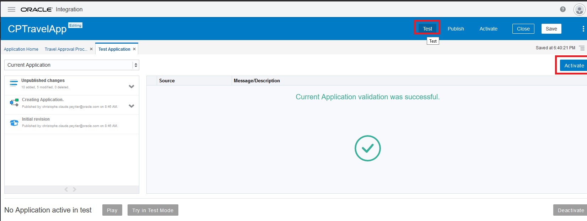

2.  Notice that an intermediate window will appear, with an option to "Add you
    to all roles". By default, this box is checked. This will be a convenient
    way to be able to impersonate all roles from the same user, and wil avoid
    having to logout and login again with different credentials, when we test
    our application.

    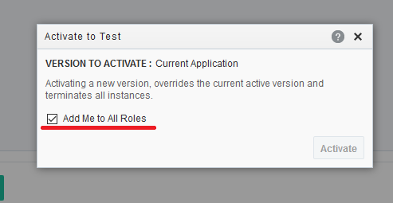

3.  You are now ready to test you application. Click the *Try in Test mode*
    button:

    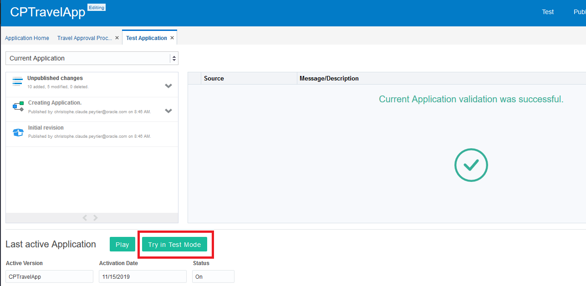

4.  This will bring you to the workspace that a "normal" user would see, and
    from there you can start your application by clicking the round icon
    corresponding to it:

    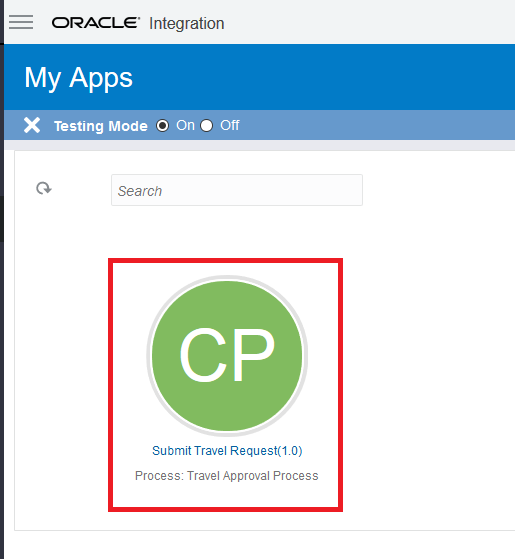

    Notive that on a shared environment there could be several deployed application, since you are all sharing
    the same testing environment. If you have doubts on which is actually your application, you can float over the roind icon
    and you should see the complete name of the application appear.

5.  The main form will appear. Fill the fields and click Submit.
    NOTE: Remember that if you enter a total amount of less than 2000$, the
    "justification" field will disappear when you tab out.

    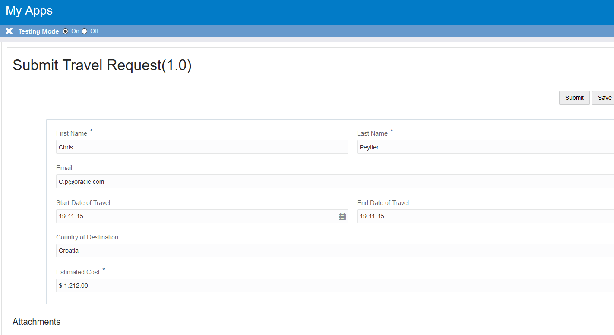

6.  Click the **"My Task"** icon on the black pane on the left. This will show that
    you have a task waiting for you.

    >   **Note:** Because we are in test mode, we have been given access to all the
    >   roles. In reality, for a deployed application, this task should only be
    >   visible to the person who has a role of "*Approver*", and it should normally
    >   be different from the person who has the role of "*Submitter*". This is for
    >   convenience reasons, otherwise we would need to log off , and login again
    >   with different credentials in order to see our pending task.

    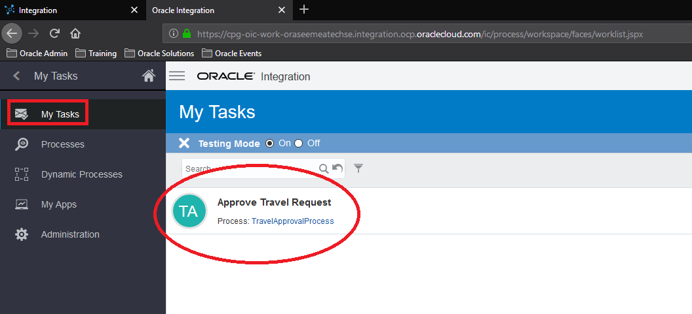

7.  Double-click on the task to open it. You should see the details of the
    travel request. For the fun of it, add a comment to explain why you will
    approve, remember to click the **Post Comment** button

    

8.  Click the **Approve** button at the top.

9.  We now expect a task to be in the "Initiator" task list, confirming that the
    travel has been approved. Click on the _"Reload"_ icon on the top right.

!   

10.  You will then see, as expected, a task confirming that your trip has been
    approved. Double-click on it, and you should see the details, with the new
    presentation, with less fields, and the congratulation message, as well as
    the comments from the approver.

    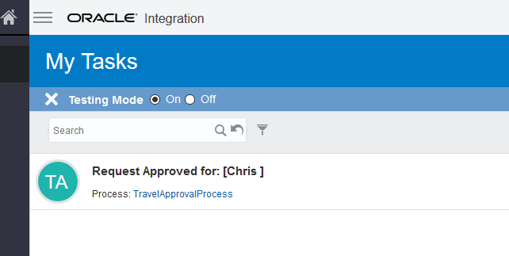

**KEY LEARNING POINT:** You can easily add or modify tasks to an existing process.
You can  map fields via the _Data association_ between tasks. You can also
selectively chose specific presentations for different tasks, despite the fact
that they use the same form.

### STEP 10: BONUS SECTION:

**Changing the look of your form with a CSS stylesheet**

In this section we will be adding a CSS stylesheet to enhance the look and feel
of our form. You will be more comfortable if you understand the concepts of CSS.

1.  Open your *TravelRequest* form. At the bottom of the Properties pane, edit
    the stylesheet section. (NOTE: You must be at the form level, NOT clicked on
    a specific field)

    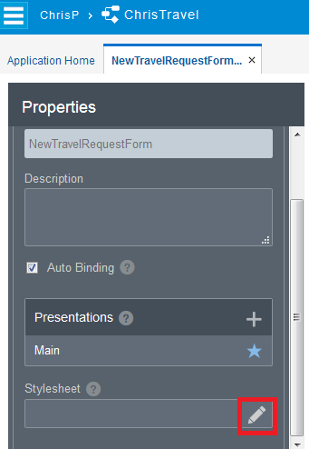

2.  Click the *upload* button, and choose the *PCS_stylesheet.css* file that you
    will find here: [link](./dependencies/PCS_stylesheet.css)
    
    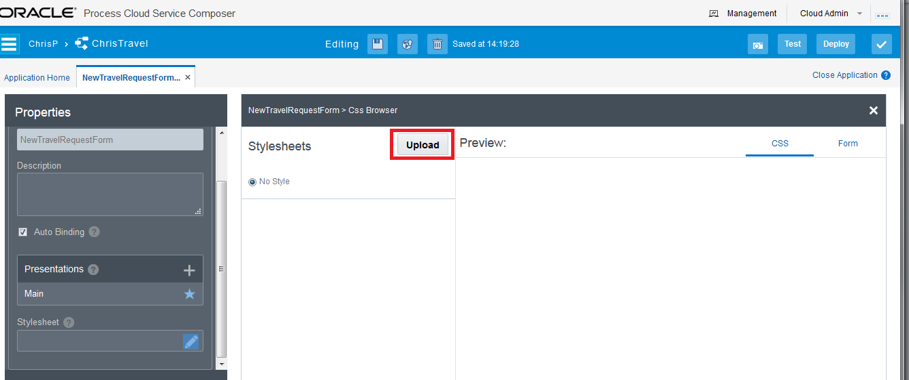

3.  Take some time to read the comments in that file. You need to understand the
    difference between affecting an HTML control name, such as *input*, and a
    CSS class, such as *.oj-label*. Note that the CSS classes are prefixed with
    a dot.

    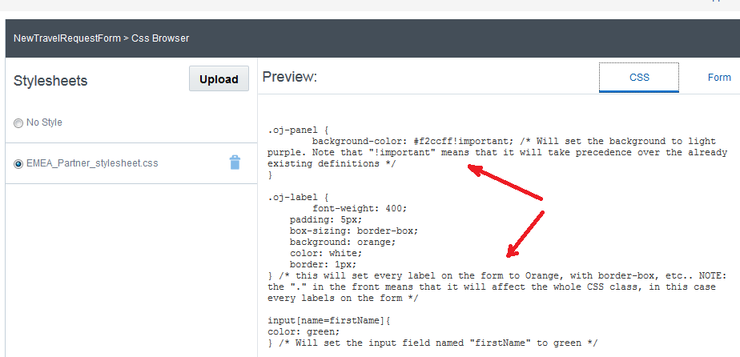

4.  Preview your form by clicking the **Form** button at the right of CSS. You will
    note that the background has changed to light purple, and the labels to
    orange.

>   NOTE: Don’t laugh, these are the elegant colors of the Swiss guard uniform,
>   designed by Michelangelo in 1510. They are still in use today. Also note that
>   the first input field is green, while the others are red, except the money
>   format, in orange:

    

    However, if you don’t like it, feel free to pick whichever color you prefer. You
    can find a good HTML color picker [here](https://www.w3schools.com/colors/colors_picker.asp). 
    Edit the .CSS file, save it, and reload the stylesheet in PCS. You will need to click the recycle
    bin button first, to remove the existing one.

    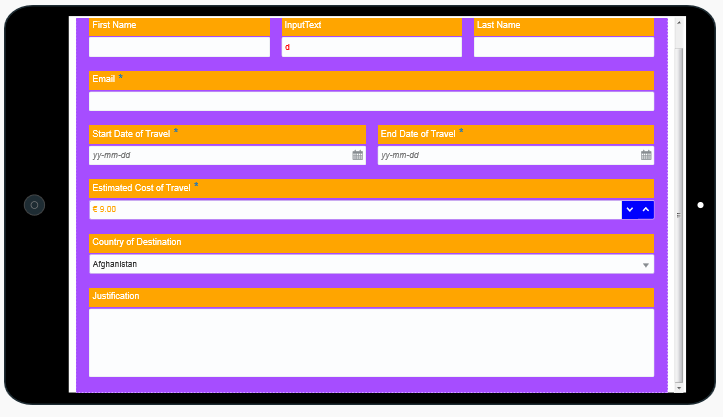

**KEY LEARNING POINT**: The WebForms tool gives you the ability to alter the
look&feel of a GUI, based on .CSS files

**Congratulations**! You have successfully completed this lab! 

For questions or feedback, please contact [Chris
Peytier](mailto:christophe.claude.peytier@oracle.com) Oracle EMEA Cloud Pursuit
Group
