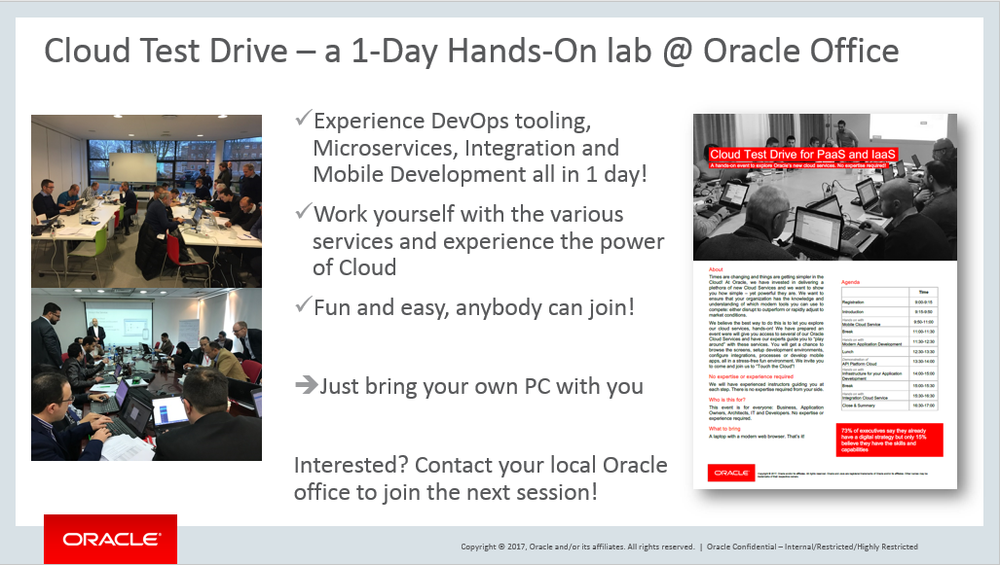

---
# Cloud Test Drive Overview page #

## Introduction ##

This project contains the lab materials for the Cloud Test Drive events organized in various locations.  Participants can experiment through these labs with a series of Oracle Cloud Services.  

During this day you will be able to experience the various cloud services hands-on.  Below you find the link to all labs already available : 

## Application Development ##
- [Microservices using Autonomous ATP and Managed Containers](AppDev/ATP-OKE/README.md)
  This lab will cover the complete setup of Developer Cloud, a Kubernetes Cluster and an Autonomous Database, and then build the CI/CD flow to deploy a Node-based microservice onto this infrastructure.
- Using **Wercker** CI/CD pipelines to [deploy an Angular Node application](AppDev/K8S/readme.md)

+ Run your first **serverless Functions** [using the Opensource FnProject](AppDev/functions/function2_lab.md) or by using the Oracle Managed service called [Oracle Functions](https://www.oracle.com/webfolder/technetwork/tutorials/infographics/oci_faas_gettingstarted_quickview/functions_quickview_top/functions_quickview/index.html#).  Or optionally [create a function from an exiting Docker](https://github.com/shaunsmith/functionslab-codeone19/blob/master/6-Container-as-Function.md) container.
+ [Functions and Events](AppDev/functionsandevents/FnHandson.md): showcasing event-driven serverless functions and an Autonomous database. 
+ Discover the **Helidon Microservices framework for Java** by running through the 2 Getting Started [Quickstarts](https://helidon.io/docs/latest/#/guides/01_overview) for the SE and MP flavour, and then continue with more advanced features like Metrics and Healthchecks in [this tutorial](https://github.com/tomas-langer/helidon-conference/blob/master/README.md)

### WebLogic Labs   -- ***New*** ! --

+ **WebLogic Cloud - VM Image via Marketplace**
  Launch WebLogic on OCI Virtual machines, using the pre-configured image provided by Oracle in the Marketplace
  
  - [Instructor-led](https://oracle.github.io/cloudtestdrive/AppDev/wls/?page=wlscnonjrf.md) version
- [Free-Tier](https://github.com/oracle/cloudtestdrive/tree/master/AppDev/wls/free_tier) version including setup of OCI environment
  
+ [Running WebLogic on Docker](AppDev/wls/WLS_on_Docker.md)
  Spin up the official Oracle Docker Image for Weblogic and deploy a simple demo application on the server.

+ [Running WebLogic on Kubernetes](AppDev/wls/WLS_on_OKE.md)
  Launch WebLogic on a Kubernetes cluster, using the WebLogic Operator to control your WebLogic environment
  
+ [Migrate a library of the Java EE "Monolith" to Microservices using Helidon](AppDev/helidon-k8s/README.md)

  

## Autonomous Databases

- [Autonomous Transaction Processing for Developers](ATP/readme.md) - This lab you will give you a first-hand impression of using Oracle’s Autonomous (ATP) database  from a Developers perspective, deploying a Node application onto a Kubernetes cluster leveraging the ATP Database.
- [Develop APEX applications](ATP/APEX/readme.md) running on top of the Autonomous Transaction Processing Database.

## BlockChain ##
+ [Set up a Blockchain network, and experiment with some transactions and Smart Contracts](BlockChain/readme.md)

  

## Enterprise JavaScript User Interface Development ##

+ [Web Component Development with Oracle JET](https://github.com/geertjanw/ojet-training/blob/master/README.md)

  

## Low Code Development ##
+ Visual Builder : [Easily build sophisticated Web or Mobile apps](AppDev/vbcs/readme.md)

+ Digital Assistant: [Building an intelligent Banking Bot](Mobile/IntelligentBots/readme.md) - Define a simple ChatBot, create two intents and a few utterances.  Finally you'll train and test your bot to see how it works.

+ [Process Cloud](https://oracle.github.io/cloudtestdrive/Integration/process/?page=README.md): understand the basics of creating a process workflow (BPMN), connecting it to an integration, and apply Business rules (DMN).

  

## Integration ##

+ [Integration Cloud Service](Integration/readme.md) - This lab will show you how to set up integration between 2 systems simply using the drag & drop features of Integration Cloud Service.  In this exercise we will set up an integration between a RightNow instance and a generic REST service of a mobile Application.
+ [APIARY](Integration/APICS/APIPCS-DesignFirst.md) - The objective of this lab is to give you an overview of the APIARY Cloud Platform as an API Developer. 
+ [API Platform Cloud Service](Integration/APICS/APIPCS-Manager.md) - The objective of this lab is to give you a comprehensive overview of the API Platform Cloud Service as an API Manager. 

## Prerequisites ##

The workshop is intended to work with the Oracle Cloud account information handed out to you during the event.  You will need the following information to start working on these exercises :

+ Oracle Cloud account **username** and **password**
+ Oracle Cloud **identity domain**
+ **Data center/region**

Alternatively you can request an Oracle Cloud Free Tier account. To get an account look into [here](common/request.for.trial.md).

## [License](LICENSE)
Copyright (c) 2014, 2016 Oracle and/or its affiliates
The Universal Permissive License (UPL), Version 1.0
